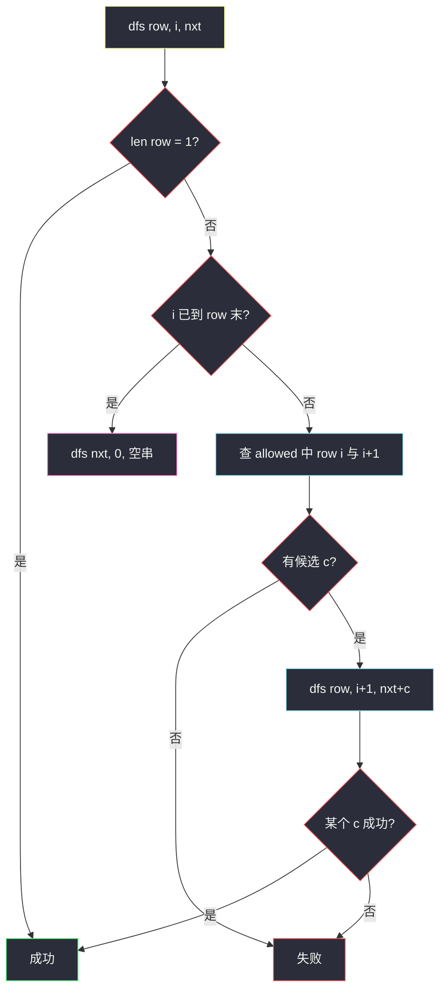

# 756. 金字塔转换矩阵（Pyramid Transition Matrix）

> 题目来源：[https://leetcode.cn/problems/pyramid-transition-matrix/](https://leetcode.cn/problems/pyramid-transition-matrix/)
>
> 灵茶题单小节定位：§9.5 轮廓线 DP

## 一、问题描述

用带颜色的积木堆金字塔。每一层比下一层**少一块**、居中放置。允许的「三角形」由 `allowed` 给出：长度为 3 的字符串 `"ABC"` 表示左下为 `A`、右下为 `B` 时，上面可以放 `C`（`"ABC"` 与 `"BAC"` 不同）。

底层是字符串 `bottom`，必须作为塔底。问能否一直堆到只剩一块塔尖，且每一组相邻两块与其上方都出现在 `allowed` 中。

**数据范围**（以力扣 / doocs 题面为准）：

- `2 <= bottom.length <= 6`
- `0 <= allowed.length <= 216`
- `allowed[i].length == 3`
- 字母只来自 `{'A','B','C','D','E','F'}`
- `allowed` 中的三元组互不相同

**示例 1**：

```text
输入：bottom = "BCD", allowed = ["BCC","CDE","CEA","FFF"]
输出：true
解释：第二层可砌成 "CE"，塔尖 "A"。
用到的三个三角形 BCC、CDE、CEA 都在 allowed 里。
```

**示例 2**：

```text
输入：bottom = "AAAA", allowed = ["AAB","AAC","BCD","BBE","DEF"]
输出：false
解释：第三层有多种砌法，但无论怎么选都堆不到塔尖。
```

**核心思考点**：底层长度 ≤ 6、颜色 6 种，一层的状态最多 6⁶ = 46656。正确姿势不是「无记忆化把上一层所有笛卡尔积都搜完」，而是**从左到右一块一块填上一层**——已填前缀 + 当前层未处理后缀构成「轮廓线」，对 `(当前层, 填到第几格, 上一层前缀)` 记忆化。填完一层后整层变成新的当前层。这就是 §9.5 轮廓线 DP 在「倒三角」上的样子。

## 二、暴力解法

### 思路

对当前层每对相邻砖查出所有合法顶砖，`itertools.product` 生成完整的上一层，再递归。没有记忆化时，同一层字符串会被不同路径反复展开，长度 5～6 且允许列表较密时会爆。

### 代码

```python
from collections import defaultdict
from itertools import product

def pyramidTransitionBrute(bottom: str, allowed: list[str]) -> bool:
    d = defaultdict(list)
    for a, b, c in allowed:
        d[a + b].append(c)

    def can(s: str) -> bool:
        if len(s) == 1:
            return True
        choices = []
        for i in range(len(s) - 1):
            cs = d[s[i] + s[i + 1]]
            if not cs:
                return False
            choices.append(cs)
        return any(can("".join(nxt)) for nxt in product(*choices))

    return can(bottom)
```

### 复杂度

- 时间：最坏每层 `6^{L-1}` 种上一层，再乘下层分支，远超 6⁶。
- 空间：`O(L²)` 递归栈（L 为底层长）。

瓶颈：子问题「这一层字符串能不能堆到顶」被重复问。

## 三、优化探索

### 3.1 一层一层生成，但必须记忆化 ⭐

`dfs(s)`：当前层是 s，能否到顶。先对相邻对查出候选，再枚举上一层。`@cache` 之后，每种层字符串只算一次。这已经能过；它还不是轮廓线，因为每次都把上一层**整行**拼出来再递归。

### 3.2 轮廓线：从左到右填一块 ⭐⭐

堆上一层时，第 `i` 块只依赖当前层的 `row[i]` 与 `row[i+1]`，和更左边已经填好的上一层砖**无关**（颜色约束是局部的）。因此可以：

```text
状态 (row, i, nxt)
- row：正在被当作「底座」的这一层
- i  ：上一层即将填的下标
- nxt：上一层已经填好的前缀
```

- 若 `len(row)==1`：到塔尖，成功。
- 若 `i == len(row)-1`：上一层填完，变成新底座：`dfs(nxt, 0, "")`。
- 否则枚举 `allowed` 中 `row[i], row[i+1]` 能顶出的颜色 `c`，试 `dfs(row, i+1, nxt+c)`。

「轮廓」就是锯齿边界：左边是已经凸起的上一层前缀，右边是还没盖住的当前层后缀。

```text
     nxt[0] nxt[1] ...          ← 已填，长度 = i
row[0]  row[1]  row[2] ...      ← 底座
              ^
              下一块盖在 row[i], row[i+1] 上
```

记忆化键 `(row, i, nxt)`：同一底座、填到同一格、已有相同前缀，后面能不能成功是确定的。字母 6 种、L ≤ 6，状态很少。



**核心一句**：上一层不要一次性笛卡尔积，沿轮廓从左到右填，用记忆化把「同一轮廓」折叠掉。

## 四、代码实现

### 主解：轮廓线 + 记忆化

```python
from collections import defaultdict

class Solution:
    def pyramidTransition(self, bottom: str, allowed: list[str]) -> bool:
        d = defaultdict(list)
        for a, b, c in allowed:
            d[a + b].append(c)
        memo = {}

        def dfs(row: str, i: int, nxt: str) -> bool:
            if len(row) == 1:
                return True
            key = (row, i, nxt)
            if key in memo:
                return memo[key]
            if i == len(row) - 1:            # 上一层砌完，整层下钻
                res = dfs(nxt, 0, "")
                memo[key] = res
                return res
            for c in d[row[i] + row[i + 1]]:
                if dfs(row, i + 1, nxt + c):
                    memo[key] = True
                    return True
            memo[key] = False
            return False

        return dfs(bottom, 0, "")
```

也可用 `functools.cache` 直接装饰 `dfs`，语义相同。

### 对照：整层记忆化（还不是轮廓，但已能过）

```python
from collections import defaultdict
from functools import cache
from itertools import product

class Solution:
    def pyramidTransition(self, bottom: str, allowed: list[str]) -> bool:
        d = defaultdict(list)
        for a, b, c in allowed:
            d[a + b].append(c)

        @cache
        def dfs(s: str) -> bool:
            if len(s) == 1:
                return True
            choices = [d[s[i] + s[i + 1]] for i in range(len(s) - 1)]
            if any(len(cs) == 0 for cs in choices):
                return False
            return any(dfs("".join(nxt)) for nxt in product(*choices))

        return dfs(bottom)
```

它把「这一整层」当状态，失败得等到整行拼完才知道。轮廓版在填第 `i` 块发现没有候选时立刻返回，前缀 `nxt` 被缓存后，其它分支撞上同一前缀会直接命中。L ≤ 6 两种都能过；题单 §9.5 要练的是后一种填法。

### 细节说明

- **`d[a+b]` 是列表**：一对底座可能顶出多种颜色，必须都试；一个成功即可返回 True（可行性问题）。
- **某对没有候选**：`for c in []` 不进入，落到 `memo=False`。不必特判。
- **`allowed` 为空**：底层长度 ≥ 2，第一对就失败，返回 False。
- **同一对底座的多种顶法**：轮廓记忆化后，失败的前缀不会被第二条路径重复展开到同样深度。
- **不要只写无 cache 的 product 爆搜**：样例能过，密集 `allowed` 会 TLE。
- **字母只有 A–F**：需要压位时每格 3 bit，L=6 共 18 bit，可把 `row`/`nxt` 收成整数；Python 字符串已经够快。

## 五、例子演示

**示例 1：`bottom = "BCD"`，`allowed = ["BCC","CDE","CEA","FFF"]`**

字典：`BC→[C]`，`CD→[E]`，`CE→[A]`，`FF→[F]`。

轮廓跟踪（`row="BCD"`）：

| 调用 | 动作 |
|---|---|
| `dfs("BCD", 0, "")` | 盖第 0 块，底座 B、C → 只能 C |
| `dfs("BCD", 1, "C")` | 盖第 1 块，底座 C、D → 只能 E |
| `dfs("BCD", 2, "CE")` | i=2 = len−1，上一层 `"CE"` 完成 |
| `dfs("CE", 0, "")` | 盖塔尖，底座 C、E → 只能 A |
| `dfs("CE", 1, "A")` | 上一层 `"A"` 完成 |
| `dfs("A", 0, "")` | 长度 1，**True** |

金字塔：

```text
  A
 C E
B C D
```

中途没有任何分支失败，FFF 根本用不上。

**示例 2：`bottom = "AAAA"`**，允许 `AAB, AAC, BCD, BBE, DEF`。

`AA→[B,C]`。第三层（相对底层是第二层）每个相邻 AA 都可选择 B 或 C，上一层长度 3，共 2³ = 8 种候选：`BBB, BBC, BCB, BCC, CBB, CBC, CCB, CCC`。

继续往上时：

- `BB` 不在字典（只有 `BCD` 的 BC、`BBE` 的 BB→E）。**`BB→[E]`** 来自 BBE。
- `BC→[D]`，`CD` 无，`BE` 无，`EE` 无，`CC` 无，`CB` 无。

逐条轮廓会发现：无论第三层怎么选，到长度 2 时总缺一对合法顶。例如 `BBB`：

| 步 | 状态 | 结果 |
|---|---|---|
| 底座 BBB | BB→E，再 BB→E | 上一层 `"EE"` |
| 底座 EE | `EE` 无候选 | **False** |

`BCC`：BC→D，CC 无候选，直接 False。其余组合同理。整棵轮廓树记忆化后返回 **False**。

**边界**：`bottom="AB", allowed=["ABC"]` → 上一层 `"C"`，长度 1，True。`allowed=[]` 且底层长度 ≥ 2 → False。

## 六、复杂度分析

设底层长 L ≤ 6，颜色种类 σ = 6，三元组条数 m ≤ 216：

- **时间复杂度：`O(状态数 × σ)`**。状态为 `(底座串, i, 前缀)`，底座长度从 L 降到 1，每种长度的串 ≤ σ^L，再乘位置 L。总体远小于 σ^L · L² · σ，L=6 时足够小。建表 `O(m)`。
- **空间复杂度：`O(状态数)`** 记忆化哈希 + `O(L)` 递归栈。

无记忆化的 product 爆搜没有上述上界。

## 七、对比总结

| 维度 | 无记忆 product | 整层记忆化 | 轮廓线记忆化（主解） |
|---|---|---|---|
| 子问题键 | 无 | 整层字符串 | 层 + 填到哪 + 前缀 |
| 与题单 | 反例 | 能过 | §9.5 正统 |
| 剪枝 | 无 | 整层去重 | 填到一半失败即可停 |

**易错点**：

1. **把 `"ABC"` 当成无序**：左 A 右 B 与左 B 右 A 不是同一个三角形。
2. **生成上一层后忘记长度减 1**：递归出口必须是长度 1，不是「再盖一次空」。
3. **一对底座多种顶砖只试了第一种**：可行性要 `any`，不是 `all`。
4. **用全局 `used` 而不是按轮廓记忆化**：金字塔不是哈密顿路径，砖可重复用颜色，没有「这块用过就不能再用」。

**套路归纳**：在网格 / 倒三角上「从左到右填下一行」时，把已填前缀当成轮廓，状态里只留轮廓相关信息。铺砖、插钉子、消消乐的轮廓 DP 都是同一图像，只是转移规则不同。

## 八、举一反三

1. **[488. 祖玛游戏](https://leetcode.cn/problems/zuma-game/)**：颜色消除 + 搜索，同样要记忆化「当前串」，避免爆搜。
2. **[473. 火柴拼正方形](https://leetcode.cn/problems/matchsticks-to-square/)**：另一类「小 n 搜索」，见 `matchsticks-to-square.md`。
3. **[1411. 给 N×3 网格图涂色的方案数](https://leetcode.cn/problems/number-of-ways-to-paint-n-3-grid/)**：按行填色，上一行就是轮廓。
4. **[265. 粉刷房子 II](https://leetcode.cn/problems/paint-house-ii/)**：线性「上一格颜色当轮廓」的简化版。
5. **[1931. 用三种不同颜色为网格涂色](https://leetcode.cn/problems/painting-a-grid-with-three-different-colors/)**：列压缩 + 轮廓转移的标准网格题。

**同族互引**：本批 `fair-distribution-of-cookies.md` 用子集 mask 当状态；本题用「一层字符串 + 填到哪」当状态。都是把指数搜索里的重复后缀缓存下来。`knight-dialer.md` 则是固定转移图，不需要轮廓，直接递推。
