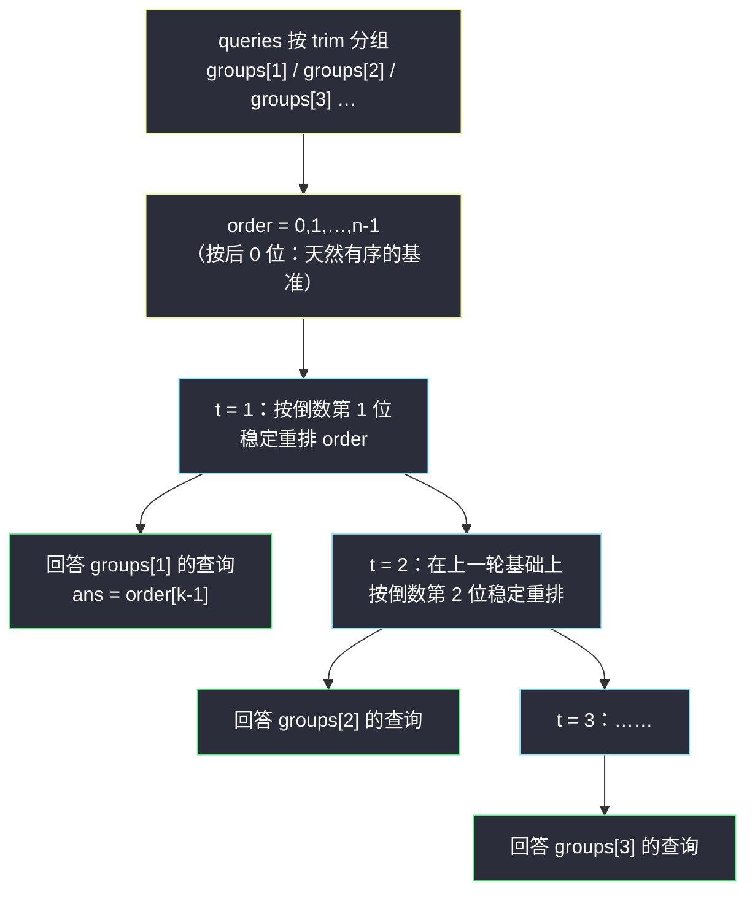

# 裁剪数字后查询第 K 小的数字（离线分组 + 基数扩展名次）

## 一、问题描述

给你一个下标从 0 开始的字符串数组 `nums`，其中每个字符串是**不含前导零**的十进制数字；再给你一个二维数组 `queries`，其中 `queries[j] = [k_j, trim_j]`。

对每个查询：

1. 将**每个** `nums[i]` 裁剪为**最后 `trim_j` 位**（保留原字符串的后缀）；
2. 在裁剪后的数字中找出**第 `k_j` 小**的那个；
3. 返回它对应的**原始下标** `i`。

如果裁剪后存在相同的数字，**原始下标更小**的那个被认为更小（即比较是稳定的）。按查询顺序返回下标数组。

> 🔗 LeetCode 2343：https://leetcode.cn/problems/query-kth-smallest-trimmed-number/
>
> 数据范围：`1 <= nums.length == n <= 100`，`1 <= nums[i].length <= 100`，`nums[i]` 只含数字且无前导零；`1 <= queries.length <= 100`，`1 <= k_j <= n`，`1 <= trim_j <= min(nums[i].length)`。

**示例 1**

```
输入：nums = ["102","473","251","814"], queries = [[1,1],[2,3],[4,2],[1,2]]
输出：[2,2,1,0]
解释：
[1,1]：裁剪成 ["2","3","1","4"]，第 1 小是 "1" → 下标 2
[2,3]：不裁剪 ["102","473","251","814"]，第 2 小是 "251" → 下标 2
[4,2]：裁剪成 ["02","73","51","14"]，第 4 小（最大）是 "73" → 下标 1
[1,2]：裁剪成 ["02","73","51","14"]，第 1 小是 "02" → 下标 0
```

**示例 2**

```
输入：nums = ["24","37","96","04"], queries = [[2,1],[2,2]]
输出：[3,0]
解释：[2,1] 裁剪成 ["4","7","6","4"]，第 2 小是第二个 "4" → 下标 3（稳定）；
     [2,2] 即原串排序，第 2 小是 "24" → 下标 0。
```

**直观理解**

同一个 `trim` 可能被多个查询复用；而 `trim` 每增大 1，相当于在「按后 `trim-1` 位排好的顺序」上再做**一位**稳定重排——这恰好是 LSD 基数排序的逐步过程。于是把查询**按 `trim` 分组**，从 `trim = 1` 一路扩展到最大 `trim`，每轮顺手回答该组的全部查询，任何一次全量排序都不必重复。

---

## 二、暴力解法

对每个查询独立做一次稳定排序：

```python
class Solution:
    def smallestTrimmedNumbers(self, nums: List[str], queries: List[List[int]]) -> List[int]:
        n = len(nums)
        ans = []
        for k, trim in queries:
            # key 取后 trim 位：等长无前导零字符串可直接按字典序比较
            idx = sorted(range(n), key=lambda i: nums[i][-trim:])
            ans.append(idx[k - 1])          # 第 k 小（1-based）
        return ans
```

两个关键点：

- 裁剪后**等长**（都剩 `trim` 位），字符串比较 `nums[i][-trim:]` 与数值比较等价；
- Python `sorted` 是稳定排序，同值时自动保持原下标顺序，正好满足题意。

### 复杂度

- **时间**：`O(q · n · log n)` 次比较，每次比较代价 `O(trim)`，共约 `100 × 100 × 7 × 100 ≈ 7×10^6`，本题数据下轻松通过。
- **空间**：`O(n)`（不计输出）。

### 🔴 瓶颈在哪里

- `trim` 相同的查询在做**重复的全量排序**（示例 1 中 `trim = 2` 被两个查询各排一次）；
- `trim` 相邻的查询也没利用「后缀关系」——排好后 `t-1` 位的信息被白白扔掉。

数据放大（`n, q, L` 到 `10^5` 量级）时，这两处浪费就是超时的根源。

---

## 三、优化探索（核心章节）

> 📚 本题属于灵茶题单**专题：离线算法**：查询不是逐个回答，而是**按某个关键字（这里是 `trim`）分组 / 排序后统一扫描**，让每份预处理成果被整组查询共享，避免每组独立重算。配合「从 `trim = 1` 逐步扩展、每轮只按一位做稳定重排」的**基数思想**，总代价从「每查询一次排序」降为「每个数位一轮桶排」。

### 3.1 关键观察一：按 trim 分组，消灭重复排序

把 `queries` 按 `trim` 装桶：`groups[trim] = [查询下标...]`。某个 `trim` 值无论被多少查询用到，只需对全体 `nums` **排序一次**，组内查询各取 `order[k-1]` 即可。这一步就把复杂度降到「不同 trim 值个数 × 一次排序」。

### 3.2 关键观察二：trim 逐位扩展 = 基数排序，消灭重复比较

「按后 `t` 位排序」可以递归分解：

```text
按后 t 位排序  =  先按倒数第 t 位排序，再在其内部按后 t-1 位排序（后者已就绪）
```

等价的说法：**在「按后 `t-1` 位有序」的序列上，按倒数第 `t` 位做一次稳定排序**，就得到「按后 `t` 位有序」的序列（LSD 基数排序的一轮）。因为稳定的第二轮会把倒数第 `t` 位相同者保持原有的（按后 `t-1 位`的）相对顺序。

于是从 `t = 1` 扫到 `maxTrim`，每轮只按**一个字符**做桶排：



### 3.3 稳定性是整个算法的地基

题目规定「同值取下标小者」，恰好与稳定排序的语义一致。两种实现都天然稳定：

- **计数排序（推荐）**：10 个桶按数字 0→9 顺序拼接，桶内保持上一轮 `order` 的相对顺序——这正是灵神讲基数排序时的标准写法，每轮严格 `O(n + 10)`；
- 直接用语言的稳定排序（Python `sorted`、Java 对 `Integer[]` 的 `Arrays.sort`）按单字符排也可以，写起来更短，但每轮是 `O(n log n)`。

注意**不能用** `qsort` 这类不稳定排序——同一位相同时打乱上一轮辛苦维持的次序，结果立刻错。

### 3.4 一句话核心

> **查询按 trim 分组，trim 从小到大一轮一位地稳定重排；每组查询在「自己的那一轮」直接取 `order[k-1]`。**

---

## 四、代码实现

### Python（主解：离线分组 + 基数扩展 + 计数排序）

```python
class Solution:
    def smallestTrimmedNumbers(self, nums: List[str], queries: List[List[int]]) -> List[int]:
        n = len(nums)
        max_trim = max(t for _, t in queries)

        groups = defaultdict(list)             # groups[t]：trim = t 的查询下标
        for qi, (k, t) in enumerate(queries):
            groups[t].append(qi)

        ans = [0] * len(queries)
        order = list(range(n))                 # 按后 0 位有序 = 原下标序（稳定基准）
        for t in range(1, max_trim + 1):
            buckets = [[] for _ in range(10)]  # 计数排序：按倒数第 t 位分桶
            for i in order:                    # 按上一轮顺序入桶 → 稳定
                buckets[ord(nums[i][-t]) - ord('0')].append(i)
            order = [i for b in buckets for i in b]   # 桶序拼接 → 按后 t 位有序
            for qi in groups[t]:               # 回答本组全部查询
                ans[qi] = order[queries[qi][0] - 1]
        return ans
```

**变量含义**

| 变量 | 含义 |
|------|------|
| `groups[t]` | `trim == t` 的查询下标列表（离线分组的核心） |
| `order` | 当前「按后 `t` 位稳定排序」后的原下标序列 |
| `buckets[d]` | 倒数第 `t` 位为 `d` 的下标，按 `order` 原序进入 |
| `order[k-1]` | 第 `k` 小（题目 `k` 是 1-based）的原始下标 |
| `nums[i][-t]` | `nums[i]` 的倒数第 `t` 个字符（`t <= min(len)` 保证不越界） |

### Java（离线 + 计数排序同款）

```java
class Solution {
    public int[] smallestTrimmedNumbers(String[] nums, int[][] queries) {
        int n = nums.length, qn = queries.length;
        int maxTrim = 0;
        for (int[] qry : queries) maxTrim = Math.max(maxTrim, qry[1]);

        List<List<Integer>> groups = new ArrayList<>();
        for (int t = 0; t <= maxTrim; t++) groups.add(new ArrayList<>());
        for (int i = 0; i < qn; i++) groups.get(queries[i][1]).add(i);

        int[] order = new int[n];
        for (int i = 0; i < n; i++) order[i] = i;
        int[] ans = new int[qn];
        int[] tmp = new int[n];
        for (int t = 1; t <= maxTrim; t++) {
            int[] pos = new int[11];                       // 计数排序：桶起始位置
            for (int i : order) pos[nums[i].charAt(nums[i].length() - t) - '0' + 1]++;
            for (int d = 0; d < 10; d++) pos[d + 1] += pos[d];
            for (int i : order)                             // 按上一轮顺序落位 → 稳定
                tmp[pos[nums[i].charAt(nums[i].length() - t) - '0']++] = i;
            int[] sw = order; order = tmp; tmp = sw;        // 交换引用，避免反复分配
            for (int qi : groups.get(t)) ans[qi] = order[queries[qi][0] - 1];
        }
        return ans;
    }
}
```

---

## 五、具体例子演示

以示例 1 端到端走一遍：`nums = ["102","473","251","814"]`，`queries = [[1,1],[2,3],[4,2],[1,2]]`。

**离线分组**：`groups[1] = {q0}`、`groups[2] = {q2, q3}`、`groups[3] = {q1}`，`max_trim = 3`。

**基准（t = 0）**：`order = [0, 1, 2, 3]`。

**轮 t = 1（看倒数第 1 位：2, 3, 1, 4）**，分桶与拼接：

| 桶 | 0 | 1 | 2 | 3 | 4 | 5-9 |
|----|---|---|---|---|---|-----|
| 入桶下标 | — | 2 | 0 | 1 | 3 | — |

`order = [2, 0, 1, 3]`（即 251 < 102 < 473 < 814 的后 1 位序）。回答 `groups[1]` 的 `q0 = [1,1]`：第 1 小 → `order[0] = 2` ✅。

**轮 t = 2（在上一轮基础上按倒数第 2 位：0, 7, 5, 1 稳定重排）**：

| 桶 | 0 | 1 | 2 | 3 | 4 | 5 | 6 | 7 |
|----|---|---|---|---|---|---|---|---|
| 入桶下标 | 0 | 3 | — | — | — | 2 | — | 1 |

`order = [0, 3, 2, 1]`（后两位 "02" < "14" < "51" < "73"）。回答 `groups[2]` 的两个查询：
`q2 = [4,2]`：第 4 小 → `order[3] = 1` ✅；`q3 = [1,2]`：第 1 小 → `order[0] = 0` ✅。

**轮 t = 3（按倒数第 3 位：1, 4, 2, 8 稳定重排）**：

| 桶 | 1 | 2 | 4 | 8 |
|----|---|---|---|---|
| 入桶下标 | 0 | 2 | 1 | 3 |

`order = [0, 2, 1, 3]`（"102" < "251" < "473" < "814"）。回答 `groups[3]` 的 `q1 = [2,3]`：第 2 小 → `order[1] = 2` ✅。

**各组的名次汇总表**（名次从 1 开始，同行同 `trim`）：

| 原下标 | nums[i] | trim=1 名次 | trim=2 名次 | trim=3 名次 |
|--------|---------|-------------|-------------|-------------|
| 0 | "102" | 2 | 1 | 1 |
| 1 | "473" | 3 | 4 | 3 |
| 2 | "251" | 1 | 3 | 2 |
| 3 | "814" | 4 | 2 | 4 |

对照查询：`[1,1]` → trim=1 名次 1 的下标 **2**；`[2,3]` → trim=3 名次 2 的下标 **2**；`[4,2]` → trim=2 名次 4 的下标 **1**；`[1,2]` → trim=2 名次 1 的下标 **0**。输出 `[2, 2, 1, 0]` ✅。

**稳定性演示（示例 2）**：`nums = ["24","37","96","04"]`，`[2,1]` 裁剪后为 `["4","7","6","4"]`，两个 `"4"`（下标 0 与 3）同值。轮 `t = 1` 分桶时按 `order = [0,1,2,3]` 原序入桶 4：`[0, 3]`，故 `order = [0, 3, 2, 1]`，第 2 小是下标 **3**（不是 0）——桶内顺序保住了「下标小者更小」的约定 ✅。

---

## 六、复杂度分析

记 `L` 为数字串最大长度（即 `max_trim` 的上界），`n` 个数字、`q` 个查询：

| 方法 | 每查询 / 每轮成本 | 总时间 | 空间 |
|------|-------------------|--------|------|
| 在线逐查排序（暴力） | `O(n log n · trim)` | `O(q · n log n · L)` | `O(n)` |
| 离线分组、每组独立稳定排序 | `O(n log n · t)` | `O(不同trim个数 · n log n · L)` | `O(n + q)` |
| 离线 + 基数扩展（本篇） | 每轮严格 `O(n + 10)` | `O(n · L + q)` | `O(n + q)` |

代入本题上界（`n = q = 100`、`L = 100`）：暴力约 `7×10^6` 次字符比较，基数扩展只要 `10^4 + 100` 量级。数据放大到 `10^5` 时差距是「超时 vs 秒过」。

---

## 七、对比总结

**在线 vs 离线**

| 维度 | 在线（逐查排序） | 离线（分组 + 基数扩展） |
|------|------------------|--------------------------|
| 查询处理顺序 | 按输入顺序逐个回答 | 打乱顺序、按 `trim` 分批统一回答 |
| 重复工作 | 同 `trim` 重复排序；相邻 `trim` 重复比较 | 每个数位只扫一遍全体 |
| 每轮成本 | `O(n log n · trim)` | `O(n)`（计数排序） |
| 前提 | 无 | 允许先读完全部查询（一次性给出而非流式） |

**易错点**

1. **稳定性不能丢**：计数排序按桶序拼接、桶内保持上轮顺序；换 `qsort` / 手写快排这类不稳定排序直接错（示例 2 专门卡这点）。
2. `k` 是 1-based，取 `order[k - 1]`。
3. 答案必须写回**原查询下标** `ans[qi]`，不能按分组后的顺序输出。
4. 基数扩展要从 `t = 1` **连续**扫到 `max_trim`，中间的 `t` 即使没有查询也不能跳过（跳过会破坏「上一轮已按后 t-1 位有序」的前提）。
5. `nums[i][-t]` 依赖 `t <= min(len(nums[i]))`，题目数据范围保证了这一点；若自定义数据需先校验。
6. `max_trim` 取**查询中出现过的最大值**即可，不必扫到 `L`。

**离线算法的通用判据**（灵神专题的提炼）：当「查询之间共享大量预处理成果」且「允许预读全部查询」时，把查询按关键字分组 / 排序，与数据的一次单向扫描对齐——本篇对齐 `trim` 递增，同族题里还有按边权、按时间、按询问值对齐的变体。

---

## 八、举一反三

| 题目 | 关系 |
|------|------|
| [2070. 每一个查询的最大美丽值](https://leetcode.cn/problems/most-beautiful-item-for-each-query/) | 同目录 `most-beautiful-item-for-each-query.md`：其第七章「离线双指针」是离线家族的另一形态（查询按预算排序） |
| [1697. 检查边长度限制的路径是否存在](https://leetcode.cn/problems/checking-existence-of-edge-length-limited-paths/) | 离线 + 并查集经典 Hard：查询按限制排序、边按权排序，同源思想见 `find-latest-group-of-size-m.md`、`evaluate-division.md` |
| [2251. 花期内花的数目](https://leetcode.cn/problems/number-of-flowers-in-full-bloom/) | 人按到达时间、花按花期双排序离线扫描 |
| [1707. 与数组中元素的最大异或值](https://leetcode.cn/problems/maximum-xor-with-an-element-from-array/) | 查询按 `mi` 排序，数字从小到大插入 01-Trie 后查询 |
| [164. 最大间距](https://leetcode.cn/problems/maximum-gap/) | 基数排序 / 桶思想亲缘题 |
| [1366. 通过投票对团队排名](https://leetcode.cn/problems/rank-teams-by-votes/) | 多关键字排序 + 稳定性边界的练习 |

**思想迁移**

- 识别离线三问：查询是否**一次全给**？是否**共享**预处理成果？是否存在一个**单调方向**让扫描只走一遍？三问皆是，就离线。
- 「逐步扩展 + 每轮只看一位」是基数排序的骨架，也是「后缀意义下的排序」通用套路（后 `t` 位有序 ⇒ 后 `t+1` 位只需再看一位）。
- 稳定性是免费的正确性来源：语言的稳定排序、桶排的入桶顺序，都在悄悄替你处理「同值取谁」。
- 口诀：**「查询先分组，按序统一扫；一轮看一位，名次顺手取。」**
