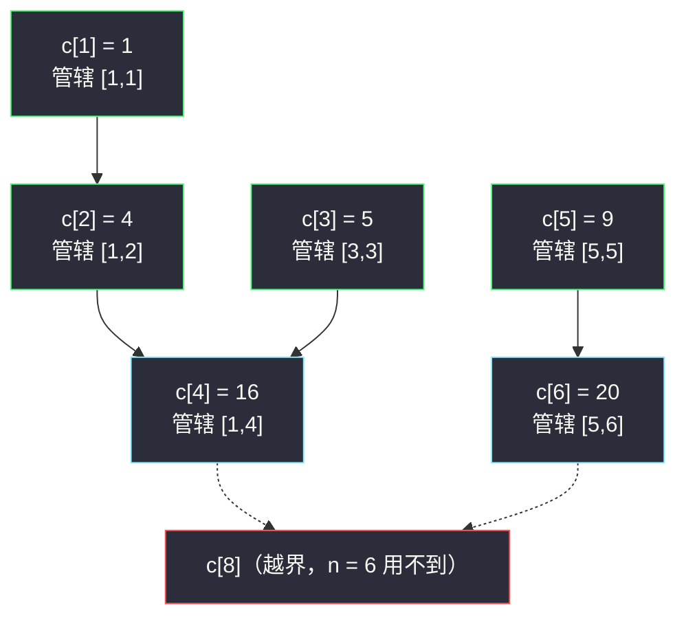
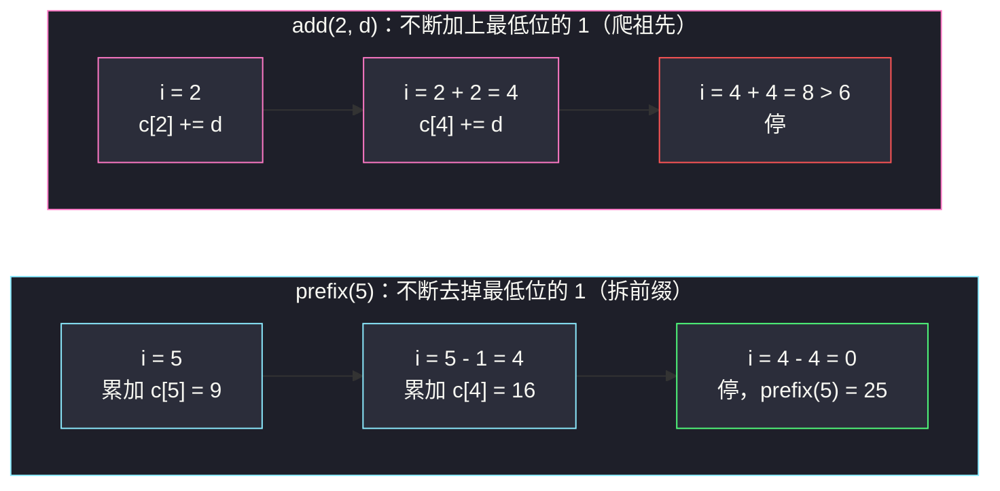

# 区域和检索 - 数组可修改（树状数组 · 单点修改与区间求和的平衡术）

## 一、问题描述

设计一个数据结构 `NumArray`，支持两种操作：

- `NumArray(nums)`：用整数数组 `nums` 初始化；
- `update(index, val)`：把 `nums[index]` 修改为 `val`（**单点修改**）；
- `sumRange(left, right)`：返回闭区间 `[left, right]` 内所有元素之和（**区间查询**）。

> 🔗 LeetCode 307：https://leetcode.cn/problems/range-sum-query-mutable/
>
> 数据范围：`1 <= n <= 3 * 10^4`，`-100 <= nums[i], val <= 100`，`0 <= left <= right < n`，
> `update` 与 `sumRange` 的调用总次数为 `3 * 10^4` 量级——两类操作交替出现，谁也躲不开谁。

**示例**

```text
输入：
["NumArray", "sumRange", "update", "sumRange"]
[[[1, 3, 5]], [0, 2], [1, 2], [0, 2]]
输出：
[null, 9, null, 8]

解释：sumRange(0, 2) 返回 9（1 + 3 + 5）；
update(1, 2) 后 nums = [1, 2, 5]，sumRange(0, 2) 返回 8（1 + 2 + 5）。
```

**直观理解**

[#303 区域和检索 - 数组不可变](https://leetcode.cn/problems/range-sum-query-immutable/)只需一份前缀和数组就能 `O(1)` 回答每次求和；本题多了一个 `update`，前缀和立刻破产——改一个数，它后面的所有前缀全要跟着变。**单点修改与区间查询是一对天生的矛盾**：改得快就查得慢，查得快就改得慢。树状数组（Binary Indexed Tree / Fenwick Tree）用一个藏在数组里的多级缓存结构，把两边同时压到 `O(log n)`，是性价比最高的入门数据结构，也是灵茶题单数据结构篇逆序对（§8.2）等一整族题的地基。

---

## 二、暴力解法

两种朴素做法各偏科一科，都过不了。

**方案 A：朴素数组，改得快、查得慢**

```python
class NumArray:
    def __init__(self, nums):
        self.a = nums[:]

    def update(self, index, val):
        self.a[index] = val                 # O(1)

    def sumRange(self, left, right):
        return sum(self.a[left:right + 1])  # O(n)
```

**方案 B：前缀和数组，查得快、改得慢**

```python
class NumArray:
    def __init__(self, nums):
        self.a = nums[:]
        self.pre = [0]
        for x in nums:
            self.pre.append(self.pre[-1] + x)

    def update(self, index, val):
        delta = val - self.a[index]
        self.a[index] = val
        for j in range(index + 1, len(self.pre)):
            self.pre[j] += delta            # 后缀整体平移，O(n)

    def sumRange(self, left, right):
        return self.pre[right + 1] - self.pre[left]  # O(1)
```

### 复杂度

| 方案 | update | sumRange | 最坏总耗时 |
|------|--------|----------|------------|
| A 朴素数组 | `O(1)` | `O(n)` | 操作数 × `O(n)` ≈ `9 * 10^8` 次加法 |
| B 前缀和 | `O(n)` | `O(1)` | 同量级 |

### 🔴 瓶颈在哪里

两个方案都把「整个数组的状态」压缩进**单一视角**：要么只存原始值（查询要现场重算），要么只存前缀和（修改要整体重算）。突破口：把信息**分级存放**——让一部分桶只管小段区间，修改时只惊动覆盖该位置的少数桶，查询时把几个桶拼起来还原前缀和。这正是树状数组做的事。

---

## 三、优化探索（核心章节）

> 📚 本题在灵茶题单中属于 **§8.1 树状数组**（数据结构篇 · 树状数组入门），是「单点修改 + 区间求和」的标准模板题。本篇把 lowbit、管辖区间、单点改、前缀查四个零件逐一拆开讲透；§8.2 的逆序对计数直接复用这套零件（见同批 `minimum-adjacent-swaps-to-reach-the-kth-smallest-number.md`）。

### 3.1 核心矛盾：修改与查询的拉锯

把前缀和想象成接力账本：`pre[i]` 记前 `i` 项总和，改第 `k` 项就要从第 `k+1` 本开始全部改写。树状数组的思路是**不让任何一个桶管太长的区间**：修改时只惊动覆盖该位置的少数桶，查询时用「二进制拆分」把前缀拼出来，两边都恰好 `O(log n)` 步。

### 3.2 lowbit：最低位的 1

一切从「二进制最低位的 1」开始。定义：

```python
lowbit(x) = x & (-x)
```

它返回 `x` 的二进制表示中**最低位的 1 所代表的权值**。例如 `6 = 110` → lowbit = 2；`4 = 100` → lowbit = 4（2 的幂取到自己）；`5 = 101` → lowbit = 1。

**为什么 `x & (-x)` 恰好取到它**：补码 `-x = ~x + 1`，按位取反后最低位的 1 变 0、其后的 0 全变 1，再加 1 时进位恰好停在那个位置——于是 `-x` 与 `x` 只有这一位同为 1，其余位相反，按位与后只剩它。

### 3.3 c[i] 到底存什么：管辖区间

树状数组只有一维数组 `c[1..n]`（**下标从 1 起**，原因见 3.6），其中：

```text
c[i] 管辖区间 [i - lowbit(i) + 1, i]，长度恰为 lowbit(i)，右端点就是 i
```

以 `nums = [1, 3, 5, 7, 9, 11]`（下标 1..6）为例：

| i | 二进制 | lowbit(i) | c[i] 管辖 | c[i] 的值 |
|---|--------|-----------|-----------|-----------|
| 1 | `001` | 1 | `[1, 1]` | 1 |
| 2 | `010` | 2 | `[1, 2]` | 1 + 3 = 4 |
| 3 | `011` | 1 | `[3, 3]` | 5 |
| 4 | `100` | 4 | `[1, 4]` | 1 + 3 + 5 + 7 = 16 |
| 5 | `101` | 1 | `[5, 5]` | 9 |
| 6 | `110` | 2 | `[5, 6]` | 9 + 11 = 20 |

三条关键观察：

1. 管辖长度 = lowbit(i)：下标二进制尾上有几个连续的 0，桶就管多长的一截。
2. **i 的父亲是 `i + lowbit(i)`**：父亲管得更长、且恰好「紧贴着把 i 覆盖进去」（`c[1]`→`c[2]`→`c[4]`）。



箭头方向 `i → i + lowbit(i)` 就是修改要走的**祖先链**（虚线箭头表示越出 `n`，停）。

### 3.4 前缀查询 prefix(i)：拆二进制

`prefix(i) = a[1] + ... + a[i]` 怎么拼？从 `i` 出发，**每步累加 `c[i]`，然后 `i -= lowbit(i)`，直到 i 归零**。

以 `prefix(6)` 为例（`6 = 110`）：累加 `c[6]`（覆盖 `[5,6]`）后 `6 - 2 = 4`；再累加 `c[4]`（覆盖 `[1,4]`）后 `4 - 4 = 0` 停。
`prefix(6) = c[6] + c[4] = 20 + 16 = 36 = 1+3+5+7+9+11` ✓。

**为什么一定能拆完**：每减一次 lowbit，就消掉二进制最低位的 1，而 `i` 的 1 的个数有限；且各桶管辖区间**首尾相接不重叠**，恰好铺满 `[1, i]`。步数 = `i` 的二进制中 1 的个数 ≤ ⌈log₂ n⌉。

### 3.5 单点修改 add(i, delta)：沿祖先链上爬

改 `a[i]`（加增量 `delta`）时，所有**管辖范围盖住 i** 的桶都要加 `delta`。哪些桶盖住 `i`？恰是 `i` 沿 `i → i + lowbit(i)` 一路向上的祖先（含自己）。以内部位置 2 为例：`2 → 4 → 8`，即 `c[2]`、`c[4]` 要改（8 越界停）。每步加的 lowbit 让管辖范围严格变长，所以链长也是 `O(log n)`。



查询走「减 lowbit」、修改走「加 lowbit」——一降一升，恰好是同一条树的两种走法。

### 3.6 区间和与下标偏移

闭区间 `[left, right]` 的和用两个前缀相减：

```text
sumRange(l, r) = prefix(r) - prefix(l - 1)
```

两个坐标系要分清：**题面下标从 0 起，树状数组内部从 1 起**。转换只在边界做一次：`prefix(right + 1) - prefix(left)`。

为什么内部必须 1 起？因为 `lowbit(0) = 0`：查询循环 `i -= lowbit(i)` 若从 0 出发永远不动（死循环）；修改循环 `i += lowbit(i)` 同理。让下标整体 `+1`，避开 0，两段循环自然终止。

### 3.7 一句话核心

> **c[i] 管 `[i - lowbit(i) + 1, i]`：查询沿「减 lowbit」把前缀拆成若干桶之和，修改沿「加 lowbit」爬祖先链；区间和 = prefix(r) - prefix(l-1)，内部下标从 1 起。**

---

## 四、代码实现

### Python（主解）

```python
class NumArray:
    def __init__(self, nums: List[int]):
        self.n = len(nums)
        self.a = nums[:]                 # 留一份当前值，update 时算增量
        self.c = [0] * (self.n + 1)      # 树状数组，有效下标 1..n
        for i, x in enumerate(nums, 1):  # 逐点插入建树，O(n log n)
            self._add(i, x)

    def _add(self, i: int, delta: int) -> None:      # 位置 i（1 起）加 delta，爬父链
        while i <= self.n:
            self.c[i] += delta
            i += i & -i

    def _pre(self, i: int) -> int:                    # a[1]+...+a[i]，去最低位
        s = 0
        while i > 0:
            s += self.c[i]
            i -= i & -i
        return s

    def update(self, index: int, val: int) -> None:
        self._add(index + 1, val - self.a[index])      # 0 起转 1 起，改增量
        self.a[index] = val

    def sumRange(self, left: int, right: int) -> int:
        return self._pre(right + 1) - self._pre(left)  # prefix(r) - prefix(l-1)
```

**变量含义**

| 变量 | 含义 |
|------|------|
| `self.c[i]` | 管辖 `[i - lowbit(i) + 1, i]` 的桶和 |
| `self.a` | 原数组副本，用于把「改成 val」换算成「加 delta」 |

**建树优化（可选）**：逐点插入是 `O(n log n)`；利用「先自留、再上交」可以 `O(n)` 建树——`c[i]` 先收下自己的 `a[i]`，再把整个 `c[i]` 累加给父桶，核心两行：`c[i] += nums[i-1]`，然后若 `j = i + (i & -i) <= n` 则 `c[j] += c[i]`。

---

## 五、例子演示

用 `nums = [1, 3, 5, 7, 9, 11]`（内部下标 1..6）端到端走一遍。先建树（逐点插入），再依次执行 `sumRange(0,2)`、`sumRange(2,5)`、`update(1,2)`、`sumRange(0,2)`、`update(3,10)`、`sumRange(2,5)`。

**第 1 步：建树（逐点插入，每步给 add 传播链与桶状态）**

| 插入 | 传播链 | c[1] | c[2] | c[3] | c[4] | c[5] | c[6] |
|------|--------|------|------|------|------|------|------|
| add(1, 1) | 1 → 2 → 4 | 1 | 1 | 0 | 1 | 0 | 0 |
| add(2, 3) | 2 → 4 | 1 | 4 | 0 | 4 | 0 | 0 |
| add(3, 5) | 3 → 4 | 1 | 4 | 5 | 9 | 0 | 0 |
| add(4, 7) | 4 | 1 | 4 | 5 | 16 | 0 | 0 |
| add(5, 9) | 5 → 6 | 1 | 4 | 5 | 16 | 9 | 9 |
| add(6, 11) | 6 | 1 | 4 | 5 | 16 | 9 | 20 |

建树完成：`c = [1, 4, 5, 16, 9, 20]`。

**第 2 步：六个操作逐个跟踪（每次操作后给树状数组状态）**

| # | 操作 | 内部过程 | 操作后 c[1..6] | 返回 |
|---|------|----------|----------------|------|
| 1 | `sumRange(0, 2)` | prefix(3) - prefix(0)：prefix(3) = c[3] + c[2] = 5 + 4；prefix(0) = 0 | `[1, 4, 5, 16, 9, 20]` | **9**（1+3+5）✓ |
| 2 | `sumRange(2, 5)` | prefix(6) - prefix(2)：prefix(6) = c[6] + c[4] = 20 + 16 = 36；prefix(2) = c[2] = 4 | `[1, 4, 5, 16, 9, 20]` | **32**（5+7+9+11）✓ |
| 3 | `update(1, 2)` | 3 → 2，delta = -1，内部 i = 2：c[2] 4→3；i = 2+2 = 4：c[4] 16→15；i = 8 越界停 | `[1, 3, 5, 15, 9, 20]` | — |
| 4 | `sumRange(0, 2)` | prefix(3) = c[3] + c[2] = 5 + 3 | `[1, 3, 5, 15, 9, 20]` | **8**（1+2+5）✓ |
| 5 | `update(3, 10)` | 7 → 10，delta = +3，内部 i = 4：c[4] 15→18；i = 8 越界停 | `[1, 3, 5, 18, 9, 20]` | — |
| 6 | `sumRange(2, 5)` | prefix(6) - prefix(2) = (c[6] + c[4]) - c[2] = (20 + 18) - 3 | `[1, 3, 5, 18, 9, 20]` | **35**（5+10+9+11）✓ |

两个 update 分别爬 2 步与 1 步祖先链，三次查询各拆 2 个桶——`O(log n)` 量级的小数字，肉眼可见的「快」。自洽性抽查：操作 6 时刻 `c[4]` 管辖 `[1,4]` 应为 `1+2+5+10 = 18`、`c[6]` 管辖 `[5,6]` 应为 `9+11 = 20`，均与状态表一致 ✓。

---

## 六、复杂度分析

| 方法 | 初始化 | update | sumRange | 空间 |
|------|--------|--------|----------|------|
| 暴力 A 朴素数组 | `O(n)` | `O(1)` | `O(n)` | `O(n)` |
| 暴力 B 前缀和 | `O(n)` | `O(n)` | `O(1)` | `O(n)` |
| 树状数组（主解） | `O(n log n)`（或 `O(n)` 建树） | `O(log n)` | `O(log n)` | `O(n)` |

- **时间**：单次操作步数 ≤ ⌈log₂ 3*10^4⌉ = 15，总耗时约 `3 * 10^4 * 2 * 15 ≈ 10^6` 次整数加减；**空间**：`c` 数组 `n + 1` 个桶 + 原数组副本，`O(n)`。

---

## 七、对比总结

**方案全景**——单点修改 + 区间求和的三档解法：

| 方案 | update | sumRange | 代码量 | 备注 |
|------|--------|----------|--------|------|
| 朴素数组 | `O(1)` | `O(n)` | 5 行 | 查询侧爆炸 |
| 前缀和 | `O(n)` | `O(1)` | 10 行 | 修改侧爆炸 |
| 分块 | `O(1)` | `O(√n)` | 中 | 思想与树状数组同源 |
| **树状数组** | `O(log n)` | `O(log n)` | **20 行** | 常数小，只支持「可减」信息 |
| 线段树 | `O(log n)` | `O(log n)` | 大 | 可扩展区间修改 / 最值 / 不可减信息 |

树状数组与线段树能力对比：树状数组本质是「前缀和的升级」，只适用于**前缀可拼接、区间可相减**的信息（和、计数、异或）；线段树每个节点存任意可合并信息（max、矩阵乘法等），还能做懒标记区间修改。本题求和两者皆可，树状数组代码量约为线段树的三分之一。

**易错点**

1. **下标偏移**：内部必须 1 起（`lowbit(0) = 0` 会死循环），边界转换 `index + 1` / `right + 1` 只做一次。
2. **update 传增量**：树状数组改的是「加上 delta」，必须另存原数组把「改成 val」换算掉，且别忘同步 `self.a[index] = val`。
3. **循环条件**：`_add` 是 `while i <= n`，`_pre` 是 `while i > 0`，写反会越界或漏加。
4. **闭区间**：`sumRange(l, r) = prefix(r) - prefix(l - 1)`，写成 `prefix(r - 1)` 会整体偏一格。

---

## 八、举一反三

| 题目 | 关系 |
|------|------|
| [303. 区域和检索 - 数组不可变](https://leetcode.cn/problems/range-sum-query-immutable/) | 无 update 的退化版，一份前缀和即可，先做它感受「为什么 update 是分水岭」 |
| [304. 二维区域和检索 - 矩阵不可变](https://leetcode.cn/problems/range-sum-query-2d-immutable/) | 前缀和推广到二维 |
| [308. 二维区域和检索 - 矩阵可变](https://leetcode.cn/problems/range-sum-query-2d-mutable/) | 树状数组推广到二维：`add` 与 `pre` 各嵌一层循环，`O(log² n)` |
| [315. 计算右侧小于当前元素的个数](https://leetcode.cn/problems/count-of-smaller-numbers-after-self/) | 树状数组第二春：把值当位置插入，查询计数——正是 §8.2 逆序对 |
| [327. 区间和的个数](https://leetcode.cn/problems/count-of-range-sum/) | 前缀和离散化 + 树状数组数落在区间的对数 |
| [1146. 快照数组](https://leetcode.cn/problems/snapshot-array/) | 同目录 `snapshot-array.md`：另一种「可修改 + 历史查询」的设计取舍 |
| [1850. 邻位交换的最小次数](https://leetcode.cn/problems/minimum-adjacent-swaps-to-reach-the-kth-smallest-number/) | 同批 `minimum-adjacent-swaps-to-reach-the-kth-smallest-number.md`：复用本篇模板数逆序对 |

**思想迁移**

- 看到「**单点修改 + 区间求和**」的组合拳，先想树状数组；看到「不可变的区间和」，前缀和就够了——别杀鸡用牛刀。
- lowbit 的两个方向要形成肌肉记忆：**查询做减法（拆前缀），修改做加法（爬祖先）**。
- 口诀：**「c 管 lowbit 段，查询减、修改加；区间和两前缀相减，下标从 1 才不卡。」**
