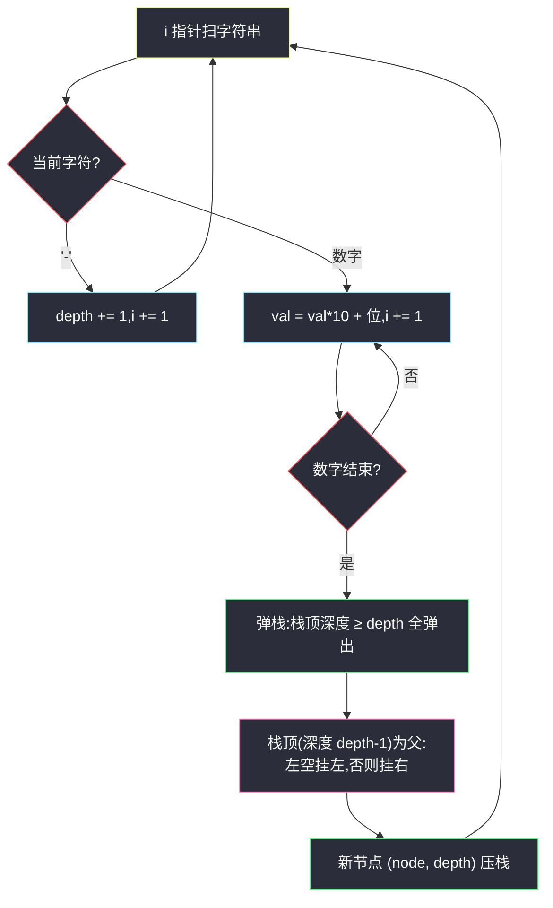
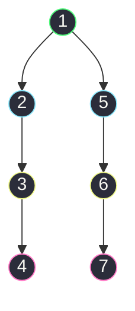

# 1028. 从先序遍历还原二叉树(Recover a Tree From Preorder Traversal)

> 🔗 LeetCode 1028:https://leetcode.cn/problems/recover-a-tree-from-preorder-traversal/
>
> 📚 灵茶题单小节:§「序列化建树:栈上的父子关系」练习

## 一、问题描述

我们从二叉树的根节点 `root` 开始进行深度优先搜索。

在遍历中的每个节点处,我们输出 `D` 条短划线(其中 `D` 是该节点的深度),然后输出该节点的值。(如果节点的深度为 `D`,则其直接子节点的深度为 `D + 1`。根节点的深度为 `0`)。

如果节点只有一个子节点,那么保证该子节点为**左子节点**。

给出遍历输出 `S`,还原树并返回其根节点 `root`。

**示例 1**

```text
输入:"1-2--3--4-5--6--7"
输出:[1,2,5,3,4,6,7]
```

**示例 2**

```text
输入:"1-2--3---4-5--6---7"
输出:[1,2,5,3,null,6,null,4,null,7]
```

**示例 3**

```text
输入:"1-401--349---90--88"
输出:[1,401,null,349,88,90]
```

> 数据范围:原始树中的节点数介于 `1` 和 `1000` 之间;每个节点的值介于 `1` 和 10^9 之间。

**节点定义**

```text
class TreeNode:
    def __init__(self, val=0, left=None, right=None):
        self.val = val          # 节点值,可达 10^9(多位数字)
        self.left = left        # 左子
        self.right = right      # 右子
```

**直观理解**

先序序列化把「结构」压缩进短划线的**个数**里:`-` 重复 `D` 次表示深度 `D`,紧随其后的数字是节点值。示例 3 的 `"1-401--349---90--88"` 里,`401` 是三位数——**数字与短划线混在一条字符串里,必须逐字符状态机式地切分**,不能天真地按 `-` split(会把 401 拆没)。

还原的关键在于先序的一条不变式:**新读到的节点,要么是栈上某个节点的孩子,要么(不可能)凭空出现**。具体地说,若新节点深度为 `D`,它的父节点必是"最近一个深度为 `D - 1` 的节点"——而在从根一路向下的先序旅途中,这些潜在祖先恰好构成一条栈。每读一个新节点,把栈顶那些深度 ≥ `D` 的弹出,剩下的栈顶就是父亲。挂接规则由题面约定:单孩子必是左孩子,即**父亲左空挂左,否则挂右**。

两个前奏问题先想清楚:

- **深度怎么会"回弹"?** 先序访问完一棵子树后才回到另一棵,于是串里深度会从深层直接跳回浅层(如示例 2 里 `4`(深度 3)后面直接是 `5`(深度 1))——回弹量就是刚才嵌进去的子树深度,弹栈恰好消解它。
- **同一个父亲的孩子在串里一定相邻吗?** 左子树整棵在前,右子树整棵在后,两个孩子之间隔着整棵左子树——所以"挂右"永远发生在弹掉整棵左子树代表之后,栈深随子树闭合而落。

为什么"单孩子保证左子"是必要承诺?因为这种序列化**不区分左右单子**:`"1-2"` 既可能来自「根 1 只有左子 2」也可能来自「根 1 只有右子 2」,序列一模一样。题目预先保证原树不存在右单子,序列才无歧义、还原才唯一。

## 二、暴力解法

两步走:先把字符串完整解析成 `(深度, 值)` 对的列表,再从左到右递归建树——`build(i, depth)` 消费以位置 `i` 起、深度为 `depth` 的子树,返回 `(子树根, 下一个未消费位置)`。

```python
class Solution:
    def recoverFromPreorder(self, traversal: str) -> Optional[TreeNode]:
        pairs = []                                       # (深度, 值)
        i, n = 0, len(traversal)
        while i < n:
            depth = 0
            while i < n and traversal[i] == '-':         # 数连续短划线
                depth += 1
                i += 1
            val = 0
            while i < n and traversal[i] != '-':         # 读多位数字
                val = val * 10 + (ord(traversal[i]) - ord('0'))
                i += 1
            pairs.append((depth, val))

        def build(i: int, depth: int):
            if i == len(pairs) or pairs[i][0] != depth:  # 无节点可挂:空子树
                return None, i
            val = pairs[i][1]
            node = TreeNode(val)
            i += 1
            node.left, i = build(i, depth + 1)           # 先试左
            node.right, i = build(i, depth + 1)          # 再试右
            return node, i

        root, _ = build(0, 0)
        return root
```

### 复杂度

- 时间:`O(n)`。解析一趟线性;`build` 每个节点恰好被消费一次(成功或作为空子树被拒绝一次),两次尝试合计常数次。
- 空间:`O(n)`(pairs 列表)+ `O(h)` 递归栈,链形树 `h = n = 1000`,接近 Python 默认递归上限(约 1000),临界但不爆;若数据规模放大就必须换迭代。

这个版本把「解析」与「建树」拆成两个独立阶段,每段都简单直白,适合作为理解的地基。但它有两处冗余:先存 pairs 再消费,多一份拷贝;递归深度绑死树高,栈溢出风险与生俱来。

另外注意 `build` 的两句递归**不可交换顺序**:先左后右是先序的内在要求——`(depth, 左子树, 右子树)` 的排列次序与字符串里子树出现的次序一致,写成先右后左就会把镜像树的串错建成正像。

## 三、优化探索

### 观察 1:栈就是"当前祖先链"

先序走到任何位置时,「从根到当前节点的路径」上的节点依次排开,深度严格递增 0、1、2、…——这些节点正是后续新节点的**全部候选父亲**。把这条路径上的节点按序压进栈,新节点深度 `D` 到来时,深度 ≥ `D` 的栈顶们已经"完成任务"(它们不可能再当父亲——父深必为 `D - 1`),弹掉即可;弹完栈顶恰好深度 `D - 1`,挂接。**栈内永远是从根到下一候选父亲的祖先链**,这一不变式贯穿整个扫描。

### 观察 2:左空挂左、否则挂右——题面约定兜底

挂接时看父亲:左指针空挂左,不空挂右。由于题面保证"单孩子必是左孩子",一条合法序列绝不会让同一父亲的右孩子先于左孩子出现;换言之,代码不需要额外校验——**约定替我们消除了歧义,挂接规则退化成机械的两行**。若某天题目允许右单子(序列化本身就得改用别的记号),这两行就不够用了。

### 观察 3:解析与建树合流——单次线性扫描

暴力版先解析成 pairs 再建树;其实解析出一个 `(depth, val)` 的瞬间就可以立刻挂接——数字读完的下一刻,短划线计数器已知、节点已可建。合流后既省掉 pairs 存储,又把递归 `build` 换成显式栈,一份循环完成全部工作。



### 观察 4:不变式论证——扫描任意时刻栈里是什么

把扫描任意时刻的栈断言出来,正确性就不再靠"感觉":

1. **深度严格递增**:栈底到栈顶,深度 0、1、2、…逐层加一,无重复无跳跃;
2. **恰为祖先链**:栈上每个节点都是它上方(更浅)节点的后代——即栈 = 根到栈顶的路径;
3. **候选父亲完备**:任何后续新节点的父亲,要么已在栈上,要么还没被读到;已被弹出的节点深度 ≥ 新深度,不可能再当父亲。

三条合起来:弹栈后栈顶必为深度 `depth-1` 的祖先,挂接永远落在正确位置。迭代版的好处就在于这三条可以对着循环体逐行验证,而递归版的同等论证藏在调用栈的隐式行为里。

### 与「建图遍历」家族的呼应

本题与[感染二叉树需要的总时间](./amount-of-time-for-binary-tree-to-be-infected.md)共享同一个母题:**树的指针只能单向表达,而问题的信息流是双向的**。感染题缺的是父方向,补一条父边建无向图;本题缺的是"谁是我爹"的回溯能力,补一个栈把祖先链显式拎出来。栈在这里扮演的角色,恰是递归调用栈的"手动版"——递归版本里它藏在函数调用链上,迭代版本里它走到台前,职责分毫未变。

顺带一提,这个"显式栈代替递归"的手法在单调查系列也出现过:柱状图最大矩形里栈存"待定高度的左端点",本题栈存"待定挂接的祖先链"——同为"把递归里隐式维护的上下文物化成数据结构"。

## 四、代码实现

```python
class Solution:
    def recoverFromPreorder(self, traversal: str) -> Optional[TreeNode]:
        n = len(traversal)
        stack = []                                        # (节点, 深度):根到当前候选父亲的祖先链
        i = 0
        while i < n:
            depth = 0
            while i < n and traversal[i] == '-':          # ① 数短划线:新节点的深度
                depth += 1
                i += 1
            val = 0
            while i < n and traversal[i] != '-':          # ② 读数字:支持多位(最大 10^9)
                val = val * 10 + (ord(traversal[i]) - ord('0'))
                i += 1

            node = TreeNode(val)
            while stack and stack[-1][1] >= depth:        # ③ 弹掉不可能再当父亲的祖先
                stack.pop()
            if stack:                                     # 栈空 ⇔ depth == 0 ⇔ 根
                parent = stack[-1][0]
                if parent.left is None:                   # ④ 单孩子约定:左空先挂左
                    parent.left = node
                else:
                    parent.right = node
            stack.append((node, depth))                   # ⑤ 新节点加入祖先链
        return stack[0][0]                                # 栈底永远是根
```

**细节说明**

- **`stack[0][0]` 返回根**:根深度为 0,任何时刻栈底都是根——它从不被弹出(弹出条件 `深度 ≥ depth ≥ 1` 对它不成立);第一个节点入栈后栈底即固定。
- **③ 的弹栈条件用 `>=`**:深度等于 `depth` 的栈顶是**兄弟**(同为上一节点的候选兄弟位置),兄弟绝不可能当父亲,必须弹出;写成 `>` 会把兄弟错留成父亲,挂错层级。
- **数字解析不 split**:值可达 `10^9`(十位数字),`traversal.split('-')` 会把多位数字连同结构一起切碎;`val * 10 + 位` 的手写解析是唯一稳妥的读法。
- **`traversal[i] != '-'` 判数字**:比 `isdigit()` 少一次函数调用,且语义同样精确——字符串里只可能出现 `-` 与数字两种字符。
- **无需 pairs、无递归**:解析、挂接、压栈在单循环内完成,栈深即树高但只存引用,`n = 1000` 时最坏 1000 个元组,内存开销远小于递归版的调用帧。
- **合法性假设**:代码信任输入合法(深度不会跳跃超过 1);若输入可能非法,③ 后可加断言 `stack and stack[-1][1] == depth - 1` 防御性检查,竞赛/刷题场景不必。
- **空串不会出现**:数据范围保证至少 1 个节点,首个字符必为数字;若要兼容空串,循环前加 `if not traversal: return None`。
- **多位数字与负值**:值域 [1, 10^9] 全为正,负号即结构符不会与数字混淆;若值可负,序列化格式本身就不成立了(负号歧义),需换分隔符——格式与值域的适配是序列化设计的隐性约束。

## 五、例子演示

用**示例 2** `"1-2--3---4-5--6---7"` 端到端走一遍,它同时覆盖「深度递增」「深度回弹两级」两种形态。



逐步执行(栈内容用「值@深度」表示):

| 读到 | (depth, val) | 弹栈 | 挂接 | 栈(底→顶) |
|---|---|---|---|---|
| `1` | (0,1) | 无 | 成为根 | `1@0` |
| `2` | (1,2) | 无 | 1 的左 | `1@0 2@1` |
| `3` | (2,3) | 无 | 2 的左 | `1@0 2@1 3@2` |
| `4` | (3,4) | 无 | 3 的左 | `1@0 2@1 3@2 4@3` |
| `5` | (1,5) | 弹 `4@3 3@2 2@1` | 1 的右 | `1@0 5@1` |
| `6` | (2,6) | 无 | 5 的左 | `1@0 5@1 6@2` |
| `7` | (3,7) | 无 | 6 的左 | `1@0 5@1 6@2 7@3` |

注意 `5` 到来时的连续弹栈:深度从 3 直接回弹到 1,三个祖先(4、3、2)一次性清场,栈顶只剩根——挂右。这正是「栈 = 祖先链」不变式最生动的时刻:**栈里被弹掉的,是再也不会有后代的节点;留下的,是新节点可能的父亲**。

层序序列化输出 `[1,2,5,3,null,6,null,4,null,7]`:1 的孩子 2、5;2 只有左 3;3 只有左 4;5 只有左 6;6 只有左 7——五个单孩子全部挂左,与题面约定吻合 ✅。

对照**示例 1** `"1-2--3--4-5--6--7"`:`2` 挂 1 左、`3` 挂 2 左、`4` 挂 2 右(2 左已占)、`5` 来时弹 `4@2 2@1` 挂 1 右、`6`/`7` 依次挂 5 的左右。输出 `[1,2,5,3,4,6,7]`——2 和 5 都是双孩子节点,「左空挂左、否则挂右」两条分支全用上 ✅。

对照**示例 3** `"1-401--349---90--88"`:`401` 三位数被 `val*10+位` 正确拼出;`90` 深度 3 挂 `349` 左;`88` 深度 2 弹 `90@3 349@2` 后挂 `401` 右。逐步展开:

| 读到 | (depth, val) | 弹栈 | 挂接 | 栈(底→顶) |
|---|---|---|---|---|
| `1` | (0,1) | 无 | 根 | `1@0` |
| `401` | (1,401) | 无 | 1 的左 | `1@0 401@1` |
| `349` | (2,349) | 无 | 401 的左 | `1@0 401@1 349@2` |
| `90` | (3,90) | 无 | 349 的左 | `1@0 401@1 349@2 90@3` |
| `88` | (2,88) | 弹 `90@3 349@2` | 401 的右 | `1@0 401@1 88@2` |

输出 `[1,401,null,349,88,90]` ✅——三位数字与深度回弹在同一例中叠加,是压测解析器的好用例。顺带观察 `88` 入栈后成为新的深度 2 代表:后续若再出现深度 3 的节点,父亲就是 88 而非已出栈的 349——"栈上每层恰一个代表"的不变式始终保持。

### 常见错误清单

- **用 `split('-')` 解析**:多位数字被切碎,`401` 变成三个空串之间的孤岛,直接崩溃;必须手写逐字符状态机。
- **弹栈条件写成 `>`**:深度相同的兄弟不被弹出,新节点被挂到兄弟下面,树形整体下坠一层,层序输出全错。
- **根的返回值取错**:返回 `stack[-1][0]` 拿到的是最后一个节点;栈底才是根。
- **递归版忘抬递归上限**:链形树 1000 层贴着 Python 默认上限,平台差异下可能 `RecursionError`;迭代版天然免疫。
- **忘掉「单孩子必左」假设**:若构造非法输入(右单子序列化而来),代码会把它挂左,产出与原树不同的树——约定是正确性的前提,不是代码的功劳。

### 边界用例速查

| 用例 | 输入要点 | 期望形态 | 考点 |
|---|---|---|---|
| 单节点 | `"7"` | 根 7,无孩子 | 栈空时挂接分支 |
| 全左链 | `"1-2--3---4"` | 每层左挂 | 弹栈永不触发 |
| 根双孩子 | `"1-2--3"` 之后接 `--4` | 1 的右子 | 左空挂左分支 |
| 深度两级回弹 | 示例 2 的 `5` | 连弹三个 | `>=` 条件 |
| 大数值 | `"1-999999999"` | 十位数字解析 | 手写数字拼装 |

### 自测三问

1. 输入 `"1-2--3---4"` 还原出什么形状?(答:全左链 1→2→3→4,弹栈分支从未触发,栈最深达到 4 层。)
2. 把挂接规则改成"右空先挂右",对合法输入输出会变吗?(答:会全错——合法序列中右孩子出现时左必已占,新分支只在左空时被触发,改规则后首个孩子就挂错边。)
3. 若输入是非法的 `"1---3"`(深度从 0 跳到 2),代码会发生什么?(答:弹栈后栈只剩 `1@0`,但 3 的深度是 2,会被挂到 1 的左子——产出错误树但不会崩;防御性断言能提前拦截。)

## 六、复杂度分析

- 时间:`O(n)`,`n` 为字符串长度。指针 `i` 只前进不后退;每个节点恰好压栈一次、至多弹栈一次;两段内层 while 合计消费全部字符各一遍。
- 空间:`O(h)` 辅助(栈深 = 树高,链形最坏 `n`;满树仅 `O(log n)`),不计返回的树本身。对比暴力版的 `O(n)` pairs + `O(h)` 递归帧,合流后省下一份完整拷贝。

### 正确性问答

**问:为什么弹完栈,栈顶深度必为 `depth - 1`?** 合法序列保证新节点的父亲在先序中先出现且深度恰为 `depth - 1`;祖先链深度严格递增且连续(每层恰一个代表),深度 ≥ `depth` 的全弹出后,链上剩下最深的就是 `depth - 1` 那位——它就是父亲。若输入深度跳跃(如根后直接深度 2),这一论证失效,输出无意义。

**问:栈里会同时存在兄弟吗?** 会——兄弟 A 已挂、栈顶还是 A 时,兄弟 B 到来,深度相同触发弹出 A,再挂 B。兄弟相邻入栈又立即出栈,正是 `>=` 条件处理的情形。

**问:为什么每个节点至多弹一次,总弹栈代价是 O(n)?** 节点只在被读到时压栈一次,弹出后永不再入(先序不回访);压弹各一次,合计 2n 次栈操作,均摊到每个字符仍是常数——这是「栈总量有界」的经典均摊论证,与单调栈系列的弹栈分析同构。

**问:递归版与迭代版,输出会不同吗?** 不会。两者消费同一 `(深度,值)` 序列,挂接决策(挂哪个父亲、左还是右)完全由序列决定,与实现载体无关——这与垂序遍历「键决定输出」同理,过程细节不改变结果。

**问:若题面去掉「单孩子必左」的保证,还能还原吗?** 不能唯一还原:`"1-2"` 对应左右两种原树,信息论上就丢了 1 比特。序列化格式必须为「单孩子方向」保留记号(如 LeetCode 层序格式的 `null` 占位,见[本站层序篇](./n-ary-tree-level-order-traversal.md)的序列化讨论)。

## 七、对比总结

| 解法 | 时间 | 空间 | 思路 | 备注 |
|---|---|---|---|---|
| 解析 + 递归建树(暴力) | `O(n)` | `O(n)` + 递归栈 | pairs 两阶段,`build(i,depth)` | 结构清晰,栈溢出临界 |
| 解析 + 迭代栈(合流,本文) | `O(n)` | `O(h)` | 单循环,边解析边挂 | 主解;无递归、无拷贝 |
| 递归直接扫字符串 | `O(n)` | `O(h)` | 不存 pairs,递归内解析 | 解析与递归耦合,可读性差 |
| split 预处理 + 建树 | `O(n)` | `O(n)` | 按位切割再重组 | 多位数字需特殊处理,易错 |

表中四种解法时间全部 `O(n)`,差异全在空间与工程性——这在"序列化"家族里很典型:算法下限早已探底,比拼的是**解析器写的稳不稳、递归会不会炸、拷贝能不能省**。

一句话:**短划线数是深度,栈是祖先链;弹到父亲就挂,左空先左**——15 行循环装下整道题。

从模板角度看,本题是「**显式栈模拟递归**」的标准教具:递归版里藏在调用链上的祖先信息,在迭代版里显式成 `(节点, 深度)` 栈。学会这手替换,所有"深度敏感的树遍历"都能去递归化——这也是本题在面试中反复出现的原因。

### 常见问答

**问:时间复杂度为什么不是 O(n log n) 或 O(n·h)?** 表面上每读一个新节点都要弹栈,若误以为弹栈量与栈深同阶就得出平方级——但弹出的元素永不再入栈,全局压弹总量 2n,均摊每字符 O(1);这是与「嵌套 while 必平方」直觉对抗的经典案例,单调栈系列(如柱状图最大矩形)的复杂度论证同源。

**问:答案的输出为什么是层序数组?** LeetCode 的树题返回值统一用层序序列化展示(含 `null` 占位),本题返回的是 TreeNode 引用,判题器再序列化;我们调试时也用同一格式对照,第五章的 `[1,401,null,349,88,90]` 即层序形式。

**问:值是 10^9,解析时 `val * 10` 会溢出吗?** Python 整数任意精度,不会;C++/Java 需用 `long`(10^9 恰在 int 上限附近,十位数 999999999 < 2^31,但保险起见用宽类型)。

**问:深度最大多少?** 链形树 1000 层,短划线前缀最长 999 个;解析器对连续 `-` 的计数没有上限约束,代码天然支持。

**问:短划线最多连多长?** 与上一问同源:最多 999 条;若把输入换成 `"1-" + "2-" * 999 + "3"` 这类退化串,解析器照样线性处理——计数器的值域只受树高限制。

**问:能否边解析边输出层序,一次都不建树?** 垂序/层序输出依赖整棵树结构,而先序串只给祖先链——不建树无法知道"某节点的兄弟何时闭合",还是要物化树结构(或至少物化每层计数)。

**问:最坏情况下栈有多深?** 链形树全程不弹栈,栈深 = n = 1000;每元素是一个 (TreeNode, int) 元组,内存几十字节,总量微不足道。若 n 放大到 10^7,`O(h)` 栈仍是瓶颈下限——任何算法都得至少存一条祖先链才能挂接。

## 八、举一反三

- [297. 二叉树的序列化与反序列化](https://leetcode.cn/problems/serialize-and-deserialize-binary-tree/):序列化全家桶的母题,`null` 占位与本题「深度记号」是两种正交的结构编码。
- [105. 从前序与中序遍历序列构造二叉树](https://leetcode.cn/problems/construct-binary-tree-from-preorder-and-inorder-traversal/):同样"从先序出发建树",但结构信息来自中序分割而非深度记号——两种信息源决定两套完全不同的算法(分治 vs 栈)。
- [1008. 前序遍历构造二叉搜索树](https://leetcode.cn/problems/construct-binary-search-tree-from-preorder-traversal/):结构信息藏在 BST 有序性里,第三种"先序建树"的信息源,与本题凑成三连。
- [449. 序列化和反序列化二叉搜索树](https://leetcode.cn/problems/serialize-and-deserialize-bst/):BST 上的序列化优化——利用有序性去掉 `null` 占位,与本题"用深度记号代替占位"异曲同工,都是**利用结构先验压缩编码**。
- [255. 验证前序遍历序列二叉搜索树](https://leetcode.cn/problems/verify-preorder-sequence-in-binary-search-tree/):同款「栈维护祖先链 + 弹栈」骨架,把建树换成验证,直接复用本题的栈直觉。
- 本站延伸阅读:[感染二叉树需要的总时间](./amount-of-time-for-binary-tree-to-be-infected.md)——同属"补全树的单向指针"家族:一个补父边建无向图,一个补祖先栈回溯方向;两篇合读能体会到「树的信息流改造」这一母题的两种手法。
