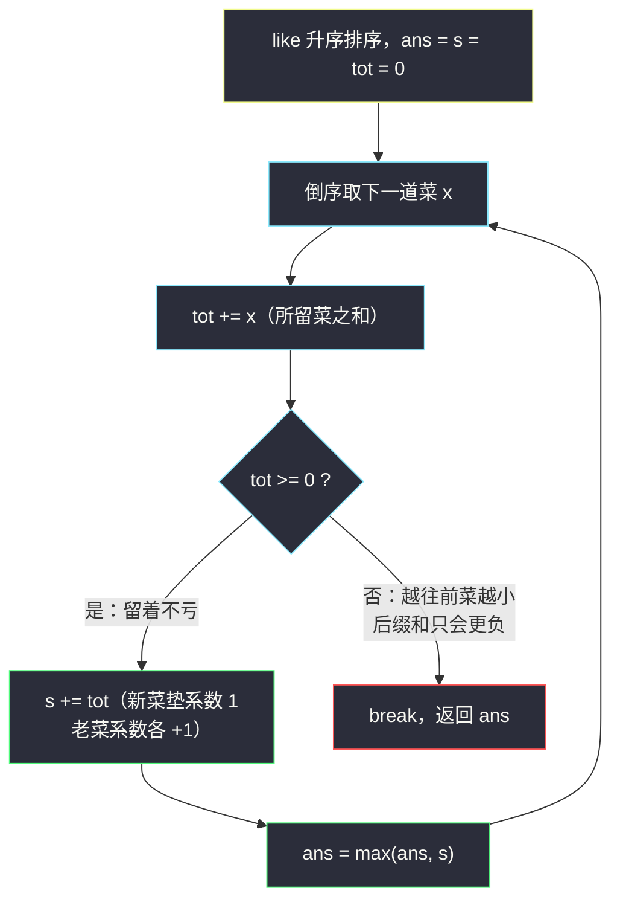
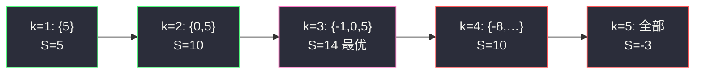

# 做菜顺序（排序不等式 · 升序做菜 + 后缀逐日叠加）

## 一、问题描述

一名厨师做了 `n` 道菜，第 `i` 道菜的喜爱度为 `like[i]`（可以为负——客人讨厌它）。做菜需要时间，第 `j` 道**做好**的菜的时间系数为 `j`（从 1 开始编号）：一道菜越晚做好，它乘上的系数越大。

你可以**丢弃部分菜**（甚至全部丢弃），并自选剩余菜的做菜顺序。总满意度定义为每道菜「喜爱度 × 时间系数」之和。请返回能获得的最大总满意度（全部丢弃时满意度为 0）。

> 🔗 LeetCode 1402：https://leetcode.cn/problems/reducing-dishes/
>
> 数据范围：`1 <= n <= 500`，`-1000 <= like[i] <= 1000`。

**示例 1**

```
输入：like = [-1,-8,0,5,-9]
输出：14
解释：丢弃 -8 和 -9 这两道菜，按 -1 → 0 → 5 的顺序做剩下的三道：
     (-1)×1 + 0×2 + 5×3 = -1 + 0 + 15 = 14。
```

**示例 2**

```
输入：like = [4,3,2]
输出：20
解释：全部都做，按 2 → 3 → 4 的顺序：2×1 + 3×2 + 4×3 = 20。
```

**示例 3**

```
输入：like = [-1,-4,-5]
输出：0
解释：所有菜都被讨厌，一道都不做是最优的。
```

**直观理解**

两件事决定了满意度：**做哪几道**、**按什么顺序做**。顺序这一半由排序不等式一锤定音：系数 `1..k` 递增，所以菜的喜爱度也应该**递增着做**——讨厌的菜抢着早做（乘小系数），最受欢迎的菜压轴（乘大系数）。选哪几道则由「后缀叠加」的增量决定：每多留一道菜，所有已留菜的系数整体 +1，新菜垫在系数 1 的位置，增量恰好是「所留菜之和」。这正是灵茶题单 §4.3 排序不等式的标准形态：**满意度排序后取正数后缀、逐日叠加（like 最大的最后做）**。

---

## 二、暴力解法

枚举每个子集，再枚举子集的所有排列算满意度，取最大：

```python
class Solution:
    def maxSatisfaction(self, like: List[int]) -> int:
        from itertools import permutations
        n = len(like)
        ans = 0                                  # 全部丢弃
        for mask in range(1, 1 << n):            # 枚举保留子集
            dishes = [like[i] for i in range(n) if mask >> i & 1]
            for perm in permutations(dishes):    # 枚举做菜顺序
                s = sum(v * (j + 1) for j, v in enumerate(perm))
                ans = max(ans, s)
        return ans
```

### 复杂度

- **时间**：`O(2^n × k!)`，天文数字。
- **空间**：`O(n)`。

### 🔴 瓶颈在哪里

排列的枚举完全是浪费：**固定子集后，最优顺序由排序不等式直接给出**（升序做），根本不需要枚举。即便先排序再用 `O(n²)` 的 DP 枚举「保留前缀长度」，也仍有大量冗余——最优解的结构其实极其规整。

---

## 三、优化探索（核心章节）

> 📚 本题在灵茶题单中属于 **§4.3 排序不等式**。模板要点：**满意度排序后取正数后缀、后缀逐日叠加**——like 最大的最后做（乘最大系数）。先证「怎么排」，再定「选哪些」，最后用增量递推一口气枚举所有保留长度。

### 3.1 排序不等式：固定选谁后，升序做最优

**排序不等式（重排不等式）**：两个长度为 `k` 的序列，**同序**配对的乘积和 ≥ 任意乱序配对的乘积和 ≥ **逆序**配对的乘积和。

**证明（相邻交换论证）**：设某方案中第 `i` 位做的菜是 `a`、第 `j` 位是 `b`（`i < j`，即 `a` 配系数 `i`、`b` 配系数 `j`），但 `a > b`——这是一个「逆序对」。交换两者的顺序后，满意度变化为：

```
(a×j + b×i) − (a×i + b×j) = (a − b)(j − i) > 0
```

即**每消除一个逆序对，满意度严格不减**。冒泡排序式的交换最终把序列调成升序，且过程中满意度单调不减 → 升序做最优。

本题的系数 `1, 2, ..., k` 天然递增，与「菜的喜爱度升序」正是同序配对。所以：**讨厌的菜先做，最喜欢的菜压轴**。

以示例 1 选定的三道菜 `{-1, 0, 5}` 为例，6 种排列的满意度：

| 做菜顺序 | 计算 | 满意度 |
|----------|------|--------|
| **-1, 0, 5（升序）** | -1 + 0 + 15 | **14** |
| 0, -1, 5 | 0 - 2 + 15 | 13 |
| -1, 5, 0 | -1 + 10 + 0 | 9 |
| 0, 5, -1 | 0 + 10 - 3 | 7 |
| 5, -1, 0 | 5 - 2 + 0 | 3 |
| 5, 0, -1（降序） | 5 + 0 - 3 | 2 |

### 3.2 选哪几道：最大的 k 道

**命题**：存在一个最优方案，保留的恰是喜爱度最大的 `k` 道（某个 `k`）。

**证明（交换论证）**：设最优方案保留了 `x` 而丢弃了 `y`，且 `y > x`。把 `x` 换成 `y`：新的 `k` 道菜多重集在降序比较下逐位不小于原多重集（`y` 替换了最小的 `x`），按 §3.1 升序做后每一项系数配对的菜都不小于原来的对应项 → 新满意度 ≥ 原满意度。反复交换后即得「保留最大 `k` 道」的最优方案。

于是把 `like` **升序排序**后，候选方案只剩 `n + 1` 个：**后缀 `a[n-k..n-1]`（最大的 `k` 道），按后缀顺序做（其中最小的先做、最大的最后做）**。

### 3.3 为什么负数菜也值得保留：垫系数

示例 1 的最优解保留了 `-1`：它自己贡献 `-1 × 1 = -1`，却把 `5` 的系数从 2 抬到 3（多赚 5）、把 `0` 抬了一档（不变），净赚。**负数菜是「垫脚石」**——只要「当前所留菜之和」仍为正，多留一道最小的菜就仍然划算；一旦后缀和转负，再往前（更小的菜）只会更亏。

### 3.4 增量递推：后缀逐日叠加

设 `a` 为升序数组，做最大的 `k` 道（即后缀）时的满意度记 `S(k)`（按升序做）。把新加入的菜 `a[n-k]` 放在**第 1 个**做：

```
S(k) = S(k-1) + (a[n-k] + a[n-k+1] + … + a[n-1])
```

直观解释：新菜占住系数 1，原有 `k-1` 道菜整体后移一位、系数各 `+1`，增量 = 新菜值 + 原有菜之和 = **后 k 项之和**。数学展开同样成立：第 `j` 项从 `a × (j-1)` 变为 `a × j`，逐项差恰是它自己。

实现上从最大的菜开始倒着加，维护 `tot`（当前所留菜之和）与 `s`（当前满意度）：



### 3.5 一句话核心

> **升序排序，从最大的一道开始逐个尝试追加：每追加一道，满意度加上「当前所留菜之和」；后缀和转负立刻停手。**

---

## 四、代码实现

### Python（主解：排序 + 后缀逐日叠加）

```python
class Solution:
    def maxSatisfaction(self, like: List[int]) -> int:
        like.sort()                        # 升序：越靠后越受欢迎
        ans = s = tot = 0                  # s：当前满意度；tot：当前所留菜之和
        for x in reversed(like):           # 从最受欢迎的菜开始追加
            tot += x
            if tot < 0:                    # 后缀和转负，再留必亏
                break
            s += tot                       # 新菜垫系数 1，老菜系数各 +1
            ans = max(ans, s)
        return ans
```

**变量含义**

| 变量 | 含义 |
|------|------|
| `like`（排序后） | 升序数组，`reversed` 遍历即从最大到最小 |
| `tot` | 当前保留的菜之和（后缀和），也是本轮满意度的增量 |
| `s` | 保留到当前为止的满意度 `S(k)` |
| `ans` | 所有 `k` 中满意度最大者；初始 0 对应「全部丢弃」 |

**循环不变式**：处理完倒数第 `k` 道菜后，`s = S(k)`（做最大的 `k` 道菜的满意度），`tot` 为这 `k` 道菜之和。

**细节**：

1. `break` 的正确性：升序数组倒序遍历时 `tot` 单调不增地变化，一旦 `< 0`，再往前的菜更小，`tot` 只会更负，`s` 只会下降——可以放心剪枝（即便不 break，靠 `max` 也正确，只是白算）。
2. 全负数组（示例 3）第一轮 `tot < 0` 直接 break，返回 0（一道不做）✓。
3. `ans` 初始为 0 而非 `-inf`：题目允许全部丢弃。

### Python（对照：`O(n²)` DP，理解贪心从何而来）

```python
class Solution:
    def maxSatisfaction(self, like: List[int]) -> int:
        like.sort()
        n = len(like)
        # f[i][j]：前 i 道菜中选若干、恰好做 j 道的最大满意度
        f = [[0] * (n + 1) for _ in range(n + 1)]
        ans = 0
        for i in range(1, n + 1):
            for j in range(1, i + 1):
                f[i][j] = max(
                    f[i - 1][j],                          # 不做第 i 道
                    f[i - 1][j - 1] + j * like[i - 1],    # 第 i 道做第 j 个（最后做）
                )
                ans = max(ans, f[i][j])
        return ans
```

这个 DP 已经把排序不等式「编译」进了转移：第 `i` 道若做必是**当前最后做**（它最大的系数由状态 `j` 决定），暗含升序。对比之下贪心解相当于发现 `f` 的最优路径必然取后缀，从而省掉整个 DP 表。

### Java（最优解环节同款）

```java
class Solution {
    public int maxSatisfaction(int[] like) {
        Arrays.sort(like);
        int ans = 0, s = 0, tot = 0;
        for (int i = like.length - 1; i >= 0; i--) {
            tot += like[i];
            if (tot < 0) break;           // 后缀和转负，止损
            s += tot;
            ans = Math.max(ans, s);
        }
        return ans;
    }
}
```

`n = 500`、`|like[i]| <= 1000`，最大满意度量级 `500 × 500 × 1000 = 2.5 × 10^8`，`int` 恰好装得下；若数据范围放大，注意换 `long`。

---

## 五、具体例子演示

### 例 1：like = [-1,-8,0,5,-9]（示例 1，端到端）

升序排序得 `[-9, -8, -1, 0, 5]`，从尾部（最大）开始逐道追加：

| 步 | 追加的菜 x | 保留的菜 | tot（所留之和） | 判断 | s（满意度） | ans |
|----|-----------|----------|-----------------|------|-------------|-----|
| 1 | 5 | {5} | 5 | ≥ 0，留 | 5×1 = 5 | 5 |
| 2 | 0 | {0, 5} | 0 + 5 = 5 | ≥ 0，留 | 5 + 5 = 10 | 10 |
| 3 | -1 | {-1, 0, 5} | -1 + 5 = 4 | ≥ 0，留 | 10 + 4 = 14 | **14** |
| 4 | -8 | {-8, -1, 0, 5} | -8 + 4 = -4 | < 0，**止损** | — | 14 |

答案 `14` ✓。展开验证每个保留长度 `k` 的满意度（做菜顺序均为升序）：

| k | 保留的后缀 | 做菜顺序 | 展开 | S(k) |
|---|-----------|----------|------|------|
| 0 | — | — | — | 0 |
| 1 | [5] | 5 | 5×1 | 5 |
| 2 | [0, 5] | 0 → 5 | 0 + 10 | 10 |
| 3 | [-1, 0, 5] | -1 → 0 → 5 | -1 + 0 + 15 | **14** |
| 4 | [-8, -1, 0, 5] | -8 → -1 → 0 → 5 | -8 - 2 + 0 + 20 | 10 |
| 5 | [-9, -8, -1, 0, 5] | 升序全做 | -9 - 16 - 3 + 0 + 25 | -3 |

`S(k)` 先升后降——负数菜前期是垫脚石（把大菜的系数抬高），后期入不敷出。这正是「枚举所有 k」而非「只做正数菜」的原因：`-1` 虽是负数，保留它净赚 `14 - 10 = 4`。

### 例 2：like = [4,3,2]（示例 2）

排序 `[2,3,4]`，倒序追加：

| 步 | x | 保留的菜 | tot | s | ans |
|----|---|----------|-----|-----|-----|
| 1 | 4 | {4} | 4 | 4 | 4 |
| 2 | 3 | {3,4} | 7 | 11 | 11 |
| 3 | 2 | {2,3,4} | 9 | 20 | **20** |

`S(3) = 2×1 + 3×2 + 4×3 = 20` ✓——全是正数菜时显然全做、升序做。

### 例 3：like = [-1,-4,-5]（示例 3）

排序 `[-5,-4,-1]`：第 1 步 `tot = -1 < 0`，直接 break，`ans = 0` ✓——没有正菜可以抬系数，垫脚石没有可垫的对象。



---

## 六、复杂度分析

| 方法 | 时间 | 空间 | 说明 |
|------|------|------|------|
| 子集×排列枚举 | `O(2^n · k!)` | `O(n)` | 不可行 |
| 排序 + DP | `O(n²)` | `O(n²)` | `n = 500` 可过，但不必要 |
| **排序 + 后缀叠加** | `O(n log n)` | `O(1)` | 排序是唯一瓶颈 |

- **时间**：`O(n log n)`。
- **空间**：`O(1)` 额外空间（原地排序不计）。

---

## 七、对比总结

**排序不等式家族：谁配谁，排个序就知道**

| 题 | 两个序列 | 结论 |
|----|----------|------|
| **#1402 本篇** | 菜的喜爱度 × 时间系数 | 同序（都递增）乘积和最大：小菜先做大菜压轴 |
| [#2931 购买物品的最大开销](https://leetcode.cn/problems/maximum-spending-after-buying-items/)（同目录 `maximum-spending-after-buying-items.md`） | 价格 × 天数 | 便宜早买、贵货晚买，同样同序配对 |
| #870 优势洗牌（同目录 `advantage-shuffle.md`） | 我方马 × 对方马 | 田忌赛马：错位配对（逆序思想） |
| [#3457 吃披萨](https://leetcode.cn/problems/eat-pizzas/)（同目录 `eat-pizzas.md`） | 披萨 × 计分位 | 交换论证确定「隔 2 取」 |

**易错点**

1. **方向做反**：把最大的菜先做（降序）恰好是排序不等式的**最小**方向，示例 1 里只有 2 分。记住「压轴的才是主角」。
2. **只保留正数菜**：漏掉负数垫系数的收益，示例 1 会算出 10 而非 14。
3. **忘记可以全丢弃**：全负数组应返回 0，不是负数。
4. **增量记错**：追加一道菜增加的是「当前所留菜**之和**」（新老菜一起），不是新菜自己。

**模板（排序不等式 · 后缀逐日叠加，Python 版）**

```python
a.sort()
ans = s = tot = 0
for x in reversed(a):
    tot += x
    if tot < 0: break      # 剪枝：后面只会更差
    s += tot               # 增量 = 所留之和
    ans = max(ans, s)
```

**常见变体**

- 若题面改成「至少做一道菜」：把初值 `ans = 0` 换成 `max(like)`，其余不动——全负数组时退而求其次做最大那道。
- 若时间系数从 0 开始（第 j 道乘 j）：满意度整体减去「所选之和」，最优保留集合不变，判断增量的阈值相应从 0 平移。

---

## 八、举一反三

| 题目 | 关系 |
|------|------|
| [2931. 购买物品的最大开销](https://leetcode.cn/problems/maximum-spending-after-buying-items/) | 同目录姊妹篇（`maximum-spending-after-buying-items.md`）：排序不等式 + m 路归并堆，「便宜早买贵货晚买」 |
| [870. 优势洗牌](https://leetcode.cn/problems/advantage-shuffle/) | 同目录（`advantage-shuffle.md`）：排序配对的另一极端（田忌赛马式错位） |
| [3457. 吃披萨](https://leetcode.cn/problems/eat-pizzas/) | 同目录（`eat-pizzas.md`）：交换论证 + 「隔 2 取」的配对结构 |
| [455. 分发饼干](https://leetcode.cn/problems/assign-cookies/) | 最朴素的排序 + 双指针配对贪心 |
| [1005. K 次取反后最大化的数组和](https://leetcode.cn/problems/maximize-sum-of-array-after-k-negations/) | 排序后对最小值动手脚的变体 |
| [2952. 需要添加的硬币的最小数量](https://leetcode.cn/problems/minimum-number-of-coins-to-be-added/) | 本批姊妹篇（`minimum-number-of-coins-to-be-added.md`）：归纳法构造 |

**思想迁移**

- 看到「乘上一个随位置变化的系数」（时间、天数、序号），先想**排序不等式**：同序最大、逆序最小，中间不用枚举。
- 「允许丢弃元素」的极值题，常用**后缀/前缀 + 增量**代替显式枚举子集：增量转负即止损。
- 负数元素未必是累赘——它们可以**垫位置**抬高别人的系数，值不值得全看「当前总和」的符号。
- 口诀：**「系数递增菜递增，讨厌的先端上桌；压轴留给头牌，后缀转负就撤。」**
