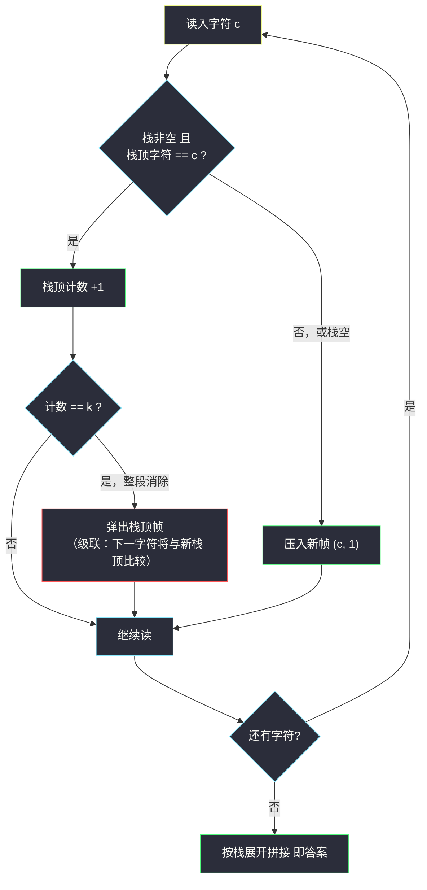

# 删除字符串中的所有相邻重复项 II（邻项消除 × 计数栈）

## 一、问题描述

给定一个小写字母字符串 `s` 和整数 `k`，重复执行「**消除**」操作，直到字符串不再变化：

- 选择 `k` 个**相邻且相等**的字母，将它们从 `s` 中删除，使左右剩余部分拼接到一起。

消除会**级联发生**：拼接后可能又出现新的 `k` 连重段，要继续删。返回最终的字符串。

> 🔗 LeetCode 1209：https://leetcode.cn/problems/remove-all-adjacent-duplicates-in-string-ii/
>
> 数据范围：`1 <= s.length <= 10^5`，`2 <= k <= 10^4`，`s` 只含小写英文字母。

**示例**

| 输入 | k | 输出 | 过程 |
|------|---|------|------|
| `s = "abcd", k = 2` | 2 | `"abcd"` | 无相邻重复，不删 |
| `s = "deeedbbcccbdaa", k = 3` | 3 | `"aa"` | 三轮级联消除（见第五章） |
| `s = "pbbcggttciiippooaais", k = 2` | 2 | `"ps"` | 成对消除后剩下的落单字符 |

**直观理解**

关键词是**级联**：删掉中间一段后，两侧字符「贴上来」可能恰好凑成新的 `k` 连重。如果用「删一次、扫一遍」的循环写法，最坏情况每个字符都要参与多轮扫描。这类「相邻相同就消除、消完还能再消」的问题，在灵神题单中归入 **§3.3 邻项消除** 小节，标准武器是**栈**——而且是带计数的栈。

---

## 二、暴力解法

每轮从头扫描字符串，找到第一段长度为 `k` 的相邻相等段删掉，重复直到某轮没删任何东西：

```python
class Solution:
    def removeDuplicates(self, s: str, k: int) -> str:
        def one_pass(t: str) -> str:
            i = 0
            while i < len(t):
                j = i
                while j < len(t) and t[j] == t[i]:   # 找相同字符连长
                    j += 1
                if (j - i) % k == 0:                 # 整段恰为 k 的倍数才全删？
                    pass                              # 这里直接删会漏：长 2k 的段要删 2 次
                if j - i >= k:                        # 朴素：先删第一组 k 个
                    return t[:i] + t[i + k:]
                i = j
            return t                                  # 本轮没删任何东西

        cur = s
        while True:
            nxt = one_pass(cur)
            if nxt == cur:
                return cur
            cur = nxt
```

### 复杂度

- **时间**：`O(n^2 / k)`——每删一段只消除 `k` 个字符，却要把整串重新拷贝一次；最坏（`k` 很大、每次只删一小段）逼近 `O(n^2)`，`n = 10^5` 时必然超时。
- **空间**：`O(n)` 字符串拷贝。

### 🔴 瓶颈在哪里

删一段后左右拼接、再从**头**重扫——但其实拼接只影响**交界处**：消除发生的位置永远在「当前读到的字符」与「它前面幸存的字符」之间。从左往右一遍扫描时，**左边幸存内容的全部信息，一个栈就装下了**。

---

## 三、优化探索（核心章节）

> 📚 本题在灵茶题单中属于 **§3.3 邻项消除**，与 [#1047 删除字符串中的所有相邻重复项](https://leetcode.cn/problems/remove-all-adjacent-duplicates-in-string/)（即 `k = 2` 特例）同模板；本章主线是把「逐字符压栈 + 计数达 k 即弹」这条套路打熟。

### 3.1 栈存什么：字符不够，要存「连长」

普通字符栈（`k=2` 版 #1047 的做法：栈顶与新字符相同则两者一起弹）到 `k > 2` 就失灵——弹掉 `k` 个需要知道「栈顶这个字符已经连续到第几个了」。所以栈元素升级为 **`(字符, 连续计数)`** 二元组：

- 读入字符 `c` 与栈顶的字符相同 → 栈顶计数 `+1`；计数到 `k` → **弹出整个栈顶**；
- 不同 → 压入新帧 `(c, 1)`。

### 3.2 级联为什么自动被处理

这是本题最漂亮的一点。删掉一段后，**下一个读进来的字符**自然地与新栈顶比较：

- 若与拼接后的左侧邻居相同 → 直接累加到它的计数上——**不需要回头重扫**；
- 若不同 → 各自安好。

也就是说，「消除 → 拼接 → 再消除」的级联，被翻译成了「弹栈 → 下一个字符继续与栈顶比较」的顺序流程。时间线永远向前，每个字符只入栈一次、至多出栈一次。

### 3.3 拼回答案

扫描结束后栈里剩下的就是答案的「压缩表示」，展开：

```python
''.join(ch * cnt for ch, cnt in st)
```

栈底到栈顶恰好是答案从左到右的顺序（弹栈才是逆序，这里顺序遍历即可）。

### 3.4 流程图



### 3.6 边界与变体速查

| 情形 | 行为 | 原因 |
|------|------|------|
| `k = 1` | 返回空串 | 每个字符入栈瞬间连长即 1 = k，立刻自消 |
| `k > s.length` | 原样返回 | 任何字符都凑不解 k 连长 |
| 全部相同字符如 `"aaaa"`、`k = 3` | 弹掉一组 3 个，余 `"a"` | 栈只弹整帧，长 4 不会触发第二次 |
| 流式追加字符（在线版） | 本模板直接可用 | 单向扫描、只看当前字符与栈顶 |

注意「长 4、k = 3」这类情形：入栈时连长从 1 累计，到 3 立刻弹帧，第 4 个字符重新从 1 计起——不会一次消掉 4 个，这正是「每 k 个一组、余数保留」的语义。

### 3.7 一句话核心

> **栈存 `(字符, 连长)`；同字符连长自增，满 `k` 弹栈帧；弹完不用回头，下一个字符自会与新栈顶续上——级联消除由此免费获得。**

---

## 四、代码实现

### Python（主解）

```python
class Solution:
    def removeDuplicates(self, s: str, k: int) -> str:
        st = []                                   # 元素 [字符, 连续计数]
        for c in s:
            if st and st[-1][0] == c:             # 与栈顶同字符：连长 +1
                st[-1][1] += 1
                if st[-1][1] == k:                # 达到 k：整段消除
                    st.pop()
            else:                                 # 新字符：压新帧
                st.append([c, 1])
        return ''.join(ch * cnt for ch, cnt in st) # 栈底→栈顶 = 答案左→右
```

### Python（备选：双指针原地标记，适合需要 `O(1)` 额外逻辑的场合）

```python
class Solution:
    def removeDuplicates(self, s: str, k: int) -> str:
        n = len(s)
        cnt = [0] * n                             # cnt[i]：以 i 结尾的连长
        left = list(s)                            # 模拟栈的原地版本
        top = 0                                   # 「栈」的有效长度
        for c in s:
            if top > 0 and left[top - 1] == c:
                cnt[top] = cnt[top - 1] + 1
            else:
                cnt[top] = 1
            left[top] = c
            if cnt[top] == k:
                top -= k - 1                     # 一次性弹掉 k 个字符（含写入位）
            else:
                top += 1
        return ''.join(left[:top])
```

**变量含义**

| 变量 | 含义 |
|------|------|
| `st` | 计数栈，`st[-1] = [字符, 该字符当前连长]` |
| `st[-1][1] == k` | 触发消除的条件：连长恰好到 `k` |
| `top`（备选版） | 手工栈的有效长度，`left[:top]` 是幸存内容 |

---

## 五、具体例子演示

以 `s = "deeedbbcccbdaa"`、`k = 3` 端到端跟踪（三段级联消除全部自动发生）：

| 读入 | 栈（底 → 顶，帧写作 `字符x连长`） | 动作说明 |
|------|-----------------------------------|----------|
| `d` | `(d,1)` | 新帧 |
| `e` | `(d,1) (e,1)` | 新帧 |
| `e` | `(d,1) (e,2)` | 同字符，连长 2 |
| `e` | `(d,1)` | **连长 3 = k，`eee` 整段弹出** |
| `d` | `(d,2)` | 与幸存的 `d` 续上——级联的伏笔 |
| `b` | `(d,2) (b,1)` | 新帧 |
| `b` | `(d,2) (b,2)` | 连长 2 |
| `c` | `(d,2) (b,2) (c,1)` | 新帧 |
| `c` | `(d,2) (b,2) (c,2)` | 连长 2 |
| `c` | `(d,2) (b,2)` | **连长 3，`ccc` 弹出** |
| `b` | `(d,2)` | **`b` 与下方 `(b,2)` 拼接成 3，又弹出——第一次级联** |
| `d` | （空栈） | **`d` 与 `(d,2)` 拼成 3，再次弹出——第二次级联** |
| `a` | `(a,1)` | 新帧 |
| `a` | `(a,2)` | 连长 2 < 3，保留 |

栈展开为 `"aa"` ✓。

对照暴力过程的语义：`eee` 删除后 `d|dbbcccbdaa` 中 `dd…` 相邻；`ccc` 删除后 `bb|b` 凑成三连、再牵出 `ddd`——每一步「消除后拼接引发新消除」都被「读下一个字符 → 与新栈顶比较」无损复刻，且**只扫了一遍字符串**。

第二个示例 `s = "pbbcggttciiippooaais"`、`k = 2` 的完整跟踪（三处级联用 ★ 标出）：

| 读入 | 栈（底 → 顶） | 说明 |
|------|---------------|------|
| `p` | `(p,1)` | 新帧 |
| `b` | `(p,1) (b,1)` | 新帧 |
| `b` | `(p,1)` | `bb` 达 2 弹出 |
| `c` | `(p,1) (c,1)` | 新帧 |
| `g` | `(p,1) (c,1) (g,1)` | |
| `g` | `(p,1) (c,1)` | `gg` 弹出 |
| `t` | `(p,1) (c,1) (t,1)` | |
| `t` | `(p,1) (c,1)` | `tt` 弹出 |
| `c` | `(p,1)` | ★ `c` 与幸存 `(c,1)` 拼成 2，级联弹出 |
| `i` | `(p,1) (i,1)` | |
| `i` | `(p,1)` | `ii` 弹出 |
| `i` | `(p,1) (i,1)` | |
| `p` | `(p,1) (i,1) (p,1)` | |
| `p` | `(p,1) (i,1)` | ★ `p` 与下方 `(p,1)` 拼成 2，级联弹出 |
| `o` | `(p,1) (i,1) (o,1)` | |
| `o` | `(p,1) (i,1)` | `oo` 弹出 |
| `a` | `(p,1) (i,1) (a,1)` | |
| `a` | `(p,1) (i,1)` | `aa` 弹出 |
| `i` | `(p,1)` | ★ `i` 与下方 `(i,1)` 拼成 2，级联弹出 |
| `s` | `(p,1) (s,1)` | 终帧 |

栈展开为 `"ps"` ✓——开头落单的 `p` 与结尾落单的 `s` 幸存，中间所有成对字符（含三处拼接后成对的级联）全部消净。

---

## 六、复杂度分析

| 解法 | 时间 | 空间 |
|------|------|------|
| 暴力逐轮删除 | `O(n^2 / k)` | `O(n)` |
| 计数栈（主解） | `O(n)` | `O(n)` |

- **时间 `O(n)`**：每个字符至多引起一次入帧、一次计数自增、一次弹帧，无回溯、无重复扫描。
- **空间 `O(n)`**：最坏（无任何消除，如 `"abcdef"`）栈保留全部字符；`k >= 2` 时更紧的上界是 `O(min(n, 26 * (k-1)))`——每种字母至多在栈里累积 `k-1` 个连长。

---

## 七、对比总结

**与同族题的关系**：#1047 是本题 `k = 2` 的特例（栈里只存字符即可，遇相同直接双双弹出）；本题把「重复次数」参数化后，栈元素必须携带**连长**信息。灵神 §3.3 的教学意图正是这条递进：先会 `k=2` 的朴素字符栈，再升级到计数栈。同为栈结构的设计题（对顶栈、聚合弹栈）见同目录 [design-a-text-editor.md](design-a-text-editor.md) 与 [parsing-a-boolean-expression.md](parsing-a-boolean-expression.md)。

**易错点**

1. **计数达 k 时是「恰好弹一帧」**：栈帧的连长设计保证任何时刻帧内计数 `< k`，弹一次即消掉完整的 `k` 个，不存在一帧内部还需要拆两次的情况。
2. **弹栈后不要清零或回退读指针**：级联靠「后续字符与幸存栈顶自然合并」完成，任何「回头重扫」都会退化成暴力。
3. **最终答案从栈底读到栈顶**，方向别搞反（弹空栈是逆序）。
4. 暴力版里「连长 2k 的段」要删两次：朴素一次删 `k` 个的循环容易在这里写错边界；计数栈版本天然没有该问题。

---

## 八、举一反三

| 题目 | 关系 |
|------|------|
| [1047. 删除字符串中的所有相邻重复项](https://leetcode.cn/problems/remove-all-adjacent-duplicates-in-string/) | `k = 2` 特例，同小节入门版 |
| [1544. 整理字符串](https://leetcode.cn/problems/make-the-string-great/) | 邻项消除的「大小写配对」变体，仍是单字符栈 |
| [394. 字符串解码](https://leetcode.cn/problems/decode-string/) | 栈做「分段聚合」的另一形态（§3.5 同款武器） |
| [71. 简化路径](https://leetcode.cn/problems/simplify-path/) | 用栈消除 `..` 与冗余分段，邻项思想的路径版 |
| 同目录 [parsing-a-boolean-expression.md](parsing-a-boolean-expression.md) | 「弹到分隔符再聚合」的栈法姊妹篇 |
| 同目录 [design-a-text-editor.md](design-a-text-editor.md) | 对顶栈设计题：栈的另外两种用法 |

**思想迁移**

- 看到「删除相邻相同 / 消除后拼接再消除」，条件反射地想栈：**左侧幸存内容 = 栈，级联 = 弹栈后续接**。
- 需要计数的消除（`k` 重复、`k` 连长），栈元素就从「单值」升级为「`(值, 计数)`」二元组——这个升级思路在单调栈计数、区间压缩里反复出现。
- 一遍扫描能解决的题，永远警惕「删完从头再扫」的写法：那通常是 `O(n^2)` 的信号。
