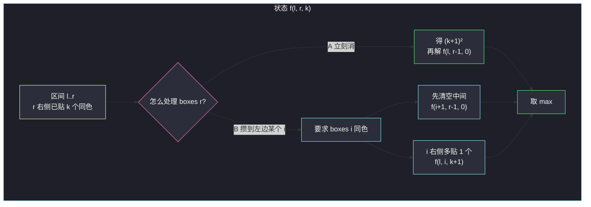
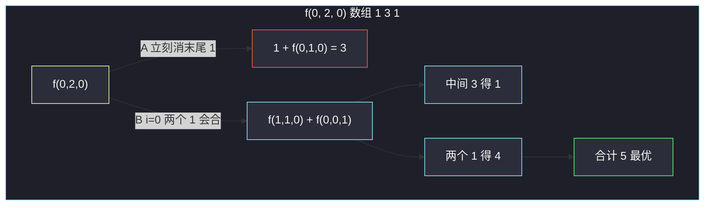

# 546. 移除盒子（Remove Boxes）

> 题目来源：[https://leetcode.cn/problems/remove-boxes/](https://leetcode.cn/problems/remove-boxes/)
>
> 灵茶题单小节定位：§8.2 区间 DP

## 一、问题描述

给出一排盒子 `boxes`，每个盒子的颜色用正整数表示。

每一轮可以移除一段**颜色相同且连续**的 `k` 个盒子（`k >= 1`），这一轮得 `k * k` 分；移除后左右两端拼在一起。重复直到盒子全部消失。

返回能获得的**最大积分**。

**数据范围**：

- `1 <= boxes.length <= 100`
- `1 <= boxes[i] <= 100`

**示例 1**：

```text
输入：boxes = [1,3,2,2,2,3,4,3,1]
输出：23
解释：
[1, 3, 2, 2, 2, 3, 4, 3, 1]
----> [1, 3, 3, 4, 3, 1]     删三个 2，得 3*3 = 9
----> [1, 3, 3, 3, 1]         删一个 4，得 1*1 = 1
----> [1, 1]                   删三个 3，得 3*3 = 9
----> []                       删两个 1，得 2*2 = 4
合计 9 + 1 + 9 + 4 = 23
```

**示例 2**：

```text
输入：boxes = [1,1,1]
输出：9
解释：三个同色一次删光，得 3*3 = 9。若一个一个删只有 1+1+1 = 3。
```

**示例 3**：

```text
输入：boxes = [1]
输出：1
```

**核心思考点**：得分是 `k²`，同色的盒子攒得越多越好——中间隔着别的颜色时，要先把中间清掉，让同色从两边拼过来。二维区间 DP 不够用：清中间时，区间右端外面已经攒了几个同色，会改变「最后一下」的平方。必须把「右边已经贴着的同色个数」做成第三维：`f[l][r][k]` = 区间 `[l, r]` 且 `r` 右侧已有 `k` 个与 `boxes[r]` 同色时的最大分。

## 二、暴力解法

### 思路

每一轮，当前数组里每一段连续同色都是一次合法操作。枚举删掉哪一段，拼接后递归，取总分最大。用元组记忆化，避免同一排列被不同删除顺序重复搜到。

`n ≤ 6` 对拍够用；`n = 100` 时连续段的选择序列是指数级，不可提交。

### 代码

```python
from functools import cache

def removeBoxesBrute(boxes: list[int]) -> int:
    @cache
    def dfs(arr: tuple[int, ...]) -> int:
        if not arr:
            return 0
        n = len(arr)
        ans = 0
        i = 0
        while i < n:
            j = i
            while j < n and arr[j] == arr[i]:
                j += 1
            k = j - i                            # [i, j) 同色
            nxt = arr[:i] + arr[j:]
            ans = max(ans, k * k + dfs(nxt))
            i = j
        return ans
    return dfs(tuple(boxes))
```

### 复杂度

- 时间：最坏指数。颜色种类越多、连续段越碎，分支越多。仅短数组基准。
- 空间：记忆化存下出现过的元组。

二维区间 DP 的朴素想法「`g[l][r]` = 消掉 `[l, r]` 的最大分，枚举切点」**是错的**——切点两侧不是独立子问题：左侧最右的颜色可能要和右侧某个同色拼接后再一起删，分割后丢失了「攒着不删」的选择。这正是下一章要补的第三维。

## 三、优化探索

### 3.1 为什么不能二维 ⭐

看 `[1, 3, 1]`。最优是先删中间的 3（1 分），两个 1 拼到一起再删（4 分），共 5 分。

如果规定「区间 `[0, 2]` 在某个切点切开、两段独立消完」：

- 在 3 左侧切：左 `[1]` 得 1，右 `[3, 1]` 再各自 1+1，总分 3；
- 在 3 右侧切：对称，还是 3。

永远到不了 5。因为**真正的最优不是「切开独立消」，而是「先消中间、两端跨过切点会合」**。二维状态没有地方记下「右端这个 1，外面还贴着另一个 1」。

`k²` 对「会合」极度敏感：1 个 1 得 1 分，2 个 1 得 4 分，3 个 1 得 9 分。少记一个贴在外面的同色，平方直接算错。

### 3.2 状态：区间 + 右端已经攒了几个 ⭐⭐⭐

定义：

```text
f(l, r, k) = 只考虑 boxes[l..r] 这一段，
             并且 boxes[r] 的右边已经贴了 k 个与它同色的盒子
             （这些盒子来自更外层、此刻已经挨着 r）
             时，把这段全部消掉能得到的最大分
```

原问题就是 `f(0, n-1, 0)`：整段、右边什么都还没贴。

`k` 从哪来？来自外层调用——外层决定「先把 `r` 右边某段中间清空，让更右边的同色贴过来」，然后把贴过来的个数加进 `k` 再问内层。

盒子下标 `r` 本身还在区间里，所以跟 `r` 一起消的同色总数是 `k + 1`（自己 + 右边已贴的 k 个）。若 `r` 左边还紧挨着同色，也可以先并进 `k`，见 3.4。

### 3.3 两种决策 ⭐⭐⭐

处理 `f(l, r, k)`，颜色 `c = boxes[r]`。

**决策 A：现在就消掉 r 以及它右边已贴的 k 个。**

一共 `k + 1` 个颜色 `c`，得 `(k+1)²` 分。剩下独立区间 `[l, r-1]`，右边不再贴着任何东西：

```text
A = (k + 1)² + f(l, r-1, 0)
```

**决策 B：先不消 r，把区间里某个同色的 i 接到 r 上。**

在 `[l, r-1]` 里枚举 `i`，满足 `boxes[i] == c`。要让 `i` 和 `r` 变成邻居，必须先把中间 `(i+1 .. r-1)` **整段消光**。中间消完得 `f(i+1, r-1, 0)` 分（这段的右边没有预贴）。然后 `[l, i]` 的右端 `i` 已经贴上了原来的 `r` 以及 `r` 右边的 k 个，所以多 1 个同色：

```text
B(i) = f(i+1, r-1, 0) + f(l, i, k+1)     仅当 boxes[i] == boxes[r]
```

取所有合法 `i` 与决策 A 的最大值。

```text
f(l, r, k) = 0                              若 l > r
f(l, r, k) = max(
    (k+1)² + f(l, r-1, 0),                 决策 A：立刻消 r
    max B(i)  for boxes[i] == boxes[r]     决策 B：攒到 i 上
)
```



决策 B 就是在形式化「先清中间、同色会合」。`[1, 3, 1]` 里，`f(0, 2, 0)` 的决策 B 会找到 `i = 0`（两个 1），先清中间的 3 得 1 分，再 `f(0, 0, 1)`：一个 1 右边已经贴了 1 个 1，一次删两个得 4 分，合计 5。二维做不到的那一步，被 `k + 1` 接住了。

### 3.4 右端连续同色先并进 k ⭐⭐

若 `boxes[r] == boxes[r-1] == ... == boxes[r-t+1]`，这 t 个本来就挨着，没有理由拆开分别贴。可以把它们从区间里缩掉，折进 `k`：

```text
while l < r and boxes[r] == boxes[r-1]:
    r -= 1
    k += 1
```

之后 `boxes[r]` 是这段连续同色的**左端**，决策 B 枚举的 `i` 都在这段的左边，不会再和右端连续块纠缠。这是常数优化，正确性不变：并进去的每一个都算进最终的 `(k+1)²` 或继续往左传。

一个常见写法是：找到连续段之后，决策 A 变成「把这一整段加上外面的 k 一起消」；和 while 收缩是同一件事。

### 3.5 记忆化，不要自底向上硬推顺序 ⭐

状态数 `O(n³)`：`l, r` 各 n，`k < n`（右边最多贴 n-1 个）。每个状态枚举 `i`，转移 `O(n)`，总共 `O(n⁴)`。`n = 100` 时 `10^8` 量级，记忆化只计算能走到的状态，常数比四重循环填表友好。

自底向上要按区间长度、再按 k 推，容易把「`k+1` 依赖更长贴附」的顺序写反。面试默写走记忆化即可。

`k` 的物理上界是「`r` 右边同色盒子个数」，实现里用 `n` 当第三维长度足够；Python `@cache` 不需要预开数组。

### 3.6 和戳气球的对比

[#312 戳气球](https://leetcode.cn/problems/burst-balloons/) 也是区间 DP，但枚举的是**最后**戳哪个，因为得分取决于当时邻居。本题得分只取决于「这一段同色有多长」，邻居颜色无关，所以枚举的是**右端这块同色现在消还是再攒**。骨架都是区间，第三维的含义完全不同：312 不需要 k，本题没有 k 就丢失会合信息。

**核心一句**：`f(l, r, k)` 问的不是「这段怎么切」，而是「右端这只盒子，现在带着已经贴上来的 k 个一起走，还是再等左边一个同色过来」。

## 四、代码实现

### 主解：三维记忆化

```python
from functools import cache

class Solution:
    def removeBoxes(self, boxes: list[int]) -> int:
        n = len(boxes)

        @cache
        def dfs(l: int, r: int, k: int) -> int:
            if l > r:
                return 0
            # 右端连续同色并进 k，boxes[r] 变成这段的左端
            while l < r and boxes[r] == boxes[r - 1]:
                r -= 1
                k += 1
            # A：立刻消掉 r 和已贴的 k 个
            ans = dfs(l, r - 1, 0) + (k + 1) * (k + 1)
            # B：把某个同色 i 接到 r 上
            for i in range(l, r):
                if boxes[i] == boxes[r]:
                    ans = max(
                        ans,
                        dfs(i + 1, r - 1, 0) + dfs(l, i, k + 1),
                    )
            return ans

        return dfs(0, n - 1, 0)
```

### 对照：Java 三维数组

```java
class Solution {
    private int[] b;
    private int[][][] f;

    public int removeBoxes(int[] boxes) {
        b = boxes;
        int n = b.length;
        f = new int[n][n][n];
        return dfs(0, n - 1, 0);
    }

    private int dfs(int l, int r, int k) {
        if (l > r) {
            return 0;
        }
        while (l < r && b[r] == b[r - 1]) {
            r--;
            k++;
        }
        if (f[l][r][k] != 0) {
            return f[l][r][k];
        }
        int ans = dfs(l, r - 1, 0) + (k + 1) * (k + 1);
        for (int i = l; i < r; i++) {
            if (b[i] == b[r]) {
                ans = Math.max(ans, dfs(i + 1, r - 1, 0) + dfs(l, i, k + 1));
            }
        }
        f[l][r][k] = ans;
        return ans;
    }
}
```

Java 用 `0` 当未访问标记是安全的：任何非空区间至少得 1 分（删一个盒子），不会和「没算过」冲突。空区间在 `l > r` 处直接返回，不会写进 `f`。

### 细节说明

- **`while` 改的是局部 `r, k`，不要改调用方的区间**：记忆化的 key 是收缩之后的 `(l, r, k)`，同一连续段的不同切法会撞到同一状态，这正是收缩的好处。
- **决策 B 的 `i` 不必取连续段最右一个**：取段内任何一个同色下标，数学上都能走到会合；只枚举「一段同色的右端」是可选剪枝，正确性不依赖它。默写不必加。
- **`(k+1)*(k+1)` 不要写成 `k*k`**：`k` 是「已经贴在右边的」，`r` 自己还要算一个。
- **中间那段的第三维必须是 0**：中间清空后，它的右边是 `r`，而 `r` 还没消、也不属于中间。给中间预贴会把 `r` 错算进中间的得分。
- **`@cache` 在部分评测环境会占内存**：算完 `cache_clear()` 可过内存卡点；LeetCode 本题一般不必。
- **颜色值不是下标**：第三维是个数 `k`，不是颜色编号。`boxes[i] <= 100` 只说明调色板小，状态仍按位置开。

## 五、例子演示

### 5.1 教学例：boxes = [1, 3, 1]

下标 `0:1, 1:3, 2:1`。求 `f(0, 2, 0)`。右端是 1，左边没有与它连续的同色，while 不触发。

**决策 A**：立刻消最后一个 1，得 1，剩 `[1, 3]`。

`f(0, 1, 0)`：右端 3，决策 A 得 1 + `f(0, 0, 0)`。`f(0, 0, 0)` 是单个 1，得 1。`[0, 1]` 里没有别的 3，没有决策 B。所以 `f(0, 1, 0) = 2`。决策 A 总分 1+2=**3**。

**决策 B**：`i = 0`，`boxes[0] == 1`。先清中间 `f(1, 1, 0)` = 单个 3，得 1；再 `f(0, 0, 1)`：一个 1，右边已贴 1 个 1，一次删两个，得 4。总分 1+4=**5**。

`f(0, 2, 0) = max(3, 5) = 5` ✅。



### 5.2 官方示例 1：boxes = [1, 3, 2, 2, 2, 3, 4, 3, 1]

下标：

```text
0 1 2 3 4 5 6 7 8
1 3 2 2 2 3 4 3 1
```

最优策略的「人话」是：三个 2 已经连在一起，先 9 分清掉；4 挡在 3 中间，先 1 分清掉；三个 3 会合再 9 分；两个 1 最后 4 分。DP 不会按这个时间顺序填表，但它的决策 B 恰好在描述「3 和 3 会合、1 和 1 会合」。

看整段 `f(0, 8, 0)`，右端颜色 1。决策 B 会找到 `i = 0` 那个 1：

1. 先清空中间 `[1..7]`，即 `f(1, 7, 0)`；
2. 再 `f(0, 0, 1)`：两个 1 一起删，得 4。

于是问题变成：中间那串 `[3, 2, 2, 2, 3, 4, 3]` 的最大分是多少？这正是 `f(1, 7, 0)`。

继续看 `f(1, 7, 0)`，右端是下标 7 的 3。决策 B 能找到下标 1 和 5 两个 3。

选 `i = 5`（紧邻 4 左边的 3）：先清 `[6..6]` 那个 4，得 1；再 `f(1, 5, 1)`，意思是 `[3, 2, 2, 2, 3]` 且右边已经贴了一个 3。

`f(1, 5, 1)` 右端又是 3（下标 5），外面已经贴 1 个。再决策 B 找到 `i = 1`：先清中间三个 2，得 9；再 `f(1, 1, 2)`——一个 3，右边已经贴了 2 个 3，三个一起删得 9。

串起来：

| 步骤 | 子问题 | 得分 |
|---|---|---|
| 清三个 2 | `f(2, 4, 0)` | 9 |
| 三个 3 一起 | `f(1, 1, 2)` | 9 |
| 清 4 | `f(6, 6, 0)` | 1 |
| 两个 1 一起 | `f(0, 0, 1)` | 4 |
| 合计 | | **23** |

这和官方操作序列一一对应，只是 DP 从「最后两个 1 会合」往里拆，官方解说从「先打 2」往外打。两条叙事同一棵决策树。

若决策 A 一上来就把最后的 1 单独删掉，两个 1 凑不成 4 分，整棵树最多 20（三个 2 得 9、三个 3 得 9、两个单 1 得 1+1），比 23 差。`k²` 的凸性惩罚了一切过早的单独删除。

### 5.3 示例 2 与示例 3

`[1, 1, 1]`：while 把三个 1 并进同一端，`k` 变成 2，`l == r`，决策 A 得 `(2+1)² = 9`，没有更左的 `i`。答案 **9** ✅。

`[1]`：`f(0, 0, 0) = 1² = 1` ✅。

### 5.4 易错局面：同色不相邻且中间不能白清

`boxes = [1, 2, 1, 2]`。两个 1 会合得先清中间的 2；清掉这个 2 之后，右边那个 2 还在，并不能和它会合（已经被 1 隔开的另一个 2 要等 1 消失）。一种最优是各删各的：四个 1 分。也可以先删一个 2，让两个 1 会合得 4，再删剩下一个 2 得 1，总分 5。DP 的决策 B 会在处理 1 时清掉中间的 2，走到 5。暴力短数组对拍时这类「交叉同色」最容易暴露二维写法的错误。

## 六、复杂度分析

设 `n = len(boxes)`（`n ≤ 100`）：

- **时间复杂度：`O(n⁴)`**——状态 `O(n³)`，每个状态枚举 `O(n)` 个会合位置。右端连续同色收缩会减少一部分状态，最坏仍是这个量级。
- **空间复杂度：`O(n³)`**——记忆化 / 三维数组。递归深度 `O(n)`。

`n = 100` 时 `100⁴ = 10^8`，再乘上同色判断的稀疏性，Python 记忆化可以过。不要再套一层「枚举这一轮删哪一段连续块」的指数搜索。

## 七、对比总结

| 维度 | 递归删连续段 | 二维区间 DP | 主解 `f(l, r, k)` |
|---|---|---|---|
| 正确性 | 正确 | **错误**（丢失会合） | 正确 |
| 时间 | 指数 | —— | `O(n⁴)` |
| 关键信息 | 整个数组 | 只有左右端点 | 右端已贴同色个数 |
| n=100 | TLE | 即使过也是错解 | 可通过 |

**套路归纳**：**得分带平方（或任何凸函数）+ 中间清空后两端同色会合** → 二维不够，给「已经贴在某端的同色个数」加一维。转移永远是两支：现在带上已贴的一起消；或者再等区间内另一个同色，先把中间独立清零。收缩右端连续段是默认优化，不是新状态。看见「消除同类项、顺序影响平方分」，第一反应就是这个三维。

易错清单：

- 用 `g[l][r]` 枚举切点，当成 312 戳气球写——本题不是「最后消谁」，切点两侧会跨切点会合。
- 决策 B 写成 `f(l, i, k) + f(i+1, r, 0)`，k 没加 1，等于没把 `r` 贴到 `i` 上。
- 中间段带着非 0 的 k 进入，把右端盒子算进中间的得分。
- `(k+1)²` 误写成 `k²`，漏掉 `r` 自己。
- Java 第三维开成颜色种类 100，而不是个数 n——`k` 最大是个数。

## 八、举一反三

1. **[312. 戳气球](https://leetcode.cn/problems/burst-balloons/)**：区间 DP 的另一支——枚举最后操作，二维就够。和本题放一起，分清「最后消谁」与「右端攒几个」。
2. **[664. 奇怪的打印机](https://leetcode.cn/problems/strange-printer/)**：同色可以「一次印一段、中间再插印」，会合思想非常像，状态是二维（一次印刷可以覆盖，不必显式记 k）。
3. **[1000. 合并石头的最低成本](https://leetcode.cn/problems/minimum-cost-to-merge-stones/)**：区间 DP + 堆数约束，枚举切点合法。
4. **[1039. 多边形三角剖分的最低得分](https://leetcode.cn/problems/minimum-score-triangulation-of-polygon/)**：标准区间枚举 k，无第三维。
5. **[132. 分割回文串 II](https://leetcode.cn/problems/palindrome-partitioning-ii/)**：区间判定 + 线性 DP 最少刀数；「先预处理区间性质再 DP」可复用。

**同族互引**：§8.2 区间 DP 的 Hard 收官。同目录 `maximum-number-of-operations-with-the-same-score-ii.md` 是「只动两端」的二维区间 DP，对比着读更能感到：本题难就难在**中间会空出来、两端同色要跨空会合**，所以才多一维 k。
