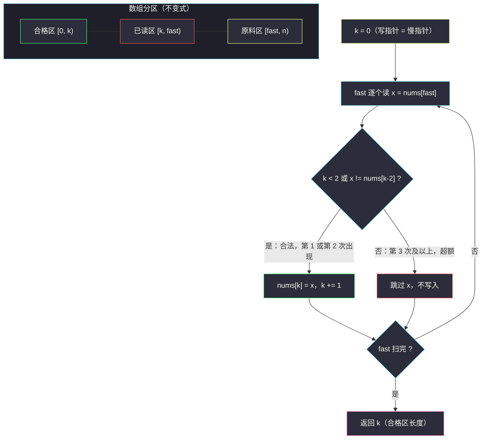

# 删除有序数组中的重复项 II（原地修改 · 慢指针写指针 · 每值最多保留 2 个）

## 一、问题描述

给一个**非严格递增**（有序、允许重复）的数组 `nums`，请**原地**删除重复出现的元素，使每个元素**最多出现两次**，返回删除后数组的新长度 `k`。

元素的**相对顺序**应该保持一致。由于数组长度无法改变，结果是：`nums` 的前 `k` 个元素存放最终内容；`k` 之后的部分是什么无所谓。要求**原地**修改、`O(1)` 额外空间，然后用下述判题程序验证：

```
int[] nums = [...];          // 输入数组
int[] expectedNums = [...];  // 期望答案
int k = removeDuplicates(nums);
assert k == expectedNums.length;
for (int i = 0; i < k; i++) {
    assert nums[i] == expectedNums[i];
}
```

> 🔗 LeetCode 80：https://leetcode.cn/problems/remove-duplicates-from-sorted-array-ii/
>
> 数据范围：`1 <= nums.length <= 3 * 10^4`，`-10^4 <= nums[i] <= 10^4`，`nums` 已按非严格递增排列。

**示例 1**

```
输入：nums = [1,1,1,2,2,3]
输出：5, nums = [1,1,2,2,3]
解释：函数应返回新长度 k = 5，且前 5 个元素为 1,1,2,2,3。1 出现 3 次，只保留前 2 个。
```

**示例 2**

```
输入：nums = [0,0,1,1,1,1,2,3,3]
输出：7, nums = [0,0,1,1,2,3,3]
解释：1 出现 4 次，只保留 2 个；新长度 k = 7。
```

**直观理解**

数组分两半看：**左边是「合格区」**（每个值 ≤ 2 个、相对顺序不变），**右边是「原料区」**（尚未审查的原料）。一个快指针从原料区逐个取货，一个慢指针标记合格区的下一个空位——「快读慢写」，是原地修改类题的通用骨架。

## 二、暴力解法（哈希计数 + 重建）

### 直观思路

用哈希表统计每个值的出现次数，然后按顺序重写 `nums`：每个值写 `min(次数, 2)` 份。由于 `nums` 有序，值的首次出现顺序就是升序，直接从左到右扫一遍即可。

```python
from collections import Counter

class Solution:
    def removeDuplicates(self, nums: List[int]) -> int:
        cnt = Counter(nums)                 # 值 -> 出现次数
        k = 0
        for v in sorted(cnt):               # 有序，按升序重建
            for _ in range(min(cnt[v], 2)):
                nums[k] = v
                k += 1
        return k
```

### 复杂度

- **时间**：`O(n log n)`（`sorted(cnt)` 排序去重后的值；若直接单扫原数组计数重写可到 `O(n)`，但写法更绕）。
- **空间**：`O(n)` 的 `Counter`。

### 🔴 瓶颈在哪里

第一，`O(n)` 额外空间违反题目「原地、`O(1)` 空间」的要求。第二，它**完全没用「有序」这个条件**——有序性本来可以让我们只看「写入区倒数第二个值」就判断重复是否超额，连哈希表都不需要。

## 三、优化探索（核心章节）

> 📚 本题在灵茶题单中属于 **§3.5 原地修改**：**慢指针 = 写指针**，标记「已处理完毕的合格区」边界；快指针 = 读指针，逐个审查原料。本题是这一族里「每个值最多保留 m 个」的代表（m = 2）。

### 3.1 数组分区：合格区 / 原料区

任意时刻，数组被划成三段：

```
[0, k)        合格区：每个值最多 2 个，相对顺序保持
[k, fast)     已读区：审查过、判定多余（或已被覆盖）的部分
[fast, n)     原料区：尚未读取
```

**不变式**：合格区永远满足「每值 ≤ 2」；`fast ≥ k` 恒成立（`k` 每轮至多 +1，`fast` 每轮必 +1），所以写操作 `nums[k] = x` 永远不会覆盖还没读的原料。

### 3.2 关键判定：看写入区倒数第二个，而不是倒数第一个

设快指针读到值 `x = nums[fast]`，写入位置为 `k`。判定规则：

```
若 k < 2 或 x != nums[k-2]：x 可以写入，nums[k] = x, k += 1
否则：跳过 x（不写入）
```

为什么比较的是 `nums[k-2]`（合格区**倒数第二个**）而不是 `nums[k-1]`（倒数第一个）？

- `nums[k-1]` 是合格区**最后一个**值。`x == nums[k-1]` 只说明「和上一个相同」，可能只是第 2 次出现，本该保留；直接比较它会把 `[1,1,2]` 里的第二个 `1` 误杀。
- `nums[k-2]` 是合格区倒数第二个值。**有序性**保证：若 `x == nums[k-2]`，则 `nums[k-2] == nums[k-1] == x`——合格区末尾已经有**两个** `x`，再写就是第 3 个，超额，必须跳过；反之若 `x != nums[k-2]`，即使 `x == nums[k-1]`（第 2 次出现）也合法。

换句话说，`nums[k-2]` 一项就同时编码了「上一个值是谁」和「它已经出现了几次是否到顶」两层信息，这是**有序数组**独有的红利——无序数组做不到。

### 3.3 一般化：最多保留 m 个

把 `2` 换成 `m`，判定变成 `k < m 或 x != nums[k-m]`。LeetCode 26（每值最多 1 个）就是 `m = 1` 的特例：`x != nums[k-1]`。一族题共用一个模板：

| 题 | m | 判定条件 |
|----|---|----------|
| LeetCode 26 删除有序数组中的重复项 | 1 | `k < 1 或 x != nums[k-1]` |
| LeetCode 80（本题） | 2 | `k < 2 或 x != nums[k-2]` |
| 任意「最多保留 m 个」 | m | `k < m 或 x != nums[k-m]` |

### 3.4 为什么快慢指针不会打架

读写发生在**同一个数组**上，需要确认写不会毁掉读：

- 初始 `fast = 0, k = 0`，满足 `k ≤ fast`；
- 每轮 `fast` 必 +1；`k` 只在写入时 +1，且写入后 `k ≤ fast + 1`。归纳可得 `k ≤ fast + 1` 恒成立，即写指针永远追不上「下一个要读的位置 `fast + 1`」。

因此 `nums[k] = x` 要么写在自身位置（`k == fast`，原地不动），要么覆盖一个早已审查过的废料位，安全。



## 四、代码实现

```python
from typing import List

class Solution:
    def removeDuplicates(self, nums: List[int]) -> int:
        k = 0                                  # 慢指针 = 下一个写入位置
        for x in nums:                          # 快指针逐个审查原料
            if k < 2 or x != nums[k - 2]:      # 合格区末尾没有两个 x
                nums[k] = x
                k += 1
        return k
```

**逐行要点**

- `k` 的语义是「合格区长度」，也正是下一个写入下标——慢指针身兼两职，这是原地修改题的标准建模。
- `k < 2` 短路保护前两个元素：合格区不足 2 个元素时 `nums[k-2]` 不存在（或为负下标），必须先放行；它们必然合法（前两个元素至多构成 2 次出现）。
- `x != nums[k-2]` 注意读的是**写入区**的 `k-2`，不是读取位置的 `fast-2`——随着写入跳过一些元素，两者可能错位，必须以「已写入的合格区」为准。
- 循环用 `for x in nums` 而非按下标读：写入永远发生在 `k ≤ fast` 的位置，被覆盖的位置都已审查过，`for` 读原序列的顺序不受影响（Python 的 for 按下标顺序迭代，覆盖发生在读之后）。

**通用版本**（最多保留 m 个，供对照，非本题提交代码）：

```python
class Solution:
    def removeDuplicates(self, nums: List[int], m: int = 2) -> int:
        k = 0
        for x in nums:
            if k < m or x != nums[k - m]:
                nums[k] = x
                k += 1
        return k
```

## 五、例子演示

以示例 1 `nums = [1,1,1,2,2,3]` 为例，逐轮跟踪（`x = nums[fast]`）：

| 轮 | fast | x | k | nums[k-2] | 判定 `k < 2 或 x != nums[k-2]` | 动作 | 数组状态（前 k 位为合格区） |
|----|------|---|---|-----------|-------------------------------|------|------------------------------|
| 1 | 0 | 1 | 0 | — | `k < 2` 成立 | 写入，k=1 | `[1]` |
| 2 | 1 | 1 | 1 | — | `k < 2` 成立（第 2 个 1，合法） | 写入，k=2 | `[1,1]` |
| 3 | 2 | 1 | 2 | `nums[0]=1` | `1 == 1` 不成立 | 跳过（第 3 个 1 超额） | `[1,1]` |
| 4 | 3 | 2 | 2 | `nums[0]=1` | `2 != 1` 成立 | 写入，k=3 | `[1,1,2]` |
| 5 | 4 | 2 | 3 | `nums[1]=1` | `2 != 1` 成立（第 2 个 2，合法） | 写入，k=4 | `[1,1,2,2]` |
| 6 | 5 | 3 | 4 | `nums[2]=2` | `3 != 2` 成立 | 写入，k=5 | `[1,1,2,2,3]` |

扫描结束，返回 `k = 5`，前 5 位恰为 `[1,1,2,2,3]`。✅

**第 3 轮细看**（超额跳过的典型）：合格区已是 `[1,1]`，此时读到第 3 个 `1`。`nums[k-2] = nums[0] = 1` 与 `x` 相等，说明合格区末尾已有两个 `1`——再写就是第 3 个，判定失败，只移动快指针。注意如果比较的是 `nums[k-1]`，第 2 轮的第二个 `1` 也会被误杀，这正是 3.2 强调的陷阱。

再看示例 2 `nums = [0,0,1,1,1,1,2,3,3]` 的关键轮次：

| fast | x | k | nums[k-2] | 动作 | 合格区 |
|------|---|---|-----------|------|--------|
| 0 | 0 | 0 | — | 写入 | `[0]` |
| 1 | 0 | 1 | — | 写入（第 2 个 0） | `[0,0]` |
| 2 | 1 | 2 | 0 | 写入 | `[0,0,1]` |
| 3 | 1 | 3 | 0 | 写入（第 2 个 1） | `[0,0,1,1]` |
| 4 | 1 | 4 | 1 | `1 == 1`，跳过 | `[0,0,1,1]` |
| 5 | 1 | 4 | 1 | 跳过 | `[0,0,1,1]` |
| 6 | 2 | 4 | 1 | 写入 | `[0,0,1,1,2]` |
| 7 | 3 | 5 | 1 | 写入 | `[0,0,1,1,2,3]` |
| 8 | 3 | 6 | 2 | 写入（第 2 个 3） | `[0,0,1,1,2,3,3]` |

返回 `k = 7`，前 7 位为 `[0,0,1,1,2,3,3]`。✅ 连续 4 个 `1` 中恰有 2 个被写入、2 个被跳过，且跳过后 `k` 停在 4，`nums[k-2]` 一直是 `1`——直到遇到新值 `2` 才重新开始写入。

## 六、复杂度

- **时间**：`O(n)`。快指针扫一遍，每轮 `O(1)` 判定与写入。
- **空间**：`O(1)` 额外空间。两个整型变量 `k`、`x`（或 `fast`），原地读写，满足题目要求。

## 七、对比总结

| 解法 | 时间 | 空间 | 说明 |
|------|------|------|------|
| 哈希计数 + 重建 | `O(n log n)` | `O(n)` | 违反原地 / `O(1)` 空间要求，浪费了有序性 |
| 慢写快读双指针 | `O(n)` | `O(1)` | 本文主解 |

**与同族题的横向对照**：

| 题 | 保留配额 m | 判定条件 | 备注 |
|----|-----------|----------|------|
| LeetCode 26 | 1 | `x != nums[k-1]` | 本题的 `m=1` 特例 |
| LeetCode 80（本题） | 2 | `x != nums[k-2]` | 多看一位，逻辑不变 |
| LeetCode 27 移除元素 | — | `x != val` | 「删除目标值」换成「删除超额重复」，同一个慢写快读骨架 |
| LeetCode 283 移动零 | — | `x != 0` | 把「保留条件」换成「非零」，保序搬运 |

核心心法一句话：**把「保留什么」编码成一个 O(1) 判定，慢指针负责写、快指针负责读，有序性把「出现次数」压缩进相邻位置的差里。**

## 八、举一反三

本题练的是「§3.5 原地修改：慢指针写指针 + 有序性压缩判定」，同一家族的题目：

1. **LeetCode 26 删除有序数组中的重复项**：https://leetcode.cn/problems/remove-duplicates-from-sorted-array/ —— `m = 1` 特例，判定条件退化为 `x != nums[k-1]`，建议先写它再回来改一个数字完成本题。
2. **LeetCode 27 移除元素**：https://leetcode.cn/problems/remove-element/ —— 同样的慢写快读骨架，只是「保留条件」从「不超额」换成「不等于 val」，体会框架与条件的分离。
3. **LeetCode 283 移动零**：https://leetcode.cn/problems/move-zeroes/ —— 慢指针写指针做保序搬运，把非零元素全部前移，是原地修改族的最经典入门。
4. **LeetCode 443 压缩字符串**：https://leetcode.cn/problems/string-compression/ —— 读写双指针 + 游程编码，把连续重复段原地压成「字符 + 次数」，判定逻辑比本题更花哨，但骨架同源。
