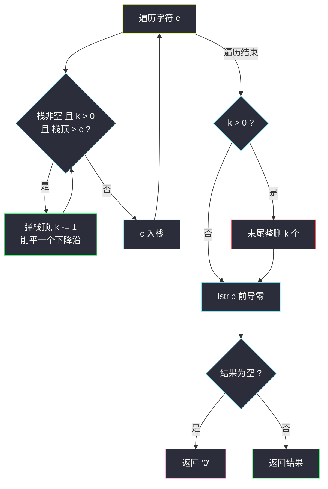

# 移掉 K 位数字（贪心 + 单调递增栈 · 最小字典序）

## 一、问题描述

给你一个以字符串表示的非负整数 `num` 和一个整数 `k`，移除 `num` 中的 `k` 位数字，使得剩下的数字**尽可能小**。请以字符串形式返回可能的最小结果。

> 🔗 LeetCode 402：https://leetcode.cn/problems/remove-k-digits/
>
> 数据范围：`1 <= k < num.length <= 10^5`；`num` 仅由若干位数字组成（不含前导零，除非是 `0` 本身）。

**示例**

```
输入：num = "1432219", k = 3   输出："1219"
解释：移掉 4、3、2 三个数字，新的最小数字是 1219。

输入：num = "10200", k = 1     输出："200"
解释：移掉首位的 1，剩下 0200 → 注意前导零要清理，即 200。

输入：num = "10", k = 2        输出："0"
解释：移掉所有数字，剩 0 位 → 规定为 "0"。
```

**直观理解**

删除 `k` 位 = 从左到右保留 `n - k` 位。数字比大小先比**位数**再比**字典序**：保留位数固定为 `n - k`，所以问题纯粹是「长度固定的剩余序列**字典序最小**」——高位越小越好。这是灵茶题单 **四、最小字典序** 的招牌套路：贪心 + 单调（递增）栈。

---

## 二、暴力解法

枚举所有「删哪 `k` 个位置」的组合，每个组合拼出剩余数字取最小：

```python
class Solution:
    def removeKdigits(self, num: str, k: int) -> str:
        from itertools import combinations
        n = len(num)
        best = None
        for idxs in combinations(range(n), k):          # 删除位置集合
            keep = [num[i] for i in range(n) if i not in set(idxs)]
            s = ''.join(keep)
            if best is None or int(s) < int(best):      # int 比较自动去前导零
                best = s
        return str(int(best)) if best else "0"
```

### 复杂度

- **时间**：`C(n, k)` 种组合，最坏 `C(10^5, 5*10^4)` 天文数字，彻底不可行。
- **空间**：`O(n)`。

### 🔴 瓶颈在哪里

组合爆炸的根源是「不知道删谁」——但其实**很多删除选择一眼就是废的**：`"1432219"` 里保留 `43` 开头永远不可能优于 `12` 开头。换一个视角：数字大小看高位，删除操作的本质是「高位上出现了一个比它右边字符更大的字符，删掉它能让后面更小的字符顶上来」。把所有「左边大、右边小」的下降沿削平，剩下的就是递增趋势的骨架——这正是单调栈的形状。

---

## 三、优化探索（核心章节）

> 📚 本题在灵茶题单中属于 **四、最小字典序（贪心 + 单调栈）**。灵神模板要点：单调递增栈 + 删除配额——遍历 `num`，栈顶字符**严格大于**当前字符且还有配额 `k` 时弹栈（弹一次配额减一）；扫完后若配额没用完，从**末尾**整删；最后清理前导零、空串补 `"0"`。与 #1673 是同一模板的镜像变体（见 `find-the-most-competitive-subsequence.md`）。

### 3.1 关键观察：删「下降沿」的峰值

如果 `num[i] > num[i+1]`，删掉 `num[i]` 一定不劣：`num[i+1]` 顶替它的位置，高位直接变小。反过来，如果整个串非降，删除任何位置都会让更大的字符前移，最优删法是**删末尾**（末尾最大，删了不伤高位）。

把这条贪心规则用栈实现：栈维护「目前已保留的数字」，保证栈内非降；来一个新字符 `c`，把所有 `比 c 大` 的栈顶弹出（这些就是被 `c` 顶掉的下降沿峰值），弹出受配额 `k` 限制：



### 3.2 贪心的正确性（交换论证）

设最优解删的位置集合为 `S*`。若 `S*` 不含某个下降沿峰值 `num[i] > num[i+1]`（且 `num[i]` 被保留），把 `S*` 中的某个删除名额挪给 `i`、恢复一个更靠后的删除位……逐位对齐比较可得新解不劣。归纳可得：**弹栈策略每一步都不劣**，且弹不掉的剩余问题（非降栈 + 剩余配额）最优解就是删末尾。

### 3.3 ⚠️ 细节：栈顶**等于**当前字符时，弹不弹？

**结论：不能弹（弹栈条件必须是严格大于 `st[-1] > c`）。**

「相等就弹」看起来无害（弹掉旧的相等字符再压新的，前缀不变），但它会**提前消耗删除配额**，而配额留到末尾能删掉**更大的尾部字符**。对拍反例（已用穷举验证）：

```
num = "112", k = 1
- 严格大于才弹：栈 = [1,1,2]，k=1 留到末尾整删 2 → "11" ✓（最优）
- 相等也弹 (>=)：处理第二个 1 时弹掉第一个 1（k 用光），
  之后的 2 无法删除 → "12" ✗（11 < 12，明显更差）
```

直觉：删一个和邻居相等的字符，**前缀一点没变小**（值不变），纯粹浪费配额；配额花在「删掉下降沿峰值」或「删掉末尾大数」上才有收益。对字母表 `{0,1,2}`、长度 ≤ 5 的全部 `num` 穷举，`>=` 写法共找到 232 个错误用例，`>` 写法全部正确。

### 3.4 末尾整删、前导零、空串三件套

- **末尾整删**：扫完后 `k > 0` 说明栈是（非降的）递增骨架，删末尾 `k` 个最优：`st[:len(st)-k]`。
- **前导零**：`"10200"` 删 1 得 `"0200"`，首位 0 要剥掉：`s.lstrip('0')`。
- **空串补零**：全删完（如 `"10", k=2`）或剥完前导零剩空，返回 `"0"`。Python 一行兜底：`s.lstrip('0') or '0'`。

### 3.5 与 #1673 的同构改写（同一骨架，换个说法）

把「删除 `k` 个」改说成「保留 `n - k` 个」，#402 就摇身变成 #1673（长度 `k` 的字典序最小子序列）。两种视角的代码对照：

| 步骤 | #402 视角（删 `k` 个） | #1673 视角（留 `n-k` 个） |
|------|------------------------|---------------------------|
| 弹栈附加条件 | `k > 0`（删除配额没用完） | `len(st) - 1 + 剩余 >= n-k`（保底名额够） |
| 末段处理 | `st[:len(st)-k]`（末尾整删） | `st[:n-k]`（截断到保留数） |

详细展开见姊妹篇 `find-the-most-competitive-subsequence.md`。掌握其中一题，另一题只需换掉「资源条件」这一行——这就是模板化刷题的复利。

### 3.6 手动模拟一遍贪心（位数视角）

「1432219 删 3 个」从位数视角看：结果一定是 4 位数，逐位从左往右确定——

1. 首位候选：在不破坏「后面还剩 3 个可选」的前提下，能选到的最小值是 `1`（下标 0）；
2. 次位从 `4` 开始往后找更小：`4 → 3 → 2` 一路下滑，配额允许替换成 `2`（删掉 4、3）；
3. 第三位遇到第二个 `2` 后再来一个 `1`：删掉一个 `2` 换成 `1`，配额用尽；
4. 末位只剩 `9` 可选。

这个「逐位确定 + 有限替换」的手动模拟与单调栈自动机完全等价：栈就是「当前已确定的位数」，弹栈就是「用配额做一次替换」。

### 3.7 一句话核心

> **递增栈削下降沿（严格大于才弹，配额限制次数），末尾整删剩余配额，最后剥前导零、空串补 0。**

---

## 四、代码实现

### Python（主解：单调递增栈 + 剩余配额）

```python
class Solution:
    def removeKdigits(self, num: str, k: int) -> str:
        st = []
        for c in num:
            while st and k and st[-1] > c:   # 严格大于才弹（相等不弹！）
                st.pop()
                k -= 1                        # 每弹一次消耗一个删除名额
            st.append(c)

        st = st[:len(st) - k] if k else st    # 配额没用完：末尾整删
        s = ''.join(st).lstrip('0')           # 清理前导零
        return s if s else "0"                # 空串补 0
```

**变量含义**

| 变量 | 含义 |
|------|------|
| `st` | 已保留数字的栈，从底到顶非降（「递增骨架」） |
| `k` | 剩余删除配额，随弹栈递减 |
| `st[-1] > c` | 出现下降沿：栈顶比当前大，删栈顶让 `c` 顶上高位 |
| `st[:len(st)-k]` | 末尾整删：非降序列删最大尾缀最优 |

### Java（最优解同款写法）

```java
class Solution {
    public String removeKdigits(String num, int k) {
        StringBuilder st = new StringBuilder();
        for (char c : num.toCharArray()) {
            while (st.length() > 0 && k > 0 && st.charAt(st.length() - 1) > c) {
                st.deleteCharAt(st.length() - 1);
                k--;
            }
            st.append(c);
        }
        st.setLength(st.length() - k);              // 末尾整删（k 可能为 0）
        int i = 0;
        while (i < st.length() - 1 && st.charAt(i) == '0') i++;  // 前导零（保留最后一位）
        String s = st.substring(i);
        return s.isEmpty() ? "0" : s;
    }
}
```

---

## 五、具体例子演示

### 例 A：`num = "1432219", k = 3`（主演示）

| 步 | 字符 c | 弹栈过程（k 变化） | 栈（底→顶） | 说明 |
|----|--------|--------------------|--------------|------|
| 1 | 1 | 栈空不弹 | `1` | |
| 2 | 4 | `1 > 4`? 否 | `1 4` | 上升，安全 |
| 3 | 3 | `4 > 3` 弹（k=2）；`1 > 3`? 否 | `1 3` | 削掉下降沿峰值 4 |
| 4 | 2 | `3 > 2` 弹（k=1）；`1 > 2`? 否 | `1 2` | 再削 3 |
| 5 | 2 | `2 > 2`? **否**（相等不弹） | `1 2 2` | 细节见 3.3 |
| 6 | 1 | `2 > 1` 弹（k=0）；`2 > 1` 想弹但 k=0 停 | `1 2 1` | 配额用光，只削掉一个 |
| 7 | 9 | k=0，直接入 | `1 2 1 9` | |

末尾整删：k=0 无需删。拼串 `"1219"`，无前导零 → **"1219"** ✓。

**与 3.6 节手动模拟对齐**：栈的每一步就是「逐位确定」——第 1 步定首位 `1`；第 3、4 步的两次弹栈把次位从 `4` 优化成 `2`（配额 -2）；第 6 步配额见底，第三位只能优化一步到 `1`；末位照单全收 `9`。得到 `1219`。

### 例 B：`num = "10200", k = 1`（前导零）

| 步 | 字符 c | 弹栈过程 | 栈 | 说明 |
|----|--------|----------|-----|------|
| 1 | 1 | 栈空 | `1` | |
| 2 | 0 | `1 > 0` 弹（k=0） | `0` | 删掉 1，0 顶上高位 |
| 3 | 2 | k=0 直接入 | `0 2` | |
| 4 | 0 | k=0 直接入 | `0 2 0` | |
| 5 | 0 | k=0 直接入 | `0 2 0 0` | |

末尾 k=0；拼串 `"0200"` → `lstrip('0')` → **"200"** ✓。

### 例 C：`num = "10", k = 2`（全删空）

`1` 入栈；`0`：`1 > 0` 弹（k=1），`0` 入栈；扫完 k=1 → 末尾整删 1 个 → 栈空 → 空串 → 兜底 **"0"** ✓。整个过程栈从未增长到 2——配额比串长还大时，弹栈 + 末尾整删联手把所有字符清空。

### 例 D：反例复盘 `num = "112", k = 1`

`>`（正确）：`[1]` → `2>1? 否` 入 `[1,1]` → `2>1? 否` 入 `[1,1,2]`；k=1 末尾删 → `[1,1]` → **"11"**。
`>=`（错误）：`[1]` → `1>=1` 弹（k=0）入 `[1]` → `2` 直接入 `[1,2]`；k=0 → **"12"** ✗。相等时弹栈把配额「白送给」一个等值字符，末尾真正的 `2` 反而删不掉了。

四个例子分别覆盖：普通弹栈（A）、前导零（B）、全删空（C）、相等陷阱（D）——写完模板后拿这四种形态各跑一遍，#402 的坑就全覆盖了。

---

## 六、复杂度分析

| 方法 | 时间 | 空间 |
|------|------|------|
| 组合枚举 | `O(C(n,k))`，不可行 | `O(n)` |
| 单调递增栈 | `O(n)`（每字符入栈一次、出栈至多一次） | `O(n)` |

`n = 10^5` 一次线性扫描 + 每字符常数摊还操作，轻松通过。注意 `lstrip('0')` 与 `''.join(st)` 都是一次 `O(n)` 遍历，加上末尾截断，总代价仍是单次线性扫描的常数倍。

### 空间细节

栈 `st` 最坏存下整个串（`num` 本身非降且 `k = 0` 的情形……本题 `k >= 1` 恒成立，所以至少弹一次或末尾删一个，但栈仍可能接近满长），`O(n)` 无法省；若语言支持 `StringBuilder`（Java 版）可原地复用，Python 列表即栈，无额外拷贝。

---

## 七、对比总结

**同模板家族（灵神「最小字典序」）对照**：

| 题 | 弹栈附加条件 | 末段处理 | 长度 |
|----|--------------|----------|------|
| #402 本篇 | `k > 0`（删除配额上限） | 配额剩余 → **末尾整删** | 位数自由（`n-k` 位） |
| #1673 最具竞争力子序列 | `len(st)-1 + 剩余元素 >= k`（保底名额） | 栈超长 → **截断到 k** | 恰好 k 位 |

两者互为镜像：#402 限制「最多删多少」，#1673 限制「必须留多少」——同一个递增栈骨架，一个从「删」的角度收口，一个从「留」的角度收口。

**易错点**

1. **相等不能弹**（3.3 节，反例 `"112", k=1`）：弹栈条件必须 `st[-1] > c` 严格大于。这是本题最隐蔽的坑。
2. **末尾整删别漏**：`k` 有剩余时删尾部 `k` 个（如 `"1234567890", k=9` 靠末尾整删兜底出 `"0"`）。
3. **前导零清理**：`"10200" → "0200" → "200"`；注意要在**末尾整删之后**再剥零（先剥后删可能把 0 剥光导致整删错位）。
4. **空串补 `"0"`**：`lstrip` 后可能为空。
5. 比较的是**字符**不是数字：Python/Java 中 `'0' < '1'` 成立，字符串字典序与数字大小一致（位数相同时）。

---

## 八、举一反三

| 题目 | 关系 |
|------|------|
| [1673. 找出最具竞争力的子序列](https://leetcode.cn/problems/find-the-most-competitive-subsequence/) | 亲兄弟（互为镜像）：同一模板 + 保底名额条件，见 `find-the-most-competitive-subsequence.md` |
| [316. 去除重复字母](https://leetcode.cn/problems/remove-duplicate-letters/) | 同为「贪心 + 单调栈出字典序最小」，叠加「每个字母恰好一次」约束 |
| [321. 拼接最大数](https://leetcode.cn/problems/create-maximum-number/) | 反方向（最大字典序）+ 两个数组拼 k 位，本模板的双数组加强版 |
| [1081. 不同字符的最小子序列](https://leetcode.cn/problems/smallest-subsequence-of-distinct-characters/) | 与 #316 同题变体 |
| [2384. 最大回文数字](https://leetcode.cn/problems/largest-palindromic-number/) | 对照：数字字符贪心构造 + 前导零处理，见同目录 `largest-palindromic-number.md` |
| [2375. 根据模式构造最小数字](https://leetcode.cn/problems/construct-smallest-number-from-di-string/) | 字典序贪心的亲戚：上升/下降约束下的最小构造，见同目录 `construct-smallest-number-from-di-string.md` |

**思想迁移**

- 「最小字典序 = 高位优先小」永远可以转成**单调栈削峰**：看到「删除若干使剩余最小/最大」，闭眼先想递增/递减栈。
- 配额类贪心要警惕**等值陷阱**：删除等值元素对目标零收益，却消耗了唯一资源（配额）——遇到 `>` 还是 `>=` 时，构造 `[.., x, x, ..]` 加尾部大数的小用例对拍。
- 末段兜底三件套（末尾整删 / 前导零 / 空串补零）是所有「数字字符串构造」题的公共收尾动作。
- 「删除/保留」类问题先问**约束在哪一侧**：删有上限 → 弹栈看配额（#402）；留有下限 → 弹栈看名额（#1673）。约束方向定了，代码只差一个条件。
- 口诀：**「递增栈削峰顶，严格大于才配删；配额剩多少，末尾一刀断。」**
