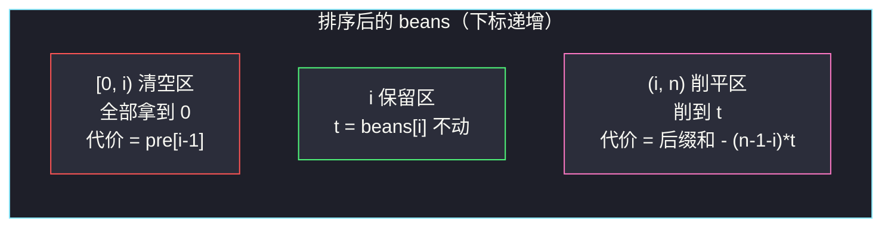
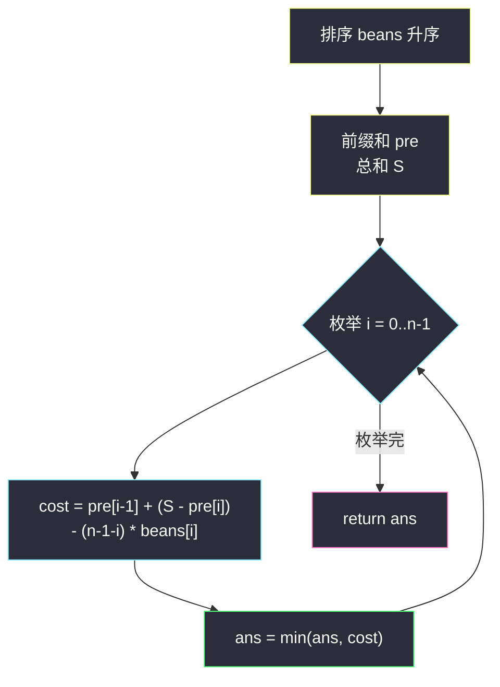

# 拿出最少数目的魔法豆（先枚举基准，再贪心）

## 一、问题描述

给定一个**正整数**数组 `beans`，每个整数表示一个袋子里魔法豆的数目。

请你从每个袋子中**拿出**一些豆子（也可以不拿），使得剩下的**非空袋子**（即至少还有一颗魔法豆的袋子）中魔法豆的数目**相等**。豆子一旦取出，不能再放回。

请返回你需要拿出魔法豆的**最少数目**。

> 🔗 LeetCode 2171：https://leetcode.cn/problems/removing-minimum-number-of-magic-beans/
>
> 数据范围：`1 <= beans.length <= 10^5`，`1 <= beans[i] <= 10^5`。

**示例 1**

```
输入：beans = [4,1,6,5]
输出：4
解释：袋 1 清空（拿出 1）；袋 2 从 6 削到 4（拿出 2）；袋 3 从 5 削到 4（拿出 1）。
共拿出 1 + 2 + 1 = 4，剩下非空袋 [4,0,4,4] 豆数相等。
```

**示例 2**

```
输入：beans = [2,10,3,2]
输出：7
解释：两个 2 袋、3 袋全部清空（2+2+3=7），只留 [0,10,0,0]，非空袋只剩一个 10。
```

**直观理解**

最终形态一定是：选定一个**基准值 t ≥ 1**，比 t 小的袋子全部清空（拿到 0），比 t 大的袋子削到 t，恰好等于 t 的不动。注意"非空袋豆数相等"允许一些袋子为空——空袋不算数。于是问题变成：**枚举基准 t，最小化总拿出量**。这是灵茶题单 **§1.6 先枚举，再贪心** 的代表题：枚举的对象不是下标而是"最终的值"，枚举之后每种情况的代价用排序 + 前缀和 `O(1)` 算出。

---

## 二、暴力解法

### 2.1 枚举所有可能的基准值

基准 t 的候选范围是 `1 .. max(beans)`（t 不可能超过最大值，否则每个袋子都要往外补豆——而豆子只能拿不能加）。对每个 t 扫一遍数组算代价：

```python
class Solution:
    def minimumRemoval(self, beans: List[int]) -> int:
        return min(
            sum(b if b < t else b - t for b in beans)   # 小于 t 清空，大于 t 削平
            for t in range(1, max(beans) + 1)
        )
```

- **时间**：`O(n * max(beans))`，`10^5 * 10^5 = 10^10`，超时。
- **空间**：`O(1)`。

### 2.2 只枚举数组中出现过的值

更进一步：最优基准不必试遍 `1..max`。若 t 不在数组中，把 t 降低到**小于 t 的最大元素值** `t'`：清空集合不变（原来 < t 的仍 < t'？不对——原来 < t 的袋子里可能恰有值在 `[t', t)` 之间？不会，`t'` 是小于 t 的最大元素，`[t', t)` 间没有元素），而削平集合每袋少削 `t - t'`，代价只会更小。所以**只枚举 t ∈ beans** 即可：

```python
class Solution:
    def minimumRemoval(self, beans: List[int]) -> int:
        ans = float('inf')
        for t in set(beans):
            ans = min(ans, sum(b if b < t else b - t for b in beans))
        return ans
```

- **时间**：`O(n^2)`（最坏所有元素互不相同），`10^10` 依然超时。
- **空间**：`O(n)`。

### 🔴 瓶颈在哪里

每个 t 都要全量扫数组。但"低于 t 的元素之和"与"高于 t 的元素之和"在**排序后就是前缀和 / 后缀和**——排序一次，所有 t 的代价都能 `O(1)` 查表。

---

## 三、优化探索（核心章节）

> 📚 本题在灵茶题单中属于 **§1.6 先枚举，再贪心**：先枚举"最终保留的豆数"这一关键量，再对剩余部分做线性贪心（排序 + 前缀和把每种枚举的代价降到 `O(1)`）。

### 3.1 排序后，基准把数组切成"清空区 + 保留区 + 削平区"

将 `beans` 升序排序。取 `t = beans[i]` 时（相同值任取一个下标即可），三个区域沿下标连续分布：



**基准取 t = beans[i] 的总代价**：

```text
cost(i) = pre[i-1]                      # 低于基准的全清空
        + (S - pre[i])                  # 高于基准的豆子总量
        - (n - 1 - i) * beans[i]        # 但每个袋子留下 t 颗
```

其中 `pre` 为排序后的前缀和，`S` 为总和。

### 3.2 为什么枚举 beans[i] 就够（再证一遍）

"先枚举"类问题的关键是**枚举对象不重不漏地覆盖最优解**。设最优基准为 t：

- 若 t 恰为某个 `beans[i]`，已覆盖；
- 若 t 不在数组中：令 `t' = max{beans[j] : beans[j] < t}`。则"清空集合"（值 < t 的袋子）与"削平集合"（值 > t 的袋子）在 t → t' 时**完全不变**（区间 `(t', t)` 内没有元素），而每个削平袋留下 `t' <= t` 颗，拿出量不增，即 `cost(t') <= cost(t)`。

所以最优值必在"取某个数组元素作基准"的方案中取到，枚举 `i = 0..n-1` 即可。

### 3.3 流程图



### 3.4 一句话核心

> **排序 + 前缀和后，"以 beans[i] 为基准的总拿出量"是一个下标 i 的函数，`O(n)` 扫一遍取最小。**

---

## 四、代码实现

### Python（主解：排序 + 前缀和 + 枚举基准）

```python
class Solution:
    def minimumRemoval(self, beans: List[int]) -> int:
        beans.sort()
        n = len(beans)
        pre = [0] * n                        # pre[i] = beans[0..i] 之和
        pre[0] = beans[0]
        for i in range(1, n):
            pre[i] = pre[i - 1] + beans[i]

        S = pre[-1]
        ans = float('inf')
        for i in range(n):                   # 枚举基准 t = beans[i]
            cost = pre[i - 1] if i else 0    # 清空区：下标 < i 的全部拿光
            cost += (S - pre[i]) - (n - 1 - i) * beans[i]   # 削平区
            ans = min(ans, cost)
        return ans
```

**变量含义**

| 变量 | 含义 |
|------|------|
| `pre[i]` | 排序后前 `i+1` 袋的总豆数 |
| `beans[i]` | 当前枚举的基准 t（保留值） |
| `pre[i-1]` | 清空区总代价（低于基准的袋子全拿到 0） |
| `(S - pre[i]) - (n-1-i)*beans[i]` | 削平区代价（高袋总量 − 每袋留 t） |

### Java（最优解同款写法）

```java
class Solution {
    public long minimumRemoval(int[] beans) {
        Arrays.sort(beans);
        int n = beans.length;
        long S = 0;
        for (int b : beans) S += b;             // 总量可达 10^10，用 long
        long ans = Long.MAX_VALUE, pre = 0;     // pre 滚动维护
        for (int i = 0; i < n; i++) {
            pre += beans[i];                    // pre = pre[i]
            long cost = (pre - beans[i])        // 清空区（pre[i-1]）
                     + (S - pre) - (long)(n - 1 - i) * beans[i];
            ans = Math.min(ans, cost);
        }
        return ans;
    }
}
```

---

## 五、具体例子演示

以示例 1 端到端走一遍：`beans = [4,1,6,5]`。

**预处理**：排序 → `[1,4,5,6]`；前缀和 `pre = [1,5,10,16]`；总和 `S = 16`。

**枚举每个基准**（决策 = 保留谁作基准；剩余状态表给出清空 / 削平明细）：

| i | 基准 t | 清空区（拿出） | 削平区（拿出） | 总代价 cost | 数组终态 |
|---|--------|----------------|----------------|-------------|----------|
| 0 | 1 | 无（pre[-1]=0） | 4−1 + 5−1 + 6−1 = 12 | **12** | [1,1,1,1] |
| 1 | 4 | 1（袋 1 清零） | 5−4 + 6−4 = 3 | **4** ✓ 最小 | [0,4,4,4] |
| 2 | 5 | 1+4 = 5 | 6−5 = 1 | **6** | [0,0,5,5] |
| 3 | 6 | 1+4+5 = 10 | 无 | **10** | [0,0,0,6] |

逐袋验算最优行 `i = 1`：袋子 `[4,1,6,5]` → 拿出 `0 + 1 + 2 + 1 = 4`，非空袋均为 4，输出 **4** ✓。

**示例 2**：`beans = [2,10,3,2]` → 排序 `[2,2,3,10]`，`pre = [2,4,7,17]`，`S = 17`。

| i | 基准 t | 清空区 | 削平区 | cost |
|---|--------|--------|--------|------|
| 0 | 2 | 0 | 0 + 1 + 8 = 9 | 9 |
| 1 | 2 | 2 | 1 + 8 = 9 | 9 |
| 2 | 3 | 4 | 7 | **11** |
| 3 | 10 | 7 | 0 | **7** ✓ 最小 |

最优是"保大弃小"：只留 10 那袋，其余清空，拿出 `2+2+3 = 7` ✓。这个例子说明**基准不必取小值**——清空一个小袋的代价，可能远小于把所有大袋削到低基准。

---

## 六、复杂度分析

| 方法 | 时间 | 空间 |
|------|------|------|
| 枚举 1..max | `O(n * maxV)` | `O(1)` |
| 枚举数组元素值 | `O(n^2)` | `O(n)` |
| **排序 + 前缀和** | **`O(n log n)`** | **`O(n)`** |

- **时间**：排序 `O(n log n)` 是大头；前缀和与枚举各一遍 `O(n)`。
- **空间**：前缀和数组 `O(n)`（Java 版滚动维护为 `O(1)`）。
- 溢出提醒：豆子总量最高 `10^5 * 10^5 = 10^10`，超出 32 位整数范围，Java 必须用 `long`，Python 无忧。

---

## 七、对比总结

**方法演进**：枚举值域（`O(n·maxV)`）→ 只枚举数组元素（`O(n^2)`）→ 排序 + 前缀和（`O(n log n)`）。每一步都在缩小"枚举空间"或加速"单次代价计算"，这正是 §1.6 模板的两板斧。

**易错点**

1. **以为基准取中位数/最小值**：反例即示例 2，最优基准是**最大值**（把小袋全部清空）。必须老老实实枚举。
2. **允许清空**：把袋子拿到 0 是合法的（空袋不受"相等"约束），初学者常把状态设计成"每袋必须 ≥ 1"导致无解或算错。
3. **溢出**：`(n - 1 - i) * beans[i]` 与总和都需 64 位。
4. **重复元素**：相同值多个袋子，排序后它们必然落在基准的同一侧（相等即保留区），枚举到其中一个下标即覆盖该基准的全部方案，无需去重也不会漏。
5. 前缀和下标细节：`i = 0` 时 `pre[i-1]` 应取 0（代码里 `if i else 0` 特判），写成 `pre[-1]` 会静默取到总和。

**与同族题的共性**：「最终状态由一个标量参数决定 ⟹ 枚举该标量的候选（通常就在输入里）⟹ 排序 + 前缀和把每个候选的代价降到 `O(1)`」。

---

## 八、举一反三

| 题目 | 关系 |
|------|------|
| [1648. 销售价值减少的颜色球](https://leetcode.cn/problems/sell-diminishing-valued-colored-balls/) | 同构进阶：枚举"卖到某个价值线"，排序 + 后缀计数求最大收益，同样是"枚举阈值 + 排序前缀统计" |
| [1838. 最高频元素的频数](https://leetcode.cn/problems/frequency-of-the-most-frequent-element/) | 枚举"最终保留的值"（目标元素），排序后滑窗/前缀和求最小操作数 |
| [2234. 花园的最大总美丽值](https://leetcode.cn/problems/maximum-total-beauty-of-the-gardens/) | Hard 加强版：阈值把花园分成"补满"与"部分提升"两段，排序 + 前缀和同款套路 |
| [1509. 三次操作后最大值和最小值的最小差](https://leetcode.cn/problems/minimum-difference-between-largest-and-smallest-value-in-three-moves/) | 灵茶题单贪心篇（§1.1）姊妹题：枚举"砍头/去尾"的分配方式 |

**思想迁移**

- 看到"最终所有值相等 / 部分清零"，第一反应：**答案由一个标量（基准值）决定**，先枚举它，再看每种枚举的代价能否排序后 `O(1)` 化。
- 排序的本质作用：把"与基准比较大小"的散乱判断，变成下标区间上的**连续三段**，前缀和自然接管。
- 口诀：**"留谁做基准，枚举不心虚；清空左边堆，削平右边取。"**
