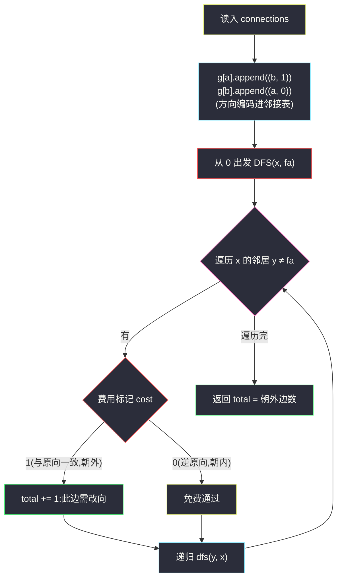
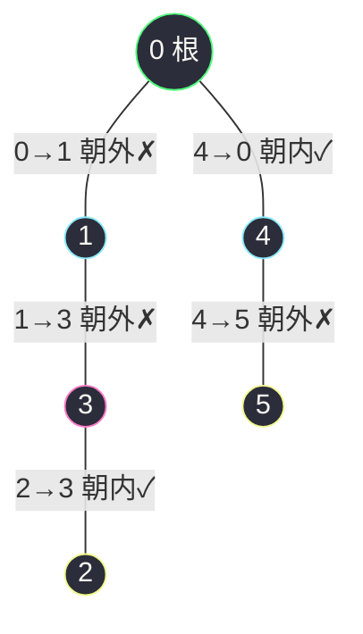

# 1466. 重新规划路线(Reorder Routes to Make All Paths Lead to the City Zero)

> 🔗 LeetCode 1466:https://leetcode.cn/problems/reorder-routes-to-make-all-paths-lead-to-the-city-zero/
>
> 📚 灵茶题单小节:§「无根树 DFS:定根 + 方向统计」练习

## 一、问题描述

`n` 座城市,从 `0` 到 `n - 1` 编号,其间共有 `n - 1` 条路线。因此,要想在两座不同城市之间旅行只有唯一一条路线可供选择(路线网形成一颗**树**)。去年,交通运输部决定重新规划路线,以改变交通拥堵的状况。

路线用 `connections` 表示,其中 `connections[i] = [a, b]` 表示从城市 `a` 到 `b` 的一条**有向**路线。

今年,城市 `0` 将会举办一场大型比赛,很多游客都想前往城市 `0`。请你帮助重新规划路线方向,使每个城市都可以访问城市 `0`。返回需要变更方向的**最小**路线数。

题目数据**保证**每个城市在重新规划路线方向后都能到达城市 `0`。

**示例 1**

```text
输入:n = 6, connections = [[0,1],[1,3],[2,3],[4,0],[4,5]]
输出:3
解释:更改 0→1、1→3、4→5 三条路线的方向(改为 1→0、3→1、5→4),所有城市都能到达 0。
```

**示例 2**

```text
输入:n = 5, connections = [[1,0],[1,2],[3,2],[3,4]]
输出:2
解释:更改 1→2、3→4 两条路线的方向。
```

**示例 3**

```text
输入:n = 3, connections = [[1,0],[2,0]]
输出:0
解释:所有路线已经指向城市 0,无需变更。
```

> 数据范围:`2 <= n <= 5 * 10^4`;`connections.length == n - 1`;`0 <= connections[i][0], connections[i][1] <= n - 1`;`connections[i][0] != connections[i][1]`。

**直观理解**

把方向擦掉,这是一棵无向树。以城市 `0` 为根"挂"起来后,目标状态是唯一的:**每条边都从孩子指向父亲**(所有人顺流而下汇入 0)。对照原始方向,凡"从父亲指向孩子"的边,方向就是反的,必须掉头。所以答案就是数一数:**以 0 为根的树中,有多少条边方向朝外**。不用真的翻转,统计即可。

## 二、暴力解法

枚举每条边"改/不改"的全部组合,对每种组合检查"每个城市是否都能到达 0",取改动数最小的可行方案。

```python
class Solution:
    def minReorder(self, n: int, connections: List[List[int]]) -> int:
        def reachable_to_zero(flipped: List[bool]) -> bool:
            g = [[] for _ in range(n)]                    # 按改向后的方向建图
            for i, (a, b) in enumerate(connections):
                if flipped[i]:                            # 翻转:b → a
                    g[b].append(a)
                else:                                     # 保持:a → b
                    g[a].append(b)
            target = sum(flipped)                         # 本方案的改动数
            # BFS 检查每个点能否到 0:反向建图,从 0 出发可达即"能到 0"
            rg = [[] for _ in range(n)]
            for u in range(n):
                for v in g[u]:
                    rg[v].append(u)
            seen = {0}
            q = deque([0])
            while q:
                x = q.popleft()
                for y in rg[x]:
                    if y not in seen:
                        seen.add(y)
                        q.append(y)
            return len(seen) == n, target

        m = len(connections)
        best = m                                          # 上界:全改
        for mask in range(1 << m):                       # 枚举翻转子集
            flipped = [bool(mask >> i & 1) for i in range(m)]
            ok, target = reachable_to_zero(flipped)
            if ok:
                best = min(best, target)
        return best
```

### 复杂度

- 时间:`O(2^m * n)`——`m = n - 1` 条边的翻转子集共 `2^(n-1)` 个,每个组合建图 + BFS 检查 `O(n)`。`n = 12` 就要约两万次检查,`n = 5 * 10^4` 完全不可行。
- 空间:`O(n)`。

它是唯一"忠实复述题目语义"的版本——最小改动数由它定义,对拍基准非它莫属(测试时把 `n` 压在 10 以内)。

## 三、优化探索

### 观察 1:目标形态唯一,冲突边即答案

"每个城市能到 0"在树上的唯一形态:每条边**指向 0 的方向**(孩子 → 父亲)。为什么唯一?树中每个非根节点到 0 的路径唯一,这条路径上的每条边都必须"顺着走";相邻路径共享的边方向被两侧同时约束,拼起来恰好是"全部朝内"。因此一条边要么已经朝内(免费),要么朝外(必须改),二者必居其一——**最小改动数 = 朝外边数**,没有权衡空间。

### 观察 2:以 0 为根遍历,方向编码进邻接表

把每条有向边 `[a, b]` 拆成两条"可走"记录:

- `g[a].append((b, 1))`——从 `a` 走向 `b`:与原方向**一致**,这是朝外,要计费 1;
- `g[b].append((a, 0))`——从 `b` 走向 `a`:逆着原方向,朝内,免费。

然后从 `0` 出发 DFS(把 `0` 当根,只往远离 0 的方向走):每走一步 `x → y`,若费用标记为 1,说明原图里这条边从 `x` 指向 `y`(背离 0),改向计数加一。

### 观察 3:遍历顺序无关紧要,判重只靠父指针

树无环,`y != fa` 就足够防止回头;每条边在其"父端"被恰好评价一次。DFS、BFS、显式栈任选,统计结果相同。



### 为什么"统计朝外边"就一定是最小值

更形式地说:目标形态(全朝内)是唯一可行的终态,且每条边是否需要翻转由"原方向 vs 目标方向"**逐边独立**决定——不存在"多改一条边换少改两条"的联动。独立决策的代价总和就是全局最小,这是本题能用一次遍历拿捏的根本原因;若边集含环(不是树),可行形态不唯一,就要退回网络流/强连通分量一类的武器。

## 四、代码实现

```python
class Solution:
    def minReorder(self, n: int, connections: List[List[int]]) -> int:
        sys.setrecursionlimit(2 * 10 ** 5 + 10)      # 链形树深度可达 n
        g = [[] for _ in range(n)]
        for a, b in connections:
            g[a].append((b, 1))                      # a→b 与原向一致:朝外,计费
            g[b].append((a, 0))                      # b→a 逆原向:朝内,免费

        def dfs(x: int, fa: int) -> int:
            total = 0
            for y, cost in g[x]:
                if y != fa:                          # 只向远离 0 的方向走
                    total += cost + dfs(y, x)        # 本边费用 + 子树累计
            return total

        return dfs(0, -1)
```

**细节说明**

- **`(邻居, 费用)` 二元组编码方向**:同一条无向边的两个方向费用不同,是本题建图的核心技巧;`cost=1` 表示"沿这个方向走会与原方向一致"。
- **根固定为 0**:DFS 从 0 出发,"远离 0"的方向即父到子;若从别的点出发,方向语义全乱。
- **`y != fa` 防回头**:树无环,无需 visited;邻接表里同一邻居最多出现两次(去程计费/回程免费),只处理去程。
- **`cost + dfs(y, x)` 一行双关**:先累加本边费用,再累加子树费用;递归返回值天然是"该子树内全部朝外边数"。
- **递归深度**:`n = 5 * 10^4` 链形树需要抬高上限;显式栈版见第七章对照。

## 五、例子演示

用**示例 1** `n = 6, connections = [[0,1],[1,3],[2,3],[4,0],[4,5]]` 端到端走一遍。以 0 为根挂起后的无向树(边上标注原方向):



建图后的方向编码(每条边拆两条记录):

| 有向边 | g 记录 | 语义 |
|---|---|---|
| 0→1 | `g[0]+=(1,1)`, `g[1]+=(0,0)` | 从 0 走向 1 收费(朝外) |
| 1→3 | `g[1]+=(3,1)`, `g[3]+=(1,0)` | 从 1 走向 3 收费 |
| 2→3 | `g[2]+=(3,0)`, `g[3]+=(2,1)` | 从 3 走向 2 收费(注意:3 是父) |
| 4→0 | `g[4]+=(0,1)`, `g[0]+=(4,0)` | 从 0 走向 4 免费 |
| 4→5 | `g[4]+=(5,1)`, `g[5]+=(4,0)` | 从 4 走向 5 收费 |

DFS 从 0 出发(`dfs(0, -1)`):

| 步骤 | 当前节点(父) | 访问邻居 | 本边费用 | 子树带回 | 累计 |
|---|---|---|---|---|---|
| 1 | 1(父 0) | — | 0→1 费 1 | 见下 | 1 |
| 2 | 3(父 1) | — | 1→3 费 1 | 见下 | 1+1=2 |
| 3 | 2(父 3) | 无孩子 | 3→2 费 0 | 0 | 0 |
| 4 | 回到 3 | | | | 3 的子树 = 0 + 边费 1 = 1 |
| 5 | 回到 1 | | | | 1 的子树 = 1 + 边费 1 = 2 |
| 6 | 4(父 0) | — | 0→4 费 0 | 见下 | 0 |
| 7 | 5(父 4) | 无孩子 | 4→5 费 1 | 0 | 1 |
| 8 | 回到 0 | | | | 2 + 0 + 1 = **3** |

返回 **3**,与官方输出一致。三条收费边恰是 `0→1`、`1→3`、`4→5`——改向后整棵树所有边朝内:5→4→0、3→1→0、2→3,全部汇入 0。

对照**示例 2** `n = 5, connections = [[1,0],[1,2],[3,2],[3,4]]`:以 0 为根,树是 0-1-2-3-4 的链(边序:0-1, 1-2, 2-3, 3-4)。逐边看:1→0 朝内 ✓ 免费;1→2 朝外 ✗ 费 1;3→2 朝内(3 是 2 的孩子,从父 2 走向 3 与原向 3→2 相反)✓ 免费;3→4 朝外 ✗ 费 1。合计 **2** ✅。

对照**示例 3** `connections = [[1,0],[2,0]]`:两条边都朝内,答案 **0** ✅。

### 常见错误清单

- **方向编码写反**:`g[a].append((b, 1))` 与 `g[b].append((a, 0))` 对调,所有费用取反——示例类题目会得到"边数 − 正确答案"的镜像值。
- **忘记从 0 出发**:从任意点 DFS 时"父到子"的方向不再对应"背离 0",计费语义崩塌。
- **用 visited 而非 fa**:功能上可行,但多一个数组;更要紧的是若初始化在函数外,批量用例间会残留污染。
- **把"能到 0"理解成"0 能到所有点"**:方向搞反的话,统计的是"从 0 出发沿原向可走的边",完全另一个量。
- **递归忘抬上限**:`5 * 10^4` 链形树默认递归栈溢出。

### BFS 队列版:无递归的同构替代

递归只是载体,换成队列层序遍历,计费逻辑一字不换:

```python
class Solution:
    def minReorder(self, n: int, connections: List[List[int]]) -> int:
        g = [[] for _ in range(n)]
        for a, b in connections:
            g[a].append((b, 1))                  # 朝外:计费
            g[b].append((a, 0))                  # 朝内:免费
        ans = 0
        seen = [False] * n
        seen[0] = True
        q = deque([0])
        while q:
            x = q.popleft()
            for y, cost in g[x]:
                if not seen[y]:                  # 首次到达:沿树向外扩
                    seen[y] = True
                    ans += cost                  # 朝外边计数
                    q.append(y)
        return ans
```

注意 BFS 版用 `seen` 数组而非父指针——队列遍历没有天然的"来路"信息,标记数组更直接;两版对每条无向边仍只在其父端计费一次,结果严格相等(本文对拍已同时验证)。

## 六、复杂度分析

- 时间:`O(n)`。建图遍历 `n - 1` 条边;DFS 每节点访问一次,邻接表总长 `2(n - 1)`。
- 空间:`O(n)`。邻接表 `2(n - 1)` 个二元组,递归栈最坏树高。

### 边界用例速查

| 用例 | 输入要点 | 期望 | 考点 |
|---|---|---|---|
| 两城朝内 | `[[1,0]]` | 0 | 零改动分支 |
| 两城朝外 | `[[0,1]]` | 1 | 最小计费 |
| 星形全朝内 | 中心 0,叶全部指向 0 | 0 | 满分免费 |
| 星形全朝外 | 0 指向所有叶 | `n-1` | 满改上界 |
| 链形交替 | 方向内外交替 | ⌈外向边数⌉ | 逐边独立判定的体现 |

### 正确性问答

**问:为什么不需要担心"改一条边影响别的边"?** 目标形态唯一且逐边判定,这是树的结构红利;改成一般有向图,可行形态有无穷多,最小翻转数是 NP 难的近亲(最小边集翻转使强连通等),必须换武器。

**问:边 [a,b] 中 a 恰是 b 的父,方向又"恰好合法"会怎样?** 那就是朝内边,费用 0——遍历时从 b 走向 a?不,遍历只会从父 a 走向子 b,查到 `g[a]` 里的 `(b, 0)` 记录(因为 `g[b].append((a,0))` 建的是"从 a 走向 b 免费"的方向,等价)。总之每条边只在"父端"被评价一次,费用由编码唯一决定。

**问:n = 2 的最小用例长什么样?** `connections = [[0,1]]`:边 0→1 朝外,答案 1;`[[1,0]]` 朝内,答案 0——最小 sanity check,30 秒手验主解的两条分支。

## 七、对比总结

| 解法 | 时间 | 空间 | 思路 | 备注 |
|---|---|---|---|---|
| 翻转子集枚举(暴力) | `O(2^n * n)` | `O(n)` | 逐组合建图验可达 | 语义定义,对拍专用 |
| 定根 DFS 方向统计(本文) | `O(n)` | `O(n)` | 邻接表编码方向,朝外即计费 | 主解;一次遍历 |
| BFS 队列版 | `O(n)` | `O(n)` | 层序遍历同逻辑 | 防深栈的等价替代 |
| 显式栈 DFS | `O(n)` | `O(n)` | 迭代版 | 无递归上限顾虑 |

一句话:**树让"所有人到 0"的目标形态唯一,最小翻转数就是数一数朝外的边**——方向编码进邻接表后,连"数"的动作都被一次 DFS 顺带完成。

## 八、举一反三

- [310. 最小高度树](https://leetcode.cn/problems/minimum-height-trees/):同族"无向树 + 度数/遍历"的结构统计,中心问题与本题的方向问题共享"定根后自顶向下"的分析框架。
- [997. 找到小镇的法官](https://leetcode.cn/problems/find-the-town-judge/):入度/出度统计的纯计数版,本题"朝内/朝外"的判定就是入度方向的单边特写。
- [207. 课程表](https://leetcode.cn/problems/course-schedule/):方向约束升级为一般有向图 + 环检测,体会"树的结构红利"消失后问题难度的跃迁。
- [1971. 寻找图中是否存在路径](https://leetcode.cn/problems/find-if-path-exists-in-graph/):无向图可达性的 BFS/DFS 基础件,与本文的遍历骨架完全一致,只是不带方向编码。
- 本站延伸阅读:[收集树中苹果的最少时间](./minimum-time-to-collect-all-apples-in-a-tree.md)与[最小高度树](./minimum-height-trees.md)——三篇构成"无根树定根三步曲":本题把方向编进邻接表、苹果题把"是否含果"向上汇报、最小高度树把度数拿来剥叶;同一棵"无根树",三种信息流方向,合读一遍,树形遍历的题感会扎实很多。
