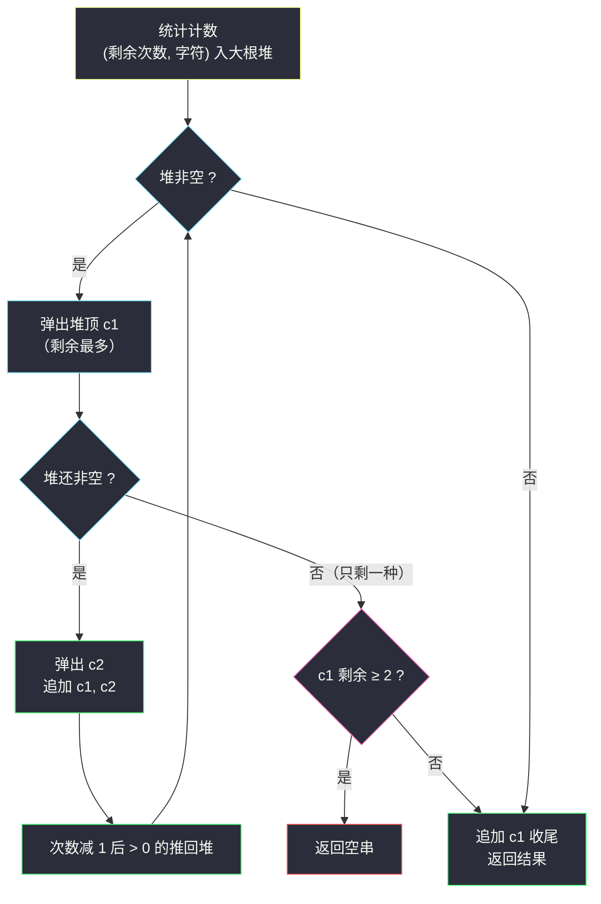
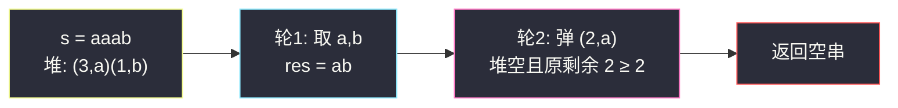

# 重构字符串（重排元素 · 大根堆贪心）

## 一、问题描述

给定一个字符串 `s`，请你重新排列 `s` 中的字符，使得**任意两个相邻的字符不相同**。

返回任意一个满足条件的重排结果；如果不存在这样的排列，返回空字符串 `""`。

> 🔗 LeetCode 767：https://leetcode.cn/problems/reorganize-string/
>
> 数据范围：`1 <= s.length <= 500`，`s` 由小写英文字母组成。

**示例 1**

```
输入：s = "aab"
输出："aba"
```

**示例 2**

```
输入：s = "aaab"
输出：""
解释：3 个 'a' 无法两两隔开（3 > ⌈4/2⌉ = 2），无解。
```

**直观理解**

这是一道「重排元素」入门题：像排队一样，把**出现次数最多**的字符最优先安置。如果某个字符太多（超过总长的一半），它必然被迫相邻——这是「鸽巢原理」给出的无解判定；否则每次都先安置剩余次数最多的两个不同字符，就能一路交替填下去。

---

## 二、暴力解法

最直接的想法是回溯：逐位尝试放一个「与上一位不同且还有剩余」的字符，失败就撤销换下一个：

```python
class Solution:
    def reorganizeString(self, s: str) -> str:
        cnt = Counter(s)
        res = []

        def dfs() -> bool:
            if len(res) == len(s):
                return True
            for ch in sorted(cnt):          # 固定顺序，便于剪枝
                if cnt[ch] > 0 and (not res or res[-1] != ch):
                    cnt[ch] -= 1
                    res.append(ch)
                    if dfs():
                        return True
                    res.pop()               # 撤销
                    cnt[ch] += 1
            return False

        return "".join(res) if dfs() else ""
```

### 复杂度

- **时间**：最坏 `O(n!)` 级别的搜索树（带相邻约束剪枝后小数据能过，`n = 500` 时理论上不可靠）。
- **空间**：`O(n)` 递归栈 + 计数。

### 🔴 瓶颈在哪里

回溯把「全局计数约束」留到深处才暴露：某个字符次数太多时，错误要到很晚才被发现。突破口是**先看计数**——无解与否由 `max(cnt)` 一票决定，有解时按「最多的先安置」的贪心可以一步不回头地构造。

---

## 三、优化探索（核心章节）

> 📚 本题在灵茶题单中属于 **§5.4 重排元素**（数据结构 · 堆 B 路）：用「(剩余次数, 字符)」大根堆，每次取出两个**不同**的字符填充，取不出（只剩一种字符且剩余 ≥ 2）则返回空串。

### 3.1 观察特征

| 特征 | 说明 |
|------|------|
| 只要求相邻不同 | 局部约束，逐位构造即可，不必全局搜索 |
| 无解条件清晰 | 某字符次数 > ⌈n/2⌉ 时必无解（鸽巢） |
| 「最危险」的字符 | 剩余次数最多的字符最容易被迫相邻，应优先消耗 |

### 3.2 有解判定（鸽巢原理）

设 `n = len(s)`，最大次数 `m = max(cnt.values())`：

- 若 `m > ⌈n/2⌉`：把这 `m` 个字符放进长度 `n` 的序列，相邻两个之间至少要隔一个别的字符，需要 `m + (m - 1) >= n`，即 `m > ⌈n/2⌉` 时放不下 → 无解。
- 若 `m ≤ ⌈n/2⌉`：下文的堆贪心（或隔位填法，见 [#1054](distant-barcodes.md)）一定能构造出解。

### 3.3 堆贪心：每轮取两个不同字符

维护大根堆，元素为 `(剩余次数, 字符)`（Python 小根堆存 `(-次数, 字符)`）。每轮：

1. 弹出堆顶 `c1`（剩余最多的字符），先放进结果；
2. 再弹出一个**不同**的字符 `c2` 放进结果——这一步保证相邻不同；
3. 两者剩余次数减 1 后若仍大于 0，推回堆中。

为什么先安置最多的？直觉上「最多的字符」是未来的隐患：如果现在不消耗它，它留在后面只能和彼此相邻。形式一点说（交换论证）：若某个合法排列中位置 `i`、`i+2` 放的不是当前最多的字符，可以把它与最多字符交换而不产生新的相邻冲突——所以「最多者优先」永不吃亏。

**取不出第二个字符时**：堆已空说明只剩一种字符。若它还剩 ≥ 2 个，必然相邻 → 返回 `""`；若恰好剩 1 个，放在末尾收尾即可。



### 3.4 一句话核心

> **每轮从大根堆取「剩余最多的两个不同字符」成对填入；只剩一种且剩余 ≥ 2 即无解。**

---

## 四、代码实现

### Python（主解：大根堆贪心）

```python
class Solution:
    def reorganizeString(self, s: str) -> str:
        cnt = Counter(s)
        # 小根堆存 (-剩余次数, 字符) == 按剩余次数的大根堆
        heap = [(-c, ch) for ch, c in cnt.items()]
        heapq.heapify(heap)

        res = []
        while heap:
            c1, ch1 = heapq.heappop(heap)   # 剩余最多的字符
            res.append(ch1)
            if not heap:                    # 只剩一种字符
                if -c1 > 1:                 # 还剩 ≥ 2 个，必然相邻
                    return ""
                break                       # 恰剩 1 个，放末尾收尾
            c2, ch2 = heapq.heappop(heap)   # 次多的、必然不同的字符
            res.append(ch2)
            if c1 + 1 < 0:                  # ch1 还有剩余，推回
                heapq.heappush(heap, (c1 + 1, ch1))
            if c2 + 1 < 0:
                heapq.heappush(heap, (c2 + 1, ch2))
        return "".join(res)
```

**变量含义**

| 变量 | 含义 |
|------|------|
| `heap` | `(-剩余次数, 字符)` 的小根堆，堆顶 = 剩余最多的字符 |
| `c1, ch1` | 本轮第一个取出（最多）的字符及其负次数 |
| `c2, ch2` | 本轮第二个取出（次多、必不同）的字符 |
| `res` | 逐步拼接的重排结果 |

**循环不变式**：每轮开始时，`res` 已合法（相邻不同），且堆中各字符剩余总数 = `n - len(res)`。每轮消耗两个不同字符，`res` 末尾两个字符互不相同，也与更早的部分拼接合法。

### Java（最优解同思路）

```java
class Solution {
    public String reorganizeString(String s) {
        int[] cnt = new int[26];
        for (char c : s.toCharArray()) cnt[c - 'a']++;
        // 大根堆：元素 [字符, 剩余次数]，按剩余次数降序
        PriorityQueue<int[]> pq = new PriorityQueue<>((a, b) -> b[1] - a[1]);
        for (int i = 0; i < 26; i++)
            if (cnt[i] > 0) pq.offer(new int[]{i, cnt[i]});

        StringBuilder sb = new StringBuilder();
        while (!pq.isEmpty()) {
            int[] first = pq.poll();
            sb.append((char) ('a' + first[0]));
            if (pq.isEmpty()) {
                if (first[1] > 1) return "";   // 只剩一种且 ≥ 2 个
                break;
            }
            int[] second = pq.poll();
            sb.append((char) ('a' + second[0]));
            if (--first[1] > 0) pq.offer(first);
            if (--second[1] > 0) pq.offer(second);
        }
        return sb.toString();
    }
}
```

---

## 五、具体例子演示

以 `s = "vvvlo"` 走主解（计数：`v:3, l:1, o:1`，`max = 3 ≤ ⌈5/2⌉ = 3`，有解）。

**逐步跟踪（每轮堆的取出与推回）**

| 轮 | 堆（取出前） | 第一取出 | 第二取出 | res | 推回 | 堆（本轮后） |
|----|--------------|----------|----------|-----|------|--------------|
| 1 | (3,v) (1,l) (1,o) | v（剩 2） | l（剩 0） | `"vl"` | (2,v) | (2,v) (1,o) |
| 2 | (2,v) (1,o) | v（剩 1） | o（剩 0） | `"vlvo"` | (1,v) | (1,v) |
| 3 | (1,v) | v（剩 0） | 堆空：剩余 0，收尾 | `"vlvov"` | — | 空 |

最终输出 `"vlvov"`，任意相邻两字符都不同。

**示例 1 复核**：`"aab"` → 轮 1 取 `a`、`b` 得 `"ab"`，推回 `(1,a)`；轮 2 弹 `a`（剩 0）后堆空、剩余 0 → 收尾得 `"aba"`。

**示例 2 复核（无解路径）**：`"aaab"` → 轮 1 弹 `(3,a)` 填 `a`、弹 `(1,b)` 填 `b` 得 `"ab"`，推回 `(2,a)`，堆只剩 `[(2,a)]`；轮 2 弹 `(2,a)` 想填第三个 `a`，但此刻**堆已空且 `-c1 = 2 > 1`** → 返回 `""`。

对照鸽巢判定：`m = 3 > ⌈4/2⌉ = 2`，确实无解 ✓。



---

## 六、复杂度分析

| 方法 | 时间 | 空间 | 说明 |
|------|------|------|------|
| 回溯暴力 | `O(n!)` | `O(n)` | 小数据可过，`n = 500` 无保障 |
| 堆贪心（主解） | `O(n log 26)` | `O(26) + O(n)` | 堆内至多 26 个不同字母，`log 26` 为常数，整体近似 `O(n)` |

堆操作共 `O(n)` 次，每次 `O(log 26)`；计数表 `O(26)`，输出串 `O(n)`。

---

## 七、对比总结

**同族题**——「重排使相邻不同」一族的三种武器：

| 方法 | 思路 | 适配场景 |
|------|------|----------|
| 大根堆贪心（本篇） | 每轮取两个剩余最多的不同字符 | 通用，自然给出无解判定 |
| 隔位填法（见 [#1054](distant-barcodes.md)） | 按频次降序，先填偶数位再填奇数位 | 只关心构造时更轻量，`O(n log n)` 仅为排序计数 |
| 回溯 | 逐位试错 | 只适合教学演示 |

**易错点**

1. **无解判定时机**：不是最后统一检查，而是「弹出一个字符后发现堆空且它剩余 ≥ 2」当场返回 `""`。
2. 同频字符的取舍随意（如 `(2,a)` 与 `(2,b)` 谁先弹都行），不影响正确性。
3. 推回堆的时机是本轮**两个都取出之后**——若先推回 `c1` 再取 `c2`，可能又取到 `c1` 自己。
4. `n = 1` 的单字符串：轮 1 弹出后堆空、剩余 0，直接收尾返回原字符。

**模板（重排元素 · 大根堆取两个，Python）**

```python
heap = [(-c, ch) for ch, c in Counter(s).items()]
heapq.heapify(heap)
res = []
while heap:
    c1, ch1 = heapq.heappop(heap)
    res.append(ch1)
    if not heap:
        if -c1 > 1: return ""
        break
    c2, ch2 = heapq.heappop(heap)
    res.append(ch2)
    if c1 + 1 < 0: heapq.heappush(heap, (c1 + 1, ch1))
    if c2 + 1 < 0: heapq.heappush(heap, (c2 + 1, ch2))
```

---

## 八、举一反三

| 题目 | 关系 |
|------|------|
| [1054. 距离相等的条形码](https://leetcode.cn/problems/distant-barcodes/) | **完全同族**（保证有解版），同批 `distant-barcodes.md` 主讲隔位填法，与本篇堆法互为印证 |
| [1405. 最长快乐字符串](https://leetcode.cn/problems/longest-happy-string/) | 三字符版「相邻不同」，同款「取剩余最多的两个」堆贪心 |
| [984. 不含 AAA 或 BBB 的字符串](https://leetcode.cn/problems/string-without-aaa-or-bbb/) | 两字符版，约束变为「不得连续三个相同」，堆贪心直接迁移 |
| [621. 任务调度器](https://leetcode.cn/problems/task-scheduler/) | 同款「最多任务优先」+ 冷却期，可堆可公式 |
| [1953. 你可以工作的最大周数](https://leetcode.cn/problems/maximum-number-of-weeks-for-which-you-can-work/) | 只问 `max ≤ ⌈total/2⌉` 的判定与方案数，鸽巢条件同源 |

**思想迁移**

- 「重排使相邻不同」先看最大频次：`max ≤ ⌈n/2⌉` 即有解，随后**最多的先安置**。
- 堆在这里扮演「动态剩余最多」的角色：每消耗两个就更新一次，无需重新扫描。
- 口诀：**「最多先安顿，成对不同取；堆空剩两个，空串定无解。」**
