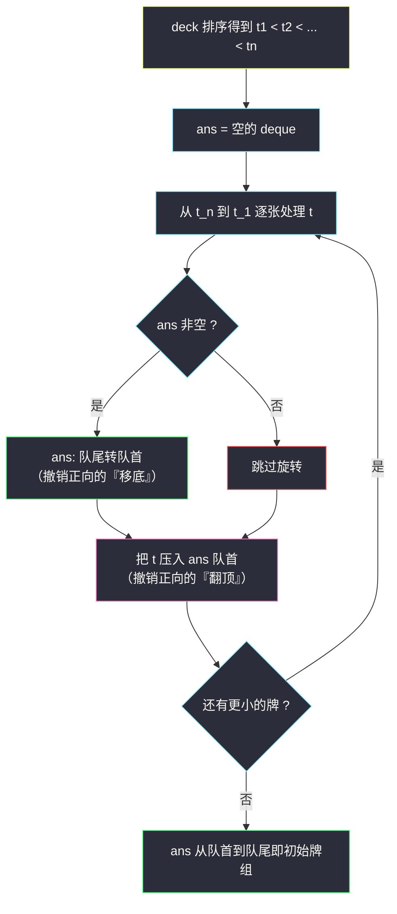

# 按递增顺序显示卡牌（反向模拟 + 双端队列）

## 一、问题描述

牌组中的每张卡牌都对应一个唯一的整数数组 `deck`。按如下规则重复操作，直到所有牌翻面完毕：

1. 翻出当前牌组**顶部**的牌，将其移出牌组；
2. 若牌组中还有牌，将当前牌组**顶部**的牌移到底部。

返回一个能让翻出的牌**按非降顺序排列**的初始牌组顺序。答案不唯一，返回任意一组合法解即可。

> 🔗 LeetCode 950：https://leetcode.cn/problems/reveal-cards-in-increasing-order/
>
> 数据范围：`1 <= len(deck) <= 1000`，`1 <= deck[i] <= 10^6`，`deck` 中所有牌**互不相同**。

**示例 1**

```
deck = [17,13,11,2,3,5,7]
输出：[2,13,3,11,5,17,7]

按输出排列牌组后模拟：
翻 2，移 13 到底 → [3,11,5,17,7,13]
翻 3，移 11 到底 → [5,17,7,13,11]
翻 5，移 17 到底 → [7,13,11,17]
翻 7，移 13 到底 → [11,17,13]
翻 11，移 17 到底 → [13,17]
翻 13，移 17 到底 → [17]
翻 17
翻出顺序 2,3,5,7,11,13,17 —— 严格递增 ✓
```

**示例 2**

```
deck = [1,1000]
输出：[1,1000]

翻 1，移 1000 到底（等于没动），翻 1000
```

**直观理解**

操作序列（翻顶、移底、翻顶、移底……）是**固定**的，问的是哪种初始排列能让这个固定的「洗牌机器」恰好按递增序吐出所有牌。正向「安排每张牌的位置」要同时照顾旋转的耦合，非常难想；而**把时间倒过来，从最后一次翻面往回撤销**，每一步都变成机械动作——这正是灵神题单 §4.1 队列基础里「**已知操作序列求初始状态 → 反向模拟**」的经典套路。

---

## 二、暴力解法

### 暴力：枚举全排列

把 `deck` 的所有排列逐一模拟，返回第一个翻出顺序递增的：

```python
class Solution:
    def deckRevealedIncreasing(self, deck: list[int]) -> list[int]:
        for perm in itertools.permutations(deck):
            q = list(perm)
            out = []
            while q:
                out.append(q.pop(0))          # 翻顶
                if q:
                    q.append(q.pop(0))        # 移底
            if out == sorted(deck):
                return list(perm)
```

`n!` 个排列、每个模拟 `O(n)`，`n = 1000` 时是天文学数字；而且答案不唯一，剪枝也无从下手。

### 🔴 瓶颈在哪里

正向视角下，第 `i` 张被翻出的牌在初始牌组中的位置是某个「约瑟夫环式」的函数，逐牌推导互相纠缠。**信息流是单向的**：初始状态 →（固定机器）→ 翻出序列。正向构造 = 在机器的输出端猜输入；反向模拟 = 逆着机器走。

---

## 三、优化探索（核心章节）

> 📚 本题在灵茶题单中属于 **§4.1 队列基础（模拟）**。模板要点：**deque 正反向模拟**——正向规则是「翻队首、队首转队尾」，反向规则就是把每一步「倒着放」：**先把队尾转回队首（撤销移底），再把上一张被翻的牌压回队首（撤销翻顶）**。同批姊妹篇 [#1670 设计前中后队列](design-front-middle-back-queue.md) 是 deque 双端操作的另一面。

### 3.1 关键认知：翻出顺序可以直接确定

翻出的顺序要求非降，而牌互不相同 → **翻出顺序就是排序后的 `deck`**，一张不多一张不少。设排序后为 `t_1 < t_2 < ... < t_n`，问题变成：构造初始牌组 `P`，使机器在时刻 `i` 翻出 `t_i`。

### 3.2 从最后一步往回拆

观察机器的**最后一步**：此时牌组只剩一张，必是 `t_n`（最大牌，最后翻出）。翻出后牌组清空。

往前倒一步：翻 `t_{n-1}` 之前，牌组形如 `[t_{n-1}, ...?]`——不对，**恰好剩两张时**是 `[x, t_n]` 中的哪种形态？模拟验证：`[x, t_n]` → 翻 `x`，移 `t_n` 到底 → `[t_n]` → 翻 `t_n`。所以倒数第二步之前牌组就是 `[t_{n-1}, t_n]`：翻出 `t_{n-1}`、`t_n` 依次正确 ✓。

于是「从 `[t_n]` 得到 `[t_{n-1}, t_n]`」的逆操作一目了然：

> **撤销「移底」**：把队尾元素转到队首；**撤销「翻顶」**：把刚翻出的牌压回队首。

一般地，若 `D` 是机器执行到某步**之后**的牌组，那么该步**之前**的牌组 = `「队尾转队首」 一次，再「压入本步翻出的牌到队首」`。

### 3.3 算法：排序 + 从大到小反向构造



从**最大牌**（最后翻出的 `t_n`）开始，按翻出顺序的**逆序**逐张执行「尾转首 + 压队首」。处理完 `t_1`（最先翻出的牌）后，deque 里躺着的正是初始牌组。

为什么处理顺序是**从大到小**？因为反向撤销必须从**最后一个状态**（空牌组，最后翻出的是 `t_n`）出发，逆着时间轴逐张放回——时间轴上的顺序是 `t_n, t_{n-1}, ..., t_1`。

### 3.4 一句话核心

> **正向「翻队首 + 队首转队尾」不可构造；反向「队尾转队首 + 压回队首」每步 O(1)。把「求初始状态」翻译成「逆着操作序列回放」，是这类模拟题的通解。**

---

## 四、代码实现

### Python（主解）

```python
from typing import List
from collections import deque

class Solution:
    def deckRevealedIncreasing(self, deck: List[int]) -> List[int]:
        ans = deque()
        for t in sorted(deck, reverse=True):   # 从最大牌（最后翻出）往回构造
            if ans:
                ans.appendleft(ans.pop())      # 撤销"移底"：队尾转回队首
            ans.appendleft(t)                  # 撤销"翻顶"：压回本步翻出的牌
        return list(ans)
```

**两行循环体，逐行对应 3.2 节的两条撤销规则**。注意 `sorted(deck, reverse=True)` 处理顺序是 `t_n, t_{n-1}, ..., t_1`，与翻出顺序正好相反。

| 语句 | 撤销的正向操作 | 复杂度 |
|------|----------------|--------|
| `ans.appendleft(ans.pop())` | 「把顶部牌移到底部」= 队首转队尾 → 逆为队尾转队首 | 均摊 `O(1)` |
| `ans.appendleft(t)` | 「翻出顶部牌」= 弹队首 → 逆为压队首 | `O(1)` |

### Java（最优解同款写法）

```java
class Solution {
    public int[] deckRevealedIncreasing(int[] deck) {
        Arrays.sort(deck);                          // 升序
        Deque<Integer> ans = new ArrayDeque<>();
        for (int i = deck.length - 1; i >= 0; i--) {  // 从最大牌往回构造
            if (!ans.isEmpty()) {
                ans.addFirst(ans.pollLast());       // 队尾转队首
            }
            ans.addFirst(deck[i]);                  // 压回本步翻出的牌
        }
        int[] res = new int[deck.length];
        for (int i = 0; i < deck.length; i++) {
            res[i] = ans.pollFirst();
        }
        return res;
    }
}
```

---

## 五、具体例子演示

### 示例 1：`deck = [17,13,11,2,3,5,7]`（期望一组解 `[2,13,3,11,5,17,7]`）

排序升序 `[2,3,5,7,11,13,17]`，反向处理顺序为 `17, 13, 11, 7, 5, 3, 2`。逐步跟踪每轮 deque 状态：

| 轮次 | 处理牌 t | 尾转首后的 deque | 压入 t 后的 deque |
|------|----------|------------------|-------------------|
| 1 | 17 | （空，跳过旋转） | [17] |
| 2 | 13 | [17]（尾 17 转首，单元素不变） | [13, 17] |
| 3 | 11 | [17, 13] | [11, 17, 13] |
| 4 | 7 | [13, 11, 17] | [7, 13, 11, 17] |
| 5 | 5 | [17, 7, 13, 11] | [5, 17, 7, 13, 11] |
| 6 | 3 | [11, 5, 17, 7, 13] | [3, 11, 5, 17, 7, 13] |
| 7 | 2 | [13, 3, 11, 5, 17, 7] | **[2, 13, 3, 11, 5, 17, 7]** |

构造结果 `[2,13,3,11,5,17,7]`，与题目给出的参考输出一致。**正向验证一遍**（把机器开起来）：

| 步骤 | 翻出 | 移底后牌组 |
|------|------|------------|
| 1 | 2 | [3,11,5,17,7,13] |
| 2 | 3 | [5,17,7,13,11] |
| 3 | 5 | [7,13,11,17] |
| 4 | 7 | [11,17,13] |
| 5 | 11 | [13,17] |
| 6 | 13 | [17] |
| 7 | 17 | 空 |

翻出序列 `2,3,5,7,11,13,17` 严格递增 ✓，端到端闭环。

**观察一个规律**：越早处理的（大）牌越会被后续的「尾转首」反复搬运——比如 `17` 从队首一路被转到队尾又转回来，最终恰好停在**倒数第二近末尾**的位置（下标 5）。这正是正向机器里「最大牌要被移底 `(n-1)` 次中的若干次、熬到最后」的镜像。

### 示例 2 复核：`deck = [1,1000]`

反向处理 `1000, 1`：轮 1 得 `[1000]`；轮 2：尾转首（不变）后压 1 → `[1,1000]` ✓。正向：翻 1、移 1000 到底（单张等于没移）、翻 1000，递增 ✓。

---

## 六、复杂度分析

| 解法 | 时间 | 空间 |
|------|------|------|
| 枚举全排列 | `O(n! · n)` | `O(n)` |
| 反向模拟（本篇） | `O(n log n)` | `O(n)` |

排序 `O(n log n)` 是主项；每张牌的两步 deque 操作（`pop` / `appendleft`）均为均摊 `O(1)`，模拟部分合计 `O(n)`。空间为 deque 与排序（Python 的 `sorted`）产生的 `O(n)`。

`n = 1000` 时排序约 `10^4` 次比较，模拟 `2 × 1000` 次双端操作，瞬时完成。

---

## 七、对比总结

**正向 vs 反向两种视角**：

| 视角 | 每步动作 | 难度 |
|------|----------|------|
| 正向构造初始牌组 | 「让第 i 次翻面恰好是 t_i」的耦合方程，牌与牌互相牵制 | 极难，等价于约瑟夫问题的位置递推 |
| 反向撤销 | 「尾转首 + 压队首」两个机械动作，彼此独立、互不纠缠 | 两行代码 |

**这类题的判定信号**：题目给了**固定的操作序列**，问初始状态——操作可逆（或可机械撤销）时，反向模拟几乎总是最优解。对照同批 [#1670 设计前中后队列](design-front-middle-back-queue.md)：那里是设计支持双向操作的数据结构，这里是利用 deque 的双向能力做时间回溯，一体两面。

**易错点清单**

1. **处理顺序写成从小到大**：必须从**最大**牌（最后翻出的）开始往回撤销；从小到大等于顺着时间轴「正向撤销」，全部错位。
2. **忘记先尾转首**：直接压新牌会漏掉「移底」的逆操作，示例 1 第一张就错。
3. **压错端**：新牌压**队首**（它是最先被翻出的）；压到队尾结果整体镜像错误。
4. **单元素轮次**：第一轮 deque 为空，`pop()` 会抛异常，需要 `if ans:` 守卫（或利用「单元素尾转首不变」的性质统一处理——但空 deque 的 `pop` 仍会崩，守卫不可省）。
5. **答案不唯一的预期**：输出与期望不同不一定是错的（题目说明任意合法解均可），验证方式是正向模拟一遍检查翻出序。

---

## 八、举一反三

| 题目 | 关系 |
|------|------|
| [1670. 设计前中后队列](https://leetcode.cn/problems/design-front-middle-back-queue/) | 同批姊妹篇（同 §4.x）：deque 双端操作的结构化设计，见 `design-front-middle-back-queue.md` |
| [641. 设计循环双端队列](https://leetcode.cn/problems/design-circular-deque/) | deque 双端原语的手工实现，理解 `appendleft` / `pop` 均摊 O(1) 的底层 |
| [844. 比较含退格的字符串](https://leetcode.cn/problems/backspace-string-compare/) | 同款「反向处理」思想：倒着扫描，遇退格跳过字符 |
| [232. 用栈实现队列](https://leetcode.cn/problems/implement-queue-using-stacks/) | 用受限结构模拟另一结构的「正反双栈」技巧，与本题的「正反模拟」互为镜像 |
| [933. 最近的请求次数](https://leetcode.cn/problems/number-of-recent-calls/) | §4.1 队列基础姊妹题：单调队列式滑动窗口计数的最简形态 |

**思想迁移**

- 「**已知输出与固定规则，反推输入**」是反向模拟的完整判定条件：先确认规则可逆（本题每步都可机械撤销），再从**最终状态**倒着走。日常工程里的「日志回放 / undo 栈 / 数据库回滚」都是这个骨架。
- deque 在这类题里是天然载体：正向的「队首转队尾」和反向的「队尾转队首」恰好都是它的 `O(1)` 原语——**选数据结构时先数一数需要哪几个端上的操作**。
- 口诀：**「翻首移尾是正向，尾转首来首压牌；从大到小往回撤，倒完一遍答案来。」**
