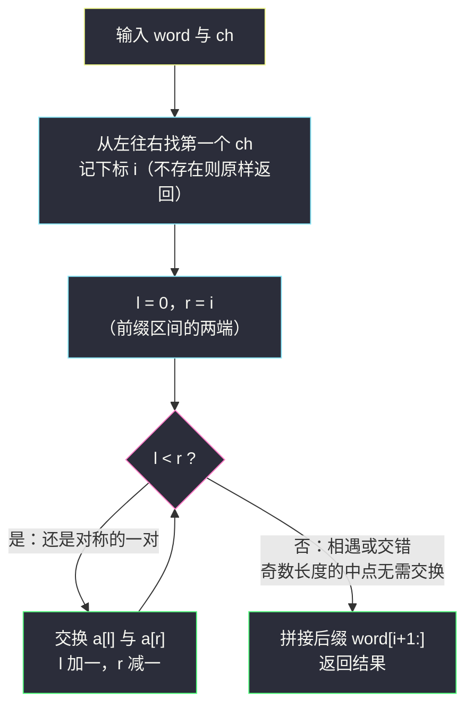
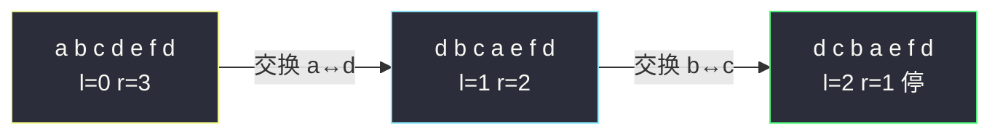

# 反转单词前缀（找 ch 定右端 · 相向双指针反转）

## 一、问题描述

给定字符串 `word` 和字符 `ch`，请找出 `ch` 在 `word` 中**第一次出现**的下标 `i`，反转 `word` 中从下标 `0` 到下标 `i`（**两端都包含**）的那段字符，返回结果字符串。如果 `ch` 不在 `word` 中，返回原字符串。

> 🔗 LeetCode 2000：https://leetcode.cn/problems/reverse-prefix-of-word/
>
> 数据范围：`1 <= word.length <= 250`，`word` 和 `ch` 都是小写英文字母。

**示例 1**

```
输入：word = "abcdefd", ch = "d"
输出："dcbaefd"
解释：第一个 'd' 出现在下标 3，反转 "abcd" 得 "dcba"，后缀 "efd" 原样保留。
```

**示例 2**

```
输入：word = "xyxzxe", ch = "z"
输出："zxyxxe"
解释：第一个 'z' 出现在下标 3，反转 "xyxz" 得 "zxyx"，后缀 "xe" 原样保留。
```

**示例 3**

```
输入：word = "abcd", ch = "z"
输出："abcd"
解释：'z' 不存在，原样返回。
```

**直观理解**

题目就两个动作：**定位**（找 `ch` 第一次出现的位置）+ **反转**（把前缀段倒过来）。定位是一次普通扫描，反转正是灵茶题单 §3.1 相向双指针的第一课——`l` 从段头、`r` 从段尾相向而行，边走边交换，走到中间相遇为止。这个模板是后面 #344、#832、#3643 一整串反转题的地基。

## 二、暴力解法

### 直观思路

直白两步走：先从左往右扫描找到第一个 `ch`，记下标 `i`；再把 `word[0..i]` 从右往左逐字符抄进一个新串，最后接上原样后缀。

```python
class Solution:
    def reversePrefix(self, word: str, ch: str) -> str:
        i = word.find(ch)                  # 第一步：定位（不存在时返回 -1）
        if i < 0:
            return word
        res = []
        for j in range(i, -1, -1):         # 第二步：从 i 倒着抄前缀
            res.append(word[j])
        res.extend(word[i + 1:])           # 后缀原样拼接
        return ''.join(res)
```

### 复杂度

- **时间**：`O(n)`（定位一遍 + 倒抄一遍）。
- **空间**：`O(n)`（新开结果串）。

注意拼接姿势：逐字符 `res = res + c` 在字符串不可变的语义下每次都整体拷贝，最坏 `O(n²)`；要用 `append`/`join`。

### 🔴 瓶颈在哪里

`n <= 250` 暴力当然能过，功能上没有瓶颈。真正的问题是：「新开数组倒着抄」这件事**没有可复用性**——一旦场景变成字符数组、整数数组要求**原地**反转（比如 #344），倒抄就失效了。本题的价值在于借它练熟 §3.1 的**原地相向双指针反转**模板。

## 三、优化探索（核心章节）

> 📚 本题在灵茶题单中属于 **§3.1 反转字符串**（单序列双指针第一课）。讲法对齐灵神的相向双指针标准写法：`l` 从区间左端出发、`r` 从区间右端出发，相向而行，每轮交换后各进一格，直到两指针相遇。

### 3.1 观察特征：反转 = 对称配对交换

把区间 `[0, i]` 反转，等价于位置 `p` 的字符与位置 `i - p` 的字符互换。也就是说：`a[0] ↔ a[i]`、`a[1] ↔ a[i-1]`、…… 成对交换，一共恰好 `⌊(i+1)/2⌋` 对，每对内部交换一次、对与对之间互不干扰。

### 3.2 相向双指针写法

```python
l, r = 0, i            # 区间 [0, i] 的两端
while l < r:
    a[l], a[r] = a[r], a[l]
    l += 1
    r -= 1
```

### 3.3 为什么不会漏、不会重（正确性论证）

- **不重**：每轮处理配对 `(l, r)` 后 `l` 加一、`r` 减一，两指针各向中间收紧一格，任何一对位置只会被访问一次。
- **不漏**：循环恰好枚举出所有满足 `p < i - p` 的对称对 `(p, i-p)`——这正是反转的充要操作集合；不多一对、不少一对。
- **停在对的位置**：条件是 `l < r` 而不是 `l <= r`。区间长度为奇数时中间元素满足 `p == i - p`，自己和自己交换等于没换，直接停；长度为偶数时两指针正好交错（`l > r`）后停止。写成 `l <= r` 也不会错（多一次无效自交换），但 `l < r` 是更干净的标准形态。



### 3.4 一句话核心

> **`word.find(ch)` 定下区间右端 `r`，左端从 `0` 出发，相向交换到相遇为止；找不到 `ch` 就原样返回。**

## 四、代码实现

### Python（主解：定位 + 原地相向反转）

```python
class Solution:
    def reversePrefix(self, word: str, ch: str) -> str:
        i = word.find(ch)                  # -1 表示 ch 不存在
        if i < 0:
            return word
        a = list(word)                     # Python 字符串不可变，转列表做原地交换
        l, r = 0, i
        while l < r:
            a[l], a[r] = a[r], a[l]
            l += 1
            r -= 1
        return ''.join(a)
```

**变量含义**

| 变量 | 含义 |
|------|------|
| `i` | `ch` 第一次出现的下标，同时是反转区间的右端 |
| `l` / `r` | 相向双指针，分别从 `0` 和 `i` 向中间走 |
| `a` | `word` 的列表副本（为原地交换服务） |

**循环不变式**：每轮交换前，`a[0..l-1]` 已是最终反转结果的前缀，`a[r+1..i]` 已是最终结果的后缀，两段对称、长度相等。

**面试口头版**（能 AC 但不练手）：

```python
i = word.find(ch)
return word[:i+1][::-1] + word[i+1:] if i >= 0 else word
```

（本题为 Easy，没有进阶优化环节，按本工程语言规则不补 Java。）

## 五、具体例子演示

**示例 1**：`word = "abcdefd"`，`ch = "d"`。

第一步定位：`j = 0` 是 `'a'`、`j = 1` 是 `'b'`、`j = 2` 是 `'c'`，`j = 3` 是 `'d'` 命中 → `i = 3`。

第二步反转 `[0, 3]`：

| 轮次 | l | r | 交换的字符 | 交换后的数组 |
|------|---|---|-----------|--------------|
| 1 | 0 | 3 | `'a' ↔ 'd'` | `d b c a e f d` |
| 2 | 1 | 2 | `'b' ↔ 'c'` | `d c b a e f d` |
| — | 2 | 1 | `l >= r`，停止 | — |

输出 `"dcbaefd"` ✓

**示例 2**：`word = "xyxzxe"`，`ch = "z"`。定位：下标 3 是 `'z'` → `i = 3`。

| 轮次 | l | r | 交换的字符 | 交换后的数组 |
|------|---|---|-----------|--------------|
| 1 | 0 | 3 | `'x' ↔ 'z'` | `z y x x x e` |
| 2 | 1 | 2 | `'y' ↔ 'x'` | `z x y x x e` |
| — | 2 | 1 | `l >= r`，停止 | — |

输出 `"zxyxxe"` ✓

**示例 3**：`word = "abcd"`，`ch = "z"`。`find` 返回 `-1`，直接原样返回 `"abcd"` ✓。



## 六、复杂度分析

| 方法 | 时间 | 空间 | 说明 |
|------|------|------|------|
| 暴力倒抄 | `O(n)` | `O(n)` | 新开数组从右往左抄一遍 |
| 相向双指针（主解） | `O(n)` | `O(1)` 原地 | 定位 `O(n)` + 交换 `⌊(i+1)/2⌋` 次；Python 因字符串不可变需 `O(n)` 列表副本 |

两种做法时间同阶，主解赢在**原地、可复用**——数组、字符数组场景直接平移。

## 七、对比总结

**易错点**

1. `ch` 不存在时必须**原样返回**，`find` 的 `-1` 要单独处理（切片下标算出 `-1` 会静默切错位置）。
2. 反转区间**含 `ch` 所在下标本身**：是 `word[0..i]`，不是 `word[0..i-1]`。
3. 循环条件 `while l < r`：奇数长度时中点无需交换；顺手写成 `l <= r` 虽不出错，但要明白中点那次是无效自交换。
4. Python 字符串不可变，先 `list(word)` 再 `''.join(a)`，不要在循环里反复拼串。

**模板（相向双指针反转，背下来）**

```python
# 反转区间 a[l..r]（两端包含）
while l < r:
    a[l], a[r] = a[r], a[l]
    l += 1
    r -= 1
```

这一小段是 §3.1 全部题目的公共骨架：#344 是它本体，#832 在交换时顺手 `^1`，#3643 把它搬到矩阵的列上，#3775 用它反转整个单词。

## 八、举一反三

| 题目 | 关系 |
|------|------|
| [344. 反转字符串](https://leetcode.cn/problems/reverse-string/) | 模板本体，原地反转整个数组 |
| [3794. 反转字符串前缀](https://leetcode.cn/problems/reverse-string-prefix/) | 同小节新题，与本题几乎一致 |
| [541. 反转字符串 II](https://leetcode.cn/problems/reverse-string-ii/) | 多段区间按规则各反各的，模板复用 |
| [345. 反转字符串中的元音字母](https://leetcode.cn/problems/reverse-vowels-of-a-string/) | 相向双指针 + 交换前先判断字符类别 |
| [917. 仅仅反转字母](https://leetcode.cn/problems/reverse-only-letters/) | 同上，跳过非字母再交换 |

**同批姊妹篇**：`flipping-an-image.md`（反转 + 取反一步到位）、`flip-square-submatrix-vertically.md`（矩阵子块反转）、`reverse-words-with-same-vowel-count.md`（分组 + 反转综合）、`search-a-2d-matrix-ii.md`（矩阵上的双指针）。

**思想迁移**

- 「定位一个边界，再原地反转一段」是字符串题最高频的组合拳之一。
- 口诀：**「先找目标定右端，左端从零向中间；成对交换各一步，相遇即停莫越线。」**
