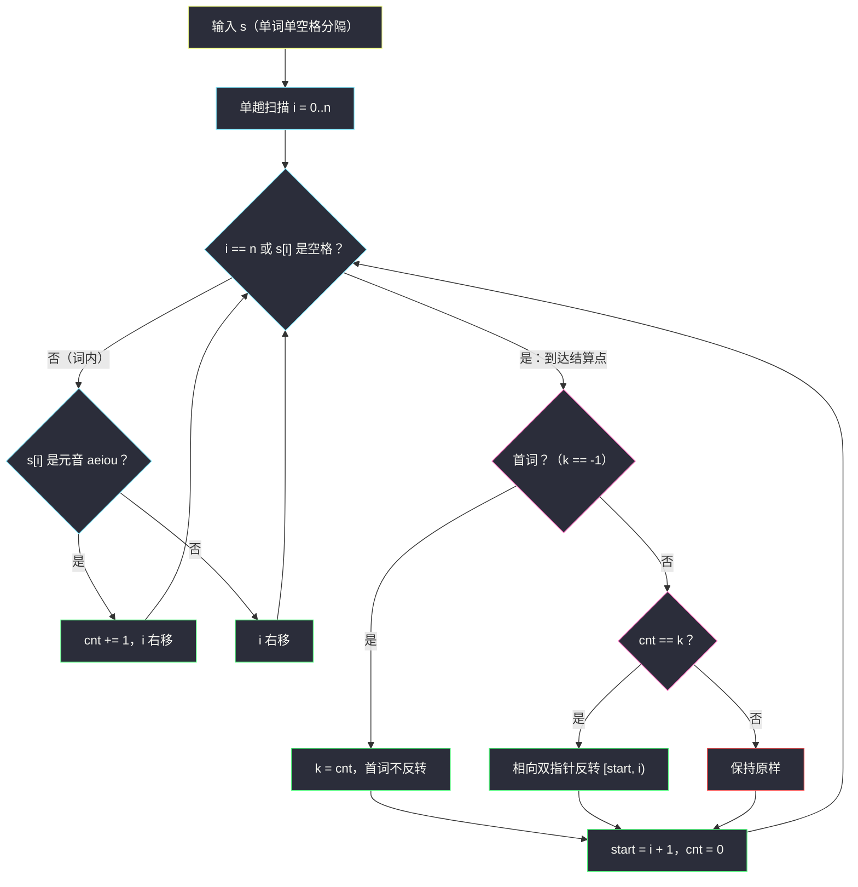

# 反转元音数相同的单词（反转字符串 · 单趟扫描与词内相向双指针）

## 一、问题描述

给定一个字符串 `s`，由若干**小写字母单词**组成，单词之间用**单个空格**分隔（保证没有前导、尾随或连续空格）。元音字母指 `a`、`e`、`i`、`o`、`u`。

处理规则：

1. 统计**第一个单词**的元音个数，记作基准 `k`——首词只负责"出题"，**永远不会被反转**；
2. 对后面每一个单词：若它的元音个数**恰好等于 `k`**，就把这个单词整个反转；否则原样保留。

返回处理后的整句。

> 🔗 LeetCode 3775：https://leetcode.cn/problems/reverse-words-with-same-vowel-count/
>
> 数据范围：`1 <= s.length <= 10^5`，只含小写字母和空格。

**示例 1**

```
输入：s = "cat and mice"
输出："cat dna mice"
解释：首词 "cat" 元音只有 a，k = 1，首词不反转；
      "and" 元音只有 a，1 = k → 反转成 "dna"；
      "mice" 元音是 i、e 共 2 个，2 ≠ 1 → 不变。
```

**补充示例（覆盖 k = 0 的边界）**

```
输入：s = "fly spy cry"
输出："fly yps yrc"
解释：首词 "fly" 一个元音都没有，k = 0；
      "spy" 元音数 0 = k → 反转成 "yps"；
      "cry" 元音数 0 = k → 反转成 "yrc"。
```

**直观理解**

把句子想象成一排"待验收的词"：首词报出预算 `k`，后面每个词报出自己的元音数，**对得上预算的就被倒着放回**，对不上的原样通过。整个过程只有两个原子动作——**数元音**（词级计数）和**反转**（词内重排），且两者互不干扰，这正是它能在一次扫描里完成的原因。

## 二、暴力解法（split 切词 + 逐词两遍处理）

### 直观思路

最直白的写法：先把句子按空格切成单词列表，首词数一遍元音定 `k`；之后每个词**先完整扫一遍数元音**，等于 `k` 就**再扫一遍用切片反转**，最后拼回去。

```python
class Solution:
    def reverseWordsWithSameVowelCount(self, s: str) -> str:
        words = s.split(' ')
        k = sum(c in 'aeiou' for c in words[0])   # 首词：只定基准，不反转
        for idx in range(1, len(words)):
            w = words[idx]
            if sum(c in 'aeiou' for c in w) == k: # 第一遍：数元音
                words[idx] = w[::-1]              # 第二遍：切片反转
        return ' '.join(words)
        # 注：c in 'aeiou' 对每个字符做的是子串查找，最坏再乘 5 的常数
```

### 复杂度

- **时间**：`O(n)`（n 为 `s` 长度），渐近上已经没有优化空间。
- **空间**：`O(n)`——`split` 产生整个单词列表，`w[::-1]`、`join` 又各造一份临时串。

### 🔴 瓶颈在哪里

渐近复杂度虽然是线性，但这版代码"扫"的遍数和中间对象都偏多：

1. **每个词被完整扫两遍以上**：数元音一遍、反转一遍，`split`/`join` 还各有一次整串拷贝；
2. **临时字符串一箩筐**：切出来的词、切片反转的新词、拼接结果，全是待回收对象，`n = 10^5` 时常数不小；
3. **结构上"数"和"倒"被割裂成两趟**——可它们明明能在同一次线性扫描里顺手做完。

## 三、优化探索（核心章节）

> 📚 本题在灵茶题单中属于 **§3.1 反转字符串**（相向双指针模板在"整个单词"上的应用）。前面 #344 反转数组、#2000 反转前缀、#832 翻转图像，模板始终是同一副骨架：`l` 从区间左端、`r` 从区间右端出发，交换后各进一格，相遇即止。本题在模板之外多了一层**"要不要反转"的判定逻辑**——判定依据（元音数）恰好可以在扫描途中顺手统计。

### 3.1 关键观察一：空格就是天然的"结算点"

元音个数是一个**词级标量**，反转是**词内操作**，两者互不干扰。于是不需要先切词再逐词处理——

- 一路扫描，途中遇到元音就把当前词的计数器 `cnt + 1`；
- 遇到**空格**（或扫到串尾）的瞬间，当前词已经"验明正身"：`cnt` 定格，`[start, i)` 就是这个词的完整区间，**当场决定反不反转**。

也就是说，"数元音"和"定位词边界"合并成了同一次扫描，词尾一到立刻结算，不存在第二遍。

### 3.2 关键观察二：循环扫到 n，让串尾当"哨兵空格"

最后一个词后面没有空格，若循环只到 `n-1`，就得在循环外再补一段几乎相同的结算代码。技巧：让 `i` 从 `0` 扫到 `n`（含），当 `i == n` 或 `s[i] == ' '` 时统一走结算分支——**串尾被当成一个看不见的空格**，最后一步自然收尾，代码零重复。

### 3.3 首词的哨兵处理：k = -1 表示"基准未定"

首词结算时面临两件事：定下 `k`，并且**不反转**（哪怕 `k = 0` 也一样）。用 `k = -1` 作哨兵最省事：

- 结算时若 `k == -1` → 这是首词：`k = cnt`，直接跳过反转分支；
- 否则 → 普通词：`cnt == k` 才反转。

注意补充示例 `s = "fly spy cry"` 里的坑：首词 `k = 0` 完全合法，后续**一个元音都没有**的词照样要反转。若把"首词不反转"写成 `cnt != k` 之类的条件，或漏掉 `k = 0` 的心智模型，就会漏反转。

### 3.4 词内反转：相向双指针原地交换

判定通过后，反转区间 `[start, i)`（左闭右开，词长 `L = i - start`）：

| 步骤 | 动作 |
|------|------|
| 初始化 | `l = start`，`r = i - 1` |
| 循环 | 交换 `arr[l]` 与 `arr[r]`，然后 `l += 1`、`r -= 1` |
| 终止 | `l >= r`（长度为奇数时中间那个字符自己和自己"交换"过也不必动，`l == r` 时直接停） |

交换共进行 `⌊L / 2⌋` 次，不产生任何新字符串。Python 里先把 `s` 转成 `list` 再改，最后 `''.join` 一次还原——这是 Python 中"原地"修改字符串的标准姿势。

### 3.5 一句话核心

> **空格即结算点：一路数元音，词到头比一比 `k`，相等就相向双指针倒置，首词只出题不动刀。**

## 四、代码实现

### Python（主解：单趟扫描 + 原地相向双指针反转）

```python
class Solution:
    def reverseWordsWithSameVowelCount(self, s: str) -> str:
        vowels = set("aeiou")          # O(1) 查元音，5 个字符的子串查找换成哈希
        arr = list(s)                  # 字符串不可变，先转成可变数组
        n = len(arr)
        k = -1                         # 首词的元音数；-1 表示基准还没定（哨兵）
        start = 0                      # 当前词的起始下标
        cnt = 0                        # 当前词的元音计数

        for i in range(n + 1):         # 扫到 n：把串尾当"哨兵空格"统一结算
            if i == n or arr[i] == ' ':
                # ---- 结算当前词 arr[start:i] ----
                if k == -1:
                    k = cnt            # 首词：只定基准，永不反转
                elif cnt == k:
                    l, r = start, i - 1
                    while l < r:       # §3.1 相向双指针反转模板
                        arr[l], arr[r] = arr[r], arr[l]
                        l += 1
                        r -= 1
                # ---- 开启下一个词 ----
                start = i + 1
                cnt = 0
            elif arr[i] in vowels:
                cnt += 1               # 词内：顺手统计元音

        return ''.join(arr)
```

### Java（最优解同款写法）

```java
class Solution {
    public String reverseWordsWithSameVowelCount(String s) {
        char[] arr = s.toCharArray();
        int n = arr.length, k = -1, start = 0, cnt = 0;
        for (int i = 0; i <= n; i++) {
            if (i == n || arr[i] == ' ') {
                if (k == -1) {
                    k = cnt;                        // 首词：只定基准
                } else if (cnt == k) {
                    for (int l = start, r = i - 1; l < r; l++, r--) {
                        char t = arr[l]; arr[l] = arr[r]; arr[r] = t;
                    }
                }
                start = i + 1;
                cnt = 0;
            } else if (isVowel(arr[i])) {
                cnt++;
            }
        }
        return new String(arr);
    }

    private boolean isVowel(char c) {
        return c == 'a' || c == 'e' || c == 'i' || c == 'o' || c == 'u';
    }
}
```

## 五、具体例子演示

以 `s = "idea aqua echo"`（n = 14，首词 `idea` 元音 i、e、a）端到端走一遍主解。

**逐事件跟踪（只列元音命中与结算点）**

| i | 字符 | 事件 | cnt | 结算动作 |
|---|------|------|-----|----------|
| 0 | i | 元音命中 | 1 | — |
| 2 | e | 元音命中 | 2 | — |
| 3 | a | 元音命中 | 3 | — |
| 4 | ␣ | 结算词 `[0,4)` = "idea" | — | 首词（k=-1）→ **k = 3，不反转**；start=5, cnt=0 |
| 5 | a | 元音命中 | 1 | — |
| 7 | u | 元音命中 | 2 | — |
| 8 | a | 元音命中 | 3 | — |
| 9 | ␣ | 结算词 `[5,9)` = "aqua" | — | cnt=3 = k → **反转**；start=10, cnt=0 |
| 10 | e | 元音命中 | 1 | — |
| 13 | o | 元音命中 | 2 | — |
| 14 | 哨兵 | 结算词 `[10,14)` = "echo" | — | cnt=2 ≠ 3 → 不变 |

**"aqua" 的词内相向双指针反转（l/r 每轮表）**

| 轮次 | l | r | 交换 | 词的状态 |
|------|---|---|------|----------|
| 初始 | — | — | — | `a q u a` |
| 1 | 0 | 3 | `a ↔ a`（内容不变，指针照走） | `a q u a` |
| 2 | 1 | 2 | `q ↔ u` | `a u q a` |
| 停止 | 2 | 1 | `l >= r`，退出 | **`auqa`** ✓ |

最终输出 `"idea auqa echo"`。

**再验证两个示例**

- `s = "cat and mice"`：首词 "cat" k=1；"and" cnt=1=k → 反转 "dna"；"mice" cnt=2≠1 → 不变。输出 `"cat dna mice"` ✓。
- `s = "fly spy cry"`：首词 "fly" k=0；"spy" cnt=0=k → "yps"；"cry" cnt=0=k → "yrc"。输出 `"fly yps yrc"` ✓——**k=0 时后续无元音词也要反转**，这是最容易漏的边界。



## 六、复杂度分析

| 方法 | 时间 | 空间 | 说明 |
|------|------|------|------|
| split + 逐词两遍处理（基准） | `O(n)` | `O(n)` | 单词列表 + 切片反转 + join 多份临时串 |
| 单趟扫描 + 原地反转（主解） | `O(n)` | `O(n)` / 辅助 `O(1)` | 每个字符恰被访问一次 + 反转时再访问至多一遍 |

- 主解里 `list(s)` 与最终 `''.join(arr)` 各是一次 `O(n)` 拷贝，这是 Python 字符串不可变的固有成本；在 Java/C++ 里字符数组可原地改写，辅助空间就是货真价实的 `O(1)`。
- 常数收益来自"扫描遍数"：基准版每个词数元音一遍、反转一遍、切拼再两遍；主解把数元音与找边界合并成一遍，反转紧随其后就地完成。

## 七、对比总结

**易错点**

1. **首词永不反转**——它只负责产生基准 `k`。用 `k = -1` 哨兵可以在结算分支里干净地区分"首词 / 普通词"。
2. **k = 0 是合法基准**：首词没有元音时，后面所有"零元音词"都要反转（见 `s = "fly spy cry"`）。
3. **最后一个词的结算**：循环扫到 `n`、把 `i == n` 当哨兵空格，避免循环外复制一段结算代码（也避免漏掉末词）。
4. 反转区间是 `[start, i)` 左闭右开，双指针初始化成 `l = start`、`r = i - 1`，别把 `r` 写成 `i`。
5. 题目保证**单空格**分隔、无前后导空格，所以不需要处理多空格/空词；若换成 LeetCode 151 那种脏输入就得另加清洗逻辑。

**模板（单趟扫描 + 结算点 + 相向双指针反转，Python 版）**

```python
def solve(s):
    arr, n = list(s), len(s)
    k, start, cnt = -1, 0, 0
    for i in range(n + 1):                 # 哨兵：i == n 结算最后一个词
        if i == n or arr[i] == ' ':
            if k == -1:
                k = cnt                    # 首词只定基准
            elif cnt == k:
                l, r = start, i - 1
                while l < r:
                    arr[l], arr[r] = arr[r], arr[l]
                    l += 1; r -= 1         # §3.1 反转模板
            start, cnt = i + 1, 0
        elif arr[i] in 'aeiou':
            cnt += 1
    return ''.join(arr)
```

## 八、举一反三

| 题目 | 关系 |
|------|------|
| [344. 反转字符串](https://leetcode.cn/problems/reverse-string/) | §3.1 模板本体：相向双指针反转整个数组 |
| [345. 反转字符串中的元音字母](https://leetcode.cn/problems/reverse-vowels-of-a-string/) | 同样围绕元音集合做双指针，本题的"单项加强版"：只交换元音字符 |
| [557. 反转字符串中的单词 III](https://leetcode.cn/problems/reverse-words-in-a-string-iii/) | 去掉元音判定：逐词全部反转，本题的"无条件下位替身" |
| [2000. 反转单词前缀](https://leetcode.cn/problems/reverse-prefix-of-word/) | 反转区间换成"首字母到 ch"，见本批 `reverse-prefix-of-word.md` |
| [151. 反转字符串中的单词](https://leetcode.cn/problems/reverse-words-in-a-string/) | 脏输入版逐词处理：多空格、前后导空格的清洗练习 |

**思想迁移**

- **结算点思想**：当"统计量"（元音数）和"操作"（反转）都限定在同一个片段内时，找片段的天然分界符（这里是空格与串尾），扫到分界符就立即结算，一趟扫描完成所有事。
- **哨兵技巧**两连用：`k = -1` 标记"首词未结算"，`i == n` 扮演"末尾空格"，都是用一个特殊值消灭边界分支的重复代码。
- 口诀：**「首词报数定个 k，扫到空格算一笔；对上预算双指倒，零元音也照规矩。」**
