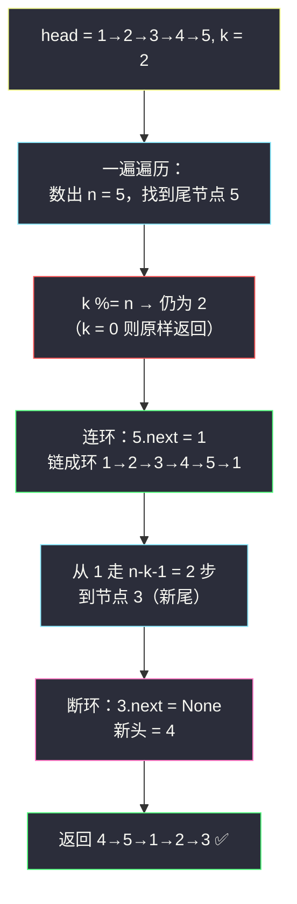

# 61. 旋转链表（Rotate List）

> 题目来源：[https://leetcode.cn/problems/rotate-list/](https://leetcode.cn/problems/rotate-list/)
>
> 灵茶题单小节定位：§链表·旋转链表

## 一、问题描述

给你一个链表的头节点 `head`，旋转链表，将链表**每个节点向右移动** `k` 个位置。

**数据范围**：

- 链表中节点的数目在范围 `[0, 500]` 内
- `-100 <= Node.val <= 100`
- `0 <= k <= 2 × 10⁹`

**示例 1**：

```text
输入：head = [1,2,3,4,5], k = 2
输出：[4,5,1,2,3]
解释：每个节点右移 2 格：尾部 [4,5] 掉转到最前面。
```

**示例 2**：

```text
输入：head = [0,1,2], k = 4
输出：[2,0,1]
解释：右移 3 格回到自身（n = 3），所以 k = 4 等价于 k = 1。
```

**核心思考点**：`k` 高达 `2 × 10⁹`，而链表长度 `n ≤ 500`——**右移 `n` 格等于没动**。所以第一步必然是 `k %= n` 把 `k` 压进 `[0, n)`。剩下的几何直觉：右移 `k` 格 ⇔ 把**倒数 `k` 个节点整体搬到头部** ⇔ 在「倒数第 `k+1` 个节点」处剪一刀再首尾相接——而「定位倒数第 `k`」正是快慢指针的主场。

## 二、暴力解法

### 思路

按定义逐格模拟：右移一格 = 把**尾节点**摘下来插到**头**。重复 `k % n` 次。

每次「摘尾插头」要走到尾部（`O(n)`），共做 `k % n` 次，总时间 `O(n × (k % n))`，最坏 `500 × 499 ≈ 2.5 × 10⁵`——本题 `n` 小能过，但思路显然不优雅，且若 `n = 10⁵` 直接超时。

### 代码

```python
class ListNode:
    def __init__(self, val=0, next=None):
        self.val = val
        self.next = next

def rotateRightBrute(head: ListNode, k: int) -> ListNode:
    # 先数长度（空链直接返回）
    n, node = 0, head
    while node:
        n += 1
        node = node.next
    if n <= 1:
        return head
    k %= n                                # 消掉整圈
    for _ in range(k):
        # 摘尾：走到倒数第二个节点
        prev = head
        while prev.next.next:
            prev = prev.next
        tail = prev.next                  # 当前的尾
        prev.next = None                  # 尾前节点成为新尾（链断开）
        tail.next = head                  # 摘下的尾插到头部
        head = tail
    return head
```

### 复杂度

- 时间：`O(n × k)`（`k` 已取模）。
- 空间：`O(1)`。
- 每转一格都要重走一遍全链——大量重复劳动，这正是要优化的信号。

## 三、优化探索

### 3.1 关键观察：一刀两断，而不是逐格搬运

右移 `k` 格后，链表在逻辑上被分成两段：

```text
原链：  1 → 2 → 3 → … → (n-k) → (n-k+1) → … → n
                 ↑剪这里          ↑这一段整体搬到前面
新链：  (n-k+1) → … → n → 1 → 2 → … → (n-k)
```

即：**新头是原倒数第 `k` 个节点，新尾是原倒数第 `k+1` 个节点**。只要找到新尾，做三次接线就完事：

1. 从新尾断开：`newTail.next = None`
2. 原尾接原头：`tail.next = head`（成环再破）
3. 新头 = 断点后第一个节点

### 3.2 定位断点：三选一

| 方法 | 步骤 | 备注 |
|---|---|---|
| 快慢指针 | 快指针先走 `k` 步，再同速走到快指针到尾 | 一次扫描，经典「倒数第 k」套路 |
| 数长度 | 走一遍数出 `n`，第二遍走到第 `n-k` 个 | 两遍但代码直白 |
| 成环法 | 先连成环，同时数出 `n`，再从任意点走 `n-k-1` 步 | 环上数步，一篇一景 |

本题反正要**先数长度**（`k` 必须先取模），所以「成环法」最顺：一遍遍历同时完成「连环 + 计数」，断点位置 = 从头走 `n - k - 1` 步。

### 3.3 成环再断：完整流程

`k %= n` 后，若 `k == 0` 直接返回原链（免得把环断错位置）。否则：



**易错点**：

- **忘取模**：`k = 2 × 10⁹` 直接按步数走必超时（且本题不取模连「走 `k` 步」都无从谈起）。
- **`k % n == 0` 没特判**：成环后 `n - k - 1 = n - 1` 步停在第 `n` 个节点（原尾），断开得 `n → 1 → … → n-1`？不——环上断开后返回 `tail.next` 恰好还是原头 `1`，看似也对；但更早返回原链可以少绕一圈，逻辑上也更干净。**严谨起见必须特判**。
- **空链/单节点**：`n ≤ 1` 时无环可连（单节点自连会成自环），先返回。

## 四、代码实现

```python
class ListNode:
    def __init__(self, val=0, next=None):
        self.val = val
        self.next = next

def rotateRight(head: ListNode, k: int) -> ListNode:
    if not head or not head.next:        # 空链 / 单节点：转一圈还是自己
        return head

    # 1) 一遍遍历：数长度 n，同时停在尾节点
    n = 1
    tail = head
    while tail.next:
        n += 1
        tail = tail.next

    # 2) 取模：右移 n 格 = 原地不动
    k %= n
    if k == 0:
        return head                      # 整圈旋转，原样返回（不进环逻辑）

    # 3) 连成环：尾接回头
    tail.next = head

    # 4) 从头走 n-k-1 步，停在新尾（原倒数第 k+1 个节点）
    newTail = head
    for _ in range(n - k - 1):
        newTail = newTail.next

    # 5) 断环：新头是新尾的后继
    newHead = newTail.next
    newTail.next = None                  # 忘了这句 = 返回一个环，判题死循环

    return newHead


# ------- 验证辅助：数组 ⇄ 链表 -------
def build_list(vals: list) -> ListNode:
    dummy = ListNode()
    cur = dummy
    for v in vals:
        cur.next = ListNode(v)
        cur = cur.next
    return dummy.next

def list_to_vals(head: ListNode) -> list:
    vals = []
    while head:
        vals.append(head.val)
        head = head.next
    return vals
```

### 细节说明

- **`k` 先取模再判断 `0`**：顺序不能反。`k = 0`、`k = n`、`k = 5n` 都应原样返回，取模后统一为 `k == 0` 一个分支。
- **数长度与找尾合并**：`while tail.next` 停在最后一个节点，循环次数恰为 `n - 1`——一遍顶两遍。
- **为什么走 `n - k - 1` 步**：新尾是第 `n - k` 个节点（1-based），从头（第 1 个）出发需要走 `n - k - 1` 步。可用示例验证：`n = 5, k = 2`，走 `2` 步到节点 `3`，断开后新头 `4` ✅。
- **必须断环**：`newTail.next = None` 漏写时链表带环，序列化会无限循环——本地验证脚本能立刻抓出来（`list_to_vals` 卡死），这也是对拍的价值之一。

## 五、例子演示

以 `head = 1 → 2 → 3 → 4 → 5`，`k = 2` 为例：

| 阶段 | 状态 | 说明 |
|---|---|---|
| 数长度 | `n = 5`，`tail = 5` | 一遍遍历结束 |
| 取模 | `k = 2 % 5 = 2` | 非零，进入旋转 |
| 连环 | `1 → 2 → 3 → 4 → 5 → (回 1)` | `tail.next = head` |
| 走步 | `n-k-1 = 2` 步：`1 → 2 → 3` | `newTail = 3` |
| 断环 | `3.next = None`，`newHead = 4` | 链拆开 |
| 返回 | `4 → 5 → 1 → 2 → 3` | ✅ 与官方示例 1 一致 |

**示例 2 全程**：`head = 0 → 1 → 2`，`k = 4`：

| 步骤 | 值 |
|---|---|
| 数长度 | `n = 3`，`tail = 2` |
| 取模 | `k = 4 % 3 = 1` |
| 连环 | `0 → 1 → 2 → 0` |
| 走步 | `n-k-1 = 1` 步：`newTail = 1` |
| 断环返回 | `2 → 0 → 1` ✅ |

```mermaid
flowchart LR
    subgraph RING["环视角：n = 5, k = 2"]
        N1((1)) --> N2((2)) --> N3((3)) --> N4((4)) --> N5((5)) --> N1
    end
    N3 -.->|"在这里剪一刀"| CUT((✂))
    CUT -.-> NEW["新链：4 → 5 → 1 → 2 → 3"]
    style N1 fill:#2b2d3a,stroke:#8be9fd,color:#f8f8f2
    style N2 fill:#2b2d3a,stroke:#8be9fd,color:#f8f8f2
    style N3 fill:#2b2d3a,stroke:#ff5555,color:#f8f8f2
    style N4 fill:#2b2d3a,stroke:#50fa7b,color:#f8f8f2
    style N5 fill:#2b2d3a,stroke:#50fa7b,color:#f8f8f2
    style CUT fill:#2b2d3a,stroke:#ff79c6,color:#f8f8f2
    style NEW fill:#2b2d3a,stroke:#50fa7b,color:#f8f8f2
    style RING fill:#1e1f29,stroke:#6272a4
```



**边界演示**：

- `head = []`：`not head` 直接返回 ✅（数据范围 `[0, 500]` 允许空链）。
- `head = [1]`，任意 `k`：单节点分支返回自身；即便走到取模也是 `k % 1 = 0` 双保险。
- `head = [1,2]`，`k = 2`：`k % 2 = 0` 原样返回 `1 → 2`（不多绕一圈）。
- `k = 0`：取模后为 `0`，原样返回。

**巨量 k 的折叠演示**（`head = 1 → 2 → 3`，`k = 2000000000`）：

| 计算步 | 结果 | 说明 |
|---|---|---|
| `n` | `3` | 先数长度 |
| `k % n` | `2000000000 % 3 = 2` | 巨量折叠成小量 |
| 等价问题 | 右移 `2` 格 | `2 × 10⁹ ≈ 6.7 亿圈，只取零头 |
| 走步 | `n-k-1 = 0` 步，`newTail = 1` | 断点就在头 |
| 返回 | `2 → 3 → 1` | 与 `k = 2` 完全一致 |

## 六、复杂度分析

设 `n` 为链表长度：

- **时间复杂度：`O(n)`**
  - 数长度（找尾）一趟 `n - 1` 步；取模 `O(1)`；走 `n - k - 1` 步——两段之和恰为 `2n - k - 2 < 2n`，线性。
  - 对比暴力 `O(n × k)`：把「逐格搬运」折叠成「一刀两断」。
- **空间复杂度：`O(1)`**
  - 只用 `tail / newTail / newHead` 三个指针。

## 七、对比总结

| 维度 | 暴力（逐格摘尾插头） | 主解（连环 + 一刀断） |
|---|---|---|
| 时间 | `O(n × (k % n))` | `O(n)` |
| 空间 | `O(1)` | `O(1)` |
| n = 10⁵、k ≈ n/2 | ~5 × 10⁹ 步，必超时 | ~2 × 10⁵ 步，轻松 |
| 代码风险点 | 摘尾走两遍的边界 | 断环漏写 / `k=0` 特判 |
| 思维层次 | 模拟 | 几何：旋转 = 换断点 |

**套路归纳**：链表「旋转 / 循环移动」题的通用公式——①**取模**把巨量 `k` 压进 `[0, n)`；②**成环**让「尾接头」一步到位；③在**倒数第 `k+1` 个**节点处断开。三个动作各司其职，遇到「左移」版本只需换成「正数第 `k` 个节点处断」即可对称解决。

## 八、举一反三

**左移变体**：若题目改成「向左移动 `k` 位」，对称地把「新尾 = 倒数第 `k+1` 个」换成「新尾 = 第 `k` 个节点（1-based，`k %= n` 后）」，其余连环、断环步骤逐字不变——左移 `k` 等价于右移 `n − k`，两种叙述可互相换算，建议读者拿 `1 → 2 → 3 → 4 → 5`，`k = 2`（左移）在纸上走一遍流程加深印象。

1. **[189. 轮转数组](https://leetcode.cn/problems/rotate-array/)**：数组版旋转，三种解法（额外数组 / 环状替换 / 三次反转）与本题连环断环思路互为镜像，体会两种存储结构下「旋转」的实现差异。
2. **[19. 删除链表的倒数第 N 个结点](https://leetcode.cn/problems/remove-nth-node-from-end-of-list/)**：与本题同用「倒数第 k」定位，快慢指针一次扫描的写法值得对照（本题因需先数 n 而选择了连环法）。
3. **[61 → 725. 分隔链表](https://leetcode.cn/problems/split-linked-list-in-parts/)**：把链表均分成 k 段，长度计算与「走 n - k 步」同源，练链表上的算术定位。
4. **[25. K 个一组翻转链表](https://leetcode.cn/problems/reverse-nodes-in-k-group/)**：与 `swap-nodes-in-pairs.md`（#24）构成链表重排三部曲，本篇的「整体搬段」与它们的「组内翻转」互补。
5. **[141. 环形链表](https://leetcode.cn/problems/linked-list-cycle/)**：本题是**主动造环再拆环**；这题是**被动判环**——快慢指针判环是连环法的「反向技能」。

**同族互引**：本篇与 `swap-nodes-in-pairs.md`（#24）同属灵神题单链表小节的重排系：#24 是「局部两两翻转」，本篇是「整体循环位移」，都靠 **dummy/成环等哨兵技巧消灭边界特判**；先刷 #24 练指针接线的顺序感，再刷本篇练「链表上的几何直觉」，衔接最顺。
