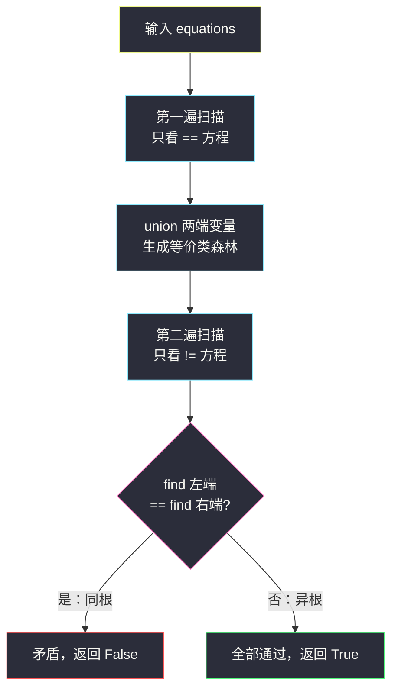
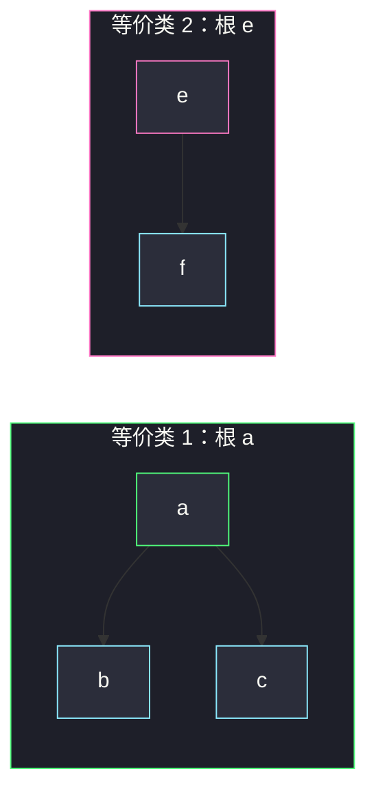

# 等式方程的可满足性（并查集入门 · 先合后查）

## 一、问题描述

给定一个字符串数组 `equations`，每个元素长度为 `4`，形如 `"a==b"` 或 `"a!=b"`，其中 `a`、`b` 是小写字母变量（最多 26 个）。

判断：能否给每个变量分配一个整数，使得**所有方程同时成立**？能则返回 `True`，否则返回 `False`。

> 🔗 LeetCode 990：https://leetcode.cn/problems/satisfiability-of-equality-equations/
>
> 数据范围：`1 <= equations.length <= 500`，`equations[i][0]` 与 `equations[i][3]` 为小写字母，`equations[i][1]` 为 `=` 或 `!`（即中间两位是 `"=="` 或 `"!="`）。

**示例 1**

```
输入：equations = ["a==b","b!=a"]
输出：false
解释：a==b 要求 a 与 b 相等，与 b!=a 直接矛盾。
```

**示例 2**

```
输入：equations = ["b==a","a==b"]
输出：true
```

**示例 3（传递性登场）**

```
输入：equations = ["a==b","b==c","c!=a"]
输出：false
解释：a==b 且 b==c 传递出 a==c，与 c!=a 矛盾。
```

**直观理解**

`==` 是一个**等价关系**：自反、对称、并且**可以传递**——`a==b`、`b==c` 会强制 `a==c`。于是所有 `==` 方程把 26 个变量切分成若干个「等价类」；而每个 `!=` 方程只是在问一个问题：**两端变量是否落在同一个等价类里**——落进同一个就矛盾，分属两个类就相安无事。

「维护等价类、支持合并与查询」的数据结构正是**并查集（Union-Find）**。本题是并查集最经典的入门判定题，也是整个并查集题单的地基：**先把所有等式合并成等价类，再逐个检查不等式是否被合并结果打脸**。

---

## 二、暴力解法

最朴素的想法是给 26 个变量各枚举一个值——`O(26^n)` 指数爆炸，直接放弃。正经的暴力是把等式当**无向边**建邻接表，对每个不等式 `u != v` 做一次 BFS 判断 `u`、`v` 是否连通：

```python
from collections import deque

class Solution:
    def equationsPossible(self, equations: List[str]) -> bool:
        adj = [[] for _ in range(26)]
        for s in equations:                      # 等式 -> 无向边
            if s[1] == '=':
                u, v = ord(s[0]) - 97, ord(s[3]) - 97
                adj[u].append(v)
                adj[v].append(u)

        def connected(u: int, v: int) -> bool:   # BFS 判连通
            if u == v:
                return True
            seen = [False] * 26
            seen[u] = True
            q = deque([u])
            while q:
                x = q.popleft()
                for y in adj[x]:
                    if y == v:
                        return True
                    if not seen[y]:
                        seen[y] = True
                        q.append(y)
            return False

        for s in equations:                      # 不等式逐个查
            if s[1] == '!' and connected(ord(s[0]) - 97, ord(s[3]) - 97):
                return False
        return True
```

### 复杂度

- **时间**：`O(n²)` 最坏——每个不等式都要全图重搜一遍（`n` 为方程数）。
- **空间**：`O(n)` 邻接表。

### 🔴 瓶颈在哪里

本题 `n <= 500`，暴力实际能过；但它暴露的问题是结构性的：**每次查询都重跑全图搜索，之前查过的信息没有复用**。当「合并」与「查询」交错到来时，我们想要一个**增量维护**等价类的结构——先合并的成果能被后面的查询直接享用。这正是并查集的用武之地，也是本题作为题单入门篇的教学定位。

---

## 三、优化探索（核心章节）

> 📚 本题在灵茶题单中属于 **§7.1 基础**（常用数据结构 B · 并查集），是整个并查集章节的第一块基石：等式合并、不等式查根，模板在此写透。

### 3.1 观察特征

| 特征 | 说明 |
|------|------|
| `==` 可传递 | `a==b`、`b==c` 强制 `a==c`，等价类会「滚雪球」 |
| `!=` 只需回答「是否同类」 | 它是**查询**，不是合并 |
| 变量只有 26 个小写字母 | 域极小，`fa` 数组直接开 26 格 |

### 3.2 并查集的三件事

把每个变量看成一个节点，用 `fa` 数组维护一片「森林」，每棵树是一个等价类：

- **find(x)**：沿父指针一路走到根，根节点就是该等价类的**代表元**；
- **union(x, y)**：把 x、y 所在的两棵树接成一棵（等价类合并）；
- **判矛盾**：`x != y` 成立的前提是 `find(x) != find(y)`——同根即矛盾。

### 3.3 关键套路：两遍扫描，先合后查

```python
# 第一遍：只处理 ==，把所有等式合并成等价类
# 第二遍：只处理 !=，检查两端是否同根
```

**为什么顺序不能乱？** 假设一边合并一边检查，遇到 `["b!=a", "a==b"]`：先碰上 `b!=a`，此刻 `a`、`b` 还没被合并，`find` 不同，判定「无矛盾」放行；随后 `a==b` 才把它们接起来——矛盾被漏掉了，错误返回 `True`（正确答案 `False`）。**先把全部等式的影响做完，再去检查不等式**，才能保证每个 `!=` 都面对完整的传递闭包。



### 3.4 模板细节：压缩 + 按大小

裸的并查集可能退化成链，两个经典优化让单次操作接近常数：

1. **路径压缩（find 内）**：找根的途中把沿途节点直接挂到根上，树越查越扁；
2. **按大小合并（union 内）**：永远把**小的树挂到大的树下**，树高被压在 `O(log)` 级别。

两者合用，单次操作的均摊代价是阿克曼反函数级别 `O(α(26))`，实际中当作常数看待。26 个节点时怎么写都能过，但模板按通用姿势写：值域变大时（比如下面 §7.3 的坐标题）只需把数组换成哈希表，骨架原封不动。

### 3.5 一句话核心

> **等式管合并，不等式管查询：第一遍扫所有 `==` 建好等价类，第二遍扫所有 `!=`，一旦发现两端同根即无解。**

---

## 四、代码实现

### Python（主解：两遍扫描）

```python
class Solution:
    def equationsPossible(self, equations: List[str]) -> bool:
        fa = list(range(26))          # fa[x] = x 的父节点，初始自成一树
        size = [1] * 26               # 仅在根处有效的集合大小

        def find(x: int) -> int:
            if fa[x] != x:
                fa[x] = find(fa[x])   # 路径压缩：一路把祖先捋平
            return fa[x]

        def union(x: int, y: int) -> None:
            rx, ry = find(x), find(y)
            if rx == ry:
                return
            if size[rx] < size[ry]:   # 小树挂到大树下
                rx, ry = ry, rx
            fa[ry] = rx
            size[rx] += size[ry]

        for s in equations:           # 第一遍：只合并等式
            if s[1] == '=':
                union(ord(s[0]) - 97, ord(s[3]) - 97)

        for s in equations:           # 第二遍：只检查不等式
            if s[1] == '!':
                if find(ord(s[0]) - 97) == find(ord(s[3]) - 97):
                    return False      # 同根 -> 矛盾
        return True
```

**反例警示（单遍混做的错误版本）**

```python
# 错误示范：边合并边检查
# equations = ["b!=a", "a==b"]
# 先遇到 b!=a：此刻 a、b 尚未合并，find 不同 -> 误判无矛盾放行
# 随后 a==b 才把它们接起来，矛盾被漏掉，错误返回 True（正确答案 False）
```

**变量含义**

| 变量 | 含义 |
|------|------|
| `fa[x]` | x 的父节点；`fa[x] == x` 时 x 是根（等价类代表元） |
| `size[r]` | 以 r 为根的集合大小（用于小挂大） |
| `ord(c) - 97` | 字母转下标：`'a' -> 0`、`'z' -> 25` |
| `s[1]` | 第二个字符，`'='` 表示等式、`'!'` 表示不等式 |

**循环不变式**：进入第二遍扫描时，`fa` 森林恰好反映**全部**等式的传递闭包——此后每个不等式面对的都是最终形态的等价类，不会出现「查早了」。

### Java（最优解，迭代版 find 防栈深）

```java
// 等式方程的可满足性
// 测试链接 : https://leetcode.cn/problems/satisfiability-of-equality-equations/
class Solution {
    private final int[] fa = new int[26];
    private final int[] size = new int[26];

    public boolean equationsPossible(String[] equations) {
        for (int i = 0; i < 26; i++) { fa[i] = i; size[i] = 1; }
        for (String s : equations)                    // 第一遍：合并等式
            if (s.charAt(1) == '=')
                union(s.charAt(0) - 'a', s.charAt(3) - 'a');
        for (String s : equations)                    // 第二遍：检查不等式
            if (s.charAt(1) == '!' &&
                find(s.charAt(0) - 'a') == find(s.charAt(3) - 'a'))
                return false;
        return true;
    }

    private int find(int x) {
        while (fa[x] != x) {
            fa[x] = fa[fa[x]];                        // 路径减半
            x = fa[x];
        }
        return x;
    }

    private void union(int x, int y) {
        int rx = find(x), ry = find(y);
        if (rx == ry) return;
        if (size[rx] < size[ry]) { int t = rx; rx = ry; ry = t; }
        fa[ry] = rx;
        size[rx] += size[ry];
    }
}
```

递归版 `find`（Python 主解）与迭代版（路径减半，Java）都是合法的压缩写法；节点域小两者皆可，大规模数据用迭代更稳。

---

## 五、具体例子演示

**演示 1**：`equations = ["a==b","b==c","e==f","c!=f","a!=e"]`，下标按 `a=0, b=1, c=2, d=3, e=4, f=5`。

第一遍扫描（只处理 `==`），父数组逐步快照：

| 步骤 | 方程 | 操作 | fa 快照 (a b c d e f) | 说明 |
|------|------|------|------------------------|------|
| 初始 | — | — | `[0,1,2,3,4,5]` | 每个字母自成一树 |
| 1 | `a==b` | union(0,1) | `[0,0,2,3,4,5]` | 两树同样大，b 挂到 a |
| 2 | `b==c` | union(1,2) | `[0,0,0,3,4,5]` | find(1)=0 所在树更大（2 个），吸收 c |
| 3 | `e==f` | union(4,5) | `[0,0,0,3,4,4]` | e、f 另立一块 |

第二遍扫描（只检查 `!=`）：

| 步骤 | 方程 | 查询 | 结果 |
|------|------|------|------|
| 4 | `c!=f` | find(2)=0 vs find(5)=4 | 异根，通过 |
| 5 | `a!=e` | find(0)=0 vs find(4)=4 | 异根，通过 |

全部通过，返回 `True`。



`c!=f` 与 `a!=e` 的两端各属一块，自然不矛盾。

**演示 2（矛盾版）**：`equations = ["a==b","b==c","c==d","a!=d"]`。

| 步骤 | 方程 | 操作 | fa 快照 (a b c d) | 说明 |
|------|------|------|--------------------|------|
| 初始 | — | — | `[0,1,2,3]` | |
| 1 | `a==b` | union(0,1) | `[0,0,2,3]` | |
| 2 | `b==c` | union(1,2) | `[0,0,0,3]` | |
| 3 | `c==d` | union(2,3) | `[0,0,0,0]` | a、b、c、d 全进一块 |
| 4 | `a!=d` | find(0)=0 vs find(3)=0 | **同根** | 矛盾 -> 返回 `False` |

第 4 步 `find(3)` 沿 `fa[3]=0` 一步到根；若链更长（如 `fa[3]=2, fa[2]=1, fa[1]=0`），路径压缩会把 3、2、1 直接挂到 0 上，下次再查就是一步。

---

## 六、复杂度分析

| 方法 | 时间 | 空间 | 说明 |
|------|------|------|------|
| 暴力 BFS 判连通 | `O(n²)` 最坏 | `O(n)` | 每个不等式全图重搜；本题 n 小能过 |
| 并查集两遍扫描（主解） | `O(n α(26))` ≈ `O(n)` | `O(26)` ≈ `O(1)` | 压缩 + 按大小合并，均摊近常数 |

---

## 七、对比总结

**家族谱系**——本题是并查集题单的第一块砖，后续题都在它之上换壳：

| 题 | 并查集扮演的角色 |
|----|------------------|
| #990 本篇 | 等式建类，不等式查根，**判定**型 |
| #947 移除最多的同行或同列石头 | 同行/同列连边，**计数**型（答案 = n - 连通块数） |
| #3873 添加一个点后可激活的最大点数 | 坐标值当节点，**最值**型（取最大两块桥接） |

**易错点**

1. **扫描顺序**：必须先合后查。一边合并一边查会在 `["b!=a","a==b"]` 上翻车。
2. **`s[1]` 取第二个字符**：判断 `==`/`!=` 看的是 `s[1]`（`=` 或 `!`），别写成 `s[1:3]` 之外的整串比较出错。
3. **union 忘判同根**：`fa[find(x)] = find(y)` 不判同根也能对（自己挂自己无害），但按大小合并版必须先判，否则 `size` 会重复累加。
4. **find 不压缩也能过本题**（26 个点），但养好习惯：值域一大，链式退化就现形。

**模板（并查集判定套路，Python）**

```python
fa = list(range(26))
size = [1] * 26

def find(x):
    if fa[x] != x:
        fa[x] = find(fa[x])       # 路径压缩
    return fa[x]

def union(x, y):
    rx, ry = find(x), find(y)
    if rx == ry:
        return
    if size[rx] < size[ry]:       # 按大小合并
        rx, ry = ry, rx
    fa[ry] = rx
    size[rx] += size[ry]

# 先合后查
for s in equations:
    if s[1] == '=':
        union(ord(s[0]) - 97, ord(s[3]) - 97)
for s in equations:
    if s[1] == '!' and find(ord(s[0]) - 97) == find(ord(s[3]) - 97):
        return False
return True
```

---

## 八、举一反三

| 题目 | 关系 |
|------|------|
| [947. 移除最多的同行或同列石头](https://leetcode.cn/problems/most-stones-removed-with-same-row-or-column/) | 同批姊妹篇 `most-stones-removed-with-same-row-or-column.md`（§7.3），从「判定」升级为「计数」 |
| [1971. 寻找图中是否存在路径](https://leetcode.cn/problems/find-if-path-exist-in-graph/) | 并查集连通判定，本题的裸图版本 |
| [547. 省份数量](https://leetcode.cn/problems/number-of-provinces/) | 只合不查，数连通块个数 |
| [721. 账户合并](https://leetcode.cn/problems/accounts-merge/) | 「字符串邮箱」当节点合并，中介思想的预热 |
| [684. 冗余连接](https://leetcode.cn/problems/redundant-connection/) | union 时发现已同根 -> 找到环上多余边 |
| [803. 打砖块](https://leetcode.cn/problems/bricks-falling-when-hit/) | 并查集逆向合并（Hard 进阶，先攒功力再来） |

**思想迁移**

- 看到「**等价关系 + 传递 + 查询是否同类**」，条件反射并查集：`==` 换成「同色」「同组」「连通」全都一样。
- 「先做完全部合并、再做全部查询」的两遍扫描，是处理**约束顺序敏感**问题的通用技巧——把信息的先后依赖抹平。
- 口诀：**「等式先合并，不等再查根；小树挂大树，查找要压缩。」**
