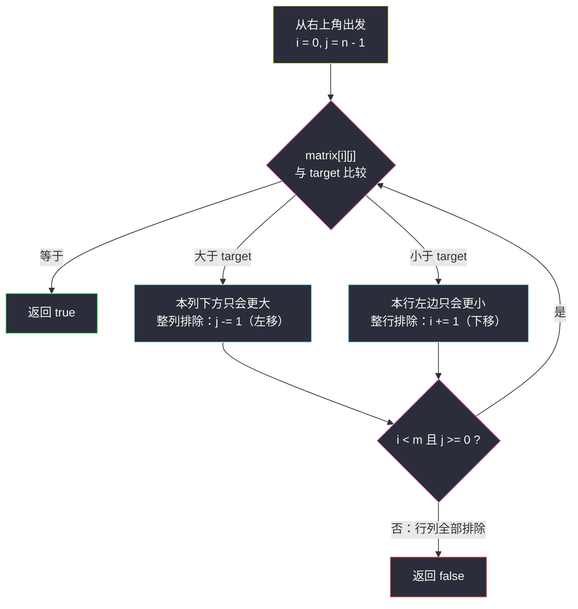

# 搜索二维矩阵 II（矩阵上的双指针 · 右上角排除法）

## 一、问题描述

编写一个高效的算法，在 `m x n` 矩阵 `matrix` 中搜索目标值 `target`。该矩阵具有两条性质：

1. **每行**的元素从左到右升序排列；
2. **每列**的元素从上到下升序排列。

存在返回 `true`，否则返回 `false`。

> 🔗 LeetCode 240：https://leetcode.cn/problems/search-a-2d-matrix-ii/
>
> 数据范围：`1 <= m, n <= 300`，`-2^31 <= matrix[i][j], target <= 2^31 - 1`。
>
> 进阶：你能设计出时间复杂度为 `O(m + n)` 的算法吗？

**示例 1**

```
输入：matrix = [[1,4,7,11,15],[2,5,8,12,19],[3,6,9,16,22],[10,13,14,17,24],[18,21,23,26,30]], target = 5
输出：true
```

**示例 2**

```
输入：matrix = [[1,4,7,11,15],[2,5,8,12,19],[3,6,9,16,22],[10,13,14,17,24],[18,21,23,26,30]], target = 20
输出：false
```

**直观理解**

矩阵「行有序、列有序」，但**行与行之间没有整体大小关系**（第 1 行的 15 比第 2 行的 2 大），所以不能像有序数组那样直接二分。突破口在于找一个「站在角落里、一次比较就能排除一整行或一整列」的特殊位置——**右上角**：它在所在行里**最大**、所在列里**最小**，是天然的岔路口。

## 二、暴力解法

### 直观思路

无视有序性，把 `m x n = 90000` 个格子全扫一遍：

```python
class Solution:
    def searchMatrix(self, matrix: List[List[int]], target: int) -> bool:
        for row in matrix:
            for x in row:
                if x == target:
                    return True
        return False
```

### 复杂度

- **时间**：`O(mn)`。
- **空间**：`O(1)`。

### 🔴 瓶颈在哪里

`m, n <= 300` 时 `mn = 9 * 10^4`，暴力当然能过——但这题完全没用上「行、列双有序」这条黄金性质，面试这么写等于白送。题目自己都在追问 `O(m + n)`，有序结构必须换成「每比较一次就废掉一行/一列」的搜索方式。

## 三、优化探索（核心章节）

> 📚 本题在灵茶题单中属于 **§3.6 矩阵上的双指针**。灵神的标准讲法：把 `(i, j)` 两维下标看成两个指针，从**右上角**出发做排除法——每一步要么 `j` 左移、要么 `i` 下移，一步排除一行或一列。

### 3.1 中间档：每行二分

行内有序 → 每行做一次二分：`O(m log n)`。比暴力强，但只用上了「行有序」这一半性质，列有序被浪费了。

### 3.2 关键观察：右上角是「岔路口」

站在右上角 `(i, j)` 时（以下均指**当前未被排除的搜索范围**内）：

- 它是**第 `i` 行的最大值**（右边没有元素了，左边全部 ≤ 它）；
- 它是**第 `j` 列的最小值**（上边都已被排除，下面全部 ≥ 它）。

拿它与 `target` 比较，结论方向**唯一**：

| 比较 | 结论 | 动作 | 一步排除 |
|------|------|------|----------|
| `matrix[i][j] == target` | 找到 | 返回 `true` | — |
| `matrix[i][j] > target` | 本列下方元素只会更大，整列都没有 | `j -= 1` | 一整列 |
| `matrix[i][j] < target` | 本行左边元素只会更小，整行都没有 | `i += 1` | 一整行 |

### 3.3 为什么不会漏（正确性论证）

- **排除的合法性**：`matrix[i][j] > target` 时，第 `j` 列中位于 `i` 及以下的所有元素都 ≥ `matrix[i][j] > target`，不可能藏着 `target`，删掉整列无损；`matrix[i][j] < target` 时，第 `i` 行中位于 `j` 及以左的所有元素都 ≤ `matrix[i][j] < target`，同理删掉整行无损。
- **覆盖的完备性**：每一步必走「左移」或「下移」之一（相等则直接返回），不存在两难局面；`i` 最多加 `m` 次、`j` 最多减 `n` 次，至多 `m + n - 1` 步内，要么命中，要么 `i` 出下界 / `j` 出左界——此时每行每列都已被显式排除，答案为 `false` 是被证明的，不是「没搜到」。

### 3.4 为什么起点必须选右上（或左下）

左上角 `(0,0)` 是全矩阵**最小**：`target` 比它大时，右边、下边都可能有答案，无法二选一；右下角同理是全矩阵最大。只有右上角（行最大、列最小）与左下角（行最小、列最大）这两个「鞍点」，比较结果才能唯一定方向。左下角出发的规则对称：比 `target` 大就上移（排除一行），比 `target` 小就右移（排除一列）。



### 3.5 与 #74「搜索二维矩阵」的视角对比

#74 的矩阵额外保证「上一行末尾 < 下一行开头」，整个矩阵可以**拉直成一个有序一维数组**，直接整体二分 `O(log(mn))`；本题行与行只是各自有序，拉直后无序，二分整体失效。右上角双指针正是为「行、列分别有序」这种更弱的结构量身定制的搜索法——**用每步 O(1) 的比较换掉一整行/列的搜索空间**。

### 3.6 一句话核心

> **从右上角出发：比 target 大就左移（排除一列），比 target 小就下移（排除一行）；m + n 步内必见分晓。**

## 四、代码实现

### Python（主解：右上角双指针）

```python
class Solution:
    def searchMatrix(self, matrix: List[List[int]], target: int) -> bool:
        m, n = len(matrix), len(matrix[0])
        i, j = 0, n - 1                       # 从右上角出发
        while i < m and j >= 0:
            v = matrix[i][j]
            if v == target:
                return True
            if v > target:                    # 本列下方更大，整列排除
                j -= 1
            else:                             # 本行左边更小，整行排除
                i += 1
        return False
```

**变量含义**

| 变量 | 含义 |
|------|------|
| `i` | 当前考察的行指针，只会下移 |
| `j` | 当前考察的列指针，只会左移 |
| `(i, j)` | 剩余搜索范围的右上角 |

**循环不变式**：每轮比较前，`target` 若存在，必位于「第 `i` 行及以下、第 `j` 列及以左」的范围内；循环外的行列都已被证明不含 `target`。

### Java（最优解同款）

```java
// 搜索二维矩阵 II：右上角出发的排除法
// 测试链接 : https://leetcode.cn/problems/search-a-2d-matrix-ii/
class Solution {
    public boolean searchMatrix(int[][] matrix, int target) {
        int m = matrix.length, n = matrix[0].length;
        int i = 0, j = n - 1;                 // 右上角
        while (i < m && j >= 0) {
            int v = matrix[i][j];
            if (v == target) {
                return true;
            }
            if (v > target) {
                j--;                          // 整列排除
            } else {
                i++;                          // 整行排除
            }
        }
        return false;
    }
}
```

## 五、具体例子演示

用示例矩阵端到端走两遍：

```
matrix:
 1   4   7  11  15
 2   5   8  12  19
 3   6   9  16  22
10  13  14  17  24
18  21  23  26  30
```

**演示 1：`target = 5`（命中路径）**

| 步 | (i, j) | matrix[i][j] | 与 5 比较 | 动作 | 本步排除 |
|----|--------|--------------|-----------|------|----------|
| 1 | (0, 4) | 15 | 15 > 5 | 左移 `j -= 1` | 第 4 列（15、19、22、24、30） |
| 2 | (0, 3) | 11 | 11 > 5 | 左移 | 第 3 列 |
| 3 | (0, 2) | 7 | 7 > 5 | 左移 | 第 2 列 |
| 4 | (0, 1) | 4 | 4 < 5 | 下移 `i += 1` | 第 0 行（只剩 1 也 < 5） |
| 5 | (1, 1) | **5** | 相等 | 返回 `true` | — |

**演示 2：`target = 20`（排除干净路径）**

| 步 | (i, j) | matrix[i][j] | 与 20 比较 | 动作 | 本步排除 |
|----|--------|--------------|-----------|------|----------|
| 1 | (0, 4) | 15 | 15 < 20 | 下移 | 第 0 行 |
| 2 | (1, 4) | 19 | 19 < 20 | 下移 | 第 1 行 |
| 3 | (2, 4) | 22 | 22 > 20 | 左移 | 第 4 列（22、24、30） |
| 4 | (2, 3) | 16 | 16 < 20 | 下移 | 第 2 行 |
| 5 | (3, 3) | 17 | 17 < 20 | 下移 | 第 3 行 |
| 6 | (4, 3) | 26 | 26 > 20 | 左移 | 第 3 列 |
| 7 | (4, 2) | 23 | 23 > 20 | 左移 | 第 2 列 |
| 8 | (4, 1) | 21 | 21 > 20 | 左移 | 第 1 列 |
| 9 | (4, 0) | 18 | 18 < 20 | 下移 | 第 4 行 |
| 10 | `i = 5` 越界 | — | — | 循环结束 | — |

此时 5 行 5 列全部被显式排除，返回 `false` ✓。注意第 3 步：右下角的 22、24、30 全部 > 20，但右上的 15、19 已在排除第 0、1 行时被带走——排除法天然处理了「同一元素只属于一个行列」的问题，不会重复也不会遗漏。

```mermaid
flowchart LR
    A["(0,4)=15 < 20<br/>下移"] --> B["(1,4)=19 < 20<br/>下移"]
    B --> C["(2,4)=22 > 20<br/>左移"]
    C --> D["(2,3)=16 < 20<br/>下移"]
    D --> E["(3,3)=17 < 20<br/>下移"]
    E --> F["(4,3)=26 > 20<br/>左移"]
    F --> G["(4,2)=23 > 20<br/>左移"]
    G --> H["(4,1)=21 > 20<br/>左移"]
    H --> I["(4,0)=18 < 20<br/>下移越界 → false"]

    style A fill:#2b2d3a,stroke:#8be9fd,color:#f8f8f2
    style B fill:#2b2d3a,stroke:#8be9fd,color:#f8f8f2
    style C fill:#2b2d3a,stroke:#f1fa8c,color:#f8f8f2
    style D fill:#2b2d3a,stroke:#8be9fd,color:#f8f8f2
    style E fill:#2b2d3a,stroke:#8be9fd,color:#f8f8f2
    style F fill:#2b2d3a,stroke:#f1fa8c,color:#f8f8f2
    style G fill:#2b2d3a,stroke:#f1fa8c,color:#f8f8f2
    style H fill:#2b2d3a,stroke:#f1fa8c,color:#f8f8f2
    style I fill:#2b2d3a,stroke:#ff5555,color:#f8f8f2
```



（青色 = 下移「小于」，黄色 = 左移「大于」，红色 = 越界收尾。）

## 六、复杂度分析

| 方法 | 时间 | 空间 | 说明 |
|------|------|------|------|
| 暴力全扫 | `O(mn)` | `O(1)` | 没用有序性 |
| 每行二分 | `O(m log n)` | `O(1)` | 只用行有序 |
| 右上角双指针（主解） | `O(m + n)` | `O(1)` | 一步排除一行或一列 |
| 对角线二分（进阶彩蛋） | 约 `O(n log n)`（方阵） | `O(1)` | 沿主对角线二分收缩，面试能讲清主解即可 |

## 七、对比总结

**易错点**

1. **起点只能是右上或左下**；从左上/右下出发，一次比较无法定方向。
2. 边界写全：`while i < m and j >= 0`（Python）/ `while (i < m && j >= 0)`（Java），漏掉 `j >= 0` 会越界访问负下标列。
3. 相等要**立即返回**，不要继续走完循环。
4. 别和 #74 混淆：#74 可拉直成一维有序数组整体二分 `O(log(mn))`；本题行间无序，右上角排除法才是正解。

**模板（矩阵右上角搜索）**

```python
i, j = 0, n - 1                       # 右上角出发（左下角出发对称）
while i < m and j >= 0:
    v = matrix[i][j]
    if v == target: return True       # 命中
    if v > target: j -= 1             # 排除一整列
    else:          i += 1             # 排除一整行
return False
```

这属于「相向型」双指针思想在二维的投影：`i` 只增、`j` 只减，两个指针合起来最多走 `m + n` 步，每步压缩掉一片搜索空间。

## 八、举一反三

| 题目 | 关系 |
|------|------|
| [74. 搜索二维矩阵](https://leetcode.cn/problems/search-a-2d-matrix/) | 结构更强（行首 > 前行尾），可拉直整体二分，与本题对比记忆 |
| [1351. 统计有序矩阵中的负数](https://leetcode.cn/problems/count-negative-numbers-in-a-sorted-matrix/) | 右上角模板直接套：找到分界线后数格子 |
| [378. 有序矩阵中第 K 小的元素](https://leetcode.cn/problems/kth-smallest-element-in-a-sorted-matrix/) | 同款矩阵结构，升级为「二分答案值域 + 计数」 |
| [4. 寻找两个正序数组的中位数](https://leetcode.cn/problems/median-of-two-sorted-arrays/) | 双有序结构上的另一经典搜索，二分与双指针结合 |

**同批姊妹篇**：§3.1 反转家族 `reverse-prefix-of-word.md`、`flipping-an-image.md`、`flip-square-submatrix-vertically.md`、`reverse-words-with-same-vowel-count.md`；双指针大家族另一范式（同向滑窗）见批 1 `count-number-of-nice-subarrays.md`、`binary-subarrays-with-sum.md`。

**思想迁移**

- 「找鞍点做岔路口」的排除法可推广到任何**两个维度各自单调**的结构：每比较一次废掉一个维度的一段。
- 口诀：**「右上起步当哨兵，大了左移杀一列，小了下移杀一行，m 加 n 步定输赢。」**
