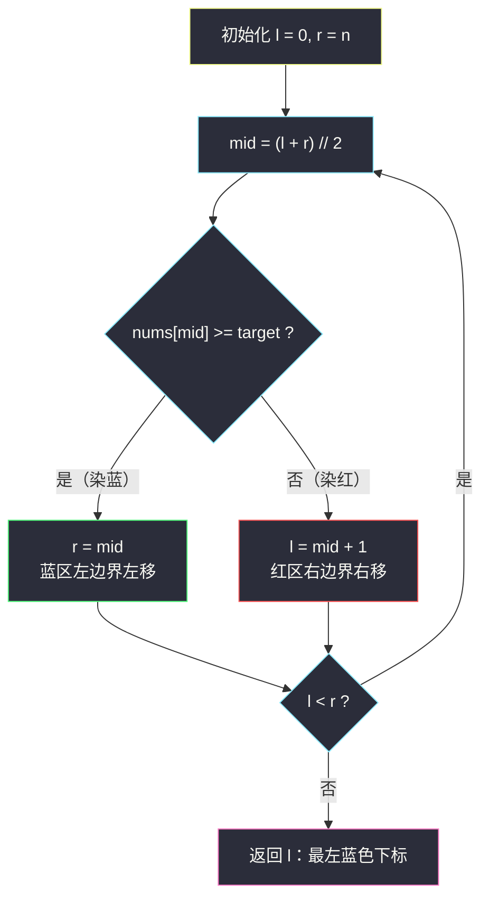

# 搜索插入位置（二分查找 · 红蓝染色入门）

## 一、问题描述

给定一个**升序排列**且元素互不相同的整数数组 `nums` 和一个目标值 `target`：

- 如果 `target` 在数组中，返回它的下标；
- 如果不在，返回它**按顺序插入数组后所在位置的下标**。

要求算法时间复杂度为 `O(log n)`。

> 🔗 LeetCode 35：https://leetcode.cn/problems/search-insert-position/
>
> 数据范围：`1 <= nums.length <= 10^4`，`-10^4 <= nums[i], target <= 10^4`，`nums` 为无重复元素的升序数组。

**示例**

```
输入：nums = [1,3,5,6], target = 5
输出：2        （5 就在下标 2 处）

输入：nums = [1,3,5,6], target = 2
输出：1        （2 插到下标 1，数组变成 [1,2,3,5,6]）

输入：nums = [1,3,5,6], target = 7
输出：4        （7 比所有元素都大，插到末尾）
```

**直观理解**

「找到就返回下标，找不到就返回插入位置」——这两句话其实是**同一件事**：

> 插入位置 = **第一个大于等于 target 的下标**。

- `target` 存在时：第一个 `>= target` 的位置恰好就是它本身（元素互异，无歧义）；
- `target` 不存在时：第一个 `>= target` 的位置正是它该插进去的坑位。

这与基础题库的 [#704 二分查找](https://leetcode.cn/problems/binary-search/)（见 `solutions/base/binary-search.md`）是同一族：#704 只回答「在不在」，本篇把「不在」升级成「插哪儿」。本篇用灵神的**红蓝染色**框架把这套模板讲透，后面 §2.1「二分答案」四连（#875 珂珂吃香蕉、#1283 最小除数、#2187 最少时间、#1011 送包裹，见同批 `koko-eating-bananas.md` 等）复用的正是同一套写法。

---

## 二、暴力解法

从头到尾线性扫描，遇到第一个 `nums[i] >= target` 的 `i` 就是答案；扫到底都没遇到，答案就是 `n`（插到末尾）。

```python
class Solution:
    def searchInsert(self, nums: List[int], target: int) -> int:
        for i, x in enumerate(nums):
            if x >= target:        # 第一个 >= target 的位置
                return i
        return len(nums)           # target 比谁都大，插到末尾
```

### 复杂度

- **时间**：`O(n)`。
- **空间**：`O(1)`。

### 🔴 瓶颈在哪里

`n = 10^4` 时线性扫当然也能过，但题目**有序**这个条件被完全浪费了，且明确要求 `O(log n)`。有序 + 随机访问 = 二分的用武之地。

---

## 三、优化探索（核心章节）

> 📚 本题在灵茶题单中属于 **§1.1 基础二分**，是整个「二分家族」的地基题。灵神讲二分的标准姿势是**红蓝染色**：不看「怎么找到 target」，而看「每个候选位置属于哪一边」。

### 3.1 把问题变成「染色的分界点」

把下标 `0..n-1` 想象成一排格子，按 `check(i) = (nums[i] >= target)` 染色：

- **红色（不可行）**：`nums[i] < target`——`target` 不可能插在这里或左边；
- **蓝色（可行）**：`nums[i] >= target`——插入位置落在这里或更左。

数组有序，所以**左边一整段红、右边一整段蓝**，中间只有一个分界点。要的答案就是**最左边那格蓝色**：


### 3.2 统一模板：求满足 check 的最小值

> **求满足 `check(x)` 的最小 `x`**（红蓝染色写法）：
> - `l = 下界`，`r = 上界 + 1`（候选区间是左闭右开 `[l, r)`）；
> - 循环内：`mid = (l + r) // 2`，若 `check(mid)` 为真则 `r = mid`，否则 `l = mid + 1`；
> - 循环条件 `l < r`，**答案就是 `l`**。

**循环不变量（模板为什么对）**：任意时刻，`l` 左边（`[0, l-1]`）全部是红色，`r` 右边（`[r, n]`）全部是蓝色，中间 `[l, r-1]` 未染色。每轮把未染色区间的中点 `mid` 染上颜色：

- `check(mid)` 真 → `mid` 及其右侧至少到 `r-1`……不，严谨地说：`mid` 是蓝色，蓝色区左边界收缩为 `mid`，即 `r = mid`；
- `check(mid)` 假 → `mid` 是红色，红色区右边界推进为 `mid + 1`，即 `l = mid + 1`。

未染色区间每轮**至少减半**，最终变成空集，`l == r` 处正是红蓝分界——也就是最小可行值。

### 3.3 本题的 l 和 r 怎么取

- 下界：插入位置最小是 `0`，所以 `l = 0`；
- 上界：插入位置最大是 `n`（插到末尾）。把**位置 `n` 视为永远可行**——相当于数组末尾外站着一个「无穷大哨兵」，`target` 再大也插在它前面——于是直接 `r = n`。

对照通用模板：候选区间 `[0, n]` 的上界 `n` 处 check 必真，把它**预染成蓝色挂在 `r` 上**，即 `r = n`（等价于对候选区间 `[0, n-1]` 套「`r = 上界 + 1`」的模板）。好处是 `mid = (l + r) // 2 < r = n` 恒成立，循环内访问 `nums[mid]` 永不越界。

### 3.4 为什么不会死循环

`r = mid` 而**不是** `r = mid - 1`，`l = mid + 1`——两个边界每次都严格向中间推进，且 `mid < r` 恒成立（`mid = (l + r) // 2 < r`），区间严格缩小，必然终止。新手常见的死循环写法是 `r = mid - 1` 配 `l = mid`，本模板从结构上杜绝了这一点。



### 3.5 一句话核心

> **插入位置 = 第一个 `nums[i] >= target` 的下标；用「求最小」红蓝模板，`l = 0, r = n`，`check(mid)` 为真收右、为假收左，答案 `l`。**

---

## 四、代码实现

### Python（主解）

```python
class Solution:
    def searchInsert(self, nums: List[int], target: int) -> int:
        l, r = 0, len(nums)              # 左闭右开 [l, r)；位置 n 视为永真候选
        while l < r:
            mid = (l + r) // 2
            if nums[mid] >= target:      # mid 染蓝：可行
                r = mid
            else:                        # mid 染红：nums[mid] < target
                l = mid + 1
        return l                         # 最左蓝色下标 = 插入位置
```

**变量含义**

| 变量 | 含义 |
|------|------|
| `l` | 红区右边界（开），永远指向「第一个可能是蓝色的候选」 |
| `r` | 蓝区左边界（开侧），`r` 及其右侧全是蓝色 |
| `mid` | 未染色区间的中点，每轮被染色 |
| 返回值 `l` | 第一个 `>= target` 的下标，不存在则为 `n` |

**其他语言注意**：`mid = (l + r) // 2` 在 Python 中不会溢出；Java / C++ 里 `l + r` 可能超过 int 上限，请写 `mid = l + (r - l) / 2`（本题数值小不会触发，但习惯要养成）。

> 「已经会了」的快速检验：能不能 30 秒内说出「本题 check 是 `nums[mid] >= target`，求的是第一个让 check 为真的下标」？能，这题就毕业了。

---

## 五、具体例子演示

**例 1：`nums = [1,3,5,6]`，`target = 2`**（答案 1）

初始 `l = 0`，`r = 4`（`n = 4`）。

| 轮次 | l | r | mid = (l+r)//2 | nums[mid] | nums[mid] >= 2 ? | 染色 | 动作 |
|------|---|---|----------------|-----------|------------------|------|------|
| 1 | 0 | 4 | 2 | 5 | ✓ 是 | 蓝 | `r = 2` |
| 2 | 0 | 2 | 1 | 3 | ✓ 是 | 蓝 | `r = 1` |
| 3 | 0 | 1 | 0 | 1 | ✗ 否 | 红 | `l = 1` |

`l == r == 1`，循环结束，返回 **1** ✓（数组变成 `[1,2,3,5,6]`，2 插在下标 1）。

**例 2：`nums = [1,3,5,6]`，`target = 7`**（答案 4）

初始 `l = 0`，`r = 4`。

| 轮次 | l | r | mid | nums[mid] | nums[mid] >= 7 ? | 动作 |
|------|---|---|-----|-----------|------------------|------|
| 1 | 0 | 4 | 2 | 5 | ✗ 否 | `l = 3` |
| 2 | 3 | 4 | 3 | 6 | ✗ 否 | `l = 4` |

`l == r == 4`，返回 **4** ✓（7 插到末尾）。注意 `mid` 始终 `< r = n`，访问 `nums[mid]` 永不越界——这就是把「位置 n」挂在 `r` 上的好处。

**例 3：`target = 5` 在数组中**：`mid = 2` 时 `nums[2] = 5 >= 5` 染蓝 `r = 2`；接着 `mid = 1`，`3 < 5` 染红 `l = 2`；`l == r == 2`，返回 **2** ✓。存在时同样走「第一个 >= target」逻辑，模板一套通吃。

---

## 六、复杂度分析

| 方法 | 时间 | 空间 | 说明 |
|------|------|------|------|
| 线性扫描 | `O(n)` | `O(1)` | 浪费有序性 |
| 红蓝二分 | `O(log n)` | `O(1)` | 未染色区间每轮至少减半 |

---

## 七、对比总结

**同一家族的三种问法**

| 题 | 问题本质 | 返回 |
|----|----------|------|
| #704 二分查找（`binary-search.md`） | target 在不在 | 下标或 −1 |
| #35 搜索插入位置（本篇） | 第一个 `>= target` 的下标 | 一定存在，`0..n` |
| #34 查找元素的第一个和最后一个位置 | 第一个 `>= target` / 第一个 `> target` | 两次红蓝二分拼出区间 |

**易错点**

1. `r` 必须初始化为 `n` 而不是 `n - 1`：插入位置可能是 `n`（`target` 比所有元素都大）。
2. 判等写 `>=` 而不是 `==`：插位置看的是「分界」，不是「恰好相等」；写 `==` 在 `target` 不存在时会漏判。
3. `r = mid`（不是 `mid - 1`）配 `l = mid + 1`，加上循环条件 `l < r`，三者是一体的，别混搭其他写法，否则容易死循环。
4. 别在循环里 `return`：让区间自然收缩到空，`l` 就是答案——这正是模板能套到「二分答案」上的原因。

---

## 八、举一反三

| 题目 | 关系 |
|------|------|
| [704. 二分查找](https://leetcode.cn/problems/binary-search/) | 最裸的二分，见 `solutions/base/binary-search.md`，与本篇互为镜像 |
| [34. 在排序数组中查找元素的第一个和最后一个位置](https://leetcode.cn/problems/find-first-and-last-position-of-element-in-sorted-array/) | 本篇的「第一个 >= x」再配一个「第一个 > x」（或对称求最大），拼出左边界和右边界 |
| [278. 第一个错误的版本](https://leetcode.cn/problems/first-bad-version/) | 红蓝结构天然存在：前全好、后全坏，求第一个坏 = 求最小，同一模板 |
| [69. x 的平方根](https://leetcode.cn/problems/sqrtx/) | 在 `1..x` 上求「k*k <= x 的最大 k」，本模板反过来求最大 |
| [875. 爱吃香蕉的珂珂](https://leetcode.cn/problems/koko-eating-bananas/) | §2.1 开篇：把「在哪插入」换成「答案是几」，同一个红蓝模板，见同批 `koko-eating-bananas.md` |

**思想迁移**

- 有序 + 求边界 → 先写出 `check(x)`，把答案转成「第一个让 check 为真的位置」。
- 模板记法：**「真收右，假收左，答案在 l」**；求最大则镜像过来：「真收左，假收右，答案在 l」（`if check(mid): l = mid else: r = mid - 1`，配 `r = 上界`、`l = 下界 - 1` 的写法）。
- 本篇是 §1.1 地基；§2.1 的「二分答案」只是把 `check` 从「比较数组元素」换成「模拟验证」，模板原封不动。
