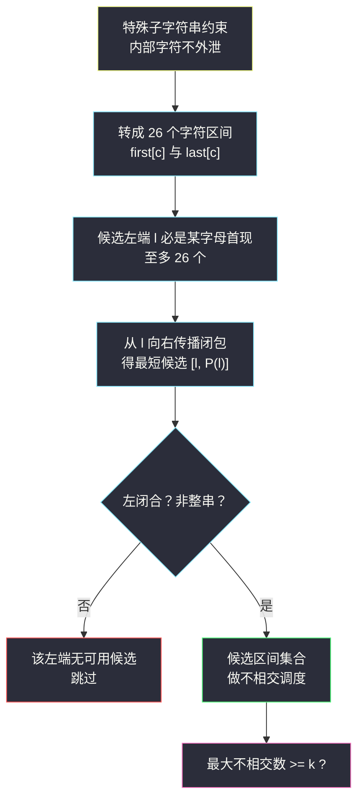
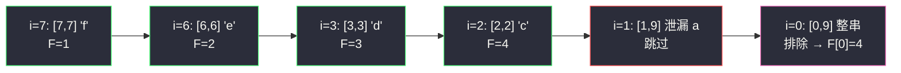

# 选择 K 个互不重叠的特殊子字符串（约束区间化 · 不相交区间调度）

## 一、问题描述

给你一个长度为 `n` 的字符串 `s` 和一个整数 `k`。

如果一个**子字符串**中出现的任何字符都**不出现在 `s` 的其余部分**，且这个子字符串**不是整个 `s`**，就称它是**特殊子字符串**。

判断：能否选出 `k` 个**互不重叠**的特殊子字符串。

> 🔗 LeetCode 3458：https://leetcode.cn/problems/select-k-disjoint-special-substrings/
>
> 数据范围：`2 <= n <= 10^5`，`1 <= k <= n`，`s` 只含小写字母。

**示例 1**

```
输入：s = "abcdbaefab", k = 2
输出：true
解释：选 "cd"（c、d 都不出现在其余部分）和 "ef"，二者互不重叠。
```

**示例 2**

```
输入：s = "cdefdc", k = 3
输出：false
解释：c 和 d 都出现两次，把 e、f 包在中间；能选出的互不重叠特殊子字符串最多 2 个（"e" 和 "f"）。
```

**直观理解**

「特殊子字符串」本质是一条**区间约束**：子串 `[l, r]` 特殊 ⟺ 它碰到的每个字符的**全部出现位置**都落在 `[l, r]` 内。把 26 个字母各自的出现范围 `[first[c], last[c]]` 求出来，问题就变成：从一串「传播出来的区间」里选出最多的互不重叠者——正是灵茶题单 §2.1「不相交区间」的调度模型。它也和 [#763 划分字母区间](https://leetcode.cn/problems/partition-labels/)共享同一套「字符区间」直觉，但多了「选子串而非划分全串」的自由度。

---

## 二、暴力解法

枚举所有 `O(n²)` 个子串，逐个判定是否特殊；再把特殊子串当作区间，做最大不相交选择：

```python
class Solution:
    def maxSubstringLength(self, s: str, k: int) -> bool:
        n = len(s)
        first, last = {}, {}
        for i, ch in enumerate(s):
            first.setdefault(ch, i)
            last[ch] = i
        subs = []
        for l in range(n):
            for r in range(l, n):
                if l == 0 and r == n - 1:
                    continue                      # 不能是整个 s
                if all(first[s[q]] >= l and last[s[q]] <= r
                       for q in range(l, r + 1)):  # 内部字符不外泄
                    subs.append((l, r))
        # 按右端点排序，经典不相交区间贪心
        subs.sort(key=lambda x: x[1])
        cnt, until = 0, -1
        for l, r in subs:
            if l > until:
                cnt += 1
                until = r
        return cnt >= k
```

### 复杂度

- **时间**：`O(n³)`（枚举子串 `O(n²)` × 每个判定 `O(n)`），`n = 10^5` 完全不可行。
- **空间**：`O(n²)` 存候选子串。

### 🔴 瓶颈在哪里

候选子串有 `O(n²)` 个，但真正「值得考虑」的极少——一个能选进最优解的子串，端点必然落在某些特殊位置上。瓶颈的突破口是：**不要枚举子串，去刻画结构**。

---

## 三、优化探索（核心章节）

> 📚 本题在灵茶题单中属于 **§2.1 不相交区间**（贪心② A 路 · 区间贪心）：把约束转成区间结构后，按右端点做不相交调度。与经典模板（如 [#435 无重叠区间](https://leetcode.cn/problems/non-overlapping-intervals/)）的差别在于：区间不是题目直接给的，而是要自己从「字符出现位置」里**推导**出来。

### 3.1 观察特征

| 特征 | 说明 |
|------|------|
| 特殊 = 区间约束 | `[l, r]` 特殊 ⟺ `∀ q ∈ [l, r]`：`first[s[q]] >= l` 且 `last[s[q]] <= r` |
| 字母表只有 26 个 | 每个字母的 `first` / `last` 一遍扫描可求，结构只有 26 个自由度 |
| 端点必是特殊位置 | 子串左端 `l` 上是 `s[l]`，特殊性要求 `first[s[l]] >= l`，而 `first[s[l]] <= l` 恒成立 → `l = first[s[l]]`，同理 `r = last[s[r]]` |
| 选子串不必覆盖全串 | 这是与 #763（划分）的关键区别，见 3.5 |

### 3.2 关键一步：从固定左端出发，只有一个候选

设左端 `l` 满足 `l = first[s[l]]`（否则从 `l` 出发不可能有特殊子串：`s[l]` 已泄漏到左边）。从 `l` 向右做**传播闭包**：

```text
r = l
for q in l..r:            # r 会随着扫描动态右扩
    r = max(r, last[s[q]])
```

得到的 `P(l)` 是「右闭合」的最小右端：`[l, P(l)]` 内任何字符都不会伸出右边界。三个断言：

1. **最短优先**：从 `l` 出发的任何特殊子串 `[l, r]` 必满足 `r >= P(l)`（闭包是最小不动点）；`r` 越大留给后面的空间越小，所以只考虑 `[l, P(l)]`。
2. **左闭合一票否决**：若 `[l, P(l)]` 内存在某字符 `first < l`（泄漏到左侧），则任何 `[l, r] ⊇ [l, P(l)]` 同样泄漏——从 `l` 出发直接无解。
3. **整串排除**：`l = 0` 且 `P(l) = n - 1` 时该候选不可用，且更长的只会还是整串，同样无解。

于是**每个位置至多贡献一个候选区间**，且候选只可能出现在「某字母的 `first` 位置」——**至多 26 个候选**。



### 3.3 不相交调度：从右往左的 DP

候选区间至多 26 个，直接做 §2.1 的调度。从右往左定义 `F[i]` = 「起点 `>= i` 的后缀里能选出的最多互不重叠特殊子串数」：

- 默认 `F[i] = F[i+1]`（`i` 不开段）；
- 若 `i = first[s[i]]` 且候选 `[i, P(i)]` 通过左闭合与非整串检查，则 `F[i] = max(F[i+1], 1 + F[P(i)+1])`。

`F` 关于下标单调不增，所以「从 `i` 出发取最短候选」的转移不漏最优解。答案 = `F[0] >= k`。

### 3.4 一个常见误区：「合并成块数块」不可行

一个看似自然的想法：把 26 个字符区间按重叠合并成块，数「非整串块」的个数。**它是错的**。反例 `s = "aba"`：块只有 `[0,2]`（a 的区间罩住 b），按该说法可用数为 0；但 `"b"`（位置 1）是真特殊子字符串——a 并**不出现在** `[1,1]` 内，它的区间横跨只发生在「数轴」上，不产生字符泄漏。示例 1 同理：`a=[0,8]` 与 `b=[1,9]` 重叠合并成整串块，但 `"cd"`、`"ef"` 都合法。**判定特殊性必须落在「出现位置」上，而不是区间几何重叠上。**

### 3.5 与 #763 划分字母区间的区别

#763 要求**划分整个串**，字符泄漏自动被「上一段的闭包」拦截；本题只选子串、留空隙，空隙两侧的字符可以互相泄漏——所以必须显式做「左闭合」检查，而不能只做右端传播。

### 3.6 一句话核心

> **首现位置才配开段，向右传播出最短候选；左闭合 + 非整串过滤后，剩下的就是一道纯不相交区间调度题。**

---

## 四、代码实现

### Python（主解：从右往左 DP）

```python
class Solution:
    def maxSubstringLength(self, s: str, k: int) -> bool:
        n = len(s)
        first, last = {}, {}
        for i, ch in enumerate(s):
            if ch not in first:
                first[ch] = i
            last[ch] = i

        # F[i]：起点 >= i 的后缀能选出的最多互不重叠特殊子串数
        F = [0] * (n + 2)
        for i in range(n - 1, -1, -1):
            F[i] = F[i + 1]                     # 默认：i 不开段
            if first[s[i]] != i:                # 只有首现位置能当左端
                continue
            r = i                               # 传播闭包求 P(i)
            q = i
            while q <= r:
                if last[s[q]] > r:
                    r = last[s[q]]
                q += 1
            mn = min(first[s[q]] for q in range(i, r + 1))
            if mn != i:                         # 左闭合失败：i 处无解
                continue
            if i == 0 and r == n - 1:           # 整个 s，不可用
                continue
            F[i] = max(F[i + 1], 1 + F[r + 1])
        return F[0] >= k
```

**变量含义**

| 变量 | 含义 |
|------|------|
| `first[c]` / `last[c]` | 字母 `c` 的首现 / 末现下标 |
| `r = P(i)` | 从 `i` 传播出的最短右闭合右端 |
| `mn` | `[i, r]` 内字符的最小 `first`，等于 `i` 才左闭合 |
| `F[i]` | 后缀 `i..n-1` 的最大可选数，单调不增 |

**循环不变式**：计算 `F[i]` 时，`F[i+1..n]` 均已就绪；任何从 `i` 出发的特殊子串右端 `r' >= P(i)`，故 `1 + F[r'+1] <= 1 + F[P(i)+1]`——只查最短候选不会漏解。

### Java（最优解同款）

```java
class Solution {
    public boolean maxSubstringLength(String s, int k) {
        char[] str = s.toCharArray();
        int n = str.length;
        int[] first = new int[26], last = new int[26];
        Arrays.fill(first, -1);
        for (int i = 0; i < n; i++) {
            int c = str[i] - 'a';
            if (first[c] < 0) first[c] = i;
            last[c] = i;
        }
        int[] F = new int[n + 2];
        for (int i = n - 1; i >= 0; i--) {
            F[i] = F[i + 1];
            int c = str[i] - 'a';
            if (first[c] != i) continue;
            int r = i;
            for (int q = i; q <= r; q++) r = Math.max(r, last[str[q] - 'a']);
            int mn = i;
            for (int q = i; q <= r; q++) mn = Math.min(mn, first[str[q] - 'a']);
            if (mn != i || (i == 0 && r == n - 1)) continue;
            F[i] = Math.max(F[i + 1], 1 + F[r + 1]);
        }
        return F[0] >= k;
    }
}
```

---

## 五、具体例子演示

以示例 1 `s = "abcdbaefab", k = 2` 走主解。先列字符区间：

| 字母 | 出现位置 | 区间 [first, last] |
|------|----------|--------------------|
| a | 0, 5, 8 | [0, 8] |
| b | 1, 4, 9 | [1, 9] |
| c | 2 | [2, 2] |
| d | 3 | [3, 3] |
| e | 6 | [6, 6] |
| f | 7 | [7, 7] |

**逐步跟踪（i 从右往左，`F[n] = F[n+1] = 0`）**

| i | s[i] | 首现? | 传播闭包 r | 左闭合 min first | 非整串? | 决策 | F[i] |
|---|------|-------|-----------|-------------------|---------|------|------|
| 9 | b | 否(first=1) | — | — | — | 跳过 | 0 |
| 8 | a | 否(0) | — | — | — | 跳过 | 0 |
| 7 | f | 是 | 7 | 7 ✓ | ✓ | 选：max(F[8], 1+F[8]) | **1** |
| 6 | e | 是 | 6 | 6 ✓ | ✓ | 选：max(F[7], 1+F[7]) | **2** |
| 5 | a | 否 | — | — | — | 跳过 | 2 |
| 4 | b | 否 | — | — | — | 跳过 | 2 |
| 3 | d | 是 | 3 | 3 ✓ | ✓ | 选：max(F[4], 1+F[4]) | **3** |
| 2 | c | 是 | 2 | 2 ✓ | ✓ | 选：max(F[3], 1+F[3]) | **4** |
| 1 | b | 是 | 9 (b→9) | min first[1..9] = 0 ✗ | — | 左闭合失败 | 4 |
| 0 | a | 是 | 9 (a→8, b→9) | 0 ✓ | ✗ 整串 | 排除 | 4 |

`F[0] = 4 >= 2` → **true** ✓（实际可选 `"c"`、`"d"`、`"e"`、`"f"` 四个）。

注意 `i=1` 这一行：`b` 的闭包一路扩到 9，但区间 `[1,9]` 里出现了 `a`，而 `a` 的首现是 0 < 1，泄漏——**从 1 出发整体无解**，这正是「左闭合」检查的价值。

**示例 2 验证**：`s = "cdefdc"`，`c=[0,5]`、`d=[1,4]`、`e=[2,2]`、`f=[3,3]`。`i=3`：`[3,3]` ✓ → F=1；`i=2`：`[2,2]` ✓ → F=2；`i=1`：`d` 闭包到 4，`[1,4]` 左闭合 ✓ 且非整串 ✓，但 `1 + F[5] = 1 < F[2] = 2`，DP 取 2；`i=0`：`c` 闭包到 5，整串排除。`F[0] = 2 < 3` → **false** ✓。



---

## 六、复杂度分析

| 方法 | 时间 | 空间 | 说明 |
|------|------|------|------|
| 暴力枚举子串 | `O(n³)` | `O(n²)` | `n = 10^5` 不可行 |
| 首现传播 + 调度 DP（主解） | `O(26n)` | `O(n)` | 首现位置 ≤ 26 个，每个闭包至多扫 `O(n)`；`F` 数组线性空间 |

时间上更紧的说法：所有传播闭包的总扫描步数不超过 `26n`，对 `n = 10^5` 也就是 `2.6 * 10^6` 次基本操作。

---

## 七、对比总结

| 题 | 候选区间来源 | 调度目标 |
|----|--------------|----------|
| #435 无重叠区间 | 题目直接给 | 保留最多不相交 |
| #763 划分字母区间 | 字符区间传播（必须划分全串） | 段数最多 |
| #3458 本篇 | 字符区间传播（只选子串） | 最多互不重叠特殊子串 |

**易错点**

1. **「合并成块数块」是伪解**：区间几何重叠 ≠ 字符泄漏（见 3.4 的 `"aba"` 反例），必须按出现位置判定。
2. **左闭合不能省**：#763 靠全串划分自动满足，本题留空隙就要显式检查 `min first == i`。
3. **整串排除要贯穿**：`l = 0` 时候选若闭包到 `n-1`，它和它的一切加长版本都不可用。
4. **只有首现位置能当左端**：`first[s[i]] < i` 时直接跳过，省掉一大类无效枚举。

**模板（约束区间化 + 不相交调度，Python）**

```python
F = [0] * (n + 2)
for i in range(n - 1, -1, -1):
    F[i] = F[i + 1]
    if not can_start(i):          # 本题: first[s[i]] == i
        continue
    r = propagate(i)              # 本题: 向右传播闭包
    if not feasible(i, r):        # 本题: 左闭合 + 非整串
        continue
    F[i] = max(F[i + 1], 1 + F[r + 1])
return F[0] >= k
```

---

## 八、举一反三

| 题目 | 关系 |
|------|------|
| [763. 划分字母区间](https://leetcode.cn/problems/partition-labels/) | 同款「字符出现区间 + 传播闭包」，但要求划分全串，是理解本题的最佳前菜 |
| [435. 无重叠区间](https://leetcode.cn/problems/non-overlapping-intervals/) | §2.1 经典模板：按右端点做不相交调度，本篇是它的「区间要自己造」版 |
| [452. 用最少数量的箭引爆气球](https://leetcode.cn/problems/minimum-number-of-arrows-to-burst-balloons/) | 同批 `minimum-number-of-arrows-to-burst-balloons.md`，§2.3 区间选点，按右端排序 |
| [2406. 将区间分为最少组数](https://leetcode.cn/problems/divide-intervals-into-minimum-number-of-groups/) | 同批 `divide-intervals-into-minimum-number-of-groups.md`，§2.2 区间分组 |
| [2580. 统计将重叠区间合并成组的方案数](https://leetcode.cn/problems/count-ways-to-group-overlapping-ranges/) | 同批 `count-ways-to-group-overlapping-ranges.md`，§2.5 区间合并计数 |
| [2564. 出现三次的最长特殊子字符串 II](https://leetcode.cn/problems/find-longest-special-substring-that-occurs-thrice-ii/) | 同目录 `find-longest-special-substring-that-occurs-thrice-ii.md`，同为「字符出现区间」结构 |

**思想迁移**

- 看到「子串 / 子数组要满足某种封闭性约束」，先把约束翻译成**每个元素的有效区间**（首末出现），让区间结构说话。
- 候选过多时找「支配关系」：固定一端后只留最短的候选（本题每个首现位置一个），把 `O(n²)` 候选压到常数个。
- 口诀：**「首现开段闭包传，左闭整串两道闸；候选排成区间表，右端调度数最大。」**
