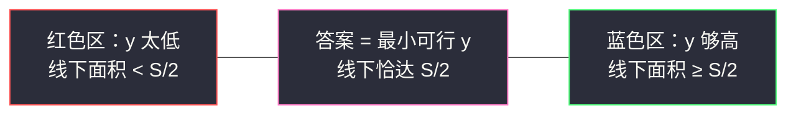
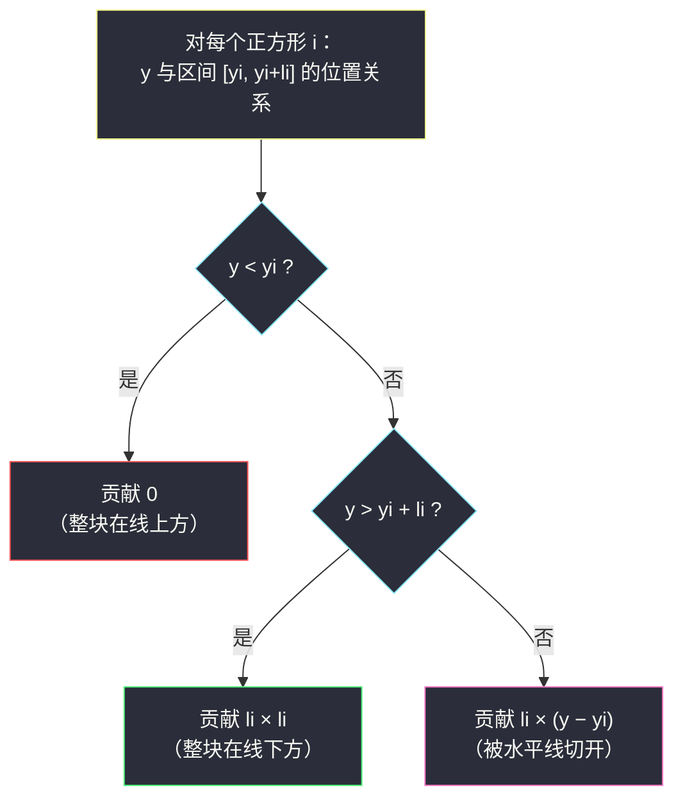
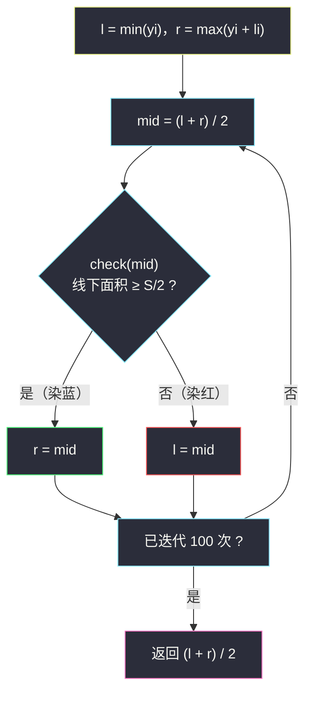

# 分割正方形 I（浮点二分 · 求最小）

## 一、问题描述

给你一个二维整数数组 `squares`，其中 `squares[i] = [xi, yi, li]` 表示一个**与 x 轴平行的正方形**：左下角坐标为 `(xi, yi)`、边长为 `li`。正方形之间**允许重叠**，重叠区域的面积**重复计数**。

请找一条水平线 `y = ?`，使得这条线**上方的总面积与下方的总面积相等**。两边都包含压线的部分。返回满足条件的**最小 y 坐标**。答案与真实值误差在 `1e-5` 以内即视为正确。

> 🔗 LeetCode 3453：https://leetcode.cn/problems/separate-squares-i/
>
> 数据范围与坐标上界见题目页面；本解法只依赖「坐标、边长为整数（可转浮点精确表示）」这一事实。

**示例**

```
输入：squares = [[0,0,1],[2,2,1]]
输出：1.00000
解释：总面积 2。y = 1 时，第一个正方形整体在线下（面积 1），第二个整体在线上（面积 1），恰好对半。

输入：squares = [[0,0,2],[1,1,1]]
输出：1.16667
解释：总面积 5。y = 7/6 时线下面积 2.5 = 总面积一半。
```

**直观理解**

答案 `y` 是**实数**而不是整数——这题与 §2.1 的整数二分不同，要在**连续区间**上二分。好在「线下面积」随 `y` 增大**单调不减**，仍然能套灵神的红蓝模板，只是收敛条件从「区间为空」变成「迭代固定次数 / 区间足够窄」。这类题统称**浮点二分**。

---

## 二、暴力解法

最朴素的想法：把 `y` 的可能范围按步长 `1e-6` 网格化，从下往上逐点计算线下面积，第一次「线下 ≥ 一半」的网格点就当答案。

```python
class Solution:
    def separateSquares(self, squares: List[List[int]]) -> float:
        total = sum(l * l for _, _, l in squares)
        lo = min(s[1] for s in squares)
        hi = max(s[1] + s[2] for s in squares)
        y = lo
        while y < hi:
            below = sum(l * min(max(y - yi, 0), l) for _, yi, l in squares)
            if 2 * below >= total:
                return y
            y += 1e-6                     # 步长必须远小于 1e-5
```

### 复杂度

- **时间**：`O(范围/步长 × n)`。坐标跨度哪怕只有 `1e5`，步长 `1e-6` 也要 `1e11` 个网格点，每个点再乘 `O(n)`——完全不可行。
- **空间**：`O(1)`。

### 🔴 瓶颈在哪里

网格扫描是「等距地试」，而可行与不可行在 `y` 轴上是一刀切的结构。把「等步长」换成「每次砍一半」，`1e11` 个候选立刻坍缩成 ~40 次判定。

---

## 三、优化探索（核心章节）

> 📚 本题在灵茶题单中属于 **§2.1 求最小**（与 #875、#1283、#3824 同小节）。它是这个小节里的**浮点二分**代表：模板与整数版同源，但收敛条件、返回值取法都换了。

### 3.1 关键观察：线下面积关于 y 单调

记总面积 `S = Σ li²`，线下面积 `g(y)` = 水平线 `y` 下方被正方形覆盖的面积（重叠重复计数）。三个事实：

1. **g(y) 单调不减**：`y` 抬高只会把更多面积划到线下；
2. **g(y) 连续**：每个正方形的贡献都是 `y` 的连续（分段线性）函数；
3. 「线上 = 线下」⇔「`g(y) >= S / 2`」（因为线上面积 = `S − g(y)`）。

于是「`g(y) >= S/2`」在 `y` 轴上**左假右真**：线太低，线下面积不足一半（红）；线够高，线下过半（蓝）。**要的答案 = 最小的蓝色 y**——标准的求最小结构。



### 3.2 check 怎么写：每个正方形的三段式贡献

单个正方形在竖直方向覆盖区间 `[yi, yi + li]`。水平线 `y` 与它只有三种位置关系：



三段合成一个式子就是**截断（clamp）**：

```
贡献 = li × clamp(y − yi, 0, li)
```

于是 `check(y) = Σ li × clamp(y − yi, 0, li) >= S / 2`，一次 `O(n)`。比较时写 `2 * below >= S` 可以避免除法带来的半个 ULP 抖动（非必须，但更稳）。

### 3.3 二分区间怎么定

- 下界 `l = min(yi)`：所有正方形都压线之上，`g = 0 < S/2`，必红（`S > 0` 因为 `li >= 1`）；
- 上界 `r = max(yi + li)`：所有正方形整体在线下，`g = S >= S/2`，必蓝。

红蓝各占一端，答案落在 `[l, r]` 内。

### 3.4 浮点二分模板（固定 100 次迭代）

```
l, r = 下界, 上界
重复 100 次：
    mid = (l + r) / 2
    if check(mid): r = mid        # mid 蓝：收缩右界
    else:          l = mid        # mid 红：收缩左界
答案 ≈ (l + r) / 2
```

与整数版的两点区别：

1. **没有 `l < r` 的终止条件**——浮点数几乎永远满足 `l < r`，必须靠「固定迭代次数」或「`while r - l > 1e-6`」来刹车；
2. **mid 染红时是 `l = mid` 而不是 `l = mid + 1`**——实数域上没有「下一个数」，`mid` 本身仍可能是答案。

**为什么 100 次够**：区间每轮严格折半，100 轮后宽度为 `(r − l) / 2^100`，早已小于 double 的机器精度；实际上约 60 轮后 `l`、`r` 就相邻到无法再分，后面几轮是白跑但不亏（总共才 100 次）。题目只要求 `1e-5` 精度，这个写法有**指数级**的精度冗余。



### 3.5 一句话核心

> **「线下面积 ≥ S/2」关于 y 左假右真 → 在 [min(yi), max(yi+li)] 上跑浮点二分，每轮用 clamp 三段式 O(n) 求面积，迭代 100 次返回区间中点。**

---

## 四、代码实现

### Python（主解）

```python
class Solution:
    def separateSquares(self, squares: List[List[int]]) -> float:
        total = 0
        lo = float('inf')
        hi = float('-inf')
        for _, yi, li in squares:
            total += li * li                 # 总面积 S
            lo = min(lo, yi)                 # 最矮的底边
            hi = max(hi, yi + li)            # 最高的顶边

        def check(y: float) -> bool:         # 线下面积 ≥ S/2 ？
            below = 0
            for _, yi, li in squares:
                below += li * min(max(y - yi, 0.0), li)   # clamp 截断
            return 2 * below >= total        # 乘 2 避免除法

        for _ in range(100):                 # 固定 100 次迭代
            mid = (lo + hi) / 2
            if check(mid):
                hi = mid                     # mid 蓝
            else:
                lo = mid                     # mid 红
        return (lo + hi) / 2
```

**变量含义**

| 变量 | 含义 |
|------|------|
| `total` | 总面积 `S = Σ li²`（重叠重复计数） |
| `lo` / `hi` | 二分区间两端：最矮底边 / 最高顶边 |
| `mid` | 当前猜测的水平线高度 |
| `min(max(y - yi, 0.0), li)` | 截断：单个正方形落在 mid 下方的高度 |
| `below` | 水平线下的总面积 |
| 返回值 | 区间中点，误差远小于 `1e-5` |

### Java（最优解同款写法）

```java
class Solution {
    public double separateSquares(int[][] squares) {
        double total = 0;
        double lo = Double.POSITIVE_INFINITY, hi = Double.NEGATIVE_INFINITY;
        for (int[] s : squares) {
            total += (double) s[2] * s[2];
            lo = Math.min(lo, s[1]);
            hi = Math.max(hi, (double) s[1] + s[2]);
        }
        double l = lo, r = hi;
        for (int i = 0; i < 100; i++) {
            double mid = (l + r) / 2;
            double below = 0;
            for (int[] s : squares) {
                double h = Math.min(Math.max(mid - s[1], 0.0), s[2]);
                below += (double) s[2] * h;
            }
            if (2 * below >= total) r = mid;
            else l = mid;
        }
        return (l + r) / 2;
    }
}
```

**Java 易错**：初始化最小值别用 `Double.MIN_VALUE`——它是「最小正数」不是负无穷，应使用 `Double.NEGATIVE_INFINITY`。

---

## 五、具体例子演示

以 `squares = [[0,0,2],[1,1,1]]` 端到端走一遍。

- 方块 A：左下 `(0,0)`、边长 2，竖直方向覆盖 `[0, 2]`；
- 方块 B：左下 `(1,1)`、边长 1，竖直方向覆盖 `[1, 2]`；
- 总面积 `S = 2² + 1² = 5`，目标「线下 ≥ 2.5」；
- 二分区间：`l = min(0, 1) = 0`，`r = max(0+2, 1+1) = 2`。

每轮 check 明细：A 贡献 `2 × clamp(mid − 0, 0, 2)`，B 贡献 `1 × clamp(mid − 1, 0, 1)`。

| 轮次 | l | r | mid | A 贡献 | B 贡献 | below | ≥ 2.5 ? | 染色 | 动作 |
|------|-----|-----|--------|--------|--------|--------|---------|------|--------|
| 1 | 0 | 2 | 1.0 | 2.0 | 0 | 2.0 | ✗ | 红 | `l = 1.0` |
| 2 | 1.0 | 2 | 1.5 | 3.0 | 0.5 | 3.5 | ✓ | 蓝 | `r = 1.5` |
| 3 | 1.0 | 1.5 | 1.25 | 2.5 | 0.25 | 2.75 | ✓ | 蓝 | `r = 1.25` |
| 4 | 1.0 | 1.25 | 1.125 | 2.25 | 0.125 | 2.375 | ✗ | 红 | `l = 1.125` |
| 5 | 1.125 | 1.25 | 1.1875 | 2.375 | 0.1875 | 2.5625 | ✓ | 蓝 | `r = 1.1875` |
| 6 | 1.125 | 1.1875 | 1.15625 | 2.3125 | 0.15625 | 2.46875 | ✗ | 红 | `l = 1.15625` |

区间已夹到 `[1.15625, 1.1875]`。继续迭代，每轮宽度再折半；100 轮后宽度为 `2 / 2^100`（比原子尺度还小无数个量级），返回 `(l + r) / 2 ≈ 1.1666666…`，即 **1.16667** ✓。

**闭式验证**（本题恰可手解，用来反验二分）：分段讨论 `g(y)`——

- `y ∈ [0, 1]`：只有 A 被切，`g = 2y`，最大 2 < 2.5，解不在这一段；
- `y ∈ [1, 2]`：`g = 2y + (y − 1) = 3y − 1`，令 `3y − 1 = 2.5` 得 `y = 7/6 ≈ 1.16667` ✓。

二分与闭式完全一致。再看示例 1 `[[0,0,1],[2,2,1]]`：`y ∈ [0,1]` 时 `g = y`，要 `g ≥ 1` 只能 `y = 1`；返回 **1.00000** ✓。

---

## 六、复杂度分析

| 方法 | 时间 | 空间 | 说明 |
|------|------|------|------|
| 网格扫描 | `O(范围/步长 × n)` | `O(1)` | 步长要压到 1e-6 级，网格点天文数字 |
| 浮点二分 | `O(100 × n)` | `O(1)` | 100 轮 × O(n) check；也可写 `while r − l > 1e-6`，轮数约 `log2(范围/1e-6)` |

把 `100` 视为常数因子，本题时间就是**线性** `O(n)`；空间除几个标量外无额外开销。

---

## 七、对比总结

**整数二分 vs 浮点二分**（灵神模板的两张面孔）：

| 维度 | 整数版（#875、#1283、#3824） | 浮点版（本篇） |
|------|------------------------------|----------------|
| 答案域 | 整数，离散 | 实数，连续 |
| 区间写法 | 左闭右开 `[l, r)`，`r = 上界 + 1` | 闭区间 `[l, r]` 即可 |
| 染红动作 | `l = mid + 1` | `l = mid`（没有「下一个数」） |
| 终止条件 | `while l < r` | 固定 100 次迭代 或 `while r − l > 1e-6` |
| 返回值 | `l` | `(l + r) / 2` |
| check | 同为 O(n) 单次验证 | 同左 |

**易错点**

1. **check 方向别写反**：求最小 y 时是「线下 ≥ S/2」为真往左收（`r = mid`）；若把 check 写成「线下 ≤ S/2」，真区在右侧，就变成求**最大**的结构，答案会漂到分界点另一侧。
2. **别用 `while l < r` 当浮点循环条件**——浮点数几乎永远严格小于，会死循环或依赖相邻 double 的巧合行为；老老实实数 100 次。
3. **比较用 `2 * below >= total`**，避免 `below >= total / 2` 的除法舍入。
4. **上界是 `max(yi + li)`**（顶边），写成 `max(yi)`（底边）时最高那块永远切不完，答案可能偏小。
5. Java 初始化下界用 `NEGATIVE_INFINITY`，不是 `MIN_VALUE`。

**模板（浮点二分，Python 版）**

```python
def smallest_ok_real(check, lo, hi):    # 真区在右，求最小真
    for _ in range(100):
        mid = (lo + hi) / 2
        if check(mid): hi = mid
        else:          lo = mid
    return (lo + hi) / 2
```

---

## 八、举一反三

| 题目 | 关系 |
|------|------|
| [3454. 分割正方形 II](https://leetcode.cn/problems/separate-squares-ii/) | 姊妹 Hard：坐标放大后浮点求和精度不够，需改整数事件 + 扫描线/线段树 |
| [1870. 准时抵达的列车最小时速](https://leetcode.cn/problems/minimum-speed-to-arrive-on-time/) | 对照题：check 里有浮点除法，但**二分对象仍是整数**，见同批 `minimum-speed-to-arrive-on-time.md` |
| [875. 爱吃香蕉的珂珂](https://leetcode.cn/problems/koko-eating-bananas/) | 整数版求最小模板的原型，见同批 `koko-eating-bananas.md` |
| [1283. 使结果不超过阈值的最小除数](https://leetcode.cn/problems/find-the-smallest-divisor-given-a-threshold/) | 同上，`Σ⌈x/d⌉ ≤ threshold`，见同批 `find-the-smallest-divisor-given-a-threshold.md` |
| [3824. 减小数组使其满足条件的最小 K 值](https://leetcode.cn/problems/minimum-k-to-reduce-array-within-limit/) | 同小节新题：不等式两边都随 k 单调，见同批 `minimum-k-to-reduce-array-within-limit.md` |
| [786. 第 K 个最小的素数分数](https://leetcode.cn/problems/kth-smallest-prime-fraction/) | 另一种「实数域二分」：二分一个值 x，计数 ≤ x 的分数个数 |

**思想迁移**

- 判断一个题该用整数还是浮点二分：**看答案的取值域**。答案本身是实数（坐标、时间、比率）→ 浮点二分 + 固定迭代；答案是整数 → 红蓝染色 + 左闭右开。
- 浮点二分的精度预算：每轮区间折半，`k` 轮后精度提升 `2^k` 倍；要求 `1e-5` 的题迭代 100 次是从不亏本的选择。
- check 里出现「分段函数」时，先画三段图再合并成 `clamp`，比 if-else 硬写更不容易漏边界。
- 口诀：**「面积随线涨，红蓝分界旁；不数循环数，一百次足够量。」**
