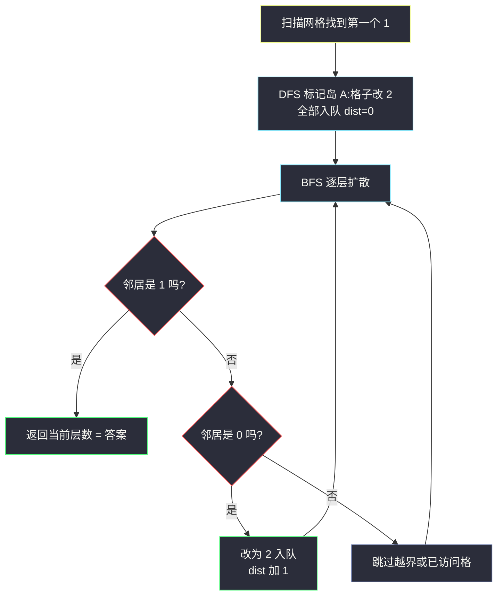

# 934. 最短的桥（Shortest Bridge）

> 题目来源：[https://leetcode.cn/problems/shortest-bridge/](https://leetcode.cn/problems/shortest-bridge/)
>
> 灵茶题单小节定位：§二、网格图 BFS（DFS 定位 + BFS 扩散的混合套路篇）

## 一、问题描述

给你一个 `n × n` 的二进制矩阵 `grid`，其中 **恰好包含两座岛**（「岛」就是由 `1` 组成的四连通分量。上下左右相邻视为连通）。

一次移动中，你可以把任意一个 `0` 变成 `1`（即「翻转一格水为陆地」）。

返回使两座岛 **连通**（存在至少一条由 `1` 组成的路径连接两岛）所需的 **最小翻转次数**。

**数据范围**：

- `n == grid.length == grid[i].length`
- `1 <= n <= 100`
- `grid[i][j]` 为 `0` 或 `1`
- `grid` 中恰好有两座岛

**示例 1**：

```text
输入：grid = [[0,1],[1,0]]
输出：1
解释：把 (0,0) 或 (1,1) 翻转为 1，两座岛即可连通。
```

**示例 2**：

```text
输入：grid = [[0,1,0],[0,0,0],[0,0,1]]
输出：2
解释：最短路径之一是 (0,1) → (1,1) → (2,1) → (2,2)，
     路径上的 (1,1) 和 (2,1) 两格水需要翻转，共 2 次。
```

**核心思考点**：两座岛之间隔着一层「水带」，我们要找的是从岛 A 出发、穿过最少的水格到达岛 B 的路径。这本质是一个 **最短路问题**——但起点不是单个格子，而是 **整座岛 A 的所有格子**，这就是「多源 BFS」的场景。

## 二、暴力解法

### 思路

最直观的暴力：**枚举配对**。

1. 先用 DFS 把两座岛的格子分别收集到列表 `islandA` 和 `islandB` 中；
2. 枚举 `islandA` 中每个格子 `a` 与 `islandB` 中每个格子 `b` 的组合；
3. 对每组 `(a, b)`，在网格上跑一次普通 BFS（把所有 `0` 视为可走、把岛 B 的格子视为终点），求 `a` 到 `b` 的最短路长度 `d`；
4. 翻转次数 = `d - 1`（路径上除终点外的水格都要翻转），取所有组合的最小值。

### 代码

```python
from collections import deque

def shortestBridgeBrute(grid: list[list[int]]) -> int:
    n = len(grid)
    # 1. DFS 收集两座岛的格子
    islands = []          # islands[k] = 第 k 座岛的格子列表
    visited = [[False] * n for _ in range(n)]
    for i in range(n):
        for j in range(n):
            if grid[i][j] == 1 and not visited[i][j]:
                cells = []
                def dfs(x: int, y: int) -> None:
                    if not (0 <= x < n and 0 <= y < n):
                        return
                    if visited[x][y] or grid[x][y] != 1:
                        return
                    visited[x][y] = True
                    cells.append((x, y))
                    for dx, dy in ((1, 0), (-1, 0), (0, 1), (0, -1)):
                        dfs(x + dx, y + dy)
                dfs(i, j)
                islands.append(cells)

    islandA, islandB = islands

    # 2. 枚举 a ∈ A, b ∈ B，跑单源 BFS
    def bfs(start: tuple[int, int], target: tuple[int, int]) -> int:
        dist = [[-1] * n for _ in range(n)]
        dist[start[0]][start[1]] = 0
        q = deque([start])
        while q:
            x, y = q.popleft()
            if (x, y) == target:
                return dist[x][y]
            for dx, dy in ((1, 0), (-1, 0), (0, 1), (0, -1)):
                nx, ny = x + dx, y + dy
                if 0 <= nx < n and 0 <= ny < n and dist[nx][ny] == -1 \
                        and (grid[nx][ny] == 0 or (nx, ny) == target):
                    dist[nx][ny] = dist[x][y] + 1
                    q.append((nx, ny))
        return -1  # 不可达（不会发生）

    best = float('inf')
    for a in islandA:
        for b in islandB:
            best = min(best, bfs(a, b) - 1)
    return best
```

### 复杂度

设两座岛大小分别为 `|A|` 和 `|B|`，网格共 `n²` 格：

- 时间：`O(|A| × |B| × n²)`。最坏两岛各占约 `n²/2` 格时高达 `O(n⁶)`，`n = 100` 时完全不可行。
- 空间：`O(n²)`。

## 三、优化探索

### 3.1 暴力慢在哪

暴力对 **每一对起点-终点组合** 都重跑一次 BFS，但所有这些 BFS 的结论高度重复——它们都在回答同一个问题：**水带最窄处有多宽？**

换个角度：与其从岛 A 的某个格子出发，不如 **从岛 A 的全部格子同时出发**。这就是 **多源 BFS**：把所有源点在距离 0 时一起入队，逐层向外扩散。

### 3.2 多源 BFS 的正确性直觉

多源 BFS 求出的是每个格子到 **最近源点** 的距离。对本题：

- 扩散从岛 A 的边缘出发，第 `k` 层到达的格子 = 「离岛 A 至少隔 `k` 步水路」的格子；
- 第一次扩散到岛 B 的格子时，当前层数 `k` 就是最短的水路长度，即翻转次数。

直觉上这正确：如果存在更短的连接方案，那条路径必然穿过某个「层数更小」的水格，BFS 会更早碰到岛 B——矛盾。

### 3.3 完整算法

1. **DFS 标记第一座岛**：扫描网格找到第一个 `1`，从它出发 DFS 把整座岛 A 的格子改为 `2`（既标记又防止后续误判），同时把这些格子 **全部加入 BFS 队列**；
2. **多源 BFS 扩散**：逐层出队，向四周的 `0` 扩散（改 `2` 防止重复入队），距离 +1；
3. **命中第二座岛**：扩散过程中如果邻居是 `1`（岛 B 的格子），当前层数就是答案，立即返回。

注意：DFS 与 BFS 各只跑一遍，总代价与格子数同阶。



## 四、代码实现

### 主解：DFS 标记 + 多源 BFS

```python
import sys
from collections import deque

def shortestBridge(grid: list[list[int]]) -> int:
    n = len(grid)

    # ---- 第一步：DFS 找到第一座岛，标记为 2 并全部入队 ----
    q = deque()
    for i in range(n):
        for j in range(n):
            if grid[i][j] == 1:
                # 用显式栈做 DFS，避免极端数据的递归深度问题
                stack = [(i, j)]
                grid[i][j] = 2
                while stack:
                    x, y = stack.pop()
                    q.append((x, y))          # 整座岛作为 BFS 源点
                    for dx, dy in ((1, 0), (-1, 0), (0, 1), (0, -1)):
                        nx, ny = x + dx, y + dy
                        if 0 <= nx < n and 0 <= ny < n and grid[nx][ny] == 1:
                            grid[nx][ny] = 2  # 入栈前标记，防止重复
                            stack.append((nx, ny))
                break                          # 第一座岛找完即止
        if q:                                  # 外层循环同步退出
            break

    # ---- 第二步：多源 BFS 向外扩散 ----
    dist = 0
    while q:
        for _ in range(len(q)):               # 按层处理
            x, y = q.popleft()
            for dx, dy in ((1, 0), (-1, 0), (0, 1), (0, -1)):
                nx, ny = x + dx, y + dy
                if not (0 <= nx < n and 0 <= ny < n):
                    continue
                if grid[nx][ny] == 1:         # 碰到第二座岛
                    return dist
                if grid[nx][ny] == 0:         # 水格：标记并入队
                    grid[nx][ny] = 2
                    q.append((nx, ny))
        dist += 1
    return -1  # 题目保证两座岛，不会走到这里
```

### 细节说明

- **DFS 改 `2` 的三重作用**：① 标记岛 A 已访问，BFS 时不会再把岛 A 的格子当「第二座岛」；② BFS 扩散中 `2` 天然充当「已入队」标记，不需要额外 `visited` 数组；③ 与岛 B 的 `1` 区分开。
- **入队时置标记**：`grid[nx][ny] = 2` 必须在 **入队的同时** 完成，而不是出队时——否则同一格会被重复入队，队列爆炸。
- **答案即层数**：BFS 第 `dist` 层的格子距岛 A 有 `dist` 步水路；第一次在邻居位置看到 `1`，说明岛 B 与「距岛 A 为 `dist` 的水格」相邻，翻转这 `dist` 格水即可连通。
- **显式栈代替递归 DFS**：`n ≤ 100` 时递归深度最多 `10⁴`，Python 默认递归上限 `1000` 会溢出，改用显式栈最稳。

## 五、例子演示

以示例 2 完整走一遍。初始网格（`S` 表示扫描时找到的第一个岛 A 格子）：

```text
0 1 0        ·  S  ·        岛 A = {(0,1)}
0 0 0   →    ·  ·  ·        岛 B = {(2,2)}
0 0 1        ·  ·  ·
```

**第一步：DFS 标记岛 A**（`(0,1)` 改 2，入队）：

```text
0 2 0        队列 q = [(0,1)]，dist = 0
0 0 0
0 0 1
```

**第二步：多源 BFS 逐层扩散**：

| 层 dist | 出队格 | 检查邻居 | 扩散动作 | 扩散后网格状态 | 队列（下一层） |
|---|---|---|---|---|---|
| 0 | (0,1) | (1,1)=0、(0,0)=0、(0,2)=0、(-1,1) 越界 | 三格改 2 入队 | `0 2 0 / 0 2 0 / 0 0 1` | [(1,1),(0,0),(0,2)] |
| 1 | (1,1) | (2,1)=0、(1,0)=0、(1,2)=0、(0,1)=2 | 三格改 2 入队 | `0 2 0 / 2 2 2 / 0 0 1` | [(0,0),(0,2),(2,1),(1,0),(1,2)] |
| 1 | (0,0) | (1,0) 已 2、(0,1) 已 2 | 无新格 | 同上 | [(0,2),(2,1),(1,0),(1,2)] |
| 1 | (0,2) | (1,2) 已 2、(0,1) 已 2 | 无新格 | 同上 | [(2,1),(1,0),(1,2)] |
| 1 | (2,1) | (2,0)=0、(2,2)=**1**、(1,1) 已 2 | **命中岛 B！返回 dist=1？** | — | — |

等一下——这里返回的是「出队格 `(2,1)` 的邻居 `(2,2)` 是 1」这件事发生在 **dist = 1 的层**。但 `(2,1)` 是在第 1 层入队的吗？回看：`(2,1)` 是在处理第 1 层的 `(1,1)` 时入队的（`dist` 此时已加到 1 之后出队）。按代码的按层计数：处理 `(1,1)` 时它属于第 1 层出队序列，把 `(2,1)` 入队；下一轮 `for _ in range(len(q))` 开始前 `dist` 加 1 变成 2，`(2,1)` 出队时检查邻居 `(2,2)` 是 `1`，**返回 `dist = 2`** ✅。

修正后的层次表：

| 层 dist | 出队格 | 扩散 / 命中情况 | 说明 |
|---|---|---|---|
| 0 | (0,1) | (1,1)、(0,0)、(0,2) 入队 | 第 1 层的水格 |
| 1 | (1,1) | (2,1)、(1,0)、(1,2) 入队 | 第 2 层的水格 |
| 1 | (0,0) | 无新格 | 邻居均已标记 |
| 1 | (0,2) | 无新格 | 邻居均已标记 |
| 2 | (2,1) | 邻居 **(2,2) 是 1** → **返回 2** | 岛 B 与第 2 层水格相邻 |

最终答案 `2`，与示例一致。翻转方案即第 0、1、2 层路径上的两格水：`(1,1)` 和 `(2,1)`（`(0,1) → (1,1) → (2,1) → (2,2)`）。

```mermaid
flowchart LR
    subgraph G["扩散过程（数字 = 所处层）"]
        A00["(0,0) L1"] --- A01["(0,1) 岛A"]
        A01 --- A02["(0,2) L1"]
        A01 --- A11["(1,1) L1"]
        A11 --- A21["(2,1) L2 命中点"]
        A21 --- A22["(2,2) 岛B"]
    end
    style G fill:#1e1f29,stroke:#6272a4
    style A00 fill:#2b2d3a,stroke:#8be9fd,color:#f8f8f2
    style A01 fill:#2b2d3a,stroke:#50fa7b,color:#f8f8f2
    style A02 fill:#2b2d3a,stroke:#8be9fd,color:#f8f8f2
    style A11 fill:#2b2d3a,stroke:#8be9fd,color:#f8f8f2
    style A21 fill:#2b2d3a,stroke:#ff79c6,color:#f8f8f2
    style A22 fill:#2b2d3a,stroke:#50fa7b,color:#f8f8f2
```



## 六、复杂度分析

设 `n × n = N` 为格子总数：

- **时间复杂度：`O(N)`**
  - DFS 标记岛 A：每格至多进出栈一次，`O(N)`；
  - 多源 BFS：每格至多入队一次，每格检查 4 个邻居，`O(4N) = O(N)`；
  - 相比暴力的 `O(|A| × |B| × N)`，是把「逐对重复搜索」压缩成「一次全体扩散」。
- **空间复杂度：`O(N)`**
  - 队列与显式栈在最坏情况下各存 `O(N)` 格；标记直接写在 `grid` 上，无额外 `visited` 数组。

## 七、对比总结

| 维度 | 暴力（逐对 BFS） | 主解（DFS + 多源 BFS） |
|---|---|---|
| 时间 | `O(|A|·|B|·N)`，最坏 `O(n⁶)` | `O(N)` |
| 空间 | `O(N)` | `O(N)` |
| 搜索次数 | 两岛大小相乘次 BFS | 一次 DFS + 一次 BFS |
| 关键洞察 | 无，纯枚举 | 「从整座岛同时出发」消除起点枚举 |
| 实现风险 | 低但写起来啰嗦 | 注意按层计数与入队即标记 |

**套路归纳**：当最短路的「起点」是一整片区域（岛、全部水域、多个入口）时，把区域内所有格子作为距离 0 的源点同时入队，逐层扩散即可——这就是多源 BFS 的标准姿势。

## 八、举一反三

1. **[1162. 地图分析](https://leetcode.cn/problems/as-far-from-land-as-possible/)**：多源 BFS 从所有陆地扩散找最远海洋，是本题同族的基础篇（见本站 `as-far-from-land-as-possible.md`）。
2. **[542. 01 矩阵](https://leetcode.cn/problems/01-matrix/)**：每个格子到最近 0 的距离，多源 BFS 模板题。
3. **[1765. 地图中的最高点](https://leetcode.cn/problems/map-of-highest-peak/)**：把「距离最近水域」直接当作高度，多源 BFS 的变体应用（见本站 `map-of-highest-peak.md`）。
4. **[1926. 迷宫中离入口最近的出口](https://leetcode.cn/problems/nearest-exit-from-entrance-in-maze/)**：单源 BFS 的按层计数写法与本题一致（见本站 `nearest-exit-from-entrance-in-maze.md`）。
5. **[1020. 飞地的数量](https://leetcode.cn/problems/number-of-enclaves/)**：DFS 标记整片连通区域的另一种用法（见本站 `number-of-enclaves.md`）。

**同族互引**：本篇的「DFS 定位 + BFS 扩散」混合结构，与 `count-sub-islands.md`（DFS 遍历整岛判定包含关系）、`map-of-highest-peak.md`（纯多源 BFS）构成网格图搜索三部曲，建议按 1162 → 1765 → 934 的顺序对照阅读。
