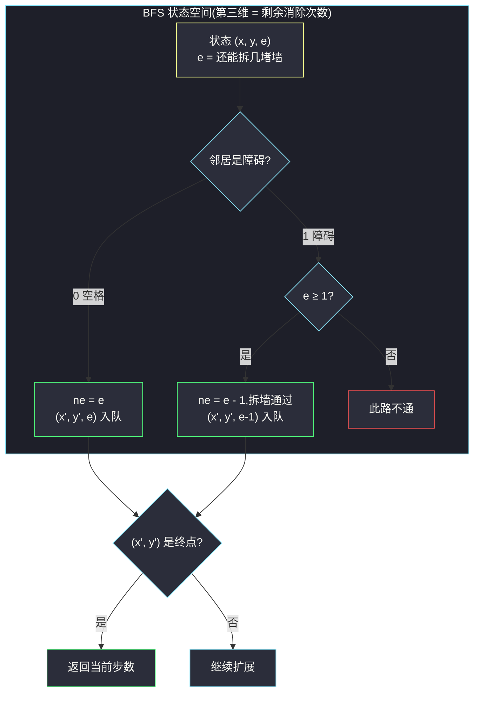

# 网格中的最短路径(分层状态 BFS · 三维 visited (位置, 剩余消除次数))

## 一、问题描述

给你一个 `m x n` 的矩阵 `grid`,每个格子是:

- `0`:空格子,可以直接走;
- `1`:障碍物,正常情况下不能走。

你可以从**左上角** `(0,0)` 移动到**右下角** `(m-1, n-1)`,每一步走到**上下左右**相邻的格子。你最多可以**消除 `k` 个障碍物**:每当你要移动到一个障碍物格子上时,必须消耗一次消除机会(把障碍拆掉再走)。

返回从 `(0,0)` 到 `(m-1, n-1)` 的**最少步数**;如果无法到达(即使消除 `k` 个障碍也不行),返回 `-1`。

> 🔗 LeetCode 1293:https://leetcode.cn/problems/shortest-path-in-a-grid-with-obstacles-elimination/
>
> 数据范围:`1 <= m, n <= 40`,`1 <= k <= m * n`,`grid[i][j]` 为 `0` 或 `1`,且起点与终点必为 `0`。

**示例 1**(官方)

```text
grid = [[0,0,0],
        [1,1,0],
        [0,0,0],
        [0,1,1],
        [0,0,0]]
k = 1
输出:6
解释:完全绕开障碍要 10 步;消除 (3,2) 处的障碍后走直线,只需 6 步:
    (0,0) → (0,1) → (0,2) → (1,2) → (2,2) → (3,2)拆墙 → (4,2)
```

**示例 2**(官方)

```text
grid = [[0,1,1],
        [1,1,1],
        [1,0,0]]
k = 1
输出:-1
解释:(0,0) 的两个邻居都是障碍,拆掉一个后仍被障碍包围,无法到达终点。
```

**直观理解**

这就是普通网格 BFS 最短路的**带预算版**:每条边除了「走一步」,还可能附带「拆一堵墙」的成本,而拆墙总预算只有 `k`。走同样远的路、花不同的预算,是**不同的处境**——这逼着我们把「处境」整个作为 BFS 的状态。

---

## 二、暴力解法

枚举「拆哪 `k` 个障碍」的所有组合,对每种组合跑一遍普通的网格 BFS,取最小步数:

```python
class Solution:
    def shortestPath(self, grid: List[List[int]], k: int) -> int:
        m, n = len(grid), len(grid[0])
        walls = [(i, j) for i in range(m) for j in range(n) if grid[i][j] == 1]

        def bfs():                          # 普通 BFS,墙被临时置 0
            q = deque([(0, 0)])
            dist = {(0, 0): 0}
            while q:
                x, y = q.popleft()
                if (x, y) == (m - 1, n - 1):
                    return dist[(x, y)]
                for nx, ny in ((x+1, y), (x-1, y), (x, y+1), (x, y-1)):
                    if 0 <= nx < m and 0 <= ny < n and grid[nx][ny] == 0 \
                            and (nx, ny) not in dist:
                        dist[(nx, ny)] = dist[(x, y)] + 1
                        q.append((nx, ny))
            return -1

        ans = bfs()                         # k 个额度都先不用
        for r in range(1, min(k, len(walls)) + 1):
            for combo in combinations(walls, r):        # 枚举拆除组合
                for i, j in combo:
                    grid[i][j] = 0
                d = bfs()
                if d != -1:
                    ans = d if ans == -1 else min(ans, d)
                for i, j in combo:
                    grid[i][j] = 1
        return ans
```

### 复杂度

- **时间**:`O(C(w, k) * mn)`,`w` 为障碍总数——组合数天文数字级,`k = 10`、`w = 40` 时已有约 `10^9` 种组合。
- **空间**:`O(mn + k)`。

### 🔴 瓶颈在哪里

「拆哪堵墙」和「怎么走」被拆成两个决策层硬枚举。事实上**拆墙与否只影响当前这一步能不能过**,完全可以把「剩余预算」并入 BFS 状态,边走边决策——这就是状态扩维 BFS。

---

## 三、优化探索(核心章节)

> 📚 本题出自灵茶题单一期 **§二、网格图 BFS**,模板要点:**分层状态 BFS**——状态 = `(位置, 剩余消除次数)`,visited 升为三维。

### 3.1 观察特征

| 特征 | 说明 |
|------|------|
| 每步代价相同(移动一格) | 无权最短路,BFS 层数即步数 |
| 消除次数是全局共享的预算 | 走过的路径决定了「还剩几次」,与位置无关的记忆不够 |
| `k <= m * n <= 1600` | 状态总数 `m * n * (k+1) <= 64000`,BFS 完全跑得动 |
| 起终点必为空格 | 无需特判起点被堵 |

### 3.2 关键一步:为什么二维 visited 不够

设想两条路都到达格子 `X`:

- 路 A:距离 3,但一路拆墙**已经用光预算**(剩余 0 次);
- 路 B:距离 4,还**攥着 1 次消除额度**(剩余 1 次)。

若 `X` 之后有一堵墙挡住唯一去路,只有路 B 的版本能拆墙继续。用二维 `visited[X]` 只会认**先到**的 A 版本,B 版本被当作「重复访问」剪掉——答案错报甚至错成 `-1`。所以 visited 必须以「位置 + 剩余额度」为键。

用一个小网格看「同格多状态」并存的真实画面(`k = 1`):

```text
grid = [[0,1,0],
        [0,1,0],
        [0,0,0]]

到 (1,2) 的两个状态:
  A:(0,0) →拆(0,1)→ (0,2) → (1,2)        步数 3,剩余额度 0
  B:(0,0) → (1,0) → (2,0) → (2,1) → (2,2) → (1,2)   步数 5,剩余额度 1
两个状态在 BFS 队列里同时存在,谁也替代不了谁。
```



### 3.3 分层 BFS 的骨架

- 状态 `(x, y, e)`:`e` 为**剩余**消除次数(存剩余而不是已用,判「还能不能拆」只需 `e ≥ grid[nx][ny]`,一步完成);
- `vis[x][y][e]` 三维布尔;
- **入队即标记**,出队时按层计数;
- 终点判断放在**入队时**:邻居是终点就直接返回 `step + 1`,省掉最后一整层的扩展。

### 3.4 剪枝一:可行性预判,k 足够大直接短路

从 `(0,0)` 到 `(m-1, n-1)` 的任意路径步数都 `≥ m + n - 2`(曼哈顿距离下界)。而任何一条**曼哈顿最短路径**只经过 `m + n - 1` 个格子,刨去必为空格的起点终点,中间至多 `m + n - 3` 个障碍。于是:

- 当 `k ≥ m + n - 2` 时,沿任一条最短路径走,遇到障碍全拆掉也绰绰有余(`k > m + n - 3`),**答案恒为 `m + n - 2`**。

这条剪枝把「大 `k` 小网格」的输入直接变成 `O(1)`,顺带救了三维数组的内存(`k` 上限是 `m*n`,不剪枝最坏开 `40 * 40 * 1600` 个布尔)。

### 3.5 剪枝二(进阶):剩余额度支配

同一格上,「剩余额度大」的状态严格强于「剩余额度小」的:能办的事是超集。因此可以用 `best[x][y]` 记录**到达 `(x,y)` 时见过的最大剩余额度**,只有新状态的 `e > best[x][y]` 才值得入队。状态数从 `m*n*(k+1)` 压向「每格一个有效值序列」,最坏同阶,实测常数更小。A* 启发式(用曼哈顿距离估计还需拆墙数)是更进一步的加速,本题规模无必要。

### 3.6 一句话核心

> **位置相同 ≠ 处境相同;把「剩余消除次数」并进状态,三维 visited 分层 BFS;k 够大时曼哈顿距离直接短路。**

---

## 四、代码实现

### Python(主解:三维 visited 分层 BFS)

```python
class Solution:
    def shortestPath(self, grid: List[List[int]], k: int) -> int:
        m, n = len(grid), len(grid[0])
        if k >= m + n - 2:                     # 剪枝:预算足够走直线
            return m + n - 2

        # vis[x][y][e]:到达 (x,y) 且剩余 e 次消除的状态是否入过队
        vis = [[[False] * (k + 1) for _ in range(n)] for _ in range(m)]
        vis[0][0][k] = True
        q = deque([(0, 0, k)])                 # (行, 列, 剩余消除次数)
        step = 0
        while q:
            step += 1
            for _ in range(len(q)):            # 一层 = 一步
                x, y, e = q.popleft()
                for nx, ny in ((x+1, y), (x-1, y), (x, y+1), (x, y-1)):
                    if 0 <= nx < m and 0 <= ny < n:
                        ne = e - grid[nx][ny]  # 遇障碍自动扣 1,空格扣 0
                        if ne < 0 or vis[nx][ny][ne]:
                            continue           # 拆不动 or 状态重复
                        if nx == m - 1 and ny == n - 1:
                            return step        # 入队时判终点
                        vis[nx][ny][ne] = True
                        q.append((nx, ny, ne))
        return -1
```

**变量含义**

| 变量 | 含义 |
|------|------|
| `(x, y, e)` | BFS 状态:位置 + **剩余**消除次数 |
| `ne = e - grid[nx][ny]` | 一行完成「空格不扣、障碍扣一」的折算 |
| `vis[x][y][e]` | 三维判重,防止同处境重复扩展 |
| `step` | 当前层数,即已走步数 |

**循环不变式**:第 `step` 层处理前,队列中恰是所有「最少 `step-1` 步可达且未结算」的状态;每个 `(x,y,e)` 至多入队一次。

**细节提醒**:`m = n = 1` 时 `k ≥ m+n-2 = 0` 恒成立,第一步剪枝直接返回 `0`,无需特判。

### Python(变体:支配剪枝,免三维数组)

```python
class Solution:
    def shortestPath(self, grid: List[List[int]], k: int) -> int:
        m, n = len(grid), len(grid[0])
        if k >= m + n - 2:
            return m + n - 2
        best = [[-1] * n for _ in range(m)]    # 到达 (x,y) 出现过的最大剩余额度
        best[0][0] = k
        q = deque([(0, 0, k)])
        step = 0
        while q:
            step += 1
            for _ in range(len(q)):
                x, y, e = q.popleft()
                for nx, ny in ((x+1, y), (x-1, y), (x, y+1), (x, y-1)):
                    if 0 <= nx < m and 0 <= ny < n:
                        ne = e - grid[nx][ny]
                        if ne < 0 or ne <= best[nx][ny]:    # 不比已见过的更强
                            continue
                        if nx == m - 1 and ny == n - 1:
                            return step
                        best[nx][ny] = ne
                        q.append((nx, ny, ne))
        return -1
```

### Java(最优解环节)

```java
class Solution {
    public int shortestPath(int[][] grid, int k) {
        int m = grid.length, n = grid[0].length;
        if (k >= m + n - 2) return m + n - 2;
        boolean[][][] vis = new boolean[m][n][k + 1];
        Deque<int[]> q = new ArrayDeque<>();
        q.offer(new int[]{0, 0, k});
        vis[0][0][k] = true;
        for (int step = 1; !q.isEmpty(); step++) {
            for (int sz = q.size(); sz > 0; sz--) {
                int[] p = q.poll();
                int[][] dirs = {{1, 0}, {-1, 0}, {0, 1}, {0, -1}};
                for (int[] d : dirs) {
                    int x = p[0] + d[0], y = p[1] + d[1];
                    if (x < 0 || x >= m || y < 0 || y >= n) continue;
                    int ne = p[2] - grid[x][y];
                    if (ne < 0 || vis[x][y][ne]) continue;
                    if (x == m - 1 && y == n - 1) return step;
                    vis[x][y][ne] = true;
                    q.offer(new int[]{x, y, ne});
                }
            }
        }
        return -1;
    }
}
```

---

## 五、具体例子演示

用官方示例 1 端到端走主解。`grid` 5 x 3、`k = 1`,`m + n - 2 = 6 > k = 1`,剪枝不触发,进入三维 BFS。起点 `(0,0,1)` 入队。

**BFS 状态表**(`e` = 剩余消除次数;「拆」= 该邻居是障碍、扣一次额度;邻居按 下/上/右/左 尝试;**同格不同 `e` 是不同状态**,这正是三维 visited 的意义):

| step | 弹出 (x,y,e) | 逐邻居结算 | 新入队 |
|------|--------------|------------|--------|
| 1 | (0,0,1) | (1,0)=1 → 拆,e=0;(0,1)=0,e=1 | **(1,0,0),(0,1,1)** |
| 2 | (1,0,0) | (2,0)=0,e=0;(0,0)=0,e=0(回起点新版本!);(1,1)=1 → 剪 | **(2,0,0),(0,0,0)** |
| 2 | (0,1,1) | (1,1)=1 → 拆,e=0;(0,2)=0,e=1 | **(1,1,0),(0,2,1)** |
| 3 | (2,0,0) | (3,0)=0,e=0;(2,1)=0,e=0 | **(3,0,0),(2,1,0)** |
| 3 | (0,0,0) | (0,1)=0,e=0(新);(1,0)=1 → 剪 | **(0,1,0)** |
| 3 | (1,1,0) | (1,2)=0,e=0;(2,1) e=0 已占;(0,1) e=1 已占;(1,0) 剪 | **(1,2,0)** |
| 3 | (0,2,1) | (1,2)=0,e=1 —— 与 (1,2,0) 同格并存! | **(1,2,1)** |
| 4 | (3,0,0) | (4,0)=0,e=0;(3,1)=1 → 剪 | **(4,0,0)** |
| 4 | (2,1,0) | (2,2)=0,e=0;(1,1)(3,1) 皆剪 | **(2,2,0)** |
| 4 | (0,1,0) | (0,2)=0,e=0(新);(1,1) 剪;(0,0) e=0 已占 | **(0,2,0)** |
| 4 | (1,2,0) | (2,2) e=0 已占;(0,2) e=0 已占;(1,1) 剪 | — |
| 4 | (1,2,1) | (2,2)=0,e=1(新);(0,2) e=1 已占 | **(2,2,1)** |
| 5 | (4,0,0) | (4,1)=0,e=0 | **(4,1,0)** |
| 5 | (2,2,0) | (1,2) e=0 已占;(3,2)=1 → 剪;(2,1) 已占 | — |
| 5 | (0,2,0) | (1,2) e=0 已占;(0,1) e=0 已占 | — |
| 5 | (2,2,1) | (3,2)=1 → **拆**,e=0(新);(1,2) e=1 已占;(2,1)=0,e=1(新) | **(3,2,0),(2,1,1)** |
| 6 | (4,1,0) | (4,2)=0 且是终点 | **返回 6** |

**关键回放**:

- **step 2 `(0,0,0)`「回声状态」**:拆过墙的版本退回起点(以 e=0 重新入队),它是合法状态但对答案无益——这类回访正是支配剪枝(变体)能砍掉的冗余,`best[x][y]` 只记见过的最大剩余额度,弱版本直接不入队;
- **step 3 `(1,2)` 同格双版本并存**:`(1,2,0)` 是「拆了 (1,1)」的破费版,`(1,2,1)` 是「从 (0,2) 直下」的富余版——三维 visited 让它们各自排队,谁也不挤掉谁;
- **step 5 `(2,2,1)` 拆掉 (3,2)**:富余版的预算花在刀刃上,生成 `(3,2,0)`——若 `(2,2)` 只剩 e=0 版本,这道墙就拆不动了(本例答案恰好走的是下方绕行,但机制如此);
- **step 6 `(4,1,0)` 向右一步**直达 `(4,2)`,入队时判中,返回当前层数 `6`。

**剪枝一的效果演示**:同一张网格改 `k = 100`,`k ≥ m + n - 2 = 6` 直接返回 `6`,一个格子都不扫——而直线 `(0,0) → (0,2) → (4,2)` 恰好 6 步,拆墙额度绰绰有余。

**最终输出**:`6` ✓,与官方一致。

---

## 六、复杂度分析

| 方法 | 时间 | 空间 | 说明 |
|------|------|------|------|
| 枚举拆除组合 + BFS | `O(C(w,k) * mn)` | `O(mn)` | 组合爆炸,不可行 |
| 三维状态 BFS(主解) | `O(mnk)` | `O(mnk)` | 每个状态至多入队一次,每次 4 条边;`m,n ≤ 40` 最坏约 `6.4 * 10^6` |
| 支配剪枝 BFS(变体) | `O(mnk)` 最坏 | `O(mn)` | 空间省一维,实测剪掉大量弱状态 |

---

## 七、对比总结

**同构链**——「状态扩维 BFS」家族,扩的那一维各不相同:

| 题 | 扩展维 | 状态形如 |
|----|--------|----------|
| #1091 二进制矩阵中的最短路径 | 无 | `(x, y)` |
| #909 蛇梯棋 | 无(编号即状态) | `编号` |
| #1293 本篇 | 剩余消除次数 | `(x, y, e)` |
| #864 获取所有钥匙的最短路径 | 已持钥匙集合 | `(x, y, 钥匙位掩码)` |

**易错点**

1. **`e` 存「剩余」而不是「已用」**:判能否拆墙时 `ne = e - grid[nx][ny]` 一行搞定;存已用则处处要跟 `k` 做减法。
2. **剪枝条件是 `k ≥ m + n - 2`**:写 `>` 会漏掉「恰好等于」的情形;写 `m + n - 3` 则需论证中间障碍上限,不如 `m + n - 2` 干净。
3. **visited 三维都要带**:只判 `(x,y)` 就是把状态压回二维,前功尽弃。
4. **入队即标记**,否则同状态反复入队,队列指数膨胀。
5. 终点判断放**入队时**可省一层;放弹出时也对,但要保证 `(m,n) = (1,1)` 时起点即终点的返回(本剪枝已覆盖)。
6. 障碍上的「拆」是**移动的一部分**,不是独立动作——不要把拆墙和移动拆成两个不同步数的操作。

**模板(带预算的网格 BFS,Python)**

```python
vis = [[[False] * (k + 1) for _ in range(n)] for _ in range(m)]
q = deque([(0, 0, k)])
vis[0][0][k] = True
while q:
    for _ in range(len(q)):
        x, y, e = q.popleft()
        for nx, ny in 四方向:
            ne = e - grid[nx][ny]        # 预算折算
            if 界内 and ne >= 0 and not vis[nx][ny][ne]:
                if (nx, ny) == 终点: return step
                vis[nx][ny][ne] = True
                q.append((nx, ny, ne))
```

---

## 八、举一反三

| 题目 | 关系 |
|------|------|
| [2290. 到达角落需要移除障碍物的最小数目](https://leetcode.cn/problems/minimum-obstacle-removal-to-reach-corner/) | 姊妹题:移除障碍**计入代价**,用 0-1 BFS / Dijkstra,两题对读最见「预算 vs 代价」之别 |
| [864. 获取所有钥匙的最短路径](https://leetcode.cn/problems/shortest-path-to-get-all-keys/) | 状态扩维的巅峰:位掩码当第三维,模板完全同构 |
| [1091. 二进制矩阵中的最短路径](https://leetcode.cn/problems/shortest-path-in-binary-matrix/) | 同目录 `shortest-path-in-binary-matrix.md`:二维 BFS 基础,先补它 |
| [407. 接雨水 II](https://leetcode.cn/problems/trapping-rain-water-ii/) | 网格最短路的 Dijkstra 版,体会「每步代价相同才配用 BFS」 |
| [1102. 得分最高的路径中的最小值](https://leetcode.cn/problems/path-with-maximum-minimum-value/) | 瓶颈路径思想,与同批 #1631 呼应 |

**思想迁移**

- **状态 = 一切影响未来的记忆**:位置影响,剩余预算也影响——凡是「同位置不同历史 ⇒ 不同前途」的量,都得进状态。判据很简单:问自己「知道我在哪,就一定知道我接下来能干什么吗?」
- **可行性预判先于搜索**:下界(曼哈顿距离)与预算(k)一比,能直接短路就别进 BFS——这类 `O(1)` 判断在面试里往往是加分点。
- **支配关系剪枝**:当状态间存在「严格更强」的偏序(剩余额度大 ≥ 剩余额度小),只留最强版本,是三维 visited 之上的常数级优化。
