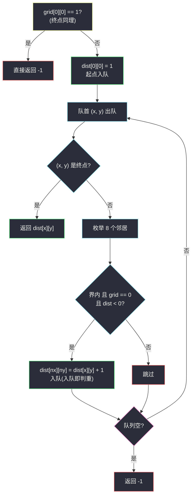

# 二进制矩阵中的最短路径(BFS 最短路 · 八方向按层扩展)

## 一、问题描述

给你一个 `n x n` 的二进制矩阵 `grid`,从**左上角** `(0,0)` 走到**右下角** `(n-1,n-1)`,只能经过值为 `0` 的格子,每一步可以走**八个方向**(水平、垂直、对角线)相邻的格子。

**最短清晰路径**的长度是路径上经过的**格子总数**(含起点和终点)。如果不存在这样的路径,返回 `-1`。

> 🔗 LeetCode 1091:https://leetcode.cn/problems/shortest-path-in-binary-matrix/
>
> 数据范围:`1 <= n <= 100`,`grid[i][j]` 为 `0` 或 `1`。

**示例 1**

```text
grid = [[0,1],
        [1,0]]
输出:2
解释:(0,0) → (1,1),走一步对角线,经过 2 个格子。
```

**示例 2**

```text
grid = [[0,0],
        [0,1]]
输出:-1
解释:终点 (1,1) 是 1(被堵),无法到达。
```

**示例 3**

```text
grid = [[1,0,0],
        [1,1,0],
        [1,1,0]]
输出:-1
解释:起点 (0,0) 是 1,直接无解。
```

**直观理解**

边权全是 1 的网格最短路——BFS 的标准主场:从起点按「层」向外扩散,第 `d` 层的格子距离起点恰为 `d`;第一次碰到哪个格子,这次的距离就是它的最短距离。与 DFS「一条路走到黑再回头」不同,BFS 像**水波纹**一样齐头并进,天然先短后长。

---

## 二、暴力解法

DFS 回溯枚举从起点到终点的**所有**路径,维护全局最小值:

```python
class Solution:
    def shortestPathBinaryMatrix(self, grid: List[List[int]]) -> int:
        if grid[0][0] or grid[-1][-1]:
            return -1
        n = len(grid)
        best = n * n + 1

        def dfs(x: int, y: int, seen: set, length: int) -> None:
            nonlocal best
            if x == n - 1 and y == n - 1:
                best = min(best, length)
                return
            for dx in (-1, 0, 1):
                for dy in (-1, 0, 1):
                    if dx == dy == 0:
                        continue
                    nx, ny = x + dx, y + dy
                    if 0 <= nx < n and 0 <= ny < n and grid[nx][ny] == 0 and (nx, ny) not in seen:
                        seen.add((nx, ny))       # 路径内判重
                        dfs(nx, ny, seen, length + 1)
                        seen.remove((nx, ny))    # 回溯,换别的路

        dfs(0, 0, {(0, 0)}, 1)
        return best if best <= n * n else -1
```

### 复杂度

- **时间**:最坏 `O(8^(n²))`——每步至多 8 个分支,简单路径数是指数级。`n = 100` 完全不可行。
- **空间**:`O(n²)` 递归栈与 `seen`。

### 🔴 瓶颈在哪里

同一格被**不同路径**反复进入,做了大量重复劳动。最短路的本质只需要每个格子**一个数**:它的最短距离。而「边权全为 1」的结构让 BFS 能以 `O(n²)` 一次性把这组数全部算对。

---

## 三、优化探索(核心章节)

> 📚 本题出自灵茶题单一期 **§二、网格图 BFS**(网格图 BFS 篇),是 BFS 最短路的入门模板题:队列 + `dist` 标记判重 + 入队时打距离,与灵神「网格图 BFS」小节的讲解对齐。

### 3.1 观察特征

| 特征 | 说明 |
|------|------|
| 每步代价相同(走一格算一步) | 无权图最短路 → BFS 而非 Dijkstra |
| 只要「起点到终点」的距离 | 单源 BFS 一次即可 |
| 八方向 | 方向数组要含 4 个对角线 |
| 答案口径是**格子数** | `dist[起点] = 1`(不是 0),终点距离直接就是答案 |

### 3.2 关键一步:dist 数组 = 距离 + 判重二合一

`dist[i][j]` 初始为 `-1`:**既表示未访问,又存最短距离**。起点 `dist[0][0] = 1` 入队;此后每弹出一个格子,把它的 8 个「界内、为 0、`dist < 0`」的邻居设为 `dist[当前] + 1` 并入队。



### 3.3 为什么「第一次到达」就是最短?

BFS 队列里的距离**单调不减**:入队顺序保证 `dist` 为 `d` 的格子全部排在 `dist` 为 `d+1` 的格子前面(先整层后下一层)。归纳可知,某格第一次被赋值时,赋的值就是能达到它的最小层数——之后再遇到它都因 `dist >= 0` 被跳过。这就是「按层扩展,首达即最短」。

### 3.4 细节清单

1. **起点/终点被堵**:`grid[0][0] == 1` 或 `grid[n-1][n-1] == 1` 直接 `-1`。
2. **`n == 1` 且通**:答案 1(起点即终点)。
3. **判重时机**:入队时就标 `dist`,不是出队时——后者会把同一格重复塞进队列,浪费且易错。
4. 八方向用 `dx, dy ∈ {-1,0,1}` 双循环跳过 `(0,0)`,或写显式 8 元组。

### 3.5 一句话核心

> **边权全 1 用 BFS:dist 兼做判重,入队即标层;队列出队时撞见终点,当前 dist 就是最短路。**

---

## 四、代码实现

### Python(主解)

```python
class Solution:
    def shortestPathBinaryMatrix(self, grid: List[List[int]]) -> int:
        if grid[0][0] or grid[-1][-1]:           # 起点或终点被堵
            return -1
        n = len(grid)
        dist = [[-1] * n for _ in range(n)]
        dist[0][0] = 1                           # 答案口径:格子数,起点算 1
        q = deque([(0, 0)])
        while q:
            x, y = q.popleft()
            if x == n - 1 and y == n - 1:        # 出队时判终点(n=1 也自然成立)
                return dist[x][y]
            for dx in range(-1, 2):
                for dy in range(-1, 2):
                    if dx == dy == 0:
                        continue
                    nx, ny = x + dx, y + dy
                    if 0 <= nx < n and 0 <= ny < n and grid[nx][ny] == 0 and dist[nx][ny] < 0:
                        dist[nx][ny] = dist[x][y] + 1
                        q.append((nx, ny))       # 入队即判重
        return -1
```

**变体(先灌满再收尾)**:不在出队时判终点,BFS 跑完直接 `return dist[n-1][n-1]`(`-1` 表示未达)。更短,但找到终点后不会提前收工;理解了模板后两种随意。

**变量含义**

| 变量 | 含义 |
|------|------|
| `dist[i][j]` | 起点到该格的最短格子数;`-1` = 未访问 |
| `q` | 待扩展的格子队列,FIFO 保证按层 |
| `(dx, dy)` 双循环 | 8 方向 |

**循环不变式**:队列中 `dist` 值单调不减且任意两种取值至多相差 1;每个格子至多入队一次。

### Java(最优解环节)

```java
class Solution {
    public int shortestPathBinaryMatrix(int[][] grid) {
        if (grid[0][0] == 1) return -1;
        int n = grid.length;
        int[][] dist = new int[n][n];
        for (int[] row : dist) Arrays.fill(row, -1);
        dist[0][0] = 1;
        Queue<int[]> q = new ArrayDeque<>();
        q.add(new int[]{0, 0});
        int[][] dirs = {{1,0},{-1,0},{0,1},{0,-1},{1,1},{1,-1},{-1,1},{-1,-1}};
        while (!q.isEmpty()) {
            int[] p = q.poll();
            for (int[] d : dirs) {
                int nx = p[0] + d[0], ny = p[1] + d[1];
                if (0 <= nx && nx < n && 0 <= ny && ny < n
                        && grid[nx][ny] == 0 && dist[nx][ny] < 0) {
                    dist[nx][ny] = dist[p[0]][p[1]] + 1;
                    q.add(new int[]{nx, ny});
                }
            }
        }
        return dist[n - 1][n - 1];
    }
}
```

---

## 五、具体例子演示

用一个 4 x 4 的例子端到端走一遍(`0` 可走,`1` 是墙):

```text
grid:
0 0 1 0
1 0 0 0
1 1 1 0
0 0 0 0
起点 (0,0),终点 (3,3)
```

**按层扩展表**(`dist` 快照中 `.` 表示未访问;墙永远保持 `.`):

| 层号(=dist-1) | 出队的格子 | 本层新入队 | dist 矩阵快照 |
|---|---|---|---|
| 0(dist=1) | (0,0) | (0,1) (1,1) | `1 2 . . / . 2 . . / . . . . / . . . .` |
| 1(dist=2) | (0,1) (1,1) | (1,2) | `1 2 . . / . 2 3 . / . . . . / . . . .` |
| 2(dist=3) | (1,2) | (0,3) (1,3) (2,3) | `1 2 . 4 / . 2 3 4 / . . . 4 / . . . .` |
| 3(dist=4) | (0,3) (1,3) (2,3) | (3,2) **(3,3)** | `1 2 . 4 / . 2 3 4 / . . . 4 / . . 5 5` |
| 4(dist=5) | (3,2) (3,3) | — | 出队 (3,3) 即终点,**返回 5** |

逐层展开说明:

- **层 0**:从 (0,0) 看 8 邻:(0,1)=0 ✓、(1,0)=1 ✗、(1,1)=0 ✓,其余越界。
- **层 1**:(0,1) 的邻居里 (0,2)=1、(1,2)=0 ✓;(1,1) 的邻居全是墙或已访问。
- **层 2**:(1,2) 一次带来 (0,3)、(1,3)、(2,3) 三个 dist=4 的格子。
- **层 3**:(2,3) 向左下、向下扩展出 (3,2) 与 (3,3),dist=5。

**最短路径还原**(从终点沿 dist 递减回退一条即可):

```text
(0,0) dist=1 → (1,1) dist=2 → (1,2) dist=3 → (2,3) dist=4 → (3,3) dist=5
对角线 x2 + 直走 x2,共 5 格,长度 5 ✓
```

理论下界是 4(三点对角直穿),但必经的 (2,2) 是墙,退而求其次得 5——体现 BFS「层」与真实绕行的对应。


---

## 六、复杂度分析

| 方法 | 时间 | 空间 | 说明 |
|------|------|------|------|
| DFS 回溯枚举 | 指数级(约 `8^(n²)` 上界) | `O(n²)` | 同格重复进入,不可行 |
| BFS 按层扩展(主解) | `O(n²)` | `O(n²)` | 每格至多入队一次,每格查 8 个邻居 |

---

## 七、对比总结

**同一片网格,三种姿势**:

| 方法 | 适用 | 本题评价 |
|------|------|----------|
| DFS 回溯 | 要枚举**所有**路径/方案 | 指数爆炸 |
| Dijkstra | 边权**非负且不全相等** | 权全 1 时退化成 BFS,杀鸡用牛刀 |
| BFS | 边权全 1 的最短路 | 正解,`O(n²)` |

**易错点**

1. **答案口径**是格子数:起点 `dist = 1`;若按「步数」初始化 0,最后要 +1。
2. **起点/终点被堵**忘记判,会在被堵的起点上白跑。
3. **判重写在出队时** → 同格重复入队;必须**入队即标记**。
4. 八方向漏对角线(写成 4 方向)或重复写 `(0,0)`。
5. Python 用 `deque.popleft()`;`list.pop(0)` 是 `O(n)`,大网格会超时。

**模板(网格 BFS 最短路,Python)**

```python
dist = [[-1] * n for _ in range(n)]
dist[sx][sy] = 1                    # 口径:格子数
q = deque([(sx, sy)])
while q:
    x, y = q.popleft()
    for dx, dy in 八方向:
        nx, ny = x + dx, y + dy
        if 0 <= nx < n and 0 <= ny < n and grid[nx][ny] == 0 and dist[nx][ny] < 0:
            dist[nx][ny] = dist[x][y] + 1
            q.append((nx, ny))
return dist[tx][ty]                 # -1 即无解
```

---

## 八、举一反三

| 题目 | 关系 |
|------|------|
| [1926. 迷宫中离入口最近的出口](https://leetcode.cn/problems/nearest-exit-from-entrance-in-maze/) | 同批姊妹题 `nearest-exit-from-entrance-in-maze.md`:4 方向 + 出口判定 |
| [1162. 地图分析](https://leetcode.cn/problems/as-far-from-land-as-possible/) | 同批姊妹题 `as-far-from-land-as-possible.md`:多源 BFS 求最远 |
| [542. 01 矩阵](https://leetcode.cn/problems/01-matrix/) | 多源 BFS 的标准练习:每个 0 到最近 1 的距离 |
| [994. 腐烂的橘子](https://leetcode.cn/problems/rotting-oranges/) | 多源 BFS 按层计「分钟」,模板完全同构 |
| [752. 打开转盘锁](https://leetcode.cn/problems/open-the-lock/) | BFS 从网格搬到**状态图**:节点是字符串状态 |
| [1293. 网格中的最短路径](https://leetcode.cn/problems/shortest-path-in-a-grid-with-obstacles-elimination/) | 状态加一维(还可消除几面墙),BFS 三维判重 |

**思想迁移**

- 看到「**最少步数/最短路径 + 每步代价相同**」,无条件上 BFS;路径还原用 `dist` 从终点一路递减回溯。
- 「首达即最短」的根基是队列的**单调性**——所有按层扩展的 BFS(含下一题的多源版)都靠它成立。
- 口诀:**「边权为一用 BFS,入队打标记距离;层层外扩首达短,八向别漏对角线。」**
