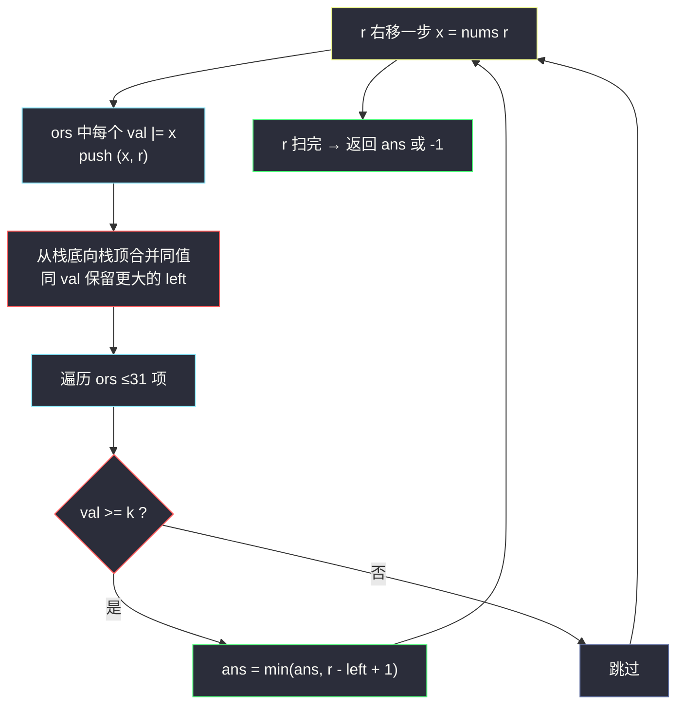

# 3097. 或和至少为 K 的最短子数组 II（Shortest Subarray With OR at Least K II）

> 题目来源：[https://leetcode.cn/problems/shortest-subarray-with-or-at-least-k-ii/](https://leetcode.cn/problems/shortest-subarray-with-or-at-least-k-ii/)
>
> 灵茶题单小节定位：§三、AND/OR LogTrick（OR 的单调性 + 按位分组栈）

## 一、问题描述

给你一个 **非负整数** 数组 `nums` 和一个整数 `k`。

找出 `nums` 中 **最短** 的 **非空** 子数组，其按位或运算 `OR` 的值 **至少** 为 `k`，返回最短长度。不存在这样的子数组返回 `-1`。

**数据范围**：

- `1 <= nums.length <= 10⁵`
- `1 <= nums[i] <= 10⁹`
- `1 <= k <= 10⁹`

（本题是 3095 的加强版：3095 数组长度 ≤ 50 允许 `O(n²)`；本题要求线性对数级以下。）

**示例 1**：

```text
输入：nums = [1,2,32,21], k = 55
输出：3
解释：子数组 [2,32,21] 的 OR = 2|32|21 = 55 ≥ 55，长度 3；
     不存在长度更短且 OR ≥ 55 的子数组。
```

**示例 2**：

```text
输入：nums = [5,1,10], k = 5
输出：1
解释：子数组 [5] 的 OR = 5 ≥ 5，长度 1。
```

**核心思考点**：滑动窗口的常见套路在这里 **失效**——右端点右移时 OR 只增不减，但 **左端点右移时 OR 未必单调不增**（丢掉的位可能让 OR 突降）。出路是灵神的 **LogTrick**：固定右端点，维护「以 r 结尾的所有子数组的 OR 值」——由于 OR 的位只增不减，这些 OR 值按左端点从右到左 **单调不降**，且互不相同至多 `B+1` 个（`B` 为位数）。

## 二、暴力解法

### 思路

枚举所有子数组：右端点 `r` 固定时，左端点 `l` 从 `r` 向左扩展，边扩边累计 OR，一旦 `OR ≥ k` 就用当前长度 `r - l + 1` 更新答案并 `break`（再向左扩展只会更长）。

### 代码

```python
def minimumSubarrayLengthBrute(nums: list[int], k: int) -> int:
    n = len(nums)
    ans = float('inf')
    for r in range(n):
        cur = 0
        for l in range(r, -1, -1):        # 从右往左扩展
            cur |= nums[l]
            if cur >= k:                  # 一旦达标，更左只会更长
                ans = min(ans, r - l + 1)
                break
    return -1 if ans == float('inf') else ans
```

### 复杂度

- 时间：`O(n²)`——每个右端点最坏向左扫到底。`n = 10⁵` 时约 `10¹⁰`，超时。
- 空间：`O(1)`。

它是 3095（`n ≤ 50`）的可过解法，本题必须优化。

## 三、优化探索

### 3.1 滑动窗口为什么失效

OR 满足「元素越多值越大」：右端右移（多并一个数）OR 不减。但左端右移（移出一个数）时，OR **不能可逆地撤销**——位一旦被并入，无法知道「这个位是不是只剩当前窗口内这一个数提供」。例如 `nums = [1, 2, 1, 2]`，窗口 `[1,2]` OR=3，移出左边 `1` 后 OR 仍是 3（位 1 由右边……不对，右边是 2 不提供位 0——正确示例：`[3, 4, 3]`，窗口 `[3,4]` OR=7，移出 3 后 OR=4；但窗口 `[3,4,3]` OR=7，移出第一个 3 后 OR 仍 =7）。位计数（cnt[30] 记录窗口内每位多少个数提供）可以救回滑动窗口，得到 `O(30n)` 解法——这是备选方案之一。

### 3.2 LogTrick：右端点固定的 OR 值集合

换一个视角：对每个右端点 `r`，考察集合

```text
S(r) = { nums[l..r] 的 OR : l = 0,1,...,r }        （共 r+1 个值，按 l 从小到大）
```

两条关键性质：

1. **单调性**：`l` 越小（子数组越长），OR 越大。即 `S(r)` 按 `l` 递减的方向 **单调不降** 地排列；
2. **去重后规模小**：这些 OR 值互不相同的最多约 `B + 1` 个（`B ≤ 30`）。因为每去掉一个数（`l` 增加 1），OR 要么不变、**要么至少丢掉一个二进制位**——OR 值每变化一次至少减一位，位最多 30 个。

于是维护一个 **栈式列表** `ors`：元素为 `(OR 值, 该值可达的最左左端点 left)`，按 OR 值从大到小排列（对应 left 从小到大）。转移（`r → r+1`）：

- 列表每个元素的 OR 值都与 `nums[r+1]` 按位或（值只增不减，保持有序）；
- 之前压在栈底、OR 值相同的元素合并——保留更左的 `left`（更左意味着同样 OR 值下子数组更长？不——我们要最短，应该保留 **最右** 的 left）。

小心：`left` 的正确取舍是——**相同 OR 值时保留最大的 `left`**（子数组最短），但「该 OR 值出现过的位置区间」中，OR 值在一段连续的 `l` 上不变，最右端（最靠近 r）的那个 `l` 给出最短子数组。实现上从栈底到栈顶合并相邻同值即可（栈顶是 `l = r` 的单元素子数组，OR 值最小、left 最大）。

### 3.3 用集合更新答案

对 `ors` 中每个 `(val, left)`，若 `val >= k`，候选长度 `r - left + 1`，更新全局最小。每个右端点检查 ≤ 31 个元素，总 `O(31n)`。



## 四、代码实现

### 主解：LogTrick（按位分组栈）

```python
def minimumSubarrayLength(nums: list[int], k: int) -> int:
    ans = float('inf')
    ors = []                        # 元素 [val, left]，val 从栈底到栈顶递减
                                    # left 为「该 val 对应子数组的最右左端点」
    for r, x in enumerate(nums):
        ors.append([x, r])
        # 合并：把 x 并入前面所有元素，同时压缩同值
        j = len(ors) - 1
        for i in range(j - 1, -1, -1):
            ors[i][0] |= x
            if ors[i][0] == ors[i + 1][0]:      # 值相同 → 保留更右的 left（更短）
                ors[i][1] = ors[i + 1][1]
                ors.pop(i + 1)
        # 查询：val >= k 的段都在栈底一段，逐一取最短（不能只看栈底第一个！）
        for val, left in ors:
            if val >= k:
                ans = min(ans, r - left + 1)
    return -1 if ans == float('inf') else ans
```

### 备选解：位计数滑动窗口（对照参考）

```python
def minimumSubarrayLengthWindow(nums: list[int], k: int) -> int:
    n = len(nums)
    cnt = [0] * 30                       # 每个二进制位窗口内提供者个数
    cur = 0                              # 窗口 OR 值
    ans = float('inf')
    left = 0
    for right, x in enumerate(nums):
        cur |= x
        for b in range(30):
            if x >> b & 1:
                cnt[b] += 1
        while cur >= k and left <= right:     # 收缩：不断移出左端
            ans = min(ans, right - left + 1)
            y = nums[left]
            for b in range(30):
                if y >> b & 1:
                    cnt[b] -= 1
                    if cnt[b] == 0:
                        cur &= ~(1 << b)      # 位清空才从 OR 里去掉
            left += 1
    return -1 if ans == float('inf') else ans
```

### 细节说明

- **`ors` 的有序性**：栈底到栈顶 val 严格递减、left 严格递减（子数组起点越靠左，OR 越大）。合并后仍然有序，`val >= k` 的元素集中在栈底连续一段。
- **查询必须扫完整个达标段，不能在栈底第一个达标处 `break`**：栈底第一个达标元素是 val 最大的（对应 left 最小 = 子数组最**长**），而最短达标子数组在达标段中 left 最大的那端（更靠栈顶）。两者只在「达标段恰好一个元素」时重合。反例：`nums = [1,24,45], k = 18`，在 `r = 2` 时 `ors = [[61,1],[45,2]]`——栈底 `[61,1]` 达标给长度 2，但栈顶 `[45,2]`（单格子数组 `[45]`）同样达标给长度 1；只查栈底会错报 2。达标段 ≤ 31 个元素，全扫仍是常数。
- **合并的方向**：从栈顶（i = j-1）向栈底处理，`ors[i] |= x` 之后若与右侧邻居同值，说明更靠左的那段 `l` 对应同样 OR 值——保留更右（更大）的 `left`，弹出重复元素。这一步保证列表长度 ≤ 31。
- **`left` 的语义是「最右可达」**：同一个 OR 值对应一段连续的左端点区间 `[left_old, left_new]`（越长子数组 OR 相同），我们只留 `left_new`（最短）。
- **位计数窗口的坑**：只有当 `cnt[b]` 减到 0 时才能把位 `b` 从 `cur` 中去掉——多个数提供同一位是 OR 不可逆的根源。

## 五、例子演示

用示例 1 `nums = [1, 2, 32, 21], k = 55` 端到端走一遍（二进制：`1=000001`，`2=000010`，`32=100000`，`21=010101`，`55=110111`）。

**r = 0（x = 1）**：

| 动作 | ors（[val, left] 栈底→栈顶） |
|---|---|
| push [1, 0] | `[[1, 0]]` |
| 无前面元素需合并 | — |
| 查询：1 < 55，无更新 | ans = ∞ |

**r = 1（x = 2）**：

| 动作 | ors |
|---|---|
| push [2, 1] | `[[1,0], [2,1]]` |
| 并入：[1,0] → val 1\|2=3，与右邻 [2,1] 的 2 不同，不合并 | `[[3,0], [2,1]]` |
| 查询：3 < 55、2 < 55 | ans = ∞ |

**r = 2（x = 32）**：

| 动作 | ors |
|---|---|
| push [32, 2] | `[[3,0],[2,1],[32,2]]` |
| 并入 i=1：2\|32=34 ≠ 32 不合并 | `[[3,0],[34,1],[32,2]]` |
| 并入 i=0：3\|32=35 ≠ 34 不合并 | `[[35,0],[34,1],[32,2]]` |
| 查询：35、34、32 全 < 55 | ans = ∞ |

**r = 3（x = 21）**：

| 动作 | ors |
|---|---|
| push [21, 3] | `[[35,0],[34,1],[32,2],[21,3]]` |
| 并入 i=2：32\|21 = 53 ≠ 21，不合并 | `[[35,0],[34,1],[53,2],[21,3]]` |
| 并入 i=1：34\|21 = 55 ≠ 53，不合并 | `[[35,0],[55,1],[53,2],[21,3]]` |
| 并入 i=0：35\|21 = 55，与右邻 55 **同值 → 合并保留 left=1** | `[[55,1],[53,2],[21,3]]` |
| 查询：栈底 **[55, 1]，55 ≥ 55** → 长度 `3 − 1 + 1 = 3`；继续扫 [53,2]（不达标）、[21,3]（不达标） | **ans = 3** |

**最终答案 3** ✅（子数组 `nums[1..3] = [2, 32, 21]`，OR = 55）。

注意 r=3 的合并一步：`[35, 0]` 并上 21 后变成 55，与右邻 `[55, 1]` 同值——这正说明「左端点 0 和 1 对应的子数组 OR 相同」，保留更右的 left=1 得到更短的长度 3（子数组 `[0..3]` 长度 4 被正确舍弃）。

```mermaid
flowchart LR
    subgraph S["r=3 时 ors 的形成（val 从左到右递减）"]
        A["[55, 1] ✓达标<br>len 3"] --- B["[53, 2]<br>len 2"] --- C["[21, 3]<br>len 1"]
    end
    style S fill:#1e1f29,stroke:#6272a4
    style A fill:#2b2d3a,stroke:#50fa7b,color:#f8f8f2
    style B fill:#2b2d3a,stroke:#ff5555,color:#f8f8f2
    style C fill:#2b2d3a,stroke:#ff5555,color:#f8f8f2
```



## 六、复杂度分析

设 `n = len(nums)`，`B ≤ 30` 为二进制位数：

- **时间复杂度：`O(n × B)`**
  - 每个右端点：并入 + 合并操作至多触栈深度 31；查询扫完整达标段（≤ 31 个元素，常数）。

> 复盘彩蛋：本文初版曾在查询处写「栈底第一个达标即最短，可 break」——方向恰好反了（栈底 = val 最大 = 最长）。官方 3 个示例都没暴露它（达标段恰好只有栈底一个元素），最终是被大随机压力测试以 15.4% 的分歧率抓出（反例 `[1,24,45], k=18`：正确 1，错版 2）。教训：**有序结构上的查询方向必须与「取最值」的方向对齐验证**，示例过 ≠ 语义对。
  - `n = 10⁵` 时约 `3 × 10⁶` 次基本操作。
- **空间复杂度：`O(B)`**
  - `ors` 列表长度不超过 31（OR 值每变化一次至少掉一位）；位计数窗口解法的 `cnt` 也是 `O(B)`。

## 七、对比总结

| 维度 | 暴力 | 位计数滑动窗口 | LogTrick（主解） |
|---|---|---|---|
| 时间 | `O(n²)` | `O(30n)` | `O(30n)` |
| 空间 | `O(1)` | `O(30)` | `O(30)` |
| 思维 | 模拟 | 挽救滑窗（计数撤销） | 换视角（固定右端点的值集合） |
| 通用性 | 低（只过 3095） | 中（限 OR/AND 类） | 高（log Trick 一族通吃） |
| 代码风险 | 低 | 位清空条件易错 | 合并方向与 left 语义易错 |

**套路归纳**：凡遇到「**按位与/或** 的子数组统计」且滑窗失效时，优先考虑 LogTrick 三件套——①位运算单调性（长数组 OR 不减 / AND 不增）；②右端点固定时值集合去重后至多 `B+1` 个；③相同值合并时保留对答案最优的端点。同族题还包括「AND 恰好为 x 的最短子数组」「子数组 OR 的不同值个数」等。

## 八、举一反三

1. **[3095. 或和至少为 K 的最短子数组 I](https://leetcode.cn/problems/shortest-subarray-with-or-at-least-k-i/)**：本题的 `n ≤ 50` 版本，暴力可过，用来验证主解。
2. **[2414. 最长的字母序连续子字符串](https://leetcode.cn/problems/length-of-the-longest-alphabetical-continuous-substring/)** 之外更贴切的是 **[1521. 最接近目标的子数组和按位或](https://leetcode.cn/problems/find-a-value-of-a-mysterious-function-closest-to-target/)**：固定右端点的 AND/OR 值集合（LogTrick 模板题）。
3. **[898. 子数组按位或操作](https://leetcode.cn/problems/bitwise-ors-of-subarrays/)**：统计所有子数组 OR 的不同值个数 ≤ 30n，值集合规模的直接证明。
4. **[3205. 最大数组跳跃得分 I](https://leetcode.cn/problems/maximum-array-hopping-score-i/)** 之外，**[2447. 最大公因数等于 K 的子数组数目](https://leetcode.cn/problems/number-of-subarrays-with-gcd-equal-to-k/)**：GCD 版 LogTrick（右端点固定的 GCD 集合同样 ≤ log 值域 个），见本站 `number-of-subarrays-with-gcd-equal-to-k.md`。
5. **[862. 和至少为 K 的最短子数组](https://leetcode.cn/problems/shortest-subarray-with-sum-at-least-k/)**：**前缀和 + 单调队列** 版的姊妹题——对比体会「普通求和可撤销（前缀和差分）vs 按位运算不可撤销（LogTrick）」的本质差异。

**同族互引**：本篇与 `number-of-subarrays-with-gcd-equal-to-k.md`（#2447，GCD LogTrick）是灵神「LogTrick」小节的一对双生题：结构完全同构（固定右端点、值集合至多 log 级、同值合并），只是「位运算 OR」换成「GCD」，建议紧挨着刷。
