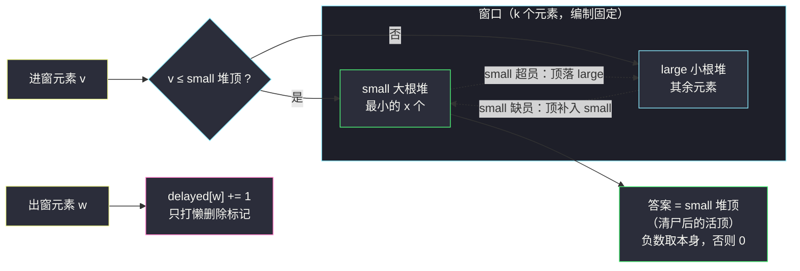

# 滑动子数组的美丽值（对顶堆 · 动态第 K 小 + 值域桶）

## 一、问题描述

给你一个长度为 `n` 的整数数组 `nums`，以及两个整数 `k` 和 `x`。

对于每个长度为 `k` 的**子数组**，求它的**美丽值**：

- 找到子数组中**第 `x` 小**的整数；
- 如果它是**负数**，美丽值就是它本身；否则美丽值为 `0`。

返回包含 `n - k + 1` 个美丽值的数组。

> 🔗 LeetCode 2653（新题）：https://leetcode.cn/problems/sliding-subarray-beauty/
>
> 数据范围（新题题面）：`n` 可达 `10^5`，`-50 <= nums[i] <= 50`，`1 <= x <= k <= n`。

**示例 1**

```
输入：nums = [1,-1,-3,-2,3], k = 3, x = 2
输出：[-1,-2,-2]
解释：[1,-1,-3] 第 2 小是 -1；[-1,-3,-2] 第 2 小是 -2；[-3,-2,3] 第 2 小是 -2。
```

**示例 2**

```
输入：nums = [-1,-2,-3,-4,-5], k = 2, x = 2
输出：[-1,-2,-3,-4]
```

**直观理解**

滑动窗口版「动态第 `x` 小」。窗口每次右移一格：进一个元素、出一个元素，问「当前窗口第 `x` 小」。普通做法（每窗排序）是 `O(nk log k)`；要支撑「插入 + 删除 + 查第 `x` 小」，标准兵器就是**对顶堆**——大根堆管最小的 `x` 个、小根堆管其余，两堆各管一半，第 `x` 小永远踩在大根堆的堆顶上。本题还送了一个大礼：值域只有 `[-50, 50]`，值域计数桶一行循环直接数出第 `x` 小，实战中更简单。

---

## 二、暴力解法

每个窗口复制出来排序，直接取第 `x` 小：

```python
class Solution:
    def getSubarrayBeauty(self, nums: List[int], k: int, x: int) -> List[int]:
        ans = []
        for i in range(k - 1, len(nums)):
            w = sorted(nums[i - k + 1 : i + 1])      # 每窗 O(k log k)
            v = w[x - 1]
            ans.append(v if v < 0 else 0)
        return ans
```

### 复杂度

- **时间**：`O(n·k·log k)`，`n = 10^5`、`k` 同量级时约 `10^5 * 10^5 = 10^10` 级，超时。
- **空间**：`O(k)`。

### 🔴 瓶颈在哪里

相邻窗口只差「一进一出」两个元素，每次却把整个窗口推翻重排。需要的结构是：**支持插入、删除、随时给出第 `x` 小**——这正是对顶堆的主场。

---

## 三、优化探索（核心章节）

> 📚 本题在灵茶题单中属于 **§5.7 对顶堆（动态第 K 小/大）**（数据结构 · 堆 B 路）：大根堆维护最小的 `K` 个 + 小根堆维护其余，滑动窗口进出后平衡。

### 3.1 观察特征

| 特征 | 说明 |
|------|------|
| 滑动窗口，单进单出 | 需要支持「插入一个、删除一个」的动态集合 |
| 询问固定为第 `x` 小 | `x` 在全程不变 → 堆的「编制」固定，天然适合对顶堆 |
| 值域 `[-50, 50]` 只有 101 个值 | 计数桶也能 `O(50n)` 直解，见 3.4 |

### 3.2 对顶堆：两半分工，第 x 小踩在分界线上

把窗口元素分成两半：

- **`small`（大根堆）**：窗口内**最小的 `x` 个**元素——它的堆顶是这 `x` 个里最大的，也就是**全局第 `x` 小**；
- **`large`（小根堆）**：其余元素——它的堆顶是第 `x + 1` 小，随时可以补充进 `small`。

维护规则（进出平衡）：

- **进窗 `v`**：`v <= small` 堆顶 → 进 `small`；否则进 `large`；
- **出窗 `w`**：只打**懒删除标记**（值 → 待删次数），不立即翻找两个堆（对顶堆不支持任意位置删除）；
- **平衡**：`small` 的有效个数（账面 `size_small`）多于 `x` → 堆顶落到 `large`；少于 `x` → `large` 堆顶补进 `small`；
- **取答案**：清理堆顶尸体后，`small` 堆顶即第 `x` 小，`< 0` 取该值否则 `0`。



**为什么懒删除是安全的**：`delayed` 按「值」计数，两堆合起来（含尸体）始终等于窗口的多重集合加上未消费的尸体；`small` 的**有效**个数由 `size_small` 账面单独维护，出窗时若 `w ≤ small` 堆顶（活顶）就给账面减一。堆顶露出的尸体在每次读顶前被 `prune` 弹掉，而每个尸体只被消费一次——均摊 `O(log n)`。

### 3.3 逐步走查一遍算法骨架

```text
for i, v in enumerate(nums):
    进窗 v（路由 + 平衡）
    if i >= k: 出窗 nums[i-k]（标记 + 判账 + 平衡）
    if i >= k-1: 清 small 顶 → 答案 = 顶 < 0 ? 顶 : 0
```

### 3.4 备选：值域计数桶（`O(50n)` 直解）

由于 `|nums[i]| <= 50`，维护 51 个计数桶（只装负数即可）：进窗 `v < 0` 则 `cnt[v + 50] += 1`，出窗对应减一；查询时从 `-50` 往上累加计数，**累加值首次 ≥ `x` 的那个桶**就是第 `x` 小（若一直数不满说明第 `x` 小非负 → 0）。只扫负数桶，每窗至多 50 步。

### 3.5 一句话核心

> **大根堆 small 养最小的 x 个，第 x 小永远在它堆顶；滑窗一进一出打懒标记，账面 `size_small` 守编制、prune 清尸体。值域小可换计数桶 `O(50n)`。**

---

## 四、代码实现

### Python（主解：对顶堆 + 懒删除）

```python
class Solution:
    def getSubarrayBeauty(self, nums: List[int], k: int, x: int) -> List[int]:
        small, large = [], []            # small 存 -v（大根堆）：最小 x 个；large 存 v：其余
        delayed = Counter()              # 懒删除：值 -> 待删副本数
        size_small = 0                   # small 的有效元素个数（账面）
        ans = []

        def top(heap):                   # 堆顶转回「原值」
            return -heap[0] if heap is small else heap[0]

        def prune(heap):                 # 堆顶是尸体就弹出，直到顶是活元素
            while heap and delayed[top(heap)]:
                delayed[top(heap)] -= 1
                heapq.heappop(heap)

        def balance():                   # 维持 small 有效个数 = x
            nonlocal size_small
            if size_small > x:           # 超员：small 顶落 large
                prune(small)
                prune(large)
                heapq.heappush(large, -heapq.heappop(small))
                size_small -= 1
            elif size_small < x:         # 缺员：large 顶补进 small
                prune(large)
                if large:
                    heapq.heappush(small, -heapq.heappop(large))
                    size_small += 1
                    prune(small)

        for i, v in enumerate(nums):
            prune(small)                                  # 比较前先清顶
            if not small or v <= top(small):              # 路由进窗元素
                heapq.heappush(small, -v)
                size_small += 1
            else:
                heapq.heappush(large, v)
            balance()

            if i >= k:                                    # 出窗：先判账再打懒删除标记
                w = nums[i - k]
                prune(small)
                if w <= top(small):                       # 判定必须基于打标记前的活顶
                    size_small -= 1                       # 视为删 small 侧，账面减一
                    delayed[w] += 1
                    prune(small)                          # 顶恰为 w 时立即兑现
                else:
                    delayed[w] += 1
                    prune(large)                          # 顶恰为 w 时立即兑现
                balance()

            if i >= k - 1:                                # 取答案：活顶即第 x 小
                prune(small)
                mx = top(small)
                ans.append(mx if mx < 0 else 0)
        return ans
```

**变量含义**

| 变量 | 含义 |
|------|------|
| `small` | 大根堆（存 `-v`），容纳窗口**最小 `x` 个**；堆顶原值 = 第 `x` 小 |
| `large` | 小根堆（存 `v`），容纳其余；堆顶是第 `x + 1` 小的候补 |
| `delayed[w]` | 值 `w` 的待删副本数（懒删除标记） |
| `size_small` | `small` 的**有效**元素个数账面，平衡的目标是 `= x` |

**不变式**：每次 `balance()` 之后，`small` 的活元素恰为窗口活元素中最小的 `x` 个，且其堆顶（清尸后）即窗口第 `x` 小。

### Python（备选：值域计数桶）

```python
class Solution:
    def getSubarrayBeauty(self, nums: List[int], k: int, x: int) -> List[int]:
        cnt = [0] * 51                    # 下标 d 对应值 d - 50（-50..0）
        ans = []
        for i, v in enumerate(nums):
            if v < 0:
                cnt[v + 50] += 1
            if i >= k and nums[i - k] < 0:
                cnt[nums[i - k] + 50] -= 1
            if i >= k - 1:
                s, beauty = 0, 0
                for d in range(50):       # 从 -50 向上数到第 x 小
                    s += cnt[d]
                    if s >= x:
                        beauty = d - 50
                        break
                ans.append(beauty)
        return ans
```

---

## 五、具体例子演示

以示例 1 `nums = [1,-1,-3,-2,3]`，`k = 3`，`x = 2` 走主解。约定表格中堆内容一律写**原值**（`small` 物理存的是 `-v`）。

**逐步跟踪（每步两堆状态 / 懒删除标记 / 输出）**

| i | 事件 | small（原值，顶=最大） | large（原值，顶=最小） | delayed | 输出 |
|---|------|------------------------|------------------------|---------|------|
| 0 | 进 1 | {1}（编制未满） | {} | {} | — |
| 1 | 进 -1 | {1, -1}（顶 1） | {} | {} | — |
| 2 | 进 -3 | -3 ≤ 1 入 small → 超员，顶 1 落 large → {-3, -1} | {1} | {} | **-1** |
| 3 | 进 -2；出 1 | -2 ≤ -1 入 small → 超员，顶 -1 落 large → {-3, -2} | {-1, 1}；出 1：`1 > -2` 属 large 侧，只打标记 | {1:1} | **-2** |
| 4 | 进 3；出 -1 | 3 > -2 入 large；出 -1：`-1 > -2` 属 large 侧 → 清 large 顶：-1 是尸体弹出、连着 1 也是尸体弹出 → {3} | {3} | {1:0, -1:0} | **-2** |

三个输出 `-1, -2, -2` ✓。逐窗人工复核：`[1,-1,-3]` 排序 `[-3,-1,1]` 第 2 小 `-1`；`[-1,-3,-2]` 排序 `[-3,-2,-1]` 第 2 小 `-2`；`[-3,-2,3]` 第 2 小 `-2` ✓。

**桶解对照**（同数据）：窗口 `[1,-1,-3]` 的负桶 `{-1:1, -3:1}`，从 -50 向上累加到 `-1` 时 `s = 2 ≥ x = 2` → `-1`；后两窗同理得 `-2`、`-2`。

**示例 2 快速复核**：`[-1,-2,-3,-4,-5]`，`k=2, x=2`——每窗恰两个负数，第 2 小即窗口较大者：`-1,-2,-3,-4` ✓（small 编制 = 2 装下整窗，堆顶即答案）。


---

## 六、复杂度分析

| 方法 | 时间 | 空间 | 说明 |
|------|------|------|------|
| 每窗排序 | `O(n·k·log k)` | `O(k)` | 超时 |
| 对顶堆（主解） | `O(n log n)` | `O(n)` | 每步 `O(1)` 次堆操作；`prune` 的每次弹出对应一次入堆，均摊 `O(log n)` |
| 值域计数桶 | `O(50·n)` | `O(50)` | 值域固定 101 个值，实战首选 |

对顶堆与桶解渐近都线性对数/近似线性；桶解常数更小、代码更短，但**依赖值域小**——值域一大（如 `10^9`）就只剩对顶堆（或平衡树）可用。

---

## 七、对比总结

**两法定位**

| 维度 | 对顶堆 | 值域桶 |
|------|--------|--------|
| 通用性 | 任意实数值域 | 仅值域小（本题 101 个值） |
| 单步成本 | `O(log n)` | `O(50)` |
| 删除处理 | 懒删除标记 + prune | 计数直接减一（天然可删） |
| 代码量 | 较长（路由/平衡/清尸三件套） | 极短 |

**易错点**

1. `small` 物理存 `-v` 模拟大根堆，**读顶、路由、落堆时都要取负转回原值**——符号错一次全盘皆输。
2. 出窗先 `prune(small)` 再比较 `w <= top(small)`：比较必须基于**活顶**，否则账面 `size_small` 记错堆。
3. 答案在 `small` 顶取，但**不能弹出**——顶是第 `x` 小本身，弹掉编制就破了。
4. 第 `x` 小非负时输出 `0`，不是省略；全正窗口照样要产出 `0`。
5. 桶解从 `-50` 向上**累加计数**，判据是「累计 ≥ `x`」首次出现，而不是「某桶计数 ≥ `x`」。

**模板（对顶堆 · 固定第 K 小，Python）**

```python
small, large = [], []          # 大根堆（存 -v）：最小 K 个 / 小根堆：其余
size_small, delayed = 0, Counter()
# 进窗：比较活顶路由 → balance()；出窗：delayed[w] += 1 → 判账 size_small → balance()
# 答案：prune(small) 后 -small[0]（即第 K 小）
```

---

## 八、举一反三

| 题目 | 关系 |
|------|------|
| [480. 滑动窗口中位数](https://leetcode.cn/problems/sliding-window-median/) | 对顶堆 + 懒删除的**原版**（K 取半动态），本篇是其「固定 x」特化 |
| [295. 数据流的中位数](https://leetcode.cn/problems/find-median-from-data-stream/) | 对顶堆静态版（只进不出），先做它再上手滑窗版 |
| [1801. 积压订单中的订单总数](https://leetcode.cn/problems/number-of-orders-in-the-backlog/) | 双堆各守一侧 + 匹配消费，对顶结构变体 |
| [502. IPO](https://leetcode.cn/problems/ipo/) | 小根堆守资本约束 + 大根堆取利润，双堆分工的另一形态 |
| [347. 前 K 个高频元素](https://leetcode.cn/problems/top-k-frequent-elements/) | 「维护前 K 个」的堆思想在静态数组上的应用 |

同批姊妹篇：[#3607 电网维护](power-grid-maintenance.md)（懒删除堆单堆版）、[#1642 可以到达的最远建筑](furthest-building-you-can-reach.md)（反悔堆）——本篇的 `prune` 正是前者的「弹顶跳过尸体」在双堆上的推广。

**思想迁移**

- 「动态第 `x` 小 + 滑窗」= 对顶堆；把「编制 `x`」想成 small 堆的固定席位，一进一出后**平衡编制**即可。
- 懒删除不是对顶堆的一部分也可以单独出场：任何「堆 + 需要删除」的场景都可用标记 + 弹顶跳过（见 `power-grid-maintenance.md`）。
- 值域小永远是降维信号：**先看值域再选结构**，桶/计数数组常把 `log` 直接抹掉。
- 口诀：**「小的进大堆，编制守 x 个；顶上出答案，尸体弹到活。」**
