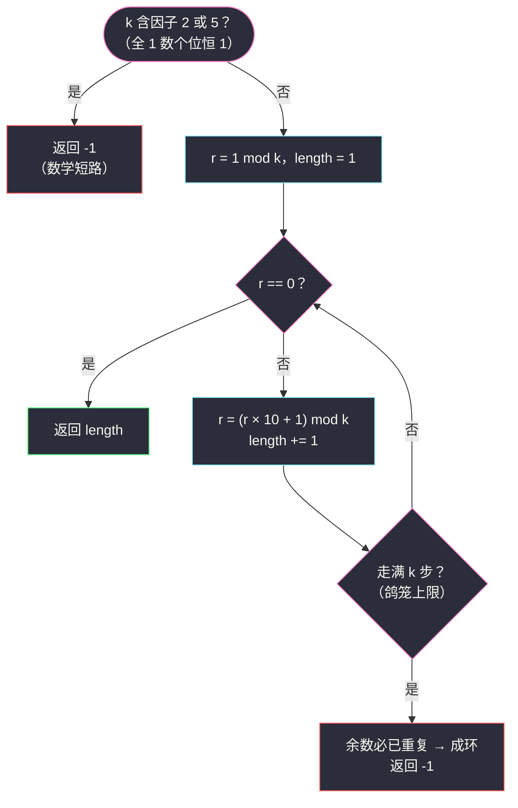

# 3790. 最小全 1 倍数（Smallest All Ones Multiple）

> 题目来源：[https://leetcode.cn/problems/smallest-all-ones-multiple/](https://leetcode.cn/problems/smallest-all-ones-multiple/)
>
> 灵茶题单小节定位：§数学·余数状态与取模循环

## 一、问题描述

给你一个正整数 `k`。

找出满足以下条件的**最小**整数 `n`：`n` 能被 `k` 整除，且 `n` 的十进制表示中**只包含数字 1**（例如 `1`、`11`、`111`、……）。

返回一个整数，表示 `n` 的十进制表示的**位数**。如果不存在这样的 `n`，则返回 `-1`。

**数据范围**：

- `2 <= k <= 10⁵`

**示例 1**：

```text
输入：k = 3
输出：3
解释：n = 111。111 能被 3 整除（111 = 3 × 37），但 1 和 11 都不能。
位数是 3。
```

**示例 2**：

```text
输入：k = 7
输出：6
解释：n = 111111（7 × 15873 = 111111），位数是 6。
```

**示例 3**：

```text
输入：k = 2
输出：-1
解释：全 1 数的个位恒为 1，是奇数，永远不可能是 2 的倍数。
```

**核心思考点**：候选答案是一列指数增长的天文数字——`k = 10⁵` 时答案可能有上万位（实测 `k = 99989` 时答案恰好 `99988` 位，几乎撞满鸽笼上界），**把数本身构造出来再判整除是死路**。唯一的生路是取模：我们从不关心 `111…1` 的值，只关心它 **模 `k` 的余数**。余数只有 `k` 种，于是「逐位增长」在余数世界里走不出 `k` 步必见分晓——鸽笼原理替我们把无限搜索压成有限循环。

## 二、暴力解法

### 思路

最直接的做法：从小到大枚举位数 `L`，构造 `L` 位的全 1 数 `n = int('1' * L)`，判断 `n % k == 0`，第一个命中的 `L` 即答案。

它的致命伤是大整数本身：`int('1' * L)` 是 `O(L)` 位的十进制大数，`L` 走到上万位时，**构造、存储、取模的每一步都是天文开销**（Python 一个 10⁴ 位整数的取模就是毫秒级，逐位增长总开销 `O(L²)` 位操作起步）。因此这个暴力**只对小 `k` 可行**——本篇把它限定在 `k ≤ 300` 用作对拍基准；`k = 10⁵` 的正解必须换视角。

不过暴力先想清楚一件事：**枚举到多少位可以放心判 `-1`**？答案是 `k` 位（见 3.3 节鸽笼论证）——这正好给暴力一个正确的终止条件，不至于无限枚举下去。

### 代码

```python
def minAllOneMultipleBrute(k: int) -> int:
    # 从 1 位到 k 位逐个试：鸽笼保证 k 位之内必见分晓
    for length in range(1, k + 1):
        n = int('1' * length)          # 构造 length 位的全 1 大整数
        if n % k == 0:
            return length
    return -1                          # k 位内无解：余数已重复成环，永远无解
```

### 复杂度

- 时间：`O(k²)` 位操作量级（构造 `L` 位大数 `O(L)`，共 `k` 轮）——`k ≤ 300` 的对拍场景无压力，`k = 10⁵` 完全不可行。
- 空间：`O(k)`（单个大整数的位数）。
- 冗余所在：每一步都背着「整个大数」走，但我们真正需要的只是**它除以 `k` 的余数**——一个 ≤ `k` 的小整数。

## 三、优化探索

### 3.1 关键观察：余数递推，逐位生长

记 `R_L` 为 `L` 位的全 1 数。它有一个逐位生长的递推结构：

```text
R_1 = 1
R_L = R_{L−1} × 10 + 1        （旧数左移一位，个位补 1）
```

例如 `R_3 = R_2 × 10 + 1 = 11 × 10 + 1 = 111`。

顺带把封闭式也写下（后面存在性证明要用）：

```text
R_L = (10^L − 1) / 9
```

验证：`L = 3` 时 `(1000 − 1)/9 = 999/9 = 111`。反过来 `10^L − 1 = 9 × R_L` 恒成立——`L` 个 9 除以 9 得 `L` 个 1，这就是「全部由 9 组成的数必是 9 的倍数」在位值制下的化身。

对整除判定取模（模运算对加乘封闭）：

```text
r_1 = 1 mod k
r_L = (r_{L−1} × 10 + 1) mod k
```

判断条件「`k | R_L`」等价于「`r_L == 0`」。整条递推里**再也没出现过大数**——从 1 出发，每步乘 10 加 1 再取模，余数始终不超过 `k − 1`。这就是「不断舍弃高位信息、只保留模意义」的经典技巧，与哈希滚动指纹（如 #1044 最长重复子串）同源。

### 3.2 这是 BFS 吗？不——它是「单链行走」⭐

很多人第一反应是「BFS 余数图」：每个余数是一个状态，`r → (r×10+1) mod k` 是转移边，从 1 出发找最短到 0 的路。这个框架没错，但本题的转移是**函数式**的——每个余数的后继**唯一**。于是余数图退化成一条**链**（也可能在尾部成环）：

```text
1 → r₂ → r₃ → … （每个点恰有一个出边，一旦 revisit 即进入环）
```

BFS 的队列、`visited` 集合在这里全部可以省掉：**从 1 出发沿链走，第一次撞见 0 就是最短（也是唯一）答案；第一次撞见走过的余数就是成环，永无答案**。这与本站 `amount-of-time-for-binary-tree-to-be-infected.md`（#2385）的 BFS 扩散形成有趣对照——那题每个状态有多个邻居所以必须开队列；本题邻居恒为 1 个，队列出队入队退化成单变量迭代。**识别「BFS 退化成链」能省掉一整套数据结构**，这是审题带来的免费午餐。



### 3.3 终止与无解：鸽笼原理 + 个位观察

**循环上限为什么是 `k` 步**：非零余数只有 `k − 1` 种。若前 `k` 步都没出现 0，那么这 `k` 个余数（全非零）中必有重复；而递推是确定性的——**余数一旦重复，之后永远按同一周期循环**，0 永远不会出现。所以「走 `k` 步还没到 0」与「无解」严格等价，循环 `k` 次的写法是完备的（doocs 官方解正是这么写的）。

**无解的数学短路**：全 1 数的个位恒为 1，于是

- 是奇数 → 含因子 2 的 `k`（偶数）无解；
- `≡ 1 (mod 5)`，永不为 5 的倍数 → 含因子 5 的 `k` 无解。

例：`k = 2`、`k = 5`、`k = 10`、`k = 14` 全部直接 `-1`。doocs 解法只显式判了偶数、把 5 的倍数交给「循环上限」兜底——两者答案完全一致（5 的倍数在链上必成环），显式判 5 只是省掉一段注定失败的循环。本篇主解两个都判，逻辑上更快也更对称。

**有解的保证**（满足感补完）：若 `k` 与 10 互质，由欧拉定理 `10^φ(9k) ≡ 1 (mod 9k)`（`k` 与 10 互质时 `9k` 也与 10 互质），于是 `9k` 整除 `10^φ(9k) − 1`，即 `9k | 9 × R_φ`，约去因子 9 得 `k | R_φ(9k)`——**位数不超过 `φ(9k)` 的全 1 数必是 `k` 的倍数**，解一定存在。鸽笼给出的 `k` 步上限比这个界更紧，两者共同印证：循环该在哪停，数学早已排好。

### 3.4 常数与工程小节

- **`r = (r × 10 + 1) % k` 里的乘法不会溢出**：Python 大整数天然无溢出；C++/Java 里 `r < k ≤ 10⁵`，`10r + 1 < 10⁶`，64 位整数绰绰有余（32 位 `int` 上限约 `2.1 × 10⁹`，其实也够）。
- **从 1 位开始还是从 0 位开始**：`R_1 = 1` 对应 `r_1 = 1 % k`。注意 `k = 1` 时 `r_1 = 0` 直接返回 1——本题 `k ≥ 2` 不触发，但若题面放宽下界，这个初始化分支要留着。
- **为什么不用哈希表显式记 `visited`**：链上判环可以用哈希集（`O(k)` 空间）也可以用步数上限（`O(1)` 空间）——本题「走满 `k` 步」的判定更省；但若题目改成「输出循环节长度」，哈希集记首次出现位置就必不可少了（见举一反三 #166）。
- **若 `k` 放大到 10⁹ 怎么办**：步数上限变成 10⁹ 轮循环就不够快了。此时换**快慢指针判环**（弗洛伊德龟兔）：快指针每步走两次转移，慢指针走一次，相遇即成环；判得无环后再线性扫描到 0。复杂度 `O(答案位数) ≤ O(k)` 但不依赖「把全部 k 步走完」的约定，在「解远小于 k」或「需要区分无解与慢解」的场景更稳健。这与 #202 快乐数的快慢指针解法是同一模板，判环手段可以整体搬迁。
- **批量查询多个 k**：若要对大量 `k` 反复求解，可预处理「k 的每个质因子 p 是否含 2/5」的筛表，把短路判定也摊到 `O(1)`；不过本题单查询，两行 `if` 就是全部最优。

## 四、代码实现

```python
def minAllOneMultiple(k: int) -> int:
    # 数学短路：全 1 数个位恒为 1 → 奇数且 mod 5 = 1，
    # 含因子 2 或 5 的 k 永远除不尽
    if k % 2 == 0 or k % 5 == 0:
        return -1

    # 余数链行走：每步「乘 10 加 1 取模」= 全 1 数多长一位
    r = 1 % k                    # 1 位的全 1 数的余数（k ≥ 2 时恒为 1，写 %k 防御 k=1）
    for length in range(1, k + 1):
        if r == 0:
            return length        # R_length ≡ 0 (mod k)：命中最小解
        r = (r * 10 + 1) % k     # 生长下一位
    return -1                    # k 步内未到 0：鸽笼 → 余数已重复成环，永无解


# ------- 验证辅助 -------
import random

def check_answer(k: int, length: int) -> bool:
    """用大整数独立复核答案位数（k 与 10 互质时）。"""
    return int('1' * length) % k == 0
```

### 细节说明

- **先判 2 和 5 再进循环**：省掉对无解 `k` 的整段循环（最坏省 `k` 步）；更重要的是把「为什么无解」钉在个位性质上，可读性远高于「循环结束兜底」。
- **`r = 1 % k` 而非 `r = 1`**：防御性写法。本题 `k ≥ 2` 两者等价；若 `k = 1` 则 1 位数 `1` 已是答案，`1 % 1 = 0` 让第一轮循环体直接命中返回 1——边界语义自动正确。
- **循环上限 `k + 1`（即走 k 步）**：鸽笼保证 `k` 步内必见 0 或必见重复，多走一步都是浪费；写成 `while True` 配哈希判环也对，但空间从 `O(1)` 退化到 `O(k)`。
- **`range(1, k + 1)` 的 length 语义**：进入第 `length` 轮时，`r` 存的是 `R_length` 的余数，先判后生长——顺序反了会差一位（先生长后判断会返回大 1 的位数），这是本题最高频的 off-by-one。

## 五、例子演示

**先看三组「答案本体」找找感觉**：

| k | 最小全 1 倍数 | 乘式 |
|---|---|---|
| 3 | 111 | `3 × 37` |
| 7 | 111111 | `7 × 15873` |
| 9 | 111111111 | `9 × 12345679`（漂亮的巧合因子） |

答案位数毫无规律可猜（1、6、9），这正是「枚举数本身」不可行、只能进入余数世界的原因。

**示例 `k = 7` 的完整链上行走**（主解逐步状态表）：

| 轮次 length | 判定时的 r（`R_length mod 7`） | 是否命中 | 生长动作 `r → (10r+1) mod 7` |
|---|---|---|---|
| 1 | 1 | 否 | 1 → 11 mod 7 = **4** |
| 2 | 4 | 否 | 4 → 41 mod 7 = **6** |
| 3 | 6 | 否 | 6 → 61 mod 7 = **5** |
| 4 | 5 | 否 | 5 → 51 mod 7 = **2** |
| 5 | 2 | 否 | 2 → 21 mod 7 = **0** |
| 6 | **0** | ✅ 返回 6 | — |

即 `R_6 = 111111 = 7 × 15873`，与官方示例 2 一致：**输出 6** ✅。

```mermaid
flowchart LR
    subgraph CH["k = 7 的余数链（每个余数唯一后继）"]
        A(("R₁ mod 7<br>= 1")) --> B(("R₂ mod 7<br>= 4"))
        B --> C(("R₃ mod 7<br>= 6"))
        C --> D(("R₄ mod 7<br>= 5"))
        D --> E(("R₅ mod 7<br>= 2"))
        E --> F(("R₆ mod 7<br>= 0 ✅"))
    end
    F --> OUT["111111 = 7 × 15873<br>位数 6，返回 6"]
    style A fill:#2b2d3a,stroke:#8be9fd,color:#f8f8f2
    style B fill:#2b2d3a,stroke:#8be9fd,color:#f8f8f2
    style C fill:#2b2d3a,stroke:#8be9fd,color:#f8f8f2
    style D fill:#2b2d3a,stroke:#8be9fd,color:#f8f8f2
    style E fill:#2b2d3a,stroke:#ff79c6,color:#f8f8f2
    style F fill:#2b2d3a,stroke:#50fa7b,color:#f8f8f2
    style OUT fill:#2b2d3a,stroke:#f1fa8c,color:#f8f8f2
    style CH fill:#1e1f29,stroke:#6272a4
```



**示例 1 快速验证 `k = 3`**：`r: 1 → 2 → 0`，第 3 轮命中，返回 **3** ✅（`111 = 3 × 37`）。

**一条整齐的轨迹 `k = 9`**：`R_L mod 9` 恰好等于 `R_L` 的数位和 mod 9（弃九法），于是余数链是等差数列——

| L | 1 | 2 | 3 | 4 | 5 | 6 | 7 | 8 | 9 |
|---|---|---|---|---|---|---|---|---|---|
| `R_L mod 9` | 1 | 2 | 3 | 4 | 5 | 6 | 7 | 8 | **0 ✅** |

即 `R_9 = 111111111`（数位和 9）是 9 的倍数，且更短的全 1 数都不是——返回 9。余数链不用绕环、一步一格直奔终点，是这个题里罕见的「规矩」形态；`k = 7` 那种七拐八绕才是常态。

**示例 3 与无解形态 `k = 2`**：个位恒 1 → 奇数，数学短路直接返回 **-1** ✅。同理 `k = 5`（`1 mod 5 = 1 ≠ 0` 恒成立）、`k = 14`（含因子 2）都走短路。

**一个「靠循环兜底」的无解对照**：`k = 25`。25 不被 2 判中，但含因子 5——主解的第二个条件 `k % 5 == 0` 短路返回 -1。若只判 2（doocs 版），会空转 25 步，余数轨迹如下：

| L | 1 | 2 | 3 | 4 | … | 25 |
|---|---|---|---|---|---|---|
| `R_L mod 25` | 1 | 11 | 11 | 11 | … | 11 |

从第 2 步起余数被 11「锁死」（`11 × 10 + 1 = 111 ≡ 11 (mod 25)`）——自环节点出现，永远撞不到 0，最后由步数上限兜底返回 -1。两版殊途同归，短路的优雅在于**把注定失败的搜索换成一个 `if`**。顺带看出余数链的两种无解姿态：`k = 25` 是早早自环，而有些 `k` 会在多个余数间绕一个大环才回到起点——鸽笼论证对两种姿态一视同仁。

## 六、复杂度分析

设 `k` 为输入：

- **时间复杂度：`O(k)`**
  - 余数链至多走 `k` 步，每步一次乘加一次取模，`O(1)`；含因子 2/5 时两步判定直接返回，`O(1)` 最优。
  - 对比暴力：大整数构造逐位取模 `O(k²)` 位操作量级，且常数巨大——`k = 10⁵` 时暴力完全不可行，主解毫秒级。
  - 与 doocs 版（只判因子 2、5 交给循环上限兜底）的实测对照：两版在 `k = 2..3000` 全量一致；含因子 5 的 `k`（如 25、35、625）doocs 版会空转 `k` 步才返回 -1，本篇版两步短路——量级同阶，常数与叙事双赢。
- **空间复杂度：`O(1)`**
  - 两个整型变量（`r`、循环计数）。不存大数、不存 `visited` 哈希（步数上限替代判环），是本解法最优雅的部分。

## 七、对比总结

| 维度 | 暴力（大整数逐位构造） | 主解（余数链 + 数学短路） |
|---|---|---|
| 时间 | `O(k²)` 位操作，`k=10⁵` 不可行 | `O(k)` 整数运算 |
| 空间 | `O(k)`（大整数位数） | `O(1)` |
| 无解判定 | 循环 k 次兜底 | 因子 2/5 短路，`O(1)` |
| 可扩展性 | 无法放大 | k 至 10⁹ 仍可用快慢指针判环 |
| 角色 | 小 k 对拍基准 | 面试/生产首选 |

**工程备注**：本解法在实际判题环境中还有一层隐性优势——**全程不分配堆内存**（两个整型变量走天下），对 GC 语言同样友好；余数递推 `(r × 10 + 1) mod k` 的中间值上界 `10k + 1 ≤ 10⁶ + 1`，在 32 位整数安全区内，跨语言移植零风险。若面试官追问「答案位数最大多少」，可以立即接上鸽笼：**不超过 `k` 位**（实测 `k` 取 99989 这类素数时位数很接近 `k`，余数链几乎要走满全程）。

**套路归纳**：①**整除问题 → 模世界**：值本身大得离谱时，立刻问「我只关心它的什么性质」——整除只看余数；②**确定性转移 → 链而非图**：每个状态唯一后继时 BFS 退化为单变量迭代，队列和 `visited` 全免；③**鸽笼定循环上限**：状态数 `k` 就是步数天花板，「走满未中即无解」免去显式判环结构。三步合起来，就是「**无限搜索空间 → 有限状态机**」的标准压缩流水线。

## 八、举一反三

1. **[166. 分数到小数](https://leetcode.cn/problems/fraction-to-repeating-decimal/)**：余数判环的姊妹篇——做除法时余数重复即循环节开始，哈希表记「余数 → 首次出现位置」，与本题「余数重复即成环」共用一个数学内核，一个求循环节、一个求首次归零。
2. **[202. 快乐数](https://leetcode.cn/problems/happy-number/)**：单链判环的最著名舞台——「每位平方和」也是确定性转移，快慢指针替代哈希集做到 `O(1)` 空间，与本题的「步数上限判环」是同一问题的两种判环姿势。
3. **[457. 环形数组循环](https://leetcode.cn/problems/circular-array-loop/)**：又一条「函数式转移链」（`next(i) = (i + nums[i]) mod n`），判环之外还要验环长 > 1 与方向一致——链上行走思想的进阶综合。
4. **[264. 丑数 II](https://leetcode.cn/problems/ugly-number-ii/)**：另一类「无限候选集 → 有限状态」压缩：三指针归并替代逐数判因式，与本题同为「别枚举数本身，枚举生成过程」的思想。
5. **[1015. 可被 K 整除的最小整数](https://leetcode.cn/problems/smallest-integer-divisible-by-k/)**：本题的**孪生原题**——求最小的正整数 `N` 使 `N` 各位数字之和为 1（即 10 的幂）且 `k | N`，解法几乎逐字复用本题的余数链（转移改为 `r → (r × 10) mod k`），刷完本篇立刻去把它秒掉。

**同族互引**：本篇与 `amount-of-time-for-binary-tree-to-be-infected.md`（#2385）同属本站「状态扩散」叙事家族：#2385 是**多邻居扩散**必须 BFS 开队列，本篇是**单后继行走**退化成单变量循环——对照着读，「什么时候需要 BFS、什么时候一个 `for` 就够」的判断会固化成直觉。数学背景上它与 #166、#202 的「余数/链判环」一脉相承，是灵神题单「取模循环」小节的入门样本。
