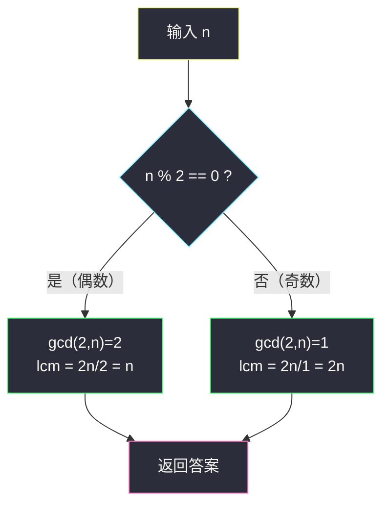

# 2413. 最小偶倍数（Smallest Even Multiple）

> 题目来源：[https://leetcode.cn/problems/smallest-even-multiple/](https://leetcode.cn/problems/smallest-even-multiple/)
>
> 灵茶题单小节定位：§1.7 最小公倍数（LCM）

## 一、问题描述

给你一个正整数 `n`，返回 `2` 和 `n` 的**最小公倍数**（正整数）。

**数据范围**：

- `1 <= n <= 150`

**示例 1**：

```text
输入：n = 5
输出：10
解释：5 和 2 的最小公倍数是 10。
```

**示例 2**：

```text
输入：n = 6
输出：6
解释：6 和 2 的最小公倍数是 6。注意数字会是它自身的倍数。
```

**核心思考点**：最小公倍数的定义是「同时是两者倍数的最小正整数」。本题只有两个数 `2` 和 `n`，可以直接套用经典公式 `lcm(a, b) = a × b / gcd(a, b)`；而 `gcd(2, n)` 的取值只有两种可能（`1` 或 `2`，取决于 `n` 的奇偶），公式退化为一个分支表达式。

## 二、暴力解法

### 思路

按定义枚举：最小公倍数一定是 `2` 的倍数，所以从 `x = 2` 开始，每次加 `2`，找到第一个能同时被 `n` 整除的数即为答案。

### 代码

```python
def smallestEvenMultipleBrute(n: int) -> int:
    x = 2
    while x % n != 0:
        x += 2
    return x
```

### 复杂度

- 时间：`O(n)`——答案不超过 `2n`，枚举步数不超过 `n` 步。`n ≤ 150` 轻松通过。
- 空间：`O(1)`。

## 三、优化探索

### 3.1 通用公式：lcm(a, b) = a × b / gcd(a, b)

最小公倍数与最大公约数的乘积恒等于两数之积：`lcm(a, b) × gcd(a, b) = a × b`。这是数论中最经典的恒等式之一（把两个数的质因子分解按「指数取 max / 取 min」拆开即可证明）。

### 3.2 代入 a = 2：gcd 只剩两种取值 ⭐

对 `gcd(2, n)` 做分类讨论：

| n 的奇偶 | gcd(2, n) | lcm(2, n) = 2n / gcd(2, n) |
|---|---|---|
| n 为偶数 | 2 | `2n / 2 = n` |
| n 为奇数 | 1 | `2n / 1 = 2n` |

直观理解：

- **n 为偶数**：`n` 本身已经是 `2` 的倍数，「同时是 2 和 n 的倍数」等价于「是 n 的倍数」，最小就是 `n` 自己（示例 2 提醒过：数字是它自身的倍数）。
- **n 为奇数**：`n` 与 `2` 互质，公倍数必须同时含因子 `2` 和 `n` 的全部因子，最小为 `2n`。



另一个等价写法是位运算加速除以 2：`n << 1` 等价于 `n × 2`，而对偶数 `n >> 1` 是除以 `2`——不过本题 `n ≤ 150`，普通算术即可，不必炫技。

## 四、代码实现

### 主解：奇偶分支

```python
class Solution:
    def smallestEvenMultiple(self, n: int) -> int:
        return n if n % 2 == 0 else n * 2
```

### 等价写法（不分支）

利用「奇数补一个因子 2、偶数不补」的语义，也可以写成：

```python
class Solution:
    def smallestEvenMultiple(self, n: int) -> int:
        return n * (2 // gcd(2, n))   # 偶数: 2//2=1 → n; 奇数: 2//1=2 → 2n
```

或者直接调用 `math.lcm`（Python 3.9+ 内置）：

```python
from math import lcm

class Solution:
    def smallestEvenMultiple(self, n: int) -> int:
        return lcm(2, n)
```

三种写法结果完全一致，面试推荐第一种（分支清晰、无依赖）；比赛速敲推荐 `math.lcm`。

### 细节说明

- **不要写成 `n if n % 2 else 2 * n` 时搞反条件**：`n % 2 == 0`（余数为 0）是偶数。
- **答案上界 `2n ≤ 300`**，无溢出风险；换成 C++/Java 也只需 `int`。

## 五、例子演示

**用 n = 5（奇数）走一遍**：

| 步骤 | 计算 | 结果 |
|---|---|---|
| 判断奇偶 | `5 % 2 = 1 ≠ 0` | 奇数 |
| 套公式 | `lcm = 2 × 5 / gcd(2, 5) = 10 / 1` | `10` |

暴力对拍视角：`x = 2 → 4 → 6 → 8 → 10`，`10 % 5 == 0` 停止，同样得 `10` ✅。

**用 n = 6（偶数）走一遍**：

| 步骤 | 计算 | 结果 |
|---|---|---|
| 判断奇偶 | `6 % 2 = 0` | 偶数 |
| 套公式 | `lcm = 2 × 6 / gcd(2, 6) = 12 / 2` | `6` |

注意 `6` 本身就是 `2` 的倍数，所以最小公倍数就是它自己，不需要「跳到下一个偶数」。

**边界 n = 1**：奇数，答案 `2 × 1 = 2`（`2` 和 `1` 的最小公倍数是 `2`）✅。
**边界 n = 2**：偶数，答案 `2` ✅。

## 六、复杂度分析

- **时间复杂度：`O(1)`**——一次取模、一次乘法。
- **空间复杂度：`O(1)`**。

## 七、对比总结

| 维度 | 暴力（枚举 2 的倍数） | 主解（奇偶分支公式） |
|---|---|---|
| 时间 | `O(n)` | `O(1)` |
| 空间 | `O(1)` | `O(1)` |
| 关键点 | lcm 定义直译 | `lcm(2,n)` 只依赖 n 奇偶 |
| 通用性 | 任意 a,b 都能枚举 a 的倍数 | 仅因 a=2 才退化为分支；一般情况用 `a*b/gcd(a,b)` |

**套路归纳**：见到 lcm 先默写 `lcm(a,b) = a×b / gcd(a,b)`（防溢出先除后乘：`a / gcd(a,b) × b`）。当其中一个数极小（如 `2`）时，gcd 的取值空间随之塌缩成常数种，公式可以进一步退化成分支表达式——本题就是最简的退化特例。

## 八、举一反三

1. **[878. 第 N 个神奇数字](https://leetcode.cn/problems/nth-magical-number/)**：二分答案 + `lcm(a,b)` 容斥计数「≤ x 的神奇数个数 = ⌊x/a⌋ + ⌊x/b⌋ − ⌊x/lcm(a,b)⌋」，lcm 公式的进阶应用。
2. **[1201. 丑数 III](https://leetcode.cn/problems/ugly-number-iii/)**：三元版容斥，`lcm(a,b)`、`lcm(a,b,c)` 组合计数，本题公式的直接扩展。
3. **[1071. 字符串的最大公因子](https://leetcode.cn/problems/greatest-common-divisor-of-strings/)**：gcd/lcm 概念从整数迁移到字符串的趣味题。
4. **[1492. n 的第 k 个因子](https://leetcode.cn/problems/the-kth-factor-of-n/)**：从「公倍数」切换到「因子」视角，与本题同属灵神题单数学开胃菜。

**同族互引**：本批（灵茶一期 math 专题）中 `number-of-common-factors.md`（#2427）研究公因子、`minimum-deletions-to-make-array-divisible.md`（#2344）研究 gcd 与因子判定的联动，可对照体会「因子 / 倍数 / gcd / lcm」四兄弟的相互转化。
