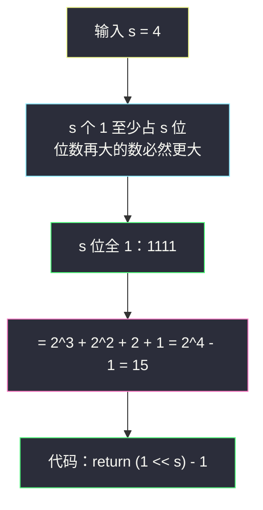

# 全 1 子序列的最小数（`2^s - 1` 构造全 1 二进制）

## 一、问题描述

给定一个正整数 `s`，返回满足条件的**最小正整数**：其二进制表示中所有位都是 `1`，且 `1` 的个数恰好为 `s`。

> 🔗 LeetCode 3370：https://leetcode.cn/problems/smallest-number-with-all-set-bits/
>
> 数据范围：`1 <= s <= 15`（结果 `2^s - 1` 最大 32767，远在 int 范围内）。

**示例**

```
输入：s = 1    输出：1      二进制 1
输入：s = 2    输出：3      二进制 11
输入：s = 3    输出：7      二进制 111
输入：s = 4    输出：15     二进制 1111
```

**直观理解**

数的大小先比**位数**再比高位。`s` 个 `1` 至少要占 `s` 个二进制位；而「s 位、恰 s 个 1」只有一种摆法——全部填 1，即 `111…1`（s 位）。位数更多（> s 位）的候选数值必然更大，不用考虑。所以答案就是那个著名的全 1 数：`2^s - 1`（2 的幂减 1，即梅森型数）。灵神题单把它放在 **位运算 · 一、基础题**，练的是「`2^k - 1` 构造全 1」这个后面到处用的小积木。

---

## 二、暴力解法

从 1 开始逐个整数检查二进制是否为 s 个 1：

```python
class Solution:
    def smallestNumber(self, s: int) -> int:
        x = 1
        while bin(x)[2:] != '1' * s:    # 二进制恰好是 s 连个 1
            x += 1
        return x
```

`bin(x)[2:] == '1' * s` 同时锁死了「位数 = s」和「全为 1」两件事。`s = 15` 时要枚举到 32767，尚能跑完但纯靠数据小；`s` 稍大即指数爆炸。

### 复杂度

- **时间**：`O(2^s)`。
- **空间**：`O(s)`（字符串）。

### 🔴 瓶颈在哪里

候选其实**唯一**：位数被「s 个 1」顶死在 s 位，s 位里又要全 1——根本不需要搜索，直接**构造**。

---

## 三、优化探索

> 📚 本题在灵茶题单中属于 **位运算 · 一、基础题**。灵神模板要点：**`2^k - 1` 构造全 1**——`(1 << s) - 1` 一步到位；等价写法还有逐轮「左移补 1」与字符串 `'1' * s` 转 int。

### 3.1 为什么答案是 `2^s - 1`

二进制 `111…1`（s 位）按位展开是 `2^(s-1) + 2^(s-2) + … + 2 + 1`，由等比求和恰等于 `2^s - 1`。反过来，`2^s` 是 `1` 后面跟 s 个 `0`，减 1 借位后变成 s 个 `1`——「减 1 制造全 1」是构造全 1 数最顺手的一招。

### 3.2 三种构造写法

| 写法 | 代码 | 说明 |
|------|------|------|
| 左移减一 | `(1 << s) - 1` | `O(1)`，最短 |
| 逐轮补 1 | 循环 `ans = (ans << 1) \| 1` 执行 s 次 | 直观展示位怎么长出来 |
| 字符串转 int | `int('1' * s, 2)` | 与暴力检查同款表达，顺向生成 |

⚠️ **括号不能省**：`1 << s - 1` 在 Python / Java / C 系里 `-` 优先级高于 `<<`，会被解析成 `1 << (s-1)`，得到 `100…0`（单个 1）而不是全 1。这是本题最现实的坑。

### 3.3 构造过程图解（以 s = 4 为例）



### 3.4 一句话核心

> **「至少 s 位」+「恰 s 个 1」⟹ 唯一候选 `111…1`（s 位）= `(1 << s) - 1`。**

---

## 四、代码实现

### Python（主解：左移减一）

```python
class Solution:
    def smallestNumber(self, s: int) -> int:
        return (1 << s) - 1      # 括号必须带：优先级坑见 3.2
```

### Python（对照一：逐轮左移补 1）

```python
class Solution:
    def smallestNumber(self, s: int) -> int:
        ans = 0
        for _ in range(s):
            ans = (ans << 1) | 1     # 每轮：左移腾位，低位补 1
        return ans
```

### Python（对照二：字符串构造）

```python
class Solution:
    def smallestNumber(self, s: int) -> int:
        return int('1' * s, 2)
```

### Java（主解同款）

```java
class Solution {
    public int smallestNumber(int s) {
        return (1 << s) - 1;
    }
}
```

**变量含义**

| 表达式 | 含义 |
|--------|------|
| `1 << s` | `1` 后跟 s 个 `0`，即 `2^s` |
| `- 1` | 借位把 s 个 0 全变成 1 |
| `(ans << 1) \| 1` | 已有位整体左移，最低位补 1（位长 +1 的全 1 保持） |

---

## 五、具体例子演示

### 例 A：`s = 4`（逐轮构造的位级跟踪表）

| 轮次 | 操作 | ans（十进制） | ans（二进制） |
|------|------|---------------|----------------|
| 初始 | — | 0 | `0` |
| 1 | `0 << 1 \| 1` | 1 | `1` |
| 2 | `1 << 1 \| 1` | 3 | `11` |
| 3 | `3 << 1 \| 1` | 7 | `111` |
| 4 | `7 << 1 \| 1` | 15 | `1111` |

每轮「整体抬一位 + 低位补 1」，全 1 性质始终不变，位长稳步 +1。

### 例 B：位权展开表（s = 4，验证 `2^s - 1`）

| 位 | 2^3 | 2^2 | 2^1 | 2^0 | 求和 |
|----|-----|-----|-----|-----|------|
| 1111 | 1 | 1 | 1 | 1 | 8 + 4 + 2 + 1 = 15 |
| 10000（= `1 << 4`） | 16 | — | — | — | 16 - 1 = 15 ✓ |

「`2^s` 减 1」与「s 位全 1」在位权层面严丝合缝。

### 例 C：答案对照表（s = 1..5）

| s | 1 | 2 | 3 | 4 | 5 |
|---|---|---|---|---|---|
| 答案 | 1 | 3 | 7 | 15 | 31 |
| 二进制 | `1` | `11` | `111` | `1111` | `11111` |
| 规律 | | | | | 每次翻倍再加 1 |

### 例 D：优先级坑演示（s = 4）

| 写法 | 实际解析 | 结果 | 二进制 | 对错 |
|------|----------|------|--------|------|
| `1 << s - 1` | `1 << (s - 1)` | 8 | `1000` | ✗ 只有一个 1 |
| `(1 << s) - 1` | 先移后减 | 15 | `1111` | ✓ |

---

## 六、复杂度分析

| 方法 | 时间 | 空间 |
|------|------|------|
| 暴力枚举 | `O(2^s)` | `O(s)` |
| `(1 << s) - 1` | `O(1)`（一次移位一次减法） | `O(1)` |
| 逐轮补 1 | `O(s)`（s 次移位） | `O(1)` |
| 字符串构造 | `O(s)` | `O(s)` |

`s ≤ 15` 时全部瞬过；但 `(1 << s) - 1` 把「分析唯一候选 → 一步构造」体现得最纯粹，也是这题唯一值得带走的东西。

---

## 七、对比总结

**全 1 数（`2^k - 1`）的三个常用身份**：

1. **掩码**：低 k 位全 1，配合 `&` 取低位、`^` 翻转 k 位——#1009 求补数正是拿它当「同位长全 1 掩码」（见同批 `complement-of-base-10-integer.md`）。
2. **判全满**：`x & mask == mask` 判低 k 位是否全 1。
3. **周期**：`2^k - 1` 模 `2^k` 意义下反复自乘不变，快速幂取模的老朋友。

**易错点**

1. **括号**：`1 << s - 1` ≠ `(1 << s) - 1`（例 D），优先级坑跨语言存在。
2. **s = 1**：答案是 1 不是 0——`0` 虽「没有 0 位」但它压根没有 1 位，不满足「s 个 1」。
3. 别把「子序列」想复杂：题目只问这个数本身，与数组子序列算法无关，审题别跑偏。

---

## 八、举一反三

| 题目 | 关系 |
|------|------|
| [1009. 十进制整数的补数](https://leetcode.cn/problems/complement-of-base-10-integer/) | 补数掩码 = 本题构造的 `2^L - 1`，见同批 `complement-of-base-10-integer.md` |
| [476. 数字的补数](https://leetcode.cn/problems/number-complement/) | 同上，正数版 |
| [231. 2 的幂](https://leetcode.cn/problems/power-of-two/) | 对照记忆：`2^k` 是单 1，`2^k - 1` 是全 1，判法 `n & (n - 1) == 0` |
| [191. 位 1 的个数](https://leetcode.cn/problems/number-of-1-bits/) | 「恰 s 个 1」的反向操作：数出一个数里 1 的个数 |
| [1486. 数组异或操作](https://leetcode.cn/problems/xor-operation-in-an-array/) | 同批位运算篇，见 `xor-operation-in-an-array.md` |

**思想迁移**

- 「最小/唯一的合法形态」类问题，先做**位数与形态的夹逼**，能夹出唯一解就直接构造，别让循环去做数学已经做完的事。
- `2^k - 1` 是位运算的乐高积木：构造它只要 `(1 << k) - 1`，认出它却要练——看到「低位全 1」「全 1 掩码」「翻转有效位」，脑子里就该浮现它。
- 移位运算优先级低于加减是跨语言通例，凡 `<<` 与算术混排，括号永远别省。
- 口诀：**「s 个 1，s 位顶；全 1 就是 2 的幂减一。」**
