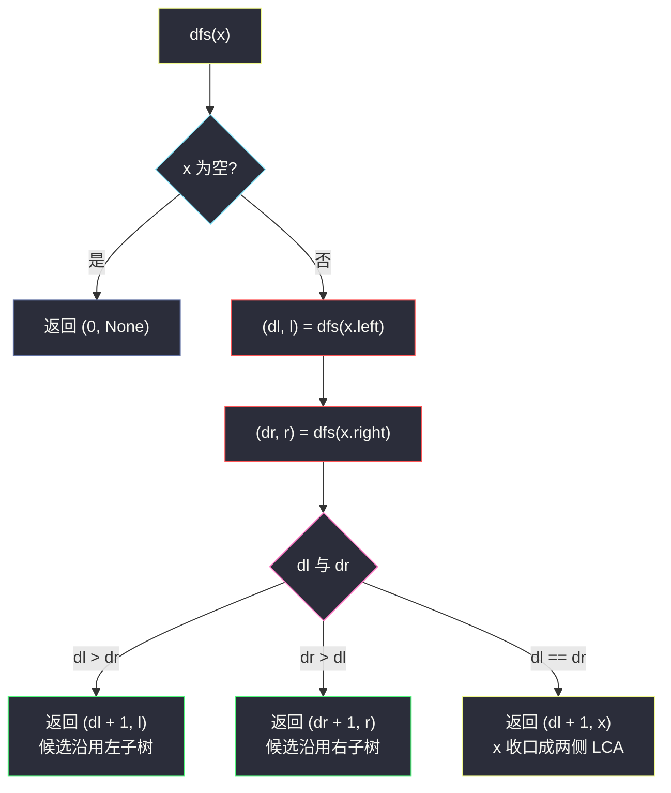
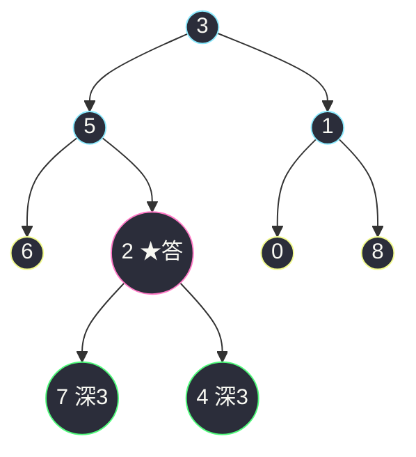

# 865. 具有所有最深节点的最小子树(Smallest Subtree with all the Deepest Nodes)

> 🔗 LeetCode 865:https://leetcode.cn/problems/smallest-subtree-with-all-the-deepest-nodes/
>
> 📚 灵茶题单小节:§「后序 DFS 合并子树信息」练习(与 #1123 同题)

## 一、问题描述

给定一个根为 `root` 的二叉树,每个节点的**深度**是它到根的最短距离。

返回包含原始树中**所有最深节点**的**最小子树**。

如果一个节点在整个树的任意节点之间具有最大的深度,则该节点是**最深的**。一个节点的子树是该节点加上它的所有后代的集合。

**示例 1**

```text
输入:root = [3,5,1,6,2,0,8,null,null,7,4]
输出:[2,7,4]
解释:返回值为 2 的节点。蓝色标记的是树的最深节点;节点 5、3、2 的子树
都包含全部最深节点,但节点 2 的子树最小,因此返回它。
```

**示例 2**

```text
输入:root = [1]
输出:[1]
解释:根节点就是树中最深的节点。
```

**示例 3**

```text
输入:root = [0,1,3,null,2]
输出:[2]
解释:最深节点只有 2;包含它的子树有节点 2、1、0 的子树,最小的是节点 2 自身。
```

> 数据范围:树中节点数量 `[1, 500]`,`0 <= Node.val <= 500`,每个节点的值互不相同。
> 官方注明本题与 [1123. 最深叶节点的最近公共祖先](https://leetcode.cn/problems/lowest-common-ancestor-of-deepest-leaves) 重复。

**直观理解**

"包含所有最深节点的最小子树"就是这些最深节点的**最近公共祖先(LCA)**——LCA 的子树恰好覆盖它们,再往下砍一刀就会漏掉某一侧的最深节点。于是本题 = "最深叶节点的 LCA"。难点在于:哪些节点最深,事先并不知道;而"最深"的判定又依赖深度——深度向下流,LCA 向上收,两个方向的信息必须在一趟遍历里汇合。

## 二、暴力解法

分两步走:先 BFS/DFS 求出全局最大深度 `maxd` 并收集所有深度为 `maxd` 的节点;再用经典的 parent 指针上跳法求这些节点的 LCA。

```python
class Solution:
    def subtreeWithAllDeepest(self, root: Optional[TreeNode]) -> Optional[TreeNode]:
        parent = {id(root): None}              # 父指针
        depth = {id(root): 0}                  # 深度
        order = []                             # 遍历序列(保证 BFS/先序均可)
        q = deque([root])
        while q:
            node = q.popleft()
            order.append(node)
            for child in (node.left, node.right):
                if child:
                    parent[id(child)] = node
                    depth[id(child)] = depth[id(node)] + 1
                    q.append(child)

        maxd = max(depth[id(x)] for x in order)
        deepest = [x for x in order if depth[id(x)] == maxd]

        nodes = list(deepest)                  # 统一上跳到同一深度,再同步上跳
        d = [depth[id(x)] for x in nodes]
        for i in range(len(nodes)):            # 第一步:全部跳到 min(d)
            while d[i] > min(d):
                nodes[i] = parent[id(nodes[i])]
                d[i] -= 1
        while len({id(x) for x in nodes}) > 1: # 第二步:同步上跳直到汇合
            for i in range(len(nodes)):
                nodes[i] = parent[id(nodes[i])]
        return nodes[0]
```

### 复杂度

- 时间:`O(n)` 两趟,但多节点上跳的常数不小;且要维护 parent/depth 两个哈希表。
- 空间:`O(n)`。

正确无虞,逻辑却分了三段(求深度、收集、上跳),任何一段的边界(如 `min(d)` 取错)都可能埋雷——这正是"两步法"的通病:**信息被切成串行的阶段,而不是随递归自然汇合**。

## 三、优化探索

### 观察 1:答案在"左右两侧都够深"的分叉点上

自底向上看,每个节点 `x` 只关心一件事:**以 `x` 为根的子树里,最深节点扎在哪一侧?**

- 左侧更深:答案在左子树里,右侧永远够不到最深;
- 右侧更深:答案在右子树里;
- **两侧一样深:最深节点左右皆有,`x` 就是它们的 LCA**,答案在 `x` 收口。

于是递归函数返回 `(子树深度, 该子树中"包含全部最深节点"的候选)` 二元组,后序合并:

```text
dfs(x) = (d, node):
    (dl, l) = dfs(x.left);  (dr, r) = dfs(x.right)   # dl/dr 空子树记 0
    若 dl > dr:  返回 (dl + 1, l)        # 左侧压倒性深,候选沿用左
    若 dr > dl:  返回 (dr + 1, r)        # 右侧压倒性深,候选沿用右
    否则:        返回 (dl + 1, x)        # 两侧同深,当前节点收口成 LCA
```

一次后序遍历,深度与候选在返回值里**同行**,天然汇合——两步法的三段逻辑被压缩成一次比较。

### 观察 2:为什么"同深即收口"是对的

归纳:设 `dfs` 返回的候选确实是"该子树内所有最深节点的 LCA"。

- `dl > dr` 时,左子树的最深严格更深,整棵子树的最深全在左侧,与右子树无关,候选就是 `l`;
- `dl == dr` 时,左右子树各含至少一个全局最深节点,它们的 LCA 必须同时覆盖两侧,只能是 `x` 自己(比 `l`、`r` 更高的首个公共祖先)。

归纳起点:叶子返回 `(1, 自身)`;空子树返回 `(0, None)`。整棵树根处返回的候选,覆盖全树最深节点——正是所求。



### 观察 3:同族对照

这个"(深度, 候选)"二元组后序合并的模式,与[删点成林](./delete-nodes-and-return-forest.md)的"返回断链后的根"、[伪回文路径](./pseudo-palindromic-paths-in-a-binary-tree.md)的"参数携带 mask"互为镜像:前者信息**向上**汇合,后两者信息**向下**累积/就地改结构。三篇合读即是"后序 DFS 三板斧"。

## 四、代码实现

```python
class Solution:
    def subtreeWithAllDeepest(self, root: Optional[TreeNode]) -> Optional[TreeNode]:
        def dfs(node: Optional[TreeNode]):
            """返回 (该子树最深深度, 子树内含全部最深节点的候选)"""
            if node is None:
                return 0, None                      # 空子树:深度 0,无候选
            dl, l = dfs(node.left)                  # 左侧结果
            dr, r = dfs(node.right)                 # 右侧结果
            if dl > dr:                             # 左侧严格更深:候选沿用左
                return dl + 1, l
            if dr > dl:                             # 右侧严格更深:候选沿用右
                return dr + 1, r
            return dl + 1, node                     # 两侧同深:当前节点收口
        return dfs(root)[1]                         # 根处的候选覆盖全树
```

**细节说明**

- **返回值是元组而非全局变量**:深度与候选必须"绑定"在一起向上传——若拆成两个递归(先求深度再找候选),就退化回两步法,多一倍遍历。
- **空子树约定 `(0, None)`**:叶子的左右都是空,`dl == dr == 0`,叶子自身收口,返回 `(1, 叶子)`——单节点树(示例 2)直接命中 `dfs` 根返回 `(1, root)` 的分支。
- **相等才收口是核心**:写错成 `dl >= dr` 会让"左侧更深的场合"也错误地在当前节点收口,把右侧较浅的候选丢弃,答案偏大(子树不够小)。三条分支必须严格区分 `>`、`<`、`==`。
- **答案与深度共同上浮**:注意父层拿到 `(dl + 1, ...)` 后,深度继续参与更上层的比较——"最深"的定义是全局的,但比较可以在局部完成,这正是该算法巧妙之处。
- **与 #1123 的关系**:完全同题(官方注释),1123 题面问"最深**叶**节点的 LCA";本解法无需特判"最深节点是否为叶"——最深节点必然是叶(若某内部节点与其同深,其孩子更深,矛盾)。

## 五、例子演示

用**示例 1** `root = [3,5,1,6,2,0,8,null,null,7,4]` 端到端走一遍。



最深节点是深度 3 的 `7` 与 `4`(都在节点 2 之下)。后序访问顺序与返回值:

| 步骤 | 节点 | 左结果 (dl, l) | 右结果 (dr, r) | 判定 | 返回 (深度, 候选) |
|---|---|---|---|---|---|
| 1 | 6(叶) | (0, None) | (0, None) | 相等,收口 | (1, 6) |
| 2 | 7(叶) | (0, None) | (0, None) | 相等,收口 | (1, 7) |
| 3 | 4(叶) | (0, None) | (0, None) | 相等,收口 | (1, 4) |
| 4 | 2 | (1, 7) | (1, 4) | 相等,**收口** | (2, **2**) |
| 5 | 5 | (1, 6) | (2, 2) | 右深,沿用右 | (3, 2) |
| 6 | 0(叶) | — | — | 相等,收口 | (1, 0) |
| 7 | 8(叶) | — | — | 相等,收口 | (1, 8) |
| 8 | 1 | (1, 0) | (1, 8) | 相等,收口 | (2, 1) |
| 9 | 3 | (3, 2) | (2, 1) | 左深,沿用左 | (4, **2**) |

根返回候选 `2`,即输出 `[2,7,4]`(以 2 为根的子树层序),与官方一致。

对照**示例 3** `root = [0,1,3,null,2]`(根 0;左 1、右 3;1 的孩子是 null、2——即节点 2 是 1 的右孩子)的逐步表格:

| 步骤 | 节点 | 左结果 | 右结果 | 判定 | 返回 |
|---|---|---|---|---|---|
| 1 | 2(叶) | — | — | 叶子收口 | (1, 2) |
| 2 | 3(叶) | — | — | 叶子收口 | (1, 3) |
| 3 | 1 | (0, None) | (1, 2) | 右深沿用右 | (2, 2) |
| 4 | 0 | (2, 2) | (1, 3) | 左深沿用左 | (3, **2**) |

返回候选 2,与官方输出 `[2]` 一致——单一最深节点时,答案就是它自己(任何包含它的子树里,最小的就是仅含它自身的子树)。警示:含 null 的层序序列要逐位展开后再找孩子归属,凭直觉易把右孩子当成左孩子(本文初稿就犯过),程序对拍是唯一保险。

边界用例速查:

| 用例 | 输入 | 期望 | 考点 |
|---|---|---|---|
| 单节点 | `[1]` | 1 | 空子树哨兵 (0, None) |
| 单链 | `[1,2,None,3,None,4]` | 4 | 最深唯一,一路沿用 |
| 双侧同深 | `[5,3,4]` | 5 | 根收口 |
| 单左叶 | `[5,3]` | 3 | dl > dr 沿用左 |

### 常见错误清单

- **三分支写错成两分支**:`if dl > dr: ... else: ...` 会把"右深"与"相等收口"合并在 else 里,只有左侧永远更深时才碰巧正确;必须 `>`、`<`、`==` 三路齐备。同理 `dl >= dr` 的写法在相等时错误收口(见四章细节说明)。
- **空子树哨兵与深度定义不配套**:本文深度含当前节点(空为 0,叶为 1);若改用"边数"口径(空为 -1,叶为 0),三路比较逻辑不变,但空子树必须返回 -1,两套约定混用会让全树高度偏移 1。
- **把候选存在全局变量**:候选必须与深度同绑在元组里向上传;拆开存全局,左右子树递归返回后容易读到对方覆盖的过期值。
- **忘判最深节点必为叶**:有解法先收集"最深节点集合"再单独求 LCA,若误把内部节点也当最深(它孩子更深时),集合污染答案(见四章最后一条的论证:最深节点必然是叶)。

## 六、复杂度分析

- 时间:`O(n)`。每个节点访问一次,单次做一次比较与元组构造,常数极小。注意"一次递归解决两个问题"并不需要两倍时间:深度与候选在同一个返回值里同行,不存在二次遍历。
- 空间:`O(h)` 递归栈,`h` 为树高,最坏(链形)`O(n)`、最好(平衡)`O(log n)`;除栈外无额外结构(对比两步法的两个哈希表)。若树极深且语言栈紧张,可仿照伪回文路径篇的显式栈迭代化——后序合并同样可搬到迭代版,代价是代码量翻倍。

## 七、对比总结

| 解法 | 时间 | 空间 | 遍历次数 | 备注 |
|---|---|---|---|---|
| 求深度 + 收集 + parent 上跳(暴力) | `O(n)` | `O(n)` | 2 趟 + 上跳 | 三段式逻辑,哈希表开销大 |
| (深度, 候选) 后序合并(本文) | `O(n)` | `O(h)` | 1 趟 | 信息随返回值汇合,分支即答案 |
| (深度, 计数) LCA 通用法 | `O(n)` | `O(h)` | 1 趟 | 返回"最深节点数",为 0 时上提 None,通用性更强 |

第三种是灵茶山艾府在 #1123 题解中给出的等价写法:递归返回 `(子树深度, 子树内最深节点数)`,节点若自身是最深节点则计数 +1,祖先处计数归并,`count == 全局最深总数` 的最低节点即答案——与本文的"候选收口"殊途同归,可对照加深理解。给出参考实现:

```python
class Solution:
    def subtreeWithAllDeepest(self, root: Optional[TreeNode]) -> Optional[TreeNode]:
        def dfs(node):                 # 返回 (深度, 子树内最深节点数, 候选)
            if node is None:
                return 0, 0, None
            dl, cl, xl = dfs(node.left)
            dr, cr, xr = dfs(node.right)
            d = max(dl, dr) + 1
            if dl > dr:
                return d, cl, xl       # 最深全在左
            if dr > dl:
                return d, cr, xr       # 最深全在右
            if dl == 0:                # 叶子:自身就是该子树唯一最深
                return 1, 1, node
            return d, cl + cr, node    # 两侧同深:计数合并,当前收口
        return dfs(root)[2]
```

注意叶子分支:`dl == dr == 0` 时节点自身就是该子树的最深,计数应为 1 而非 `cl + cr = 0`——漏写这一支会让"最深节点数"链路从叶起就是 0,所有收口处计数恒 0(候选仍对,计数列失去意义,变体题里会直接出错)。

该版本把"哪侧最深"从返回候选改成返回计数,通用性更强(能扩展到"包含至少 k 个最深节点"之类变体),代价是元组多一列、边界稍繁——两个版本都值得掌握,考场选更顺手的。

## 八、举一反三

- [1123. 最深叶节点的最近公共祖先](https://leetcode.cn/problems/lowest-common-ancestor-of-deepest-leaves/):官方盖章的同题,双倍练习机会。
- [236. 二叉树的最近公共祖先](https://leetcode.cn/problems/lowest-common-ancestor-of-a-binary-tree/):LCA 的裸题——后序返回"是否包含 p/q"的布尔合并,与本文"哪侧更深"的合并结构完全平行。
- [1644. 二叉树的最近公共祖先 II](https://leetcode.cn/problems/lowest-common-ancestor-of-a-binary-tree-ii/):p/q 可能不存在,返回值从布尔升级为计数,体会"合并信息不够用时要加宽元组"。
- [1740. 找到二叉树中的距离](https://leetcode.cn/problems/find-distance-in-a-binary-tree/):LCA + 深度差的组合应用,先用本文套路定位分叉点再算两侧距离。
- 本站延伸阅读:[删点成林](./delete-nodes-and-return-forest.md) 与[二叉树中的伪回文路径](./pseudo-palindromic-paths-in-a-binary-tree.md)——"后序 DFS 三板斧"的另两板:就地改结构与自顶向下累积状态,三篇构成树上信息流的完整拼图。
