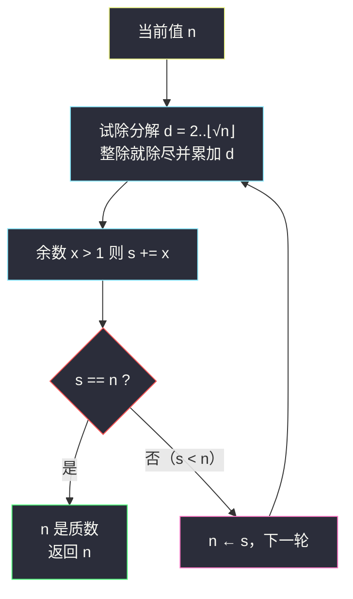

# 2507. 使用质因数之和替换后可以取到的最小值（Smallest Value After Replacing With Sum of Prime Factors）

> 题目来源：[https://leetcode.cn/problems/smallest-value-after-replacing-with-sum-of-prime-factors/](https://leetcode.cn/problems/smallest-value-after-replacing-with-sum-of-prime-factors/)
>
> 灵茶题单小节定位：§1.3 质因数分解

## 一、问题描述

给你一个正整数 `n`。

请你将 `n` 的值替换为 `n` 的**质因数**之和，重复这一过程。

注意，如果 `n` 能够被某个质因数多次整除，则在求和时，应当包含这个质因数同样次数。

返回 `n` 可以取到的最小值。

**数据范围**：

- `2 <= n <= 10⁵`

**示例 1**：

```text
输入：n = 15
输出：5
解释：最开始，n = 15。
15 = 3 × 5，所以 n 替换为 3 + 5 = 8。
8 = 2 × 2 × 2，所以 n 替换为 2 + 2 + 2 = 6。
6 = 2 × 3，所以 n 替换为 2 + 3 = 5。
5 是 n 可以取到的最小值。
```

**示例 2**：

```text
输入：n = 3
输出：3
解释：最开始，n = 3。
3 是 n 可以取到的最小值。
```

**核心思考点**：每轮做一次**质因数分解**（计重数），把 `n` 换成全部质因数之和，直到值不再变化。两个关键：① 分解模板「试除到 √n、余数 > 1 补上」；② 终止条件——新值 `s` 与旧值相等时停止（说明 `n` 已是质数，或分解后和等于自身，值不再下降）。

## 二、暴力解法

### 思路

模拟题意：每轮对当前 `n` 做**带重数的质因数分解**求和 `s`；若 `s == n` 说明值不再变化（`n` 是质数），停止返回；否则 `n ← s` 继续下一轮。

判断「n 的质因数」时，暴力版可以先用 `is_prime(x)` 判断再试除——但真正标准的是试除法本身：从小到大枚举 `i = 2, 3, ...`，只要 `i` 整除 `n` 就不断除尽，`i` 天然全是质数（合数因子早被更小的质因子除掉了）。

### 代码

```python
def smallestValueBrute(n: int) -> int:
    def factor_sum(x: int) -> int:          # x 的质因数之和（计重数）
        s, d = 0, 2
        while d * d <= x:
            while x % d == 0:
                s += d
                x //= d
            d += 1
        if x > 1:                            # 剩下的大于 √x 的质因子
            s += x
        return s

    while True:
        s = factor_sum(n)
        if s == n:                           # 不再变化：n 为质数
            return n
        n = s
```

### 复杂度

- 时间：单轮分解 `O(√n)`；轮数很小（见 3.2 分析），总体 `O(√n · log n)` 级别。
- 空间：`O(1)`。

## 三、优化探索

### 3.1 为什么试除出来的因子必然是质数？

枚举 `d` 从 2 开始，只要 `d | x` 就把 `x` 中的 `d` **除干净**再前进。若某个 `d` 是合数（`d = p·q`，`p` 为质数且 `p < d`），那么 `x` 能被 `d` 整除就必须能被 `p` 整除——但 `p` 的所有次数在更早的轮次已被除尽，矛盾。所以进入「整除」分支的 `d` 只能是质数，无需额外 `is_prime` 判断。这是质因数分解的标准论证。

### 3.2 为什么循环必然终止、轮数极少？ ⭐

观察每次替换 `n → s`（设 `n` 是合数，质因数为 `p₁ × p₂ × ... × pₖ`，`k ≥ 2`）：

- `s = p₁ + p₂ + ... + pₖ`，而算术基本定理给出 `n = p₁ × p₂ × ... × pₖ`。
- 对 `k ≥ 2` 个 ≥ 2 的数，**和严格小于积**（`2×3 > 2+3`，`2×2 > 2+2`，积随因子增多增长远快于和）。故每轮 `s < n`，值**严格递减**，循环必然终止。
- 值域 `10⁵`，且从第二轮起值已大幅缩小（`10⁵` 的质因数和最多 `2+2+...+2` 对应 `2¹⁶ > 10⁵`，故和不超过 17×2 = 34 左右量级），**实际轮数 ≤ 5 轮左右**。



### 3.3 细节坑：s == n 不止质数一种情形吗？

`s == n` 时，要么 `n` 是质数（分解只有自身，和等于自身），要么 `n` 是「质因数积 = 和」的合数——但 3.2 已证合数时和严格小于积，不存在后者。因此 `s == n ⇔ n` 是质数，终止条件干净可靠。

⚠ 有一个经典易错点：**不要用 `s < n` 作为唯一循环条件后返回错误的量**。若写成 `while s < n: n = s` 再返回 `n`，与本文写法等价；但若把「是否停止」判在更新之后（如 `n = s` 后再比较），容易在质数输入（示例 2：`n = 3` 首轮 `s = 3`）上多绕或提前退出，务必像上面那样「先算 `s`、比较、再更新」。

## 四、代码实现

### 主解：试除分解模拟

```python
class Solution:
    def smallestValue(self, n: int) -> int:
        while True:
            x, s, d = n, 0, 2
            while d * d <= x:            # 试除到 √x
                while x % d == 0:        # 除干净因子 d（计重数）
                    x //= d
                    s += d
                d += 1
            if x > 1:                    # 残留的大质因子
                s += x
            if s == n:                   # 质数：值不再变化
                return n
            n = s
```

### 进阶写法（等价微调）

内层试除可以只枚举 `2` 和奇数（或 6k±1），把常数再压小——本题 `n ≤ 10⁵` 没有必要，仅作为大值域时的习惯：

```python
class Solution:
    def smallestValue(self, n: int) -> int:
        while True:
            s, x = 0, n
            for d in [2] + list(range(3, isqrt(x) + 1, 2)):
                while x % d == 0:
                    x //= d
                    s += d
            if x > 1:
                s += x
            if s == n:
                return n
            n = s
```

### 细节说明

- **`d * d <= x` 用的是「当前剩余值 x」而不是初始 n**：每除尽一个因子，`x` 缩小，平方根上界随之收紧，这是试除模板效率的来源。
- **残留 `x > 1` 必是质数**：大于 `√(原剩余值)` 的因子至多一个（若有两个，乘积已超）。
- **Java 版（可选）**：逻辑同上，`int` 足够（值只降不升）。

## 五、例子演示

**示例 1 端到端：n = 15**

| 轮次 | 当前 n | 分解过程 | 质因数（计重） | s | 比较 |
|---|---|---|---|---|---|
| 1 | 15 | `d=2` 不整除；`d=3`：`15/3=5`，余 5；`d·d=16>5` 停 | `3, 5` | `3+5 = 8` | `8 ≠ 15` → 继续 |
| 2 | 8 | `d=2`：`8/2=4`、`4/2=2`、`2/2=1`；余 1 | `2, 2, 2` | `2+2+2 = 6` | `6 ≠ 8` → 继续 |
| 3 | 6 | `d=2`：`6/2=3`；余 3；`d·d=9>3` 停 | `2, 3` | `2+3 = 5` | `5 ≠ 6` → 继续 |
| 4 | 5 | `d=2` 不整除；`d·d=4 ≤ 5` 也不整除；余 5 | `5` | `5` | `5 == 5` → **返回 5** ✅ |

**示例 2：n = 3（质数输入）**：第 1 轮分解，`d=2` 时 `d·d=4 > 3` 直接跳出，残留 `x=3`，`s = 3 == n`，返回 **3** ✅——验证了 3.3 的终止分析。

**自造例子 n = 4**：第 1 轮 `4 = 2×2`，`s = 4 == 4`？注意 `2+2 = 4` 恰好相等！但 4 是合数，`s == n` 时值也不再变化（替换后仍是 4），返回 **4** 同样正确——这说明「s == n 停止」作为代码条件是完备的（无论质数还是这种特殊不动点，值都不再下降）。有意思的是 `4` 是唯一满足「合数且质因数和等于自身」的数（`2+2 = 2×2`），`8 = 2+2+2 = 6 < 8` 已不满足。

## 六、复杂度分析

- **时间复杂度：`O(√n)`**
  - 首轮分解 `O(√n)`；此后值 ≤ 约 `2·log₂n ≈ 34`，后续每轮 `O(√34)` 常数级，轮数 ≤ 5。
  - 严格上界写 `O(√n + log n · √log n)` 也没问题，工程上记 `O(√n)`。
- **空间复杂度：`O(1)`**——只用了常数个变量。

## 七、对比总结

| 维度 | 暴力（逐个判断质数再收集） | 主解（标准试除分解） |
|---|---|---|
| 时间 | `O(n)` 级（对每个候选判素） | `O(√n)` |
| 空间 | `O(1)` | `O(1)` |
| 正确性论证 | 直白 | 试除因子必质（3.1） |
| 通用性 | 值域一大就崩 | 所有「分解质因数」题通吃 |

**套路归纳**：带重数的质因数分解模板——`d` 从 2 试除到 `⌊√x⌋`（对**当前剩余值**取根号），整除就除尽并累加，结束后残留 `x > 1` 补一笔。本题再叠一层「和 < 积 ⇒ 值严格递减 ⇒ 模拟必然终止」的收敛论证。凡是「反复变换直到稳定」的题，先问两件事：变换是否单调（这里严格递减）、稳定点如何判别（`s == n`）。

## 八、举一反三

1. **[2521. 数组乘积中的不同质因数数目](https://leetcode.cn/problems/distinct-prime-factors-of-product-of-array/)**：对每个元素做本题同款试除分解（不计重数），把模板从单数扩到数组。
2. **[263. 丑数](https://leetcode.cn/problems/ugly-number/)**：判断质因数是否只含 {2,3,5}，试除除尽思路的判别版。
3. **[264. 丑数 II](https://leetcode.cn/problems/ugly-number-ii/)**：从「分解」转向「合成」，三指针生成质因数受限的数。
4. **[952. 按公因数计算最大组件大小](https://leetcode.cn/problems/largest-component-size-by-common-factor/)**：质因数分解 + 并查集，分解模板的图论化。
5. **[1808. 好因子的最大数目](https://leetcode.cn/problems/maximize-number-of-nice-divisors/)**：从质因数次幂反推因子计数，交换「积 ↔ 和」视角的进阶题。

**同族互引**：灵茶一期 math 专题里，`factorial-trailing-zeroes.md`（#172）研究「阶乘中质因数 5 的幂次」——与本题同为「质因数分解」小节的两大经典；`most-frequent-prime.md`（#3044）则是「判断质数」的应用侧练习。
