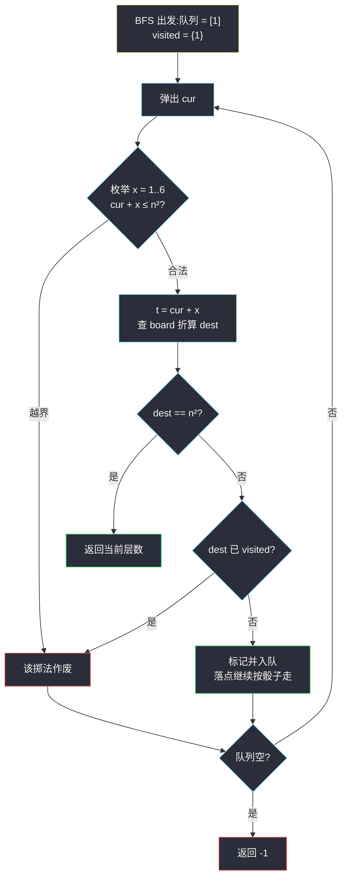

# 蛇梯棋(编号映射 BFS · 一维化棋盘 + 传送门一次结算)

## 一、问题描述

给你一个大小为 `n x n` 的整数矩阵 `board`,棋盘按**牛耕式转行书写**(boustrophedon)规则编号:

- 从 `board[n-1][0]`(左下角)开始编号 `1`;
- 沿当前行走到行尾后,**上一行且方向反转**(先向右再向左交替),直到 `board[0][...]` 编号 `n²`。

`board[r][c]` 的含义:

- `-1`:平地,不触发任何事件;
- 其他值:该格是**蛇或梯子**的起点,走到这里**必须**传送到对应编号的格子。

你从编号 `1` 的格子出发。每个回合你掷骰子得到 `x ∈ [1, 6]`:

1. 只有当 `当前编号 + x ≤ n²` 时才能移动到 `当前编号 + x`(掷大了不算步数白走,直接换下一种掷法);
2. 若落点是蛇或梯子的起点,**必须**传送到它的终点;
3. **一回合至多传送一次**——传送的终点即便又是蛇/梯子起点,也不再传送;
4. 到达编号 `n²` 时游戏结束。

返回到达 `n²` 的**最少回合数**;无法到达返回 `-1`。

> 🔗 LeetCode 909:https://leetcode.cn/problems/snakes-and-ladders/
>
> 数据范围:`2 <= n <= 20`,`board[i][j]` 为 `-1` 或区间 `[1, n²-1]` 内的编号。

**示例 1**(官方 6 x 6)

```text
board = [[-1,-1,-1,-1,-1,-1],
         [-1,-1,-1,-1,-1,-1],
         [-1,-1,-1,-1,-1,-1],
         [-1,35,-1,-1,13,-1],
         [-1,-1,-1,-1,-1,-1],
         [-1,15,-1,-1,-1,-1]]
输出:4
解释:1 →(掷1)→ 2,遇梯子到 15 →(掷2)→ 17,遇蛇到 13
    →(掷1)→ 14,遇梯子到 35 →(掷1)→ 36,共 4 回合。
```

**直观理解**

把棋盘的「蛇形排布」看成**花式摆放**:格子之间真正的移动关系只取决于**编号**,与行列位置无关。于是问题退化成「编号 `1` 到编号 `n²` 的无权图最短路」——每条边是「掷一次骰子,再被传送门折算」,标准的 BFS 分层计数。

---

## 二、暴力解法

不带任何记忆地 DFS 枚举所有掷骰序列,记录能到达 `n²` 的最小回合数:

```python
class Solution:
    def snakesAndLadders(self, board: List[List[int]]) -> int:
        n = len(board)
        self.ans = n * n + 1          # 哨兵:超过最大可能步数

        def to_rc(s):                 # 编号 → 坐标
            q, r = divmod(s - 1, n)
            return n - 1 - q, (r if q % 2 == 0 else n - 1 - r)

        def dfs(cur, steps):
            if cur == n * n:
                self.ans = min(self.ans, steps)
                return
            if steps >= n * n:        # 防环上限
                return
            for nxt in range(cur + 1, min(cur + 6, n * n) + 1):
                r, c = to_rc(nxt)
                dest = board[r][c] if board[r][c] != -1 else nxt
                dfs(dest, steps + 1)

        dfs(1, 0)
        return self.ans if self.ans <= n * n else -1
```

### 复杂度

- **时间**:每个状态 6 个分支,路径长可达 `n²`,最坏 `O(6^(n²))`——纯指数级,`n = 20` 时天文数字。
- **空间**:`O(n²)` 递归栈。

### 🔴 瓶颈在哪里

**同一个编号被反复探索**。蛇会把人拉回小编号(成环),DFS 不带记忆就会在同一批格子上兜圈子。编号只有 `n²` 个,「每个编号只处理一次」是唯一的出路——这正是 BFS + visited 的用武之地。

---

## 三、优化探索(核心章节)

> 📚 本题出自灵茶题单一期 **§二、网格图 BFS**,模板要点:**编号映射 BFS**——棋盘一维编号到二维行列的换算,传送门只许一次且落点继续按骰子走,集合/数组防环。

### 3.1 观察特征

| 特征 | 说明 |
|------|------|
| 每条边代价相同(掷一次骰子) | 无权图最短路 → BFS 层数即回合数 |
| 图结构只依赖编号 | 二维棋盘是「摆放方式」,BFS 状态可直接用编号 `1..n²` |
| 传送门是强制的 | 落到起点**必须**走,没有「留在原地」的选项 |
| 蛇会回拉编号 | 图有环,必须 visited 防重复入队 |
| `n <= 20` | 最多 400 个状态,BFS 秒级 |

### 3.2 关键一步:编号 ↔ 坐标映射

牛耕式编号的规律,把编号 `s` 减 1 后 `divmod(s-1, n)`:

- 商 `q`:自底向上第几行 → 实际行号 `n - 1 - q`;
- 余 `r`:行内第几个;
- **偶数行**(q 为偶)从左到右,列号就是 `r`;**奇数行**(q 为奇)从右到左,列号是 `n - 1 - r`。

以 `n = 3` 为例:

```text
编号布局(↑ 为行号递增方向):
行0:  7  8  9      ← 第 2 行(q=2 偶),从左到右
行1:  6  5  4      ← 第 1 行(q=1 奇),从右到左
行2:  1  2  3      ← 第 0 行(q=0 偶),从左到右
```

只此一个公式,棋盘的蛇形就被「抹平」成一条 `1..n²` 的一维链。

### 3.3 传送门:邻接边的一次性折算

从编号 `cur` 出发的一条边是:

```text
掷 x ∈ [1,6] 且 cur + x ≤ n²
    → 落点 t = cur + x
    → 读 board 值:dest = board[to_rc(t)] 若非 -1,否则 dest = t
    → dest 就是这条边的终点(不再二次传送)
```

注意三个细节:

1. **`visited` 标记打在 `dest` 上**(传送后的最终落点),而不是骰子落点 `t`——真正成为状态的是 `dest`;
2. `t == n²` 直接返回(终格编号必为平地,但即便写传送也只是原地不动,先判更省事);
3. 起点编号 `1` **不触发传送**——传送只发生在掷骰子之后,起点原地不动没有回合。

### 3.4 防环:为什么蛇不可怕

蛇把编号拉回去,图里出现环,BFS 依然正确:visited 保证每个编号只入队一次,蛇造成的「回头边」要么指向已访问编号(被剪),要么指向新编号(正常扩展)。最坏时间 `O(n²)`。



### 3.5 一句话核心

> **棋盘蛇形只是排布,BFS 状态就是编号;掷骰 + 传送门折算成一条边,visited 打在传送终点上。**

---

## 四、代码实现

### Python(主解:一维编号 BFS)

```python
class Solution:
    def snakesAndLadders(self, board: List[List[int]]) -> int:
        n = len(board)
        target = n * n

        def to_rc(s: int):                       # 编号 → (行, 列)
            q, r = divmod(s - 1, n)
            return n - 1 - q, (r if q % 2 == 0 else n - 1 - r)

        visited = {1}                             # 集合防环
        q = deque([1])
        step = 0
        while q:
            step += 1
            for _ in range(len(q)):               # 整层 = 同一回合数
                cur = q.popleft()
                for t in range(cur + 1, min(cur + 6, target) + 1):
                    r, c = to_rc(t)
                    dest = board[r][c] if board[r][c] != -1 else t
                    if dest == target:            # 到达终点
                        return step
                    if dest not in visited:
                        visited.add(dest)         # 标记打在折算后的落点
                        q.append(dest)
        return -1
```

**变量含义**

| 变量 | 含义 |
|------|------|
| `to_rc(s)` | 编号映射:牛耕式编号 → 二维坐标 |
| `t` | 骰子落点(可能被传送门覆盖,未必成为状态) |
| `dest` | 折算后的真正落点,BFS 的邻居 |
| `step` | 当前 BFS 层数,即已用回合数 |

**循环不变式**:第 `step` 层处理前,队列里恰好是所有「最少 `step - 1` 回合可达且未结算」的编号;任何编号只入队一次。

**细节提醒**:若担心极端输入把起点写成传送门——规则上起点不触发传送,代码从掷骰子开始,天然满足。

### Java(最优解环节)

```java
class Solution {
    public int snakesAndLadders(int[][] board) {
        int n = board.length, target = n * n;
        boolean[] visited = new boolean[target + 1];
        Deque<Integer> q = new ArrayDeque<>();
        q.offer(1);
        visited[1] = true;
        for (int step = 1; !q.isEmpty(); step++) {
            for (int sz = q.size(); sz > 0; sz--) {
                int cur = q.poll();
                for (int t = cur + 1; t <= Math.min(cur + 6, target); t++) {
                    int[] rc = toRC(board, n, t);
                    int dest = board[rc[0]][rc[1]] != -1 ? board[rc[0]][rc[1]] : t;
                    if (dest == target) return step;
                    if (!visited[dest]) {
                        visited[dest] = true;
                        q.offer(dest);
                    }
                }
            }
        }
        return -1;
    }

    private int[] toRC(int[][] board, int n, int s) {
        int q = (s - 1) / n, r = (s - 1) % n;
        return new int[]{n - 1 - q, q % 2 == 0 ? r : n - 1 - r};
    }
}
```

---

## 五、具体例子演示

用官方 6 x 6 示例端到端走一遍。三个传送门:格 2 → 15(`board[5][1]`)、格 17 → 13(`board[3][4]`)、格 14 → 35(`board[3][1]`)。目标 `n² = 36`。

**先校准编号映射**(抽查):格 13 → `divmod(12,6) = (2,0)`,行 `5-2 = 3`,偶行取列 0 → `(3,0)`;格 17 → `divmod(16,6) = (2,4)` → `(3,4)`;格 36 → `divmod(35,6) = (5,5)` → 行 0,奇行列 `5-5 = 0` → `(0,0)` ✓(最右上角)。

**BFS 逐层状态表**(只列产生新状态的掷法;「→梯/蛇」表示传送折算):

| 层(回合) | 弹出 cur | 掷 x | 落点 t | 折算 dest | 新入队 |
|-----------|----------|------|--------|-----------|--------|
| 1 | 1 | 1 | 2 | **15**(梯子) | 15 |
| 1 | 1 | 2~6 | 3,4,5,6,7 | 均平地 | 3,4,5,6,7 |
| 2 | 15 | 1~6 | 16,17,18,19,20,21 | 17→**13**(蛇),其余平地 | 16,13,18,19,20,21 |
| 2 | 3~7 | 各掷 | 4..13 | 均平地或已访问 | 8,9,10,11,12 |
| 3 | 16 | 1~6 | 17..22 | 平地或已访问 | 22 |
| 3 | 13 | **1** | 14 | **35**(梯子) | **35** |
| 3 | 13 | 2~6 | 15,16,17,18,19 | 平地或已访问 | — |
| 3 | 18~21 | 各掷 | 19..27 | 平地或已访问 | 23,24,25,26,27 |
| 3 | 8~12 | 各掷 | 9..18 | 全部落入已访问集合 | — |
| 4 | 22 | 1~6 | 23..28 | 平地或已访问 | 28 |
| 4 | **35** | **1** | **36** | 到达 `n²` | **返回 4** |

**关键三步回放**:

- 层 1:掷 1 落到格 2,被梯子**折算**成 15 入队——骰子落点 2 本身不进 visited;
- 层 2:从 15 掷 2 落到格 17,被蛇折算成 13 入队——**蛇并没有坏事**,反而把状态送到了离 36 更近的「梯子聚集区」;
- 层 3:从 13 掷 1 落到格 14,被梯子折算成 35;层 4 从 35 掷 1 直达 36,`step = 4` ✓。

**如果 visited 打在骰子落点 t 上会怎样?** 格 2 已被标记,15 仍会入队,看似没漏;但考虑反例:格 `a` 与格 `b` 传送门都指向 `c`,若先标记 `a`,`b` 的传送终点 `c` 不受影响——只有当**骰子落点本身**被重复标记时才会错杀。本题中骰子落点也可能被多个状态共用,统一在 `dest` 上标记最不易出错,语义也更清晰:「状态 = 折算后真正站稳的格子」。

**最终输出**:`4` ✓,与官方一致。

---

## 六、复杂度分析

| 方法 | 时间 | 空间 | 说明 |
|------|------|------|------|
| 无记忆 DFS | `O(6^(n²))` | `O(n²)` | 环导致指数膨胀 |
| 编号 BFS(主解) | `O(n²)` | `O(n²)` | 每编号至多出队一次,每次 6 条边;`to_rc` 为 `O(1)` |

`n = 20` 时状态 400 个,边 2400 条,毫秒级。

---

## 七、对比总结

**同构链**——「BFS 最短路」在不同棋盘上的变奏:

| 题 | 状态空间 | 每步转移 |
|----|----------|----------|
| #1091 二进制矩阵中的最短路径 | 二维坐标 | 八方向移动 |
| #752 打开转盘锁 | 四位数字串 | 一位 ±1 |
| #909 本篇 | **一维编号**(棋盘只是排布) | 骰子 +1..+6,再经传送门折算 |

**易错点**

1. **编号映射的奇偶行反转**:`q % 2 == 1` 的行从右到左,列号要取 `n - 1 - r`,忘了反转全盘错位。
2. **`cur + x ≤ n²` 的上界**:`range(cur+1, min(cur+6, target)+1)`,掷出界的骰子直接无效,不是「留在原地耗一回合」。
3. **传送门强制且仅一次**:落点是蛇/梯子必须传送;传送终点再是传送门也不再传。
4. **visited 标记在折算终点 `dest` 上**,与状态定义保持一致。
5. 起点编号 1 不触发传送(传送只随掷骰子发生)。
6. 别忘了「无解返回 -1」——队列耗尽即无解,例如终点被蛇环包围。

**模板(编号映射 BFS,Python)**

```python
def bfs():
    visited = {1}
    q = deque([1])
    step = 0
    while q:
        step += 1
        for _ in range(len(q)):
            cur = q.popleft()
            for t in range(cur + 1, min(cur + 6, target) + 1):
                dest = 传送门折算(t)          # board 值非 -1 则折算
                if dest == target:
                    return step
                if dest not in visited:
                    visited.add(dest)
                    q.append(dest)
    return -1
```

---

## 八、举一反三

| 题目 | 关系 |
|------|------|
| [1091. 二进制矩阵中的最短路径](https://leetcode.cn/problems/shortest-path-in-binary-matrix/) | 同目录 `shortest-path-in-binary-matrix.md`:网格 BFS 分层的基础模板 |
| [752. 打开转盘锁](https://leetcode.cn/problems/open-the-lock/) | 一维化状态 BFS 的另一经典:四位数字串 + 旋转邻接 |
| [1306. 跳跃游戏 III](https://leetcode.cn/problems/jump-game-iii/) | 一维数组 ±i 跳转 BFS,visited 防环思路完全同构 |
| [1162. 地图分析](https://leetcode.cn/problems/as-far-from-land-as-possible/) | 同目录 `as-far-from-land-as-possible.md`:多源 BFS,层的另一种用法 |
| [LCP 07. 传递信息](https://leetcode.cn/problems/chuan-di-xin-xi/) | 邻接表 + 逐层计数,BFS 结构相同(改求方案数) |

**思想迁移**

- **降维观察**:当图结构只依赖「编号/值」而与几何排布无关时,把二维摆拍平成一维链,BFS 状态立刻简洁——类似的还有 #1306(下标即状态)、#752(字符串即状态)。
- **强制转移 = 边的折算**:「必须传送」「必须跳到 `arr[i]`」这类规则,都只是在建边时做一次映射,BFS 框架不动。
- **环不可怕,重复才可怕**:BFS 的 visited 保证每个状态只结算一次,图的环自动被消化。
