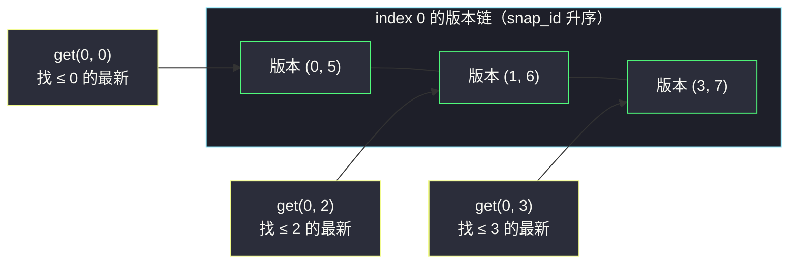
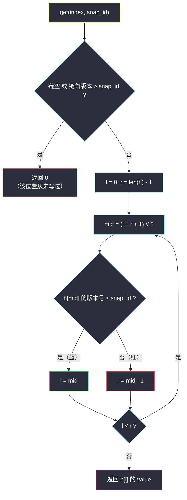

# 快照数组（每下标版本历史 + 二分取最新）

## 一、问题描述

请你实现支持**快照**（snapshot）的数组 `SnapshotArray`：

- `SnapshotArray(int length)`：初始化一个长度为 `length` 的数组，初始每个元素都是 `0`；
- `void set(index, val)`：把下标 `index` 处的元素设为 `val`（对**尚未拍摄**的快照生效）；
- `int snap()`：拍摄快照并返回其编号 `snap_id`，编号从 `0` 开始，每调用一次**自增一次**——即使两次 `snap()` 之间没有任何 `set`，编号照样连续增长；
- `int get(index, snap_id)`：返回在编号为 `snap_id` 的快照中，下标 `index` 处的值。

> 🔗 LeetCode 1146：https://leetcode.cn/problems/snapshot-array/
>
> 数据范围：`1 <= length <= 5 * 10^4`，三种方法调用总次数 `<= 5 * 10^4`，
> `0 <= index < length`，`0 <= snap_id < snap() 的调用次数`，`-10^5 <= val <= 10^5`。

**示例**

```
输入：
["SnapshotArray","set","snap","set","get"]
[[3],[0,5],[],[0,6],[0,0]]
输出：
[null,null,0,null,5]

解释：
- SnapshotArray(3)：arr = [0, 0, 0]
- set(0, 5)：arr = [5, 0, 0]
- snap()：拍下第 0 张快照（此刻 arr = [5,0,0]），返回 0
- set(0, 6)：arr = [6, 0, 0]（尚未拍快照）
- get(0, 0)：第 0 张快照时下标 0 的值 = 5
```

**直观理解**

`get` 要「时光回放」：任意时刻、任意位置、查任意历史版本的值。整块数组每拍一次照才定格一次，而 `set` 只改动一个格子——全量拷贝显然浪费。正确姿势是把每个格子的**写历史**记成一条按快照编号有序的版本链，查询时在链上**二分**找「编号不超过 `snap_id` 的最新一条」。这正是灵茶题单 §1.2 的「预处理有序结构 + 二分查询」在数据结构设计题上的落法。

---

## 二、暴力解法

### 暴力 1：每次 snap 全量拷贝

`snap()` 时把整个数组复制一份存起来，`get` 直接查表：

```python
class SnapshotArray:
    def __init__(self, length: int):
        self.arr = [0] * length
        self.snaps = []                       # snaps[i] = 第 i 张快照的数组副本

    def set(self, index: int, val: int) -> None:
        self.arr[index] = val

    def snap(self) -> int:
        self.snaps.append(self.arr[:])        # O(n) 拷贝
        return len(self.snaps) - 1

    def get(self, index: int, snap_id: int) -> int:
        return self.snaps[snap_id][index]     # O(1)
```

- **时间**：`snap()` 单次 `O(n)`，最坏 `5 * 10^4` 次 `snap` × `5 * 10^4` 长度 = `2.5 * 10^9` 步，超时；
- **空间**：`O(n * snap 次数)`，同量级爆炸——而其中绝大多数格子两次快照之间**根本没变**。

### 暴力 2：全局写日志，get 倒着扫

把每次 `set` 追加进全局列表 `(snap_id, index, val)`，`get` 时倒序扫日志找该 `index` 最后一条 `snap_id` 合法的记录。`set` 变 `O(1)`，但 `get` 退化到 `O(总 set 次数)`，最坏同样是 `2.5 * 10^9` 量级。

### 🔴 瓶颈在哪里

两种暴力都把「不相关位置」的数据也带着走。真正需要的只有：**每个位置自己的、按时间有序的写历史**。

---

## 三、优化探索（核心章节）

> 📚 本题在灵茶题单中属于 **§1.2 二分进阶（排序 / 预处理 + 二分）**。与同批 [#2080 区间频率](range-frequency-queries.md)（值 → 有序下标表）互为镜像：这里每个**下标**挂一张 `(snap_id, value)` 升序版本表，`get` 用灵神**求最大**模板（`check(mid)` 满足则 `l = mid`）找最新版本。

### 3.1 关键观察：快照本质是「带版本号的写」

维护计数器 `cur` = 下一次 `snap()` 将返回的编号（初始 0）。于是：

- `set(index, val)` 是「在版本 `cur` 下写一格」；
- `snap()` 只需 `cur += 1` 并返回旧值——**它什么都不用保存**！快照是「虚拟」的，数据全部由 `set` 惰性记录。

每个下标 `index` 维护一条版本链 `history[index] = [(snap_id, value), ...]`。写入规则：

- 若链尾的版本号**等于** `cur`：说明同一快照期内已经写过，**覆盖**链尾（同一次快照定格的是最后一次写）；
- 否则：追加 `(cur, val)`。

由于 `cur` 只增不减，追加进链的版本号**天然升序，无需排序**。

### 3.2 get = 在版本链上找「版本号 ≤ snap_id 的最后一条」

对 `h = history[index]`，找**最大**的 `x` 使 `h[x].snap_id <= snap_id`：



版本号随下标单调不减，`check(x) = h[x].snap_id <= snap_id` 呈**左真右假**：早版本能回放、晚版本不能——答案 = **最右蓝**，套「求最大」模板。

**初始值 0 的兜底**：若链为空，或链首版本号已 `> snap_id`（第一次写发生在快照 `snap_id` 之后），说明那个位置在快照 `snap_id` 时从未被写过 → 返回初始值 `0`。

### 3.3 统一模板（求最大）

```
求满足 check(x) 的最大下标 x（红蓝染色，右假左真）：
    前提：check(l) 为真（已先特判「链首 > snap_id」的情形）
    l, r = 0, len(h) - 1          # 闭区间
    while l < r:
        mid = (l + r + 1) // 2    # ★ 求最大必须上取整
        if h[mid].snap <= snap_id: l = mid      # mid 蓝：可回放，试更新的版本
        else:                        r = mid - 1 # mid 红：太晚，回退
    # 循环结束 l == r = 可回放的最晚版本
```

与「求最小」模板（同批 `koko-eating-bananas.md`：`check` 满足 `r = mid`）对照：求最大是 `check` 满足 `l = mid`，且 `mid` 必须**上取整**，否则 `r = l + 1` 时 `mid = l` 搭上 `l = mid` 就是死循环。



### 3.4 为什么「同一快照期覆盖写」既正确又省

不覆盖（同版本多条照单全收）时，`get` 找到的仍是该版本**最后一条**，结果一样正确——但链更长、内存更大。覆盖版每次快照期每个下标至多留一条，链长 ≤ `set` 次数，且同一版本号不会重复出现，链的「有序 + 严格」性质更干净。面试写覆盖版。

### 3.5 一句话核心

> **写时记 `(snap_id, value)` 进该下标的版本链（同版本覆盖），`snap()` 只递增计数器；`get` 在链上求最大二分找「编号 ≤ snap_id」的最新版本，没写过就返回 0。**

---

## 四、代码实现

### Python（主解：版本链 + 手写求最大二分）

```python
class SnapshotArray:
    def __init__(self, length: int):
        self.history = [[] for _ in range(length)]  # 每下标一条 (snap_id, value) 升序链
        self.cur = 0                                # 下一次 snap() 将返回的编号

    def set(self, index: int, val: int) -> None:
        h = self.history[index]
        if h and h[-1][0] == self.cur:
            h[-1] = (self.cur, val)                 # 同一快照期内覆盖写
        else:
            h.append((self.cur, val))               # 新版本追加，天然有序

    def snap(self) -> int:
        self.cur += 1
        return self.cur - 1                         # 快照是虚拟的：只动计数器

    def get(self, index: int, snap_id: int) -> int:
        h = self.history[index]
        if not h or h[0][0] > snap_id:              # 从未写 / 首次写在快照之后
            return 0
        l, r = 0, len(h) - 1                        # 求「最后一个版本号 <= snap_id」
        while l < r:
            mid = (l + r + 1) // 2                  # 求最大：上取整防死循环
            if h[mid][0] <= snap_id:
                l = mid                             # 这个版本可回放，试更新的
            else:
                r = mid - 1                         # 版本太晚，回退
        return h[l][1]
```

**变量含义**

| 变量 | 含义 |
|------|------|
| `cur` | 下一次 `snap()` 的编号；当前未定格的「工作版本号」 |
| `history[index]` | 该下标的 `(snap_id, value)` 升序链，长度 ≤ 该下标的写入次数 |
| `h[mid][0] <= snap_id` | check：版本 `mid` 在快照 `snap_id` 时已经存在 |
| `h[l][1]` | 循环结束时的返回值：最新可回放版本的值 |

等价的 `bisect` 版本（元组字典序小技巧：`(s,)` 小于任何以 `s` 开头的二元组）：

```python
from bisect import bisect_left

    def get(self, index: int, snap_id: int) -> int:
        h = self.history[index]
        i = bisect_left(h, (snap_id + 1,)) - 1      # 最后一个版本号 <= snap_id
        return h[i][1] if i >= 0 else 0
```

### Java（最优解同款写法）

```java
class SnapshotArray {
    private List<int[]>[] history;   // 每下标: int[]{snapId, val}
    private int cur;

    @SuppressWarnings("unchecked")
    public SnapshotArray(int length) {
        history = new ArrayList[length];
        for (int i = 0; i < length; i++) {
            history[i] = new ArrayList<>();
        }
    }

    public void set(int index, int val) {
        List<int[]> h = history[index];
        if (!h.isEmpty() && h.get(h.size() - 1)[0] == cur) {
            h.set(h.size() - 1, new int[]{cur, val});   // 同版本覆盖
        } else {
            h.add(new int[]{cur, val});                 // 新版本
        }
    }

    public int snap() {
        return cur++;
    }

    public int get(int index, int snap_id) {
        List<int[]> h = history[index];
        if (h.isEmpty() || h.get(0)[0] > snap_id) return 0;
        int l = 0, r = h.size() - 1;
        while (l < r) {
            int mid = l + (r - l + 1) / 2;              // 求最大：上取整
            if (h.get(mid)[0] <= snap_id) l = mid;
            else r = mid - 1;
        }
        return h.get(l)[1];
    }
}
```

---

## 五、具体例子演示

以官方示例端到端走一遍：`SnapshotArray(3)` 初始 `cur = 0`，三条版本链全空。

| 步骤 | 调用 | 内部变化 | 说明 |
|------|------|----------|------|
| 1 | `set(0, 5)` | `h[0]: [] → [(0,5)]` | 在版本 0 下写 |
| 2 | `snap()` → 0 | `cur: 0 → 1` | 不搬任何数据 |
| 3 | `set(0, 6)` | `h[0]: [(0,5)] → [(0,5),(1,6)]` | `cur=1` 与链尾版本不同，追加 |
| 4 | `get(0, 0)` | 二分 | 见下表 |

**get(0, 0)：在 `h[0] = [(0,5), (1,6)]` 上找「版本号 ≤ 0」的最后一条**，`l = 0, r = 1`：

| 轮次 | l | mid | r | h[mid] | check：版本 ≤ 0 ? | 染色 | 动作 |
|------|---|-----|---|--------|-------------------|------|------|
| 1 | 0 | 1 | 1 | (1,6) | ✗ | 红 | `r = 0` |
| 结束 | 0 | — | 0 | — | — | — | 返回 `h[0][1] = 5` ✓ |

这正是示例答案 **5**：第 0 张快照定格在 `set(0,6)` 之前。

**继续追加几个调用**，体会覆盖写与初始值兜底：

```
snap() → 1        // cur: 1 → 2，期间无人 set，编号照样连续
set(1, 9)         // h[1]: [] → [(2,9)]
set(1, 7)         // h[1]: [(2,9)] → [(2,7)]   ← 链尾版本同为 2，覆盖而非追加
snap() → 2        // cur: 2 → 3
```

- **get(0, 1)**：`h[0] = [(0,5),(1,6)]`，`l=0, r=1`，`mid=1`：版本 1 ≤ 1 ✓ 蓝 → `l=1`；循环结束返回 `h[1][1] = 6` ✓；
- **get(1, 1)**：`h[1] = [(2,7)]`，链首版本 2 > 1 → 触发特判返回 **0**（快照 1 时下标 1 还从未写过）✓；
- **get(1, 2)**：链首 2 ≤ 2，`l == r = 0` 直接返回 **7** ✓——注意是 7 不是 9，覆盖写保证了同一快照期只留最后一次。

三次 `get` 的复杂度分别是 `O(log 2)`、`O(1)`（特判）、`O(1)`（单元素链）——链越短二分越快，这就是 3.4 节覆盖写省下来的。

---

## 六、复杂度分析

| 方法 | set | snap | get | 空间 |
|------|-----|------|-----|------|
| 暴力 1 全量拷贝 | `O(1)` | `O(n)` | `O(1)` | `O(n * S)`，S = snap 次数 |
| 暴力 2 全局日志 | `O(1)` | `O(1)` | `O(总 set 数)` | `O(总 set 数)` |
| 版本链 + 二分（本篇） | `O(1)` 均摊 | `O(1)` | `O(log V)` | `O(总 set 数)` |

`V` 为该下标的版本数，`V <= 总 set 次数 <= 5 * 10^4`，`log2(5 * 10^4) ≈ 16`。空间只与**真实发生的写**成正比——`5 * 10^4` 次调用总量下，最多几万条 `(版本, 值)` 二元组，远小于任何全量快照方案。

---

## 七、对比总结

三种方案账单对比：**把开销记在「写」上、让「读」付对数**，是最贴合本题调用形态的分配——拷贝方案把账记在 `snap` 上，日志方案把账记在 `get` 上，都押错了边。

**与 §1.2 同族的对照**：

| 题 | 有序结构 | 二分方向 |
|----|----------|----------|
| #1146 本篇 | 下标 → (snap_id, value) 升序版本链 | 求最大：最后一个 `<= s` 的版本 |
| #2080 区间频率 | 值 → 下标升序列表 | 求最小 ×2：切 `[left, right]` 段数长度 |
| #2070 最大美丽值 | 排序 + 前缀最大值 | 求最大：最后一个 `price <= q` |
| #2476 BST 最近节点查询 | 中序展开的有序数组 | 求最大 + 求最小各一次 |

**易错点**

1. **`snap()` 编号必须连续**：即使两次快照间没有 `set` 也要占号。`get` 依赖「版本号 ≤ snap_id」的比较，若跳号，晚于 `snap_id` 写入的版本可能被误判为可回放。
2. **求最大模板 mid 上取整**：`(l + r + 1) // 2`，配 `l = mid` 才不死循环。
3. **从未写过返回 0**：两种触发情形——链空，或链首版本号 `> snap_id`；漏判后者会返回错误值而不是 0。
4. **同一快照期多次 set 要覆盖**：不覆盖也能过（`get` 仍取到该版本最后一条），但链变长、内存翻倍；覆盖后链内版本号还严格递增。
5. `set` 时的比较对象是**链尾版本号与 `cur`**，别拿 `snap_id` 比——`set` 时根本不存在什么查询编号。

---

## 八、举一反三

| 题目 | 关系 |
|------|------|
| [981. 基于时间的键值存储](https://leetcode.cn/problems/time-based-key-value-store/) | 几乎同款：`key` → `(timestamp, value)` 有序表，`get` 二分取 `<= t` 的最新；`bisect_left(h, (t+1,)) - 1` 原样能用 |
| [2080. 区间内查询数字的频率](https://leetcode.cn/problems/range-frequency-queries/) | 同批姊妹篇（同 §1.2）：有序下标表 + 两刀计数，见 `range-frequency-queries.md` |
| [2070. 每一个查询的最大美丽值](https://leetcode.cn/problems/most-beautiful-item-for-each-query/) | 同批姊妹篇（同 §1.2）：同为求最大二分，见 `most-beautiful-item-for-each-query.md` |
| [2476. 二叉搜索树最近节点查询](https://leetcode.cn/problems/closest-nodes-queries-in-a-binary-search-tree/) | 同小节：有序化 + 边界二分，见 `closest-nodes-queries-in-a-binary-search-tree.md` |
| [1476. 子矩形查询](https://leetcode.cn/problems/subrectangle-queries/) | 反例对照：只查最新覆盖值、无历史版本——记「最后一次更新」即可，体会「要不要版本链」的分界 |
| [729. 我的日程安排表 I](https://leetcode.cn/problems/my-calendar-i/) | 思想迁移：有序集合 + 二分定位插入点，同属「有序结构 + `O(log n)` 维护/查询」 |

**思想迁移**

- 「历史版本可回放」类设计题的通用骨架：**每个键挂一条按版本有序的链，写时追加（同版本覆盖），读时二分找不超时点的最新条**。Git 的提交历史、浏览器的 undo 栈、数据库的 MVCC，骨子里都是这套「只记增量、惰性定格」。
- 快照本身可以是**虚拟的**（只推计数器），数据由写操作惰性表达——「占位元数据 + 增量日志」是空间敏感系统的常见取舍。
- 口诀：**「写时记版本，读时二分追；号小取最新，无写便是零。」**
