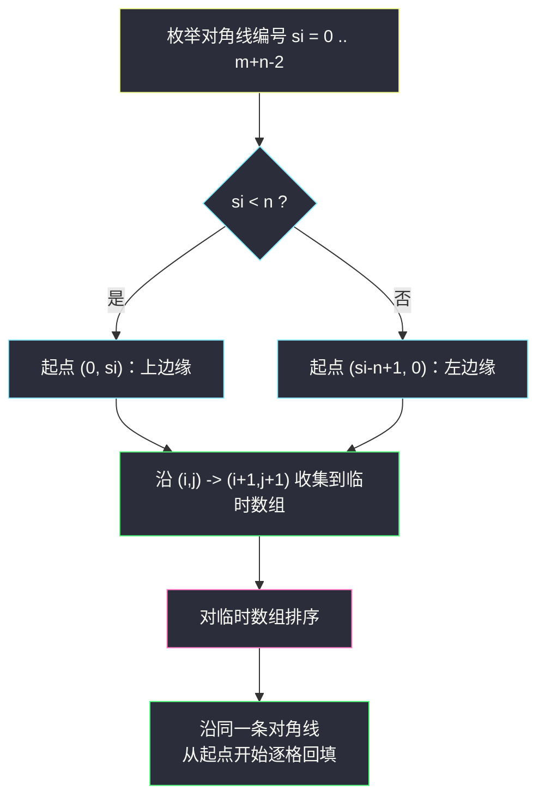
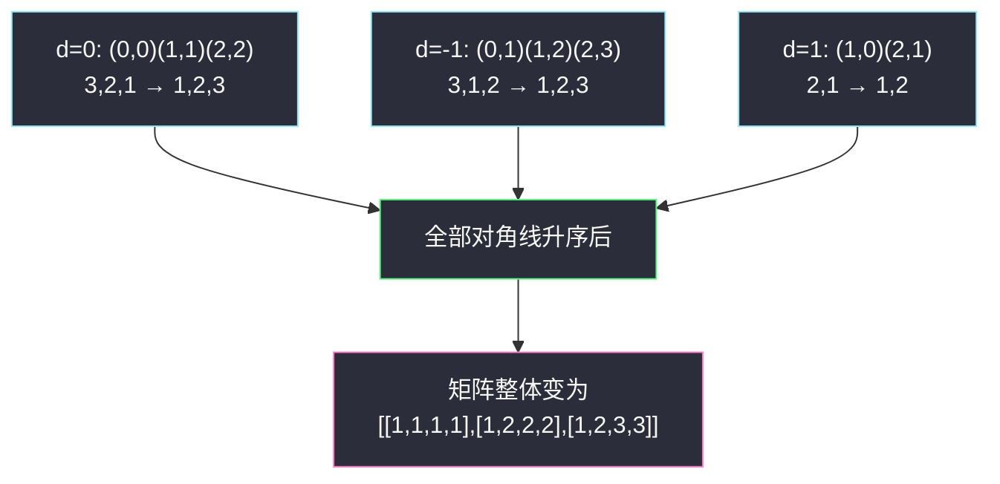

# 将矩阵按对角线排序（遍历对角线 · i−j 分组排序回填）

## 一、问题描述

给你一个 `m * n` 的整数矩阵 `mat`，请你将矩阵中的**每条对角线**上的元素按**升序排序**后，返回排好序的矩阵。

「对角线」的定义：从矩阵最上面一行或最左侧列中的某个单元格 `(i, j)` 开始，沿**右下方向**（即 `(i+1, j+1)`、`(i+2, j+2)`……）延伸的元素集合。注意：不同对角线之间互不干扰，各自独立排序。

> 🔗 LeetCode 1329：https://leetcode.cn/problems/sort-the-matrix-diagonally/
>
> 数据范围：`m == mat.length`，`n == mat[i].length`，`1 <= m, n <= 100`，`1 <= mat[i][j] <= 100`。

**示例**

```
输入：mat = [[3,3,1,1],
            [2,2,1,2],
            [1,1,1,2]]
输出：[[1,1,1,1],
       [1,2,2,2],
       [1,2,3,3]]
```

以 `(0,0)` 出发的对角线取到元素 `[3,2,1]`，排序后 `[1,2,3]` 依次放回 `(0,0)`、`(1,1)`、`(2,2)`；其它对角线同理。

**直观理解**

这题表面是「排序」，实质是**二维网格的对角线遍历**：只要能把「同一对角线上的格子」正确地聚成一组，排序回填只是体力活。识别分组的钥匙是一个下标恒等式——**同一条右下方向对角线上的格子，`i - j` 恒相等**；反之 `i - j` 相等的两个格子一定在同一条对角线上。

---

## 二、暴力解法

最直白的写法：用哈希表按 `i - j` 分组收集元素，组内排序，再按同样的遍历顺序回填。

```python
from collections import defaultdict

class Solution:
    def diagonalSort(self, mat: List[List[int]]) -> List[List[int]]:
        m, n = len(mat), len(mat[0])
        groups = defaultdict(list)
        for i in range(m):              # 收集：按 i-j 分组
            for j in range(n):
                groups[i - j].append(mat[i][j])
        for key in groups:              # 每组排序
            groups[key].sort(reverse=True)   # 回填沿对角线从左上到右下，pop() 取尾部最省事
        for i in range(m):              # 回填：同样的行优先顺序
            for j in range(n):
                mat[i][j] = groups[i - j].pop()
        return mat
```

按行优先扫描时，同一条对角线 `(i, j) → (i+1, j+1)` 中，`(i, j)` 先被访问，所以组内顺序天然是「左上到右下」；排成升序后从头部依次取即可（上面用降序 + `pop()` 是为了避免头部出队）。

### 复杂度

- **时间**：`O(mn log(min(m, n)))`——所有对角线长度之和为 `mn`，单条最长 `min(m, n)`。
- **空间**：`O(mn)`——哈希表存下了全部元素。

### 🔴 瓶颈在哪里

这版已经不慢（`m, n <= 100` 随便过），但白白花了 `O(mn)` 的哈希表开销；且「收集一遍、回填一遍」走了两趟全矩阵。面试里更好的答案是**只带一条对角线的临时数组，原地进出**。

---

## 三、优化探索（核心章节）

> 📚 本题在灵茶题单中属于 **§0.3 遍历对角线**：把二维网格的下标遍历顺序玩明白——先行后列、先列后行、沿对角线、倒序……本题练的是「沿对角线收集与回填」，以及 `i - j` / `i + j` 两个下标恒等式的运用。

### 3.1 两个对角线恒等式（必须形成条件反射）

| 方向 | 恒等式 | 例：格子的分组 |
|------|--------|----------------|
| 右下方向 ↘（本题） | `i - j` 相同 | `(0,0)、(1,1)、(2,2)` 同组，`d = 0` |
| 右上方向 ↗ | `i + j` 相同 | `(1,0)、(0,1)` 同组，`s = 1` |

原因：沿 ↘ 走一步 `i+1, j+1`，差 `i - j` 不变；沿 ↗ 走一步 `i-1, j+1`，和 `i + j` 不变。

### 3.2 对角线的「起点」只有 m + n − 1 个

每条 ↘ 对角线**恰好有一个**起点落在矩阵的「上边缘 + 左边缘」（去掉重复的 `(0,0)`）：

- 上边缘：`(0, j)`，`j = 0..n-1`，共 `n` 条；
- 左边缘：`(i, 0)`，`i = 1..m-1`，共 `m-1` 条；

合计 `m + n - 1` 条对角线。把编号 `si = 0..m+n-2` 映射到起点：`si < n` 时起点 `(0, si)`，否则起点 `(si - n + 1, 0)`。



### 3.3 优化点：临时数组代替哈希表

一条对角线最长 `min(m, n)`，收集/排序/回填用同一个临时数组即可，额外空间从 `O(mn)` 降到 `O(min(m, n))`，也不用再第二趟全矩阵扫描。

### 3.4 还能更快：值域只有 1..100

`mat[i][j] ∈ [1, 100]`，每条对角线改用**计数排序**：长度为 `d` 的对角线排序代价从 `O(d log d)` 降到 `O(d + 100)`。总时间 `O(mn + (m+n) * 100)`。当矩阵很大且值域很小时，这比比较排序更优。

### 3.5 一句话核心

> **右下对角线 ⟺ `i - j` 恒定；每条对角线唯一起点在上边缘或左边缘。枚举起点、收集排序回填，临时数组 O(min(m,n)) 搞定一切。**

---

## 四、代码实现

### Python 主解：枚举起点，原地收集-排序-回填

```python
class Solution:
    def diagonalSort(self, mat: List[List[int]]) -> List[List[int]]:
        m, n = len(mat), len(mat[0])

        def walk(i0: int, j0: int):
            """处理以 (i0, j0) 为起点的一条对角线"""
            diag = []
            i, j = i0, j0
            while i < m and j < n:          # 收集
                diag.append(mat[i][j])
                i += 1
                j += 1
            diag.sort()                     # 排序
            i, j, t = i0, j0, 0
            while i < m and j < n:          # 回填
                mat[i][j] = diag[t]
                i += 1
                j += 1
                t += 1

        for si in range(m + n - 1):         # m+n-1 条对角线
            if si < n:
                walk(0, si)                 # 起点：上边缘 (0, si)
            else:
                walk(si - n + 1, 0)         # 起点：左边缘 (si-n+1, 0)
        return mat
```

**变量含义**

| 变量 | 含义 |
|------|------|
| `si` | 对角线编号，`0..m+n-2`，与上/左边缘起点一一对应 |
| `diag` | 当前对角线的临时数组，最长 `min(m, n)` |
| `i, j` | 沿对角线行走的坐标，`(i+1, j+1)` 前进一步 |

### Python 进阶：计数排序版（利用值域 1..100）

```python
class Solution:
    def diagonalSort(self, mat: List[List[int]]) -> List[List[int]]:
        m, n, V = len(mat), len(mat[0]), 100
        for si in range(m + n - 1):
            i0, j0 = (0, si) if si < n else (si - n + 1, 0)
            cnt = [0] * (V + 1)
            i, j = i0, j0
            while i < m and j < n:          # 计数
                cnt[mat[i][j]] += 1
                i += 1
                j += 1
            i, j, v = i0, j0, 1
            while i < m and j < n:          # 按 1..V 顺序展开回填
                while cnt[v] == 0:
                    v += 1
                mat[i][j] = v
                cnt[v] -= 1
                i += 1
                j += 1
        return mat
```

### Java（哈希表 + 小根堆，按 i−j 分组自动有序）

```java
// 将矩阵按对角线排序
// 测试链接 : https://leetcode.cn/problems/sort-the-matrix-diagonally/
class Solution {
    public int[][] diagonalSort(int[][] mat) {
        int m = mat.length, n = mat[0].length;
        Map<Integer, PriorityQueue<Integer>> groups = new HashMap<>();
        for (int i = 0; i < m; i++) {
            for (int j = 0; j < n; j++) {
                groups.computeIfAbsent(i - j, k -> new PriorityQueue<>()).offer(mat[i][j]);
            }
        }
        for (int i = 0; i < m; i++) {
            for (int j = 0; j < n; j++) {
                mat[i][j] = groups.get(i - j).poll();   // 小根堆出队即升序
            }
        }
        return mat;
    }
}
```

行优先扫描保证了同一条对角线「先左上、后右下」的入队顺序，`poll()` 出队自然是升序回填，收集与回填天然对齐。

---

## 五、具体例子演示

以 `mat = [[3,3,1,1],[2,2,1,2],[1,1,1,2]]`（`m = 3, n = 4`）端到端走一遍，共 `m + n - 1 = 6` 条对角线。先看每格的对角线编号 `d = i - j`：

| i\j | 0 | 1 | 2 | 3 |
|-----|---|---|---|---|
| 0 | 0 | −1 | −2 | −3 |
| 1 | 1 | 0 | −1 | −2 |
| 2 | 2 | 1 | 0 | −1 |

**逐对角线处理（si 从 0 到 5，注意 si 与 d 的对应：si < 4 时起点 `(0, si)` 即 d = −si；否则起点 `(si−3, 0)` 即 d = si−3）**

| si | 起点 | 对角线格子 | 收集 | 排序后 | 回填后这批格子 |
|----|------|-----------|------|--------|----------------|
| 0 | (0,0) | (0,0),(1,1),(2,2) | [3,2,1] | [1,2,3] | mat[0][0]=1, mat[1][1]=2, mat[2][2]=3 |
| 1 | (0,1) | (0,1),(1,2),(2,3) | [3,1,2] | [1,2,3] | mat[0][1]=1, mat[1][2]=2, mat[2][3]=3 |
| 2 | (0,2) | (0,2),(1,3) | [1,2] | [1,2] | mat[0][2]=1, mat[1][3]=2 |
| 3 | (0,3) | (0,3) | [1] | [1] | mat[0][3]=1 |
| 4 | (1,0) | (1,0),(2,1) | [2,1] | [1,2] | mat[1][0]=1, mat[2][1]=2 |
| 5 | (2,0) | (2,0) | [1] | [1] | mat[2][0]=1 |

**最终矩阵**

```
1 1 1 1
1 2 2 2
1 2 3 3
```

逐格核对：`(0,0)=1,(1,1)=2,(2,2)=3` 升序 ✓；`(0,1)=1,(1,2)=2,(2,3)=3` 升序 ✓；`(1,0)=1,(2,1)=2` 升序 ✓。



---

## 六、复杂度分析

| 方法 | 时间 | 空间 | 说明 |
|------|------|------|------|
| 哈希分组 + 排序 | `O(mn log(min(m,n)))` | `O(mn)` | 最直观，两趟扫描 |
| 枚举起点 + 临时数组（主解） | `O(mn log(min(m,n)))` | `O(min(m,n))` | 原地回填，空间最优的比较排序 |
| 枚举起点 + 计数排序 | `O(mn + (m+n)·100)` | `O(min(m,n) + 100)` | 值域小的时候更快 |
| 哈希 + 小根堆（Java 版） | `O(mn log(min(m,n)))` | `O(mn)` | 堆即有序，写起来最短 |

排序的总量是所有对角线长度之和 `mn`，单条上界 `min(m, n)`，故比较排序总量 `O(mn log(min(m,n)))`。

---

## 七、对比总结

**「遍历对角线」小抄**

| 场景 | 恒等式 | 起点位置 | 走法 |
|------|--------|----------|------|
| 本题（↘ 分组） | `i - j` 相同 | 第一行 + 第一列 | `i+1, j+1` |
| 锯齿/斜向遍历 | `i + j` 相同（按层） | 第一行 + 第一列 | 层内方向交替 |
| 反对角线（↗） | `i + j` 相同 | 第一行 + 最后一列 | `i-1, j+1` |

**易错点**

1. 起点 `(0,0)` 属于上边缘，左边缘从 `(1,0)` 开始，否则主对角线被处理两遍（本题重复排序不报错，但概念要清）。
2. 行优先扫描收集时，同一条对角线的元素顺序天然是「左上→右下」，回填必须按同样的顺序展开，别把降序排成升序回填。
3. `m != n` 时别假设矩阵是方阵：`i < m` 与 `j < n` 两个越界条件都要检查。
4. 哈希表版用 `pop()`（尾部）时排序要 `reverse=True`；用下标回填则排升序，两者别混。

---

## 八、举一反三

| 题目 | 关系 |
|------|------|
| [498. 对角线遍历](https://leetcode.cn/problems/diagonal-traverse/) | 同练 `i + j` 分层 + 层内方向交替，对角线遍历的入门款 |
| [1424. 对角线遍历 II](https://leetcode.cn/problems/diagonal-traverse-ii/) | 哈希按 `i + j` 分组，注意行内从右往左收集的顺序陷阱 |
| [566. 重塑矩阵](https://leetcode.cn/problems/reshape-the-matrix/) | 二维下标一维化 `(i*n+j)` 的姊妹技巧，同属 §0.3 网格遍历 |
| [1905. 统计子岛屿](https://leetcode.cn/problems/count-sub-islands/) | 网格遍历基本功的另一种形态（DFS/BFS 网格） |
| [54. 螺旋矩阵](https://leetcode.cn/problems/spiral-matrix/) | 网格遍历顺序的集大成者：边界收缩四方向 |

**思想迁移**

- 二维网格题先问：遍历顺序是什么？行、列、对角线、螺旋、蛇形——`i - j` / `i + j` / 边界收缩各有模板。
- 「分组 + 组内处理」题（本题、异位词分组等）优先找那个**分组键**：能写成下标恒等式就绝不真的建图。
- 口诀：**「右下看差、右上看和；起点挂在边，收集排序还。」**

---
