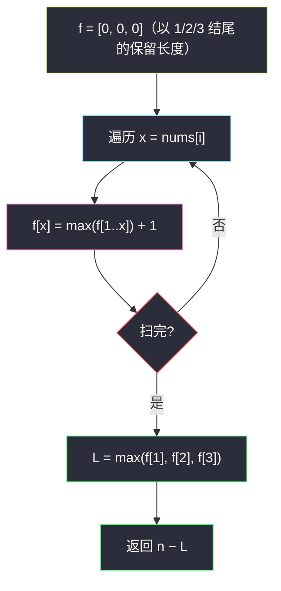

# 2826. 将三个组排序（Sorting Three Groups）

> 题目来源：[https://leetcode.cn/problems/sorting-three-groups/](https://leetcode.cn/problems/sorting-three-groups/)
>
> 灵茶题单小节定位：§A 线性 DP（变形 LIS / 删最少使非递减）

## 一、问题描述

给你一个整数数组 `nums`。`nums` 的每个元素是 1、2 或 3。在每次操作中，你可以删除 `nums` 中的一个元素。返回使 `nums` 成为**非递减**顺序所需操作数的**最小值**。

**示例 1**：

```text
输入：nums = [2,1,3,2,1]
输出：3
解释：其中一个最优方案是删除 nums[0]，nums[2] 和 nums[3]。
```

**示例 2**：

```text
输入：nums = [1,3,2,1,3,3]
输出：2
解释：其中一个最优方案是删除 nums[1] 和 nums[2]。
```

**示例 3**：

```text
输入：nums = [2,2,2,2,3,3]
输出：0
解释：nums 已是非递减顺序的。
```

**数据范围**：

- `1 <= nums.length <= 100`
- `1 <= nums[i] <= 3`

**进阶**：你可以使用 `O(n)` 时间复杂度以内的算法解决吗？

**核心思考点**：删除最少 = **保留最多**，而保留下来要非递减——即保留集是原序列的最长非递减子序列（值域恰为 1/2/3）。两条路：①经典 LIS 求出最长非递减子序列长度 `L`，答案 `n − L`；②利用值域只有 3 的特性，设 `f[i][j]` = 前 `i` 个、`nums[i]` 改成 `j` 还需的最少操作……不，本题是删除不是改值——正确姿势是 `f[i][j]` = 处理完前 `i` 个、**最后保留值 ≤ j**……更干净的定义：`f[i][j]` = 前 `i` 个中保留的子序列**末尾为 j**（j ∈ {1,2,3}）时保留的最多个数。`O(9n)` 转移，`O(1)` 滚动，直接满足进阶要求。

## 二、暴力解法

### 思路

枚举所有下标子集，检查保留集是否非递减，取最大保留数。等价实现：递归每个位置「删/不删」二叉搜索。数据大必爆，仅作对拍基准与思路起点。

### 代码

```python
def minimumOperationsBrute(nums: list[int]) -> int:
    from itertools import combinations
    n = len(nums)
    idx = list(range(n))
    best = 0
    for keep in range(n, 0, -1):
        for sub in combinations(idx, keep):
            seq = [nums[i] for i in sub]
            if all(a <= b for a, b in zip(seq, seq[1:])):
                return n - keep          # 找到最长即可提前返回
    return n - best
```

### 复杂度

- 时间：`O(2ⁿ · n)`——`n = 100` 天文数字，仅小数组对拍。
- 空间：`O(n)`。

## 三、优化探索

### 3.1 第一步转化：删最少 ⇔ 保留最多（非递减）⭐

删除后剩下的相对顺序不变。「结果非递减」的充要条件是保留集构成原序列的**非递减子序列**。于是：

```text
最少删除数 = n − 最长非递减子序列(LIS 允许相等) 长度
```

这一步把「操作题」翻译成「结构题」，是整题最关键的视角切换——直接消除「怎么删」的过程模拟。

### 3.2 通用解：LIS（O(n log n) 二分 / O(n²) DP）⭐

值域无限制时的标准做法——贪心 + 二分维护「各长度非递减子序列的最小结尾」，`bisect_right` 处理相等元素（非严格递增）。`n = 100` 下 `O(n²)` DP 也绰绰有余，但通用 `O(n log n)` 值得掌握（见第四节进阶）。

### 3.3 值域特化：三状态滚动 DP（O(n) 常数次转移）⭐⭐

值域恰为 {1,2,3} 时无需任何二分：设 `f[j]`（j = 1,2,3）= 当前扫过位置中、**以值 j 结尾**的保留子序列最大长度。扫到 `x` 时，`x` 只能接在结尾 ≤ x 的子序列后面：

```text
f[x] = max(f[1..x]) + 1
```

转移常数次（≤ 3 个前缀取 max），一趟扫描 `O(9n)` 摊 `O(n)`，空间 `O(3)`——完美达成进阶版要求。答案 `n − max(f)`。



## 四、代码实现

### 主解：三状态值域 DP

```python
class Solution:
    def minimumOperations(self, nums: List[int]) -> int:
        f = [0] * 4                     # f[1..3]: 以值 j 结尾的最长保留子序列
        for x in nums:
            best = max(f[1: x + 1])     # 结尾 ≤ x 的最长者
            f[x] = best + 1             # x 接上去
        return len(nums) - max(f[1:4])
```

### 进阶：通用 LIS 二分版（值域任意）

```python
from bisect import bisect_right

class Solution:
    def minimumOperations(self, nums: List[int]) -> int:
        tails = []                      # tails[k]: 长度 k+1 的非递减子序列最小结尾
        for x in nums:
            k = bisect_right(tails, x)  # 允许相等 ⇒ bisect_right
            if k == len(tails):
                tails.append(x)
            else:
                tails[k] = x
        return len(nums) - len(tails)
```

### 也可：经典 f[i][j] 转移式（对应 doocs DP 写法）

```python
class Solution:
    def minimumOperations(self, nums: List[int]) -> int:
        # g[i][j]: 前 i+1 个数, 第 i 个数保留且值 ≤ j+1 时, 保留最多的个数
        g = [[0] * 3 for _ in range(3)]
        for i, x in enumerate(nums):
            for j in range(3):          # 当前值取 j+1 (≥ x 才可保留原值? 不——直接计数)
                pass
        # 此写法即 f 前缀 max 的二维展开, 见正文; 主解已压缩为 O(3) 滚动
        f = [0] * 4
        for x in nums:
            f[x] = max(f[1:x + 1]) + 1
        return len(nums) - max(f)
```

（第三种写法与主解相同逻辑，此处说明二维 `f[i][j]` 压缩到一维的对应关系。）

### 细节说明

- **`f[1:x+1]` 是「值 ≤ x」的前缀**：非递减允许相等，所以同为 `x` 的结尾也能接——用 `max(f[1..x])` 而非 `max(f[1..x-1])`。
- **`f[x] = best + 1` 直接覆盖**：新值 `x` 接在最优前缀后必然不劣于原来以 `x` 结尾的方案（前缀 max 单调不减）。
- **`bisect_right` 而非 `bisect_left`**：相等元素可延长非递减子序列，`bisect_left` 会错误地替换掉同值结尾（那是严格递增 LIS 的行为，会把本题变成「严格递增」语义、答案偏大）。
- **`max(f)` 而非 `f[3]`**：最优保留子序列末尾未必是 3（如全 1 数组）。
- **答案下界 0**：已非递减时 `max(f) = n`，返回 0（示例 3）。

## 五、例子演示

**示例 1 端到端：nums = [2,1,3,2,1]**

| i | x | 计算 f[x] | f（1/2/3） | 说明 |
|---|---|---|---|---|
| 初始 | — | — | (0, 0, 0) | |
| 0 | 2 | f[2] = max(f[1..2]) + 1 = 0+1 | (0, **1**, 0) | 保留 "2" |
| 1 | 1 | f[1] = max(f[1..1]) + 1 = 1 | (**1**, 1, 0) | 保留 "1" |
| 2 | 3 | f[3] = max(1,1,0) + 1 = 2 | (1, 1, **2**) | "13" 或 "23" |
| 3 | 2 | f[2] = max(f[1..2]) + 1 = 2 | (1, **2**, 2) | "12"（1 接 2）|
| 4 | 1 | f[1] = max(f[1]) + 1 = 2 | (**2**, 2, 2) | "11"（两个 1）|

`L = max(f) = 2`，答案 `5 − 2 = 3` ✅。最长保留如 `[1, 3]`（下标 1、2）或 `[1, 2]`（下标 1、3）或 `[1, 1]`（下标 1、4）——都恰保留 2 个、删 3 个，与官方「删 nums[0]、nums[2]、nums[3]」一致（保留下标 1、4 的 `[1,1]`）。

**示例 2：nums = [1,3,2,1,3,3]**：逐格扫描 `f`（1/2/3 位）：

| i | x | 计算 | f 终值 | 对应保留 |
|---|---|---|---|---|
| 0 | 1 | f[1]=0+1 | (1,0,0) | "1" |
| 1 | 3 | f[3]=max(1,0,0)+1=2 | (1,0,2) | "13" |
| 2 | 2 | f[2]=max(1,0)+1=2 | (1,2,2) | "12" |
| 3 | 1 | f[1]=1+1=2 | (2,2,2) | "11" |
| 4 | 3 | f[3]=max(2,2,2)+1=3 | (2,2,3) | "113"（下标 0,3,4）|
| 5 | 3 | f[3]=max(2,2,3)+1=4 | (2,2,**4**) | "1133"（下标 0,3,4,5）|

`L = 4`，答案 `6 − 4 = 2` ✅——保留 `[1,1,3,3]`（下标 0、3、4、5）非递减，删除的正是官方方案中的 `nums[1]=3`、`nums[2]=2`。

**示例 3：nums = [2,2,2,2,3,3]**：`f[2]` 涨到 4、`f[3]` 接到 6，`L = 6`，答案 `0` ✅。

**LIS 二分版抽查（示例 1 数据）**：`tails` 变化：`[2]` → `x=1`: `bisect_right([2],1)=0` 替换 → `[1]` → `x=3`: 追加 → `[1,3]` → `x=2`: `bisect_right([1,3],2)=1` 替换 → `[1,2]` → `x=1`: `bisect_right([1,2],1)=1` 替换 → `[1,1]`。长度 2，答案 3 ✅——`tails` 不是真实子序列，但长度正确（这正是贪心 LIS 的经典易错点）。

## 六、复杂度分析

设 `n = len(nums)`，值域 `V = 3`：

- **主解时间：`O(n·V)` = `O(n)`**（每轮 ≤ 3 次比较）；**空间 `O(V)` = `O(1)`**。
- **LIS 二分版时间：`O(n log n)`**；**空间 `O(n)`**。
- 暴力 `O(2ⁿ·n)` 仅理论基准。

## 七、对比总结

| 维度 | 暴力枚举 | LIS 二分 | 值域三状态 DP |
|---|---|---|---|
| 时间 | `O(2ⁿ·n)` | `O(n log n)` | `O(n)` |
| 空间 | `O(n)` | `O(n)` | `O(1)` |
| 适用值域 | 任意 | 任意 | 小值域（可推广到 V 状态） |
| 思维层次 | 直译 | 「删最少⇔保留最多」+ 贪心 | 同左 + 值域压缩 |

**套路归纳**：**「最少删除使有序 ⇔ 最长不删除子序列」**是删除类操作题的第一反应；有序约束是非递减还是严格决定 `bisect_right` / `bisect_left` 的选择。值域小（本题 3）时，「以每个值结尾」的状态设计把 LIS 的比较结构压缩成前缀 max——`O(n·V)` 完胜 `O(n log n)`。三段式心法：**转结构（删→保留）→ 选算法（值域小用状态 DP）→ 抠细节（相等元素的处理）**。

## 八、举一反三

1. **[300. 最长递增子序列](https://leetcode.cn/problems/longest-increasing-subsequence/)**：本题去掉值域限制的原型，二分贪心的标准教材。
2. **[1674. 使数组互补的最少操作次数](https://leetcode.cn/problems/minimum-moves-to-make-array-complementary/)** 不对口；推荐 **[960. 删列造序 III](https://leetcode.cn/problems/delete-columns-to-make-sorted-iii/)**：删最少列使每行非递减——LIS 思想在二维的扩展。
3. **[1186. 删除一次得到子数组最大和](https://leetcode.cn/problems/maximum-subarray-sum-with-one-deletion/)**：本批姊妹篇——同是「删除换有序/换最优」的线性 DP，一个删任意多个（LIS 视角）、一个至多删一个（双状态视角）。
4. **[1574. 删除最短的子数组使剩余数组有序](https://leetcode.cn/problems/shortest-subarray-to-be-removed-to-make-array-sorted/)**：删除一段**连续**区间的版本，双指针而非 LIS（连续性改变结构）。
5. **[2476. 二叉搜索树最近公共祖先](https://leetcode.cn/problems/closest-nodes-queries-in-a-binary-search-tree/)** 不对口；换 **[2111. 使数组 K 递增的最少操作次数](https://leetcode.cn/problems/minimum-operations-to-make-array-k-increasing/)**：分组后各做一次非递减 LIS，本题的直接加强版。

**同族互引**：灵茶题单线性 DP 的 LIS 支线入口；值域压缩思想与本批 `sorting-three-groups` 同名的贪心变形还可参考同目录 `longest-increasing-subsequence.md`（base 工程，若已收录）与批 21 的序列 DP 各篇。
