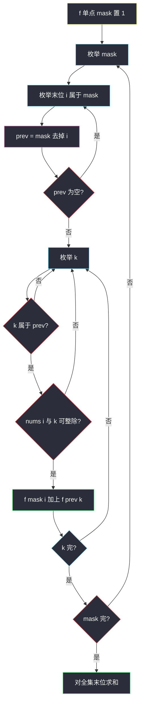

# 2741. 特别的排列（Special Permutations）

> 题目来源：[https://leetcode.cn/problems/special-permutations/](https://leetcode.cn/problems/special-permutations/)
>
> 灵茶题单小节定位：§9.2 排列型状压 DP ② 相邻相关

## 一、问题描述

给你下标从 0 开始、长度为 n 的数组 `nums`，含 **n 个互不相同** 的正整数。一个排列是**特别的**，当且仅当每对相邻元素满足 `a % b == 0` 或 `b % a == 0`（谁整除谁都可以）。

返回特别排列的个数，对 `10^9+7` 取模。

**数据范围**：

- `2 <= nums.length <= 14`
- `1 <= nums[i] <= 10^9`
- `nums` 中元素互不相同

**示例 1**：

```text
输入：nums = [2,3,6]
输出：2
解释：[3,6,2] 与 [2,6,3] 是两个特别的排列。
```

**示例 2**：

```text
输入：nums = [1,4,3]
输出：2
解释：[3,1,4] 与 [4,1,3] 是两个特别的排列。
```

（官方示例就是这两组，不要记成 `[2,3,4]`。`[2,3,4]` 任意相邻都无法让 3 与 2 或 4 整除，答案是 0。）

**核心思考点**：n ≤ 14 ⇒ `2¹⁴ = 16384` 个已用集合。这是**排列型状压**：状态必须带「最后一个放的是谁」，因为约束只发生在相邻两位。`f[mask][i]` = 已用集合为 mask、末位下标为 i 的方案数。转移枚举前驱 `k`，且 **k 必须属于 `mask` 去掉 i 之后的集合**，同时 `nums[i]` 与 `nums[k]` 可互相整除。

## 二、暴力解法

### 思路

`itertools.permutations` 枚举全部排列，逐对检查整除。n = 14 时 14! ≈ 8.7×10¹⁰，不可用；n ≤ 8 对拍足够。

### 代码

```python
from itertools import permutations

def specialPermBrute(nums: list[int]) -> int:
    n = len(nums)
    cnt = 0
    for p in permutations(nums):
        ok = True
        for i in range(n - 1):
            if p[i] % p[i + 1] != 0 and p[i + 1] % p[i] != 0:
                ok = False
                break
        if ok:
            cnt += 1
    return cnt % (10**9 + 7)
```

### 复杂度

- 时间：`O(n! · n)`。
- 空间：`O(n)`。

## 三、优化探索

### 3.1 为什么多一维「末位」⭐

§9.1 那种 `f[mask]`（只记用了哪些）要求「转移代价与顺序无关」。本题相邻必须整除，**刚放进去的那个数**会卡住下一位能放谁，所以状态是 `(已用集合, 末位下标)`。这就是题单 §9.2「相邻相关」的标准加维。

优美排列（#526）约束的是「值与下标」，进度等于 `popcount(mask)`，不必记末位；本题约束的是「值与值」，必须记。

### 3.2 转移 ⭐⭐

```text
f[1<<i][i] = 1                 单个数自己就是长度为 1 的合法前缀
对 mask，对 i ∈ mask：
    prev = mask ⊕ (1<<i)       去掉末位 i
    若 prev == 0：已在初始化处理
    否则枚举 k ∈ prev：
        若 nums[i] 与 nums[k] 可整除：
            f[mask][i] += f[prev][k]
答案 Σ_i f[(1<<n)-1][i]
```

**前驱 k 必须在 prev 里**：`prev` 是「去掉 i 之后还在用的集合」。若 k 不在 prev 中，`f[prev][k]` 语义非法（末位没被选进集合）。即使漏写判断，因为非法格子恒为 0，数值偶尔仍对——这是隐患，默写时必须写 `prev >> k & 1`。

复杂度 `O(n² · 2ⁿ)`：每个 `(mask, i)` 枚举 k。n = 14 时约 14² × 16384 ≈ 3×10⁶。



**核心一句**：排列型状压 = 子集 mask + 末位 i；相邻约束写在 i 与 k 之间，k 必须来自 `mask \ {i}`。

## 四、代码实现

### 主解：`f[mask][i]` 递推

```python
class Solution:
    def specialPerm(self, nums: list[int]) -> int:
        MOD = 10**9 + 7
        n = len(nums)
        N = 1 << n
        f = [[0] * n for _ in range(N)]
        for i in range(n):
            f[1 << i][i] = 1                 # 以 i 开头

        for mask in range(N):
            for i in range(n):
                if (mask >> i) & 1 == 0:
                    continue
                prev = mask ^ (1 << i)       # 去掉末位 i
                if prev == 0:
                    continue
                for k in range(n):
                    if (prev >> k) & 1 == 0: # k 必须属于 prev
                        continue
                    x, y = nums[i], nums[k]
                    if x % y == 0 or y % x == 0:
                        f[mask][i] = (f[mask][i] + f[prev][k]) % MOD
        return sum(f[N - 1]) % MOD
```

### 对照：记忆化 DFS（同一转移，自顶向下）

```python
from functools import cache

class Solution:
    def specialPerm(self, nums: list[int]) -> int:
        MOD = 10**9 + 7
        n = len(nums)
        full = (1 << n) - 1

        @cache
        def dfs(mask: int, i: int) -> int:   # 已用 mask、末位 i
            if mask == full:
                return 1
            res = 0
            for j in range(n):
                if (mask >> j) & 1:
                    continue                 # j 必须还不在 mask 里
                x, y = nums[i], nums[j]
                if x % y == 0 or y % x == 0:
                    res += dfs(mask | (1 << j), j)
            return res % MOD

        return sum(dfs(1 << i, i) for i in range(n)) % MOD
```

递推版按 mask 从小到大刷表；DFS 从「当前末位」往后续空位扩。两者状态数相同。注意 DFS 里枚举的是**下一个** j（不在 mask 中），递推里枚举的是**上一个** k（在 prev 中）——方向相反，约束都是「相邻一对可整除」。

可预处理 `ok[k][i]` 布尔表，把循环里的 `%` 换成数组查找，n=14 时整除次数从热路径上拿掉，量级不变。

### 细节说明

- **循环顺序**：从小 mask 到大自然满足「`prev` 比 `mask` 少 1 个 1」，无需拓扑排序。
- **`x % y`**：元素为正整数且互不相同，不会除 0。
- **取模**：方案数可到 14! 量级（全两两整除时，如 1,2,4,… 的子集），必须 `% MOD`。
- **不要用值当第二维**：值域 10⁹，第二维必须是**下标** 0..n−1。
- **漏掉 `k ∈ prev`**：见 3.2。正确写法以本主解为准。

## 五、例子演示

**示例 1：`nums = [2,3,6]`**

下标 0→2，1→3，2→6。可整除对：`(0,2)` 即 2|6，`(1,2)` 即 3|6。`(0,1)` 的 2 与 3 不行。

用三位二进制，低位是下标 0。

**初始化**：

| mask | 末位 | f |
|---|---|---|
| 001 | 0 | 1 |
| 010 | 1 | 1 |
| 100 | 2 | 1 |

**mask = 011**（用了 2 和 3）：

- 末位 0，prev=010，k 只能 1：3 与 2 不整除 → 0
- 末位 1，prev=001，k 只能 0：同样 0

**mask = 101**（2 和 6）：

- 末位 0，prev=100，k=2：6 与 2 可以 → f=1，对应前缀 `[6,2]`
- 末位 2，prev=001，k=0：2 与 6 可以 → f=1，对应 `[2,6]`

**mask = 110**（3 和 6）：对称地各 1，前缀 `[6,3]`、`[3,6]`。

**mask = 111 全集**：

| 末位 i | prev | 合法 k | 累加 | 对应排列 |
|---|---|---|---|---|
| 0（2） | 110 | k=2（6），3 不行 | 1 | `[3,6,2]` |
| 1（3） | 101 | k=2（6），2 不行 | 1 | `[2,6,3]` |
| 2（6） | 011 | f[011] 全 0 | 0 | 2 与 3 从未相邻合法，6 到不了末位且用齐 |

和 = **2**，与官方一致。

**示例 2：`[1,4,3]`**

1 能整除任何数，所以 1 必须夹在 4 与 3 中间：`[4,1,3]`、`[3,1,4]`。状压同样得到全集末位分别落在 3 与 4 上各 1，和为 2。`[1,4,3]` 里 4 与 3 相邻不合法，不会被算进。

**示例 2 逐步：`[1,4,3]`**（下标 0→1，1→4，2→3）

可整除对：1 与 4、1 与 3；4 与 3 不行。

| mask | 含义 | 末位 | 转移 | f |
|---|---|---|---|---|
| 001 | {1} | 0 | 初始化 | 1 |
| 010 | {4} | 1 | 初始化 | 1 |
| 100 | {3} | 2 | 初始化 | 1 |
| 011 | {1,4} | 0 | prev={4}，4|1 | 1 → 前缀 `[4,1]` |
| 011 | {1,4} | 1 | prev={1}，1|4 | 1 → `[1,4]` |
| 101 | {1,3} | 0 / 2 | 对称 | 各 1 |
| 110 | {4,3} | 1 或 2 | 4 与 3 不行 | **0** |
| 111 | 全集 | 0（1） | prev={4,3} 全 0 | 0 |
| 111 | 全集 | 1（4） | prev={1,3}，k 必须是 1（末位 4 的前驱） | 1 → `[3,1,4]` |
| 111 | 全集 | 2（3） | 对称 | 1 → `[4,1,3]` |

和 = **2**。全集不能以 1 结尾：以 1 结尾意味着 4 与 3 已经排在前两位且相邻，而 `f[110]` 为 0，接不上。

**对照 `[2,3,4]`**：2|4，但 3 与谁都不能整除，两位 mask 含 3 的全是 0，全集为 0。

## 六、复杂度分析

- **时间复杂度：`O(n² · 2ⁿ)`**——每个 mask、每个末位 i、每个前驱 k。n = 14 时约 3×10⁶ 次整除判断。
- **空间复杂度：`O(n · 2ⁿ)`**——DP 表。可滚动到按 popcount 分层，一般没必要。

## 七、对比总结

| 维度 | 全排列暴力 | 回溯 | 排列型状压（主解） |
|---|---|---|---|
| 时间 | `O(n!)` | 指数 + 剪枝 | `O(n² 2ⁿ)` 稳定 |
| 状态 | 当前前缀 | 同左 | mask + 末位 |
| 相邻约束 | 排完再验 / 当下验 | 当下验 | 写在 i、k 转移上 |

**易错点**：

1. **前驱 k 没限制在 `prev` 内**——模板题专门要踩的坑。
2. **初始化漏了 `f[1<<i][i]=1`**，后面全是 0。
3. **用 `nums[i]` 当第二维**，值域炸表。
4. **只判断 `a % b == 0` 忘了对称**。
5. **示例记成 `[2,3,4]`**，和官方不一致。

**套路归纳**：n ≤ 16 的排列计数 + 相邻二元谓词 → `f[mask][last]`。谓词换成「差为 1」「和为平方数」「异或为 0」都是同一骨架，只改 if。

## 八、举一反三

1. **[526. 优美的排列](https://leetcode.cn/problems/beautiful-arrangement/)**：位置-值约束，可不记末位，见 `beautiful-arrangement.md`。
2. **[996. 正方形数组的数目](https://leetcode.cn/problems/number-of-squareful-arrays/)**：相邻和为完全平方，与本题几乎同构（注意重复元素要去重）。
3. **[943. 最短超级串](https://leetcode.cn/problems/find-the-shortest-superstring/)**：`f[mask][i]` 变成最小长度 / 拼接代价。
4. **[847. 访问所有节点的最短路径](https://leetcode.cn/problems/shortest-path-visiting-all-nodes/)**：图上的 mask + 当前点，BFS 版。
5. **[1681. 最小不兼容性](https://leetcode.cn/problems/minimum-incompatibility/)**：子集划分 + 状压，和本批饼干题同一侧。

**同族互引**：`beautiful-arrangement.md` 是 §9.2 的「位置约束」篇；本篇是「相邻值约束」篇，多一维 last。`fair-distribution-of-cookies.md` 则是子集枚举，不是排列。
