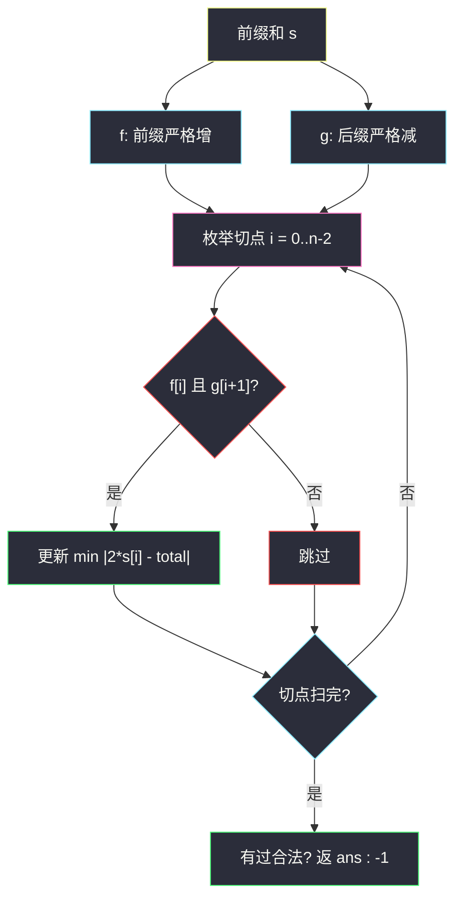

# 3698. 分割数组得到最小绝对差（Split Array With Minimum Difference）

> 题目来源：[https://leetcode.cn/problems/split-array-with-minimum-difference/](https://leetcode.cn/problems/split-array-with-minimum-difference/)
>
> 灵茶题单小节定位：专题：前后缀分解（前缀严格增 × 后缀严格减，枚举切点）

## 一、问题描述

给你一个整数数组 `nums`。把它**恰好**分成两个非空连续子数组 `left` 和 `right`，使得：

- `left` **严格递增**（每个元素都大于前一个）；
- `right` **严格递减**（每个元素都小于前一个）。

返回 `|sum(left) - sum(right)|` 的最小可能值。不存在任何合法分割时返回 `-1`。

子数组是原数组中连续、非空的一段。单元素既算严格递增也算严格递减。

**数据范围**：

- `2 <= nums.length <= 10⁵`
- `1 <= nums[i] <= 10⁵`

必须 `O(n)`（或 `O(n log n)`）。切点两侧的单调性一旦被某个位置破坏，更长前缀/后缀也一定不合法。

**示例 1**：

```text
输入：nums = [1,3,2]
输出：2
```

| 切在 i 后 | left | right | 合法 | 绝对差 |
|-----------|------|-------|------|--------|
| 0 | `[1]` | `[3,2]` | 是 | `\|1-5\|=4` |
| 1 | `[1,3]` | `[2]` | 是 | `\|4-2\|=2` |

最小为 2。

**示例 2**：

```text
输入：nums = [1,2,4,3]
输出：4
```

| 切在 i 后 | left | right | 合法 | 绝对差 |
|-----------|------|-------|------|--------|
| 0 | `[1]` | `[2,4,3]` | 否（2<4 非递减） | — |
| 1 | `[1,2]` | `[4,3]` | 是 | `\|3-7\|=4` |
| 2 | `[1,2,4]` | `[3]` | 是 | `\|7-3\|=4` |

最小为 4。

**示例 3**：

```text
输入：nums = [3,1,2]
输出：-1
解释：
- `[3] | [1,2]`：右边 1<2 非严格递减
- `[3,1] | [2]`：左边 3>1 非严格递增
```

**核心思考点**：合法切点是「某前缀整段严格增」且「对应后缀整段严格减」。这两种性质都可以预处理成布尔数组，再 `O(n)` 扫切点，用前缀和算绝对差。

## 二、暴力解法

### 思路

枚举切点 `k = 1..n-1`（左边 `nums[0..k-1]`）。检查左段是否严格增、右段是否严格减，合法则更新 `|sumL - sumR|`。

### 代码

```python
def splitArrayBrute(nums: list[int]) -> int:
    n = len(nums)
    ans = None
    for k in range(1, n):
        left, right = nums[:k], nums[k:]
        inc = all(left[i] < left[i + 1] for i in range(len(left) - 1))
        dec = all(right[i] > right[i + 1] for i in range(len(right) - 1))
        if inc and dec:
            d = abs(sum(left) - sum(right))
            ans = d if ans is None else min(ans, d)
    return -1 if ans is None else ans
```

### 复杂度

- 时间：`O(n²)`——每个切点扫描左右两段。
- 空间：`O(1)`（不计切片复制）。
- `n = 10⁵` 会 TLE。

## 三、优化探索

### 3.1 单调性一旦失败，更长段也失败 ⭐

`f[i] = nums[0..i]` 是否严格递增：

```text
f[0] = True
f[i] = f[i-1] and (nums[i] > nums[i-1])
```

一旦某对 `nums[i] ≤ nums[i-1]`，之后所有 `f[j] (j≥i)` 都是 False。后缀严格递减 `g[i]` 对称：从右往左，`g[i] = g[i+1] and (nums[i] > nums[i+1])`。

注意是**严格**：相等也不行。`[1,1]` 只能切成两个单元素，两边都合法。

### 3.2 前缀和把差值变成 O(1) 查询 ⭐⭐

`s[i] = nums[0]+…+nums[i]`。切在 `i` 与 `i+1` 之间（`0 ≤ i ≤ n-2`）时：

```text
sumL = s[i]
sumR = s[n-1] - s[i]
```

合法条件：`f[i] and g[i+1]`。全部切点扫一遍取最小绝对差。

切点两侧**互不比较**：`left` 的最后一个和 `right` 的第一个可以任意大小关系，因为它们分属两段。这与「山峰数组」不同——不必 `left[-1] > right[0]`。



核心一句：**预处理「前缀能否当 left、后缀能否当 right」，切点上做前缀和差值。**

## 四、代码实现

### 主解：前缀和 + 两侧单调布尔数组

```python
class Solution:
    def splitArray(self, nums: List[int]) -> int:
        n = len(nums)
        s = [0] * n
        s[0] = nums[0]
        f = [True] * n
        g = [True] * n
        for i in range(1, n):
            s[i] = s[i - 1] + nums[i]
            f[i] = f[i - 1] and nums[i] > nums[i - 1]
        for i in range(n - 2, -1, -1):
            g[i] = g[i + 1] and nums[i] > nums[i + 1]
        ans = None
        for i in range(n - 1):
            if f[i] and g[i + 1]:
                d = abs(s[i] - (s[n - 1] - s[i]))
                ans = d if ans is None else min(ans, d)
        return -1 if ans is None else ans
```

空间上可以只记两个下标：最长严格增前缀的右端 `L`、最长严格减后缀的左端 `R`。合法切点 `i` 满足 `i ≤ L` 且 `i+1 ≥ R`。布尔数组更好讲、更不容易偏一位。

```python
L = 0
while L + 1 < n and nums[L] < nums[L + 1]:
    L += 1
R = n - 1
while R - 1 >= 0 and nums[R - 1] > nums[R]:
    R -= 1
```

### 细节说明

- **相等即非法**：`nums[i] <= nums[i-1]` 切断前缀增。`[1,1]` 只能切成两个单元素，差 0，合法。
- **切点两侧互不比较**：`[2,2,1]` 切 0 → left=`[2]`、right=`[2,1]`（2>1）合法，差 `|2-3|=1`。不要把「全数组不是山」直接判 -1。
- **Java 用 `long` 存前缀和**：`n·10⁵ = 10¹⁰`。
- **没有合法切点**时返回 -1，不要返回 0。
- 后缀递减写成 `>=` 会把平台当成合法。

## 五、例子演示

**示例 1：`[1,3,2]`**

| 下标 | nums | f 前缀增 | g 后缀减 | s |
|------|------|----------|----------|---|
| 0 | 1 | T | F（1<3） | 1 |
| 1 | 3 | T（1<3） | T（3>2） | 4 |
| 2 | 2 | F | T | 6 |

切点 i=0：`f[0] ∧ g[1]` = T∧T，差 `|1-5|=4`。  
切点 i=1：`f[1] ∧ g[2]` = T∧T，差 `|4-2|=2`。  
返回 **2** ✅。

**示例 2：`[1,2,4,3]`**

| i | f[i] | g[i] |
|---|------|------|
| 0 | T | F |
| 1 | T | F |
| 2 | T | T（4>3） |
| 3 | F | T |

i=0：`g[1]=F` 非法（右段 `[2,4,3]` 先升后降）。  
i=1、i=2 合法，差都是 4。返回 **4** ✅。

**示例 3：`[3,1,2]`**

`f = [T, F, F]`（3>1 已坏），`g = [F, F, T]`（1<2 使 g[1] 为假）。两个切点都不合法，返回 **-1** ✅。

**`[1,1]`**：`f=[T,F]`，`g=[F,T]`。切点 i=0：`f[0]∧g[1]` 成立，差 `|1-1|=0`。

**全增 `[1,2,3,4,5]`**：`g=[F,F,F,F,T]`，唯一合法切点 i=3：left 和 10、right=`[5]`，差 5。

**全减 `[5,4,3,2,1]`**：`f=[T,F,F,F,F]`，唯一合法切点 i=0：left=`[5]`、right 和 10，差 5。两边对称，都只能切在「单元素那一侧」。

## 六、复杂度分析

设 `n = len(nums)`：

- **时间复杂度：`O(n)`**——三趟线性扫描。
- **空间复杂度：`O(n)`**——前缀和与两个布尔数组。

## 七、对比总结

| 维度 | 每切点重扫 | 主解预处理 |
|------|-----------|------------|
| 时间 | `O(n²)` | `O(n)` |
| 单调判断 | 重复检查同一对邻居 | 失败向右/左传播 |
| 和 | 每切点 `O(n)` 求和 | 前缀和 `O(1)` |

**套路归纳**：**前后缀分解**三件套——①前缀和（或前缀最值）；②前缀可行性；③后缀可行性。切点 / 删除一段 / 枚举分界时，先问「左约束能否前缀 DP、右约束能否后缀 DP」。本题左右约束恰好是两种相反的严格单调。

## 八、举一反三

1. **[724. 寻找数组的中心下标](https://leetcode.cn/problems/find-pivot-index/)**：前缀和切一刀，无单调约束。
2. **[2270. 分割数组的方案数](https://leetcode.cn/problems/number-of-ways-to-split-array/)**：枚举切点比较左右和。
3. **[915. 分割数组](https://leetcode.cn/problems/partition-array-into-disjoint-intervals/)**：左 max ≤ 右 min，典型前后缀最值。
4. **[1574. 删除最短的子数组使剩余数组有序](https://leetcode.cn/problems/shortest-subarray-to-be-removed-to-make-array-sorted/)**：最长合法前缀 + 最长合法后缀再双指针拼接。
5. **[1671. 得到山形数组的最少删除次数](https://leetcode.cn/problems/minimum-number-of-removals-to-make-mountain-array/)**：前缀 LIS + 后缀 LDS，和本题「增 | 减」同形但允许删。

**同族互引**：同目录 `find-the-middle-index-in-array.md`、`left-and-right-sum-differences.md` 是前后缀和的入门；本题在切点上叠加单调布尔前缀。
