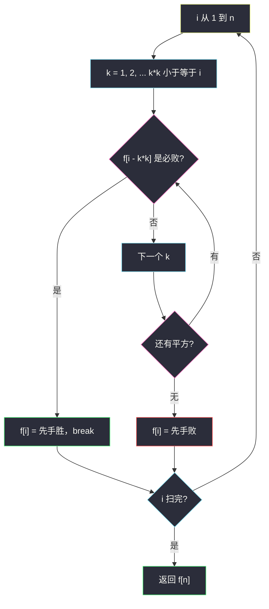
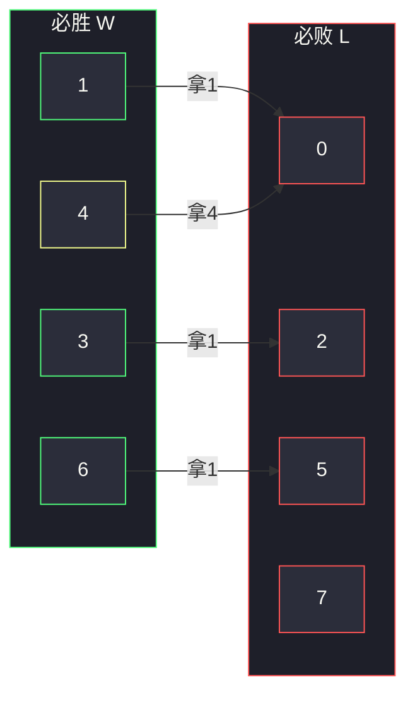

# 1510. 石子游戏 IV（Stone Game IV）

> 题目来源：[https://leetcode.cn/problems/stone-game-iv/](https://leetcode.cn/problems/stone-game-iv/)
>
> 灵茶题单小节定位：十四、博弈 DP（先手必胜 / 必败）

## 一、问题描述

Alice 和 Bob 轮流玩，Alice 先手。一开始有 `n` 个石子。每次操作，当前玩家从堆里拿走**任意非零平方数**个石子（`1, 4, 9, …`）。不能操作的人输掉。

两人都采取最优策略。返回 Alice 是否必胜。

**数据范围**：

- `1 <= n <= 10^5`

**示例 1**：

```text
输入：n = 1
输出：true
解释：Alice 拿走 1 个，Bob 无法操作。
```

**示例 2**：

```text
输入：n = 2
输出：false
解释：Alice 只能拿 1 个，Bob 拿走最后一个（2 → 1 → 0）。
```

**示例 3**：

```text
输入：n = 4
输出：true
解释：4 本身是平方数，Alice 一次拿完。
```

官方还有 `n = 7 → false`、`n = 17 → false`。

**核心思考点**：这是标准的「取石子、不能动者输」公平组合游戏。状态只剩一个整数（剩余石子数），没有拆堆。`f[i] = true` 表示**轮到自己、剩 i 个时先手必胜**。转移：`f[i] = 存在平方 k² ≤ i，使得 f[i - k²] = false`（把对手扔进必败局）。`f[0] = false`。`n ≤ 1e5` 必须 `O(n √n)` 线性筛式 DP，不能每步重新搜整棵博弈树。

## 二、暴力解法

### 思路

递归：当前剩余 `i`，枚举拿走 `k*k`，若存在一步让对手 `win(i-k*k) == False`，则自己赢。无记忆化时同一剩余量被反复展开，指数级。

### 代码

```python
def winnerSquareGameBrute(n: int) -> bool:
    def win(i: int) -> bool:
        k = 1
        while k * k <= i:
            if not win(i - k * k):
                return True
            k += 1
        return False          # 包括 i == 0：循环不进，先手输
    return win(n)
```

### 复杂度

- 时间：指数级（博弈树按平方分支）。`n = 1e5` 不可用；无缓存对拍缩到 `n ≤ 12`。加 `@cache` 后与主解同阶 `O(n √n)`，可用来交叉验证到 `n = 400`。
- 空间：递归深度 `O(n)`（每次至少拿 1）。

## 三、优化探索

### 3.1 必胜 / 必败的定义 ⭐

组合游戏里：

- **P 局面**（Previous-player wins）：轮到当前玩家时必输 —— `f[i] = false`。典型：`i = 0`，无合法动作。
- **N 局面**（Next-player wins）：当前玩家必胜 —— 存在一步走到某个 P 局面。

这不是「谁拿得多谁赢」的石子游戏 I（[#877](https://leetcode.cn/problems/stone-game/)），没有区间、没有得分，只问输赢。Grundy 数在单堆下退化成 `mex` 的 0/1：P 的 SG 为 0，N 非 0。写布尔数组足够。

### 3.2 转移与早停 ⭐⭐

```text
f[0] = False
f[i] = any( not f[i - k*k]  for k = 1, 2, …, k*k ≤ i )
```

一旦发现某个 `k` 走到必败，立刻 `f[i] = True` 并 `break`——不必枚举完所有平方。最坏仍是每个 `i` 看完 `⌊√i⌋` 个分支，总时间仍 `O(n √n)`。

特判直觉（可作剪枝，不是主逻辑）：

- `n` 是完全平方：先手一次拿完，必胜；
- 否则要看能否把对手推到必败剩余。

`n = 2`：只能拿 1，留给对手 1（平方，对手拿完），自己输。  
`n = 7`：拿 1 剩 6（必胜局）、拿 4 剩 3（必胜局），没有通往必败的边，先手输。

### 3.3 为什么是 O(n √n) 而不是更慢

朴素记忆化每个状态展开 `√i` 次，状态 `n` 个，共 `Σ √i ≈ ∫√x dx = O(n √n)`。`n = 1e5` 时约 `1e5 * 316 / 2 ≈ 1.6×10⁷` 次，Python 可过。不要对每个 `i` 再去生成平方表以外的因子，也不要 DFS 模拟对局深度。

自底向上按 `i = 1..n` 填，保证看 `f[i-k*k]` 时已经算完（`k*k ≥ 1`）。



## 四、代码实现

### 主解：O(n √n) 递推

```python
class Solution:
    def winnerSquareGame(self, n: int) -> bool:
        f = [False] * (n + 1)                # f[0] = False：无法行动
        for i in range(1, n + 1):
            k = 1
            while k * k <= i:
                if not f[i - k * k]:
                    f[i] = True
                    break
                k += 1
        return f[n]
```

### 对照：记忆化（同一转移）

```python
from functools import cache

class Solution:
    def winnerSquareGame(self, n: int) -> bool:
        @cache
        def win(i: int) -> bool:
            k = 1
            while k * k <= i:
                if not win(i - k * k):
                    return True
                k += 1
            return False
        return win(n)
```

### 细节说明

- **`while k * k <= i`**：用乘法避免 `int(i**0.5)` 在大整数边界的浮点误差；`n = 1e5` 时 `k*k` 最大 1e5，不会溢出 64 位，Python 更无压力。
- **找到一个必败就停**：正确性来自「存在量词」，不影响 `f[i]` 的真值。
- **不要模 2**：这不是每次固定拿 1 枚的 Nim/奇偶游戏。`n = 3` 先手胜、`n = 2` 先手负，与奇偶无关。
- **递归版深度**：最坏每次拿 1，深度 `n`。`n = 1e5` 可能爆系统递归上限，提交用递推更稳。

## 五、例子演示

从 0 填到 7（W = 先手胜，L = 先手败）：

| i | 可走到 | 是否存在 L | f[i] |
|---|---|---|---|
| 0 | （无） | 否 | **L** |
| 1 | 0 | 有 0 | **W** |
| 2 | 1 | 1 为 W | **L** |
| 3 | 2 | 有 2 | **W** |
| 4 | 3, 0 | 有 0 | **W** |
| 5 | 4, 1 | 都是 W | **L** |
| 6 | 5, 2 | 有 5、也有 2 | **W** |
| 7 | 6, 3 | 都是 W | **L** |

官方：`n=1` W、`n=2` L、`n=4` W、`n=7` L，全部对上。`n=7` 的两条线：

- 拿 4 → 剩 3（W），对手在 3 上拿 1 到 2（L），你再面对 2 必输；
- 拿 1 → 剩 6（W），对手拿 1 到 5（L），你同样进必败。

无论怎么开局，Bob 都能把 Alice 按进 `{2, 5, 7}` 这类 L 集合。



**对拍**：无缓存递归对 `n = 1..12`；`@cache` 递归对 `n = 1..400` 与递推逐点对照（共 400 组）。必含平方数（必真）、官方 1/2/4/7/17。再加自检：每个 `f[i]==True` 都存在 `k` 使 `f[i-k*k]==False`，每个 `False` 的所有 `k` 都指向 `True`。

## 六、复杂度分析

- **时间复杂度：`O(n √n)`**——`Σ_{i=1}^{n} ⌊√i⌋`。
- **空间复杂度：`O(n)`**——布尔数组。记忆化版另加递归栈。

## 七、对比总结

| 维度 | 无缓存递归 | 记忆化 | 递推主解 |
|---|---|---|---|
| 时间 | 指数 | `O(n √n)` | `O(n √n)` |
| n=1e5 | 不可用 | 递归深度风险 | 稳 |
| 转移 | 同一 `any(not …)` | 同 | 同 |

**易错点**：

1. `f[0]` 写成 `True`（拿完的人赢 vs 不能动的人输——规则是后者，走完到 0 的是上一手，当前面对 0 的人输）。
2. 只判断 `n` 是不是平方——`n=8` 不是平方但先手可拿到 4 剩 4？8-4=4 是 W，8-1=7 是 L，所以 8 其实是 W。漏掉非平方的必胜。
3. 和石子游戏 I 一样去写区间 DP、比较得分——本题没有得分。
4. `k` 从 0 开始会拿走 0 个，死循环。

**套路归纳**：十四、博弈 DP 的「单堆、减法游戏」模板：`f[x] = 存在合法一步到必败`。合法步是平方、因子、`[1,m]` 任意，只改枚举集合。先手必胜 ⇔ 开局状态是 N 局面。

## 八、举一反三

1. **[877. 石子游戏](https://leetcode.cn/problems/stone-game/)**：区间两端取堆，问得分，见二期 `stone-game.md`。
2. **[1140. 石子游戏 II](https://leetcode.cn/problems/stone-game-ii/)**：后缀 + `M` 状态的博弈 DP。
3. **[292. Nim 游戏](https://leetcode.cn/problems/nim-game/)**：每次 1~3 颗，闭式 `n % 4 != 0`；用本题模板也能 DP 出来。
4. **[1025. 除数博弈](https://leetcode.cn/problems/divisor-game/)**：减一个真因数，先手胜 ⇔ `n` 为偶。
5. **[294. 翻转游戏 II](https://leetcode.cn/problems/flip-game-ii/)**：状态变成字符串 / 掩码，转移仍是「存在一步到对手必败」。

**同族互引**：题单「十四、博弈 DP」从 877 的区间净胜分，收到本题的单堆布尔胜负。和 `last-stone-weight.md`（堆模拟）不是博弈 DP。
