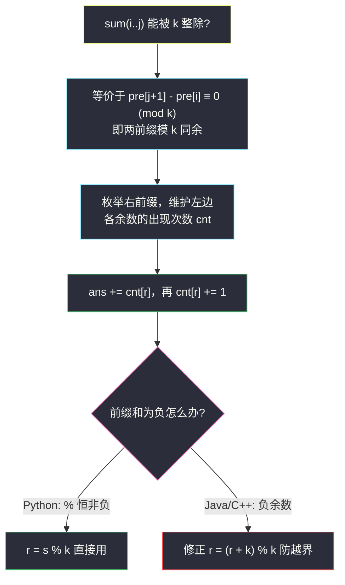
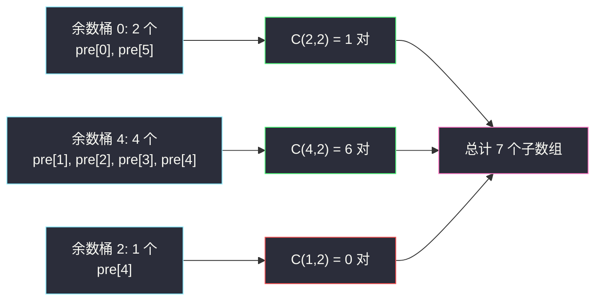

# 和可被 K 整除的子数组（前缀和 + 哈希 · 同余配对）

## 一、问题描述

给你一个整数数组 `nums` 和一个整数 `k`，返回其中和可被 `k` 整除的**连续**子数组的数目。

> 🔗 LeetCode 974：https://leetcode.cn/problems/subarray-sums-divisible-by-k/
>
> 数据范围：`1 <= nums.length <= 3 * 10^4`，`-10^4 <= nums[i] <= 10^4`，`2 <= k <= 10^4`。

**示例 1**

```
输入：nums = [4,5,0,-2,-3,1], k = 5
输出：7
解释：7 个子数组和是 5 的倍数：[4,5,0,-2,-3,1]、[5]、[5,0]、[5,0,-2,-3]、[0]、[0,-2,-3]、[-2,-3]。
```

**示例 2**

```
输入：nums = [5], k = 9
输出：0
```

**直观理解**

数组**含负数**，前缀和没有单调性，滑窗彻底失效。但「整除」是个**同余**条件：两个数模 `k` 余数相同，它们的差就是 `k` 的倍数——于是「子数组和被 k 整除」可以翻译成「两个前缀和同余」，用哈希计数配对解决。

---

## 二、暴力解法

枚举所有子数组，边延伸右端点边累加，判断 `% k == 0`（注意 Python 的负数取模天然非负，直接可用）。

```python
class Solution:
    def subarraysDivByK(self, nums: List[int], k: int) -> int:
        n, ans = len(nums), 0
        for i in range(n):
            s = 0                        # 子数组 nums[i..j] 的和
            for j in range(i, n):
                s += nums[j]
                if s % k == 0:
                    ans += 1
        return ans
```

### 复杂度

- **时间**：`O(n²)`。
- **空间**：`O(1)`。

### 🔴 瓶颈在哪里

`n = 3 * 10^4` 时约 `4.5 * 10^8` 次运算，超时。每个起点从零累加，完全没有复用「前缀和」这个天然可增量维护的信息。

---

## 三、优化探索（核心章节）

> 📚 本题在灵茶题单中属于 **§1.2 前缀和与哈希表**（常用数据结构 A），模板是 **枚举右维护左**：从左往右枚举右端点，哈希表维护左边各**余数**出现的次数，当前前缀查同余的计数完成配对。#974 是「前缀和 + 同余哈希」的代表题。

### 3.1 从「整除」到「同余」

记 `pre[j]` 为前 `j` 个元素的和（`pre[0] = 0` 为空前缀），则：

```
sum(i..j) = pre[j+1] - pre[i]
```

「`sum(i..j)` 能被 `k` 整除」等价于：

```
pre[j+1] - pre[i] ≡ 0 (mod k)  ⟺  pre[j+1] ≡ pre[i] (mod k)
```

即**两个前缀和模 `k` 同余**。子数组计数问题变成了「同余前缀对」计数问题。

### 3.2 枚举右维护左

从左往右枚举右前缀，哈希表 `cnt` 维护**左边**各余数出现的次数：

- 查询 `cnt[当前余数]`，即左边与当前同余的前缀个数，累加进答案；
- 再把当前余数入表 `cnt[当前余数] += 1`。

初始要预置 `cnt[0] = 1`：空前缀 `pre[0] = 0` 余数为 0，它是所有「从下标 0 开始的和为 k 倍数的子数组」的配对来源。

由于余数只有 `0..k-1` 共 `k` 种（`k <= 10^4` 很小），哈希表直接用长度为 `k` 的数组。

### 3.3 负数的余数修正

本题 `nums[i]` 可为负，前缀和可为负。**C++ / Java 的 `%` 向零取整**，`-1 % 5 = -1`，负下标会越界；需要修正：

```
r = (s % k + k) % k
```

**Python 的 `%` 结果与除数同号**，`-1 % 5 = 4` 恰好就是数学意义的非负余数，可以不修正。这也是本题最经典的跨语言陷阱。



### 3.4 组合视角：余数分组 + C(c,2)

换一个等价写法：扫完整个数组后，余数 `r` 出现了 `c_r` 次（含空前缀），同余类里任取两个前缀都能配出一个合法子数组，贡献 `C(c_r, 2) = c_r * (c_r - 1) / 2` 个：

```
答案 = Σ 各余数的 C(c_r, 2)
```

「边枚举边配对」与「先统计再组合」计数完全一致——前者每一步加的是「当前前缀与左边同余者的对数」，全部加起来就是总对数。

### 3.5 一句话核心

> **余数相同的两个前缀，夹出来的子数组和一定是 k 的倍数**；一趟扫描维护余数计数，`ans += cnt[r]` 即可，负数余数记得 `+k` 修正。

---

## 四、代码实现

### Python（主解：枚举右维护左，数组当哈希表）

```python
class Solution:
    def subarraysDivByK(self, nums: List[int], k: int) -> int:
        cnt = [0] * k
        cnt[0] = 1                       # 预置空前缀 pre[0] = 0，余数 0
        ans = s = 0
        for x in nums:
            s = (s + x) % k              # Python 取模恒非负，无需 +k 修正
            ans += cnt[s]                # 左边同余的前缀个数 = 本轮新增答案
            cnt[s] += 1                  # 当前前缀入表
        return ans
```

**变量含义**

| 变量 | 含义 |
|------|------|
| `s` | 当前前缀和的余数（只保留余数即可，防大数、也无需求差） |
| `cnt[r]` | 左边余数为 `r` 的前缀个数，`cnt[0]` 初始 1 |
| `cnt[s]` | 本轮查询到的同余配对数 |

**循环不变式**：处理第 `j` 个元素前，`cnt` 恰好统计了前缀 `pre[0..j]`（共 `j+1` 个）的余数分布。

**只存余数的好处**：`(s + x) % k` 滚动维护，前缀和本身永远不超 `k`，既省事又避免（其他语言中）溢出讨论。

### 组合写法（先统计后求和，同一思想的另一面）

```python
class Solution:
    def subarraysDivByK(self, nums: List[int], k: int) -> int:
        cnt = [0] * k
        cnt[0] = 1
        s = 0
        for x in nums:
            s = (s + x) % k
            cnt[s] += 1
        return sum(c * (c - 1) // 2 for c in cnt)   # Σ C(c, 2)
```

### Java（注意负数修正）

```java
class Solution {
    public int subarraysDivByK(int[] nums, int k) {
        int[] cnt = new int[k];
        cnt[0] = 1;
        int ans = 0, s = 0;
        for (int x : nums) {
            s = ((s + x) % k + k) % k;   // 负数修正：映射回 0..k-1
            ans += cnt[s];
            cnt[s]++;
        }
        return ans;
    }
}
```

---

## 五、具体例子演示

### 例 1：nums = [4,5,0,-2,-3,1], k = 5（示例 1）

先列前缀和与余数（代码中滚动维护，这里列全便于对照）：

| j | pre[j] | pre[j] mod 5 |
|---|--------|--------------|
| 0 | 0 | 0 |
| 1 | 4 | 4 |
| 2 | 9 | 4 |
| 3 | 9 | 4 |
| 4 | 7 | 2 |
| 5 | 4 | 4 |
| 6 | 5 | 0 |

逐步扫描（`cnt` 为查询时的内容，配对数即本轮 `ans` 增量）：

| j | nums[j] | s（新余数） | 查询 cnt[s] | 配对的前缀 | ans | 更新后 cnt |
|---|---------|-------------|--------------|------------|-----|------------|
| 0 | 4 | 4 | 0 | 无 | 0 | `{0:1, 4:1}` |
| 1 | 5 | 4 | 1 | pre[1] | 1 | `{0:1, 4:2}` |
| 2 | 0 | 4 | 2 | pre[1]、pre[2] | 3 | `{0:1, 4:3}` |
| 3 | -2 | 2 | 0 | 无 | 3 | `{0:1, 4:3, 2:1}` |
| 4 | -3 | 4 | 3 | pre[1]、pre[2]、pre[3] | 6 | `{0:1, 4:4, 2:1}` |
| 5 | 1 | 0 | 1 | pre[0] | 7 | `{0:2, 4:4, 2:1}` |

答案 `7` ✓。逐对还原：`(0,5]`→`[4,5,0,-2,-3,1]`、`(1,1]`→`[5]`、`(1,2]`→`[5,0]`、`(2,2]`→`[0]`、`(1,3]`→`[5,0,-2,-3]`、`(2,3]`→`[0,-2,-3]`、`(0,4]`→`[-2,-3]`……共 7 个，与示例一致。

**组合视角验证**：余数 0 出现 2 次、余数 4 出现 4 次、余数 2 出现 1 次，`C(2,2) + C(4,2) + C(2,1)` 即 `1 + 6 + 0 = 7` ✓。

### 例 2：负数余数修正，nums = [-1,2,9], k = 5

前缀和 `0, -1, 1, 10`：

| j | pre | 正确余数 | Java 错误取法 s % k | 修正后 |
|---|-----|----------|----------------------|--------|
| 1 | -1 | 4 | -1 | `(-1 + 5) % 5 = 4` |
| 2 | 1 | 1 | 1 | 1 |
| 3 | 10 | 0 | 0 | 0 |

余数序列 `0,4,1,0`：`j=3` 时 `cnt[0]=1` 配对成功，答案 1，对应子数组 `[-1,2,9]`（和 10）✓。若不做 `+k` 修正，`-1` 与 `4` 会被当成两个不同余数，漏掉/错乱配对。



（上图为组合视角：每个余数桶内部两两配对。）

---

## 六、复杂度分析

| 方法 | 时间 | 空间 | 说明 |
|------|------|------|------|
| 暴力枚举 | `O(n²)` | `O(1)` | 每个起点重新累加 |
| 同余配对 | `O(n)` | `O(k)` | 一趟扫描 + 长度 k 的计数数组 |

---

## 七、对比总结

**前缀和 + 哈希家族：本题的位置**

| 题 | 转化的「等价变换」 | 配对条件 |
|----|--------------------|----------|
| #560 和为 K 的子数组 | 恒等 | `pre[i] == pre[j] - k` |
| **#974 本篇** | `T(x) = x mod k` | **余数相等** |
| #1524 和为奇数 | `T(x) = x mod 2`，取**反号** | 余数不同 |
| #2588 美丽子数组 | 异或前缀（值本身就是变换） | 前缀相等 |

「模 k」是把无限多种前缀和压缩到 `k` 个等价类的哈希思想，模 2、按位模 2（异或）都是它的特例。

**易错点**

1. **`cnt[0] = 1` 不能漏**：空前缀负责配对「从下标 0 开始」的子数组。
2. **先查询再入表**：防止把当前前缀自己算进配对。
3. **负数余数**：Python 无忧；Java/C++ 必须 `((s % k) + k) % k`。
4. 只需维护**余数**而非前缀和本身，避免不必要的大数（其他语言防溢出）。

**模板（同余配对，Python 版）**

```python
cnt = [0] * k
cnt[0] = 1
ans = s = 0
for x in nums:
    s = (s + x) % k
    ans += cnt[s]
    cnt[s] += 1
return ans
```

---

## 八、举一反三

| 题目 | 关系 |
|------|------|
| [1524. 和为奇数的子数组数目](https://leetcode.cn/problems/number-of-sub-arrays-with-odd-sum/) | 「模 2」特例且配反号，最简形态，见同批 `number-of-sub-arrays-with-odd-sum.md` |
| [2588. 统计美丽子数组数目](https://leetcode.cn/problems/count-the-number-of-beautiful-subarrays/) | 换成异或前缀的「同值配对」，与本题完全同构，见同批 `count-the-number-of-beautiful-subarrays.md` |
| [560. 和为 K 的子数组](https://leetcode.cn/problems/subarray-sum-equals-k/) | 家族鼻祖，先做它再回看本题更顺 |
| [523. 连续的子数组和](https://leetcode.cn/problems/continuous-subarray-sum/) | 同余 + **最早下标**：要求子数组长度 ≥ 2，哈希存余数首次出现位置 |
| [1590. 使数组和能被 P 整除](https://leetcode.cn/problems/make-the-sum-of-divisible-by-p/) | 同余 + 最短子数组：哈希存余数**最后**下标 |
| [1074. 元素和为目标值的子矩阵数目](https://leetcode.cn/problems/number-of-submatrices-that-sum-to-target/) | 本题推广到二维矩阵（前缀和 + 哈希嵌套） |

**思想迁移**

- 「差满足整除关系」→ **同余配对**；余数是天然且数量有限的哈希键。
- 同一框架换维护内容即可变形：计数存「次数」（本题）、求最短存「最后下标」（#1590）、求长度 ≥ 2 存「最早下标」（#523）。
- 口诀：**「同余两个前缀，夹出 k 的倍数；负数别忘加 k，零桶先放一个。」**
