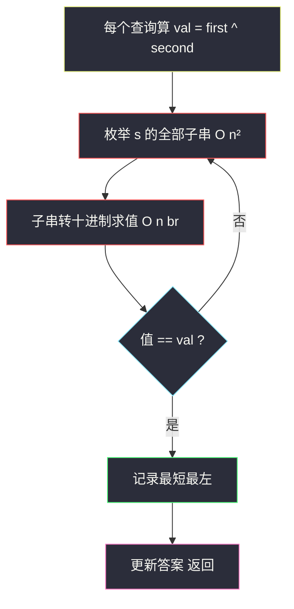

# 2564. 子字符串异或查询（Substring XOR Queries）

> 题目来源：[https://leetcode.cn/problems/substring-xor-queries/](https://leetcode.cn/problems/substring-xor-queries/)
>
> 灵茶题单小节：§字符串/哈希预处理

## 一、问题描述

给你一个 **二进制字符串** `s` 和一个二维整数数组 `queries`，其中 `queries[i] = [first_i, second_i]`。

对于第 `i` 个查询，找到 `s` 的 **最短** 子字符串，它对应的 **十进制值** `val` 与 `first_i` **按位异或** 得到 `second_i`，换言之 `val ^ first_i == second_i`。

第 `i` 个查询的答案是子字符串 `[left_i, right_i]` 的两个端点（下标从 `0` 开始）；如果不存在这样的子字符串，答案为 `[-1, -1]`；如果有多个答案，选择 `left_i` 最小的一个。返回数组 `ans`。

**数据范围**：

- `1 <= len(s) <= 10⁴`
- `s[i]` 为 `'0'` 或 `'1'`
- `1 <= len(queries) <= 10⁵`
- `0 <= first_i, second_i <= 10⁹`

**示例 1**：

```text
输入：s = "101101", queries = [[0,5],[1,2]]
输出：[[0,2],[2,3]]
解释：查询 [0,5]：子串 "101"（下标 [0,2]）值为 5，5 ^ 0 = 5 ✓；
     查询 [1,2]：子串 "11"（下标 [2,3]）值为 3，3 ^ 1 = 2 ✓。
```

**示例 2**：

```text
输入：s = "0101", queries = [[12,8]]
输出：[[-1,-1]]
解释：12 ^ 8 = 4（二进制 "100"），s 中不存在无前导零且值为 4 的子串。
```

**示例 3**：

```text
输入：s = "1", queries = [[4,5]]
输出：[[0,0]]
解释：4 ^ 5 = 1，子串 "1" 值为 1，答案 [0,0]。
```

**核心思考点**：`val = first ^ second` 是 **唯一确定** 的，所以每个查询的答案只取决于「值为 `val` 的最短、最靠左子串是否出现过」。`first, second ≤ 10⁹ < 2³⁰`，故 `val < 2³⁰`，二进制表示至多 **30 位**——`s` 的所有候选子串只需枚举长度 `1..30` 的那些，全部打表存哈希，`10⁵` 个查询每个 `O(1)` 查表。

## 二、暴力解法

### 思路

对每个查询 `[first, second]`，计算目标值 `val = first ^ second`，然后扫描 `s` 的所有子串，找到值等于 `val` 的最短、最靠左的那个。



### 代码

```python
def substringXorQueriesBrute(s: str, queries: list[list[int]]) -> list[list[int]]:
    n = len(s)
    ans = []
    for first, second in queries:
        val = first ^ second
        best = [-1, -1]
        # 按「长度递增、左端点递增」枚举，第一个命中的即最短最左
        found = False
        for ln in range(1, n + 1):
            if found:
                break
            for i in range(n - ln + 1):
                if s[i] == '0' and ln > 1:      # 前导零子串无效
                    continue
                if int(s[i:i + ln], 2) == val:
                    best = [i, i + ln - 1]
                    found = True
                    break
        ans.append(best)
    return ans
```

### 复杂度

- 时间：`O(len(queries) × n² )` ≈ `10⁵ × 10⁸ × 30`，完全不可行（仅作对拍参照）。
- 空间：`O(1)`。

## 三、优化探索

### 3.1 查询侧的信息压缩

查询虽多（`10⁵` 个），但每个查询只问一件事：**「值为 `val` 的最短最左子串在哪」**。而 `val < 2³⁰`，答案候选只有 `2³⁰` 种可能——远小于子串总数。这就是典型的「**预处理子串值 → 哈希表 → O(1) 查询**」结构，与「和为 K 的子数组」的前缀和哈希是同一思想家族。

### 3.2 只需枚举 30 位以内的子串

`val = first ^ second` 两个操作数都 `< 2³⁰`，异或结果也 `< 2³⁰`，二进制长度 ≤ 30。因此值超过 `2³⁰` 的长子串不可能被查询命中——**长度 `1..30` 的子串就覆盖了全部答案空间**，共约 `30n ≤ 3 × 10⁵` 个候选。

### 3.3 「最短 + 最左」由枚举顺序天然保证

题目的 tie-break 规则（最短优先，其次 `left` 最小）恰好对应 **两层循环的枚举顺序**：

- 外层：长度 `ln` 从 `1` 到 `30` 递增——先入表的值必然是更短的表示；
- 内层：左端点 `i` 从小到大——同长度下更靠左的先入表；
- 哈希表用「不存在才写入」（`setdefault` / `not in` 判断），保证每个值保留 **第一次出现** 的位置。

### 3.4 前导零与 `val = 0` 特判

- 以 `'0'` 开头且长度 > 1 的子串（如 `"01"`、`"010"`）有前导零，它的数值总会由某个 **更短的合法子串** 表示（`"01"` 的值 `1` 已由 `"1"` 以更短形式入表），因此直接跳过，不影响正确性；
- `val = 0` 的合法表示只有 `"0"`（长度 1）——它同样被外层 `ln = 1` 的循环覆盖：`s` 中首个 `'0'` 的位置即答案；若 `s` 全为 `'1'`，表里没有 0，查询返回 `[-1,-1]`。无需任何特判代码。

## 四、代码实现

### 主解：分层预处理 + 哈希查表

```python
def substringXorQueries(s: str, queries: list[list[int]]) -> list[list[int]]:
    n = len(s)
    # first[val] = (left, right)：值 val 的最短最左子串位置
    first = {}

    # 外层长度递增 → 先入表的一定更短；
    # 内层左端点递增 → 同长度下更靠左的先入表
    for ln in range(1, 31):                    # val < 2^30，30 位足够
        val = 0
        for i in range(n):
            val = val * 2 + (s[i] == '1')      # 滑动窗口增量求值
            if i >= ln:                        # 窗口滑出，减去移出位（它已被左移到 2^ln 权位）
                val -= (s[i - ln] == '1') << ln
            if i < ln - 1:
                continue                       # 窗口尚未填满 ln 位
            l = i - ln + 1
            if s[l] == '0' and ln > 1:         # 前导零子串不入表
                continue
            if val not in first:               # 保留首次出现 = 最短最左
                first[val] = (l, i)

    return [[*first.get(f ^ s2, (-1, -1))] for f, s2 in queries]
```

### 细节说明

- **增量求值**：固定长度 `ln` 滑动时，`val = val * 2 + 新位 - 首位 × 2^(ln-1)`，每步 `O(1)`；比每次 `int(s[i:i+ln], 2)` 切片（`O(ln)`）更快，总复杂度 `O(30n)`。
- **前导零过滤的严谨性**：以 `'0'` 开头且长度 > 1 的子串（如 `"01"`）其数值等于去掉前导零后的更短子串——那个更短子串属于更小的层、已被先处理入表，`if val not in first` 保证不会覆盖。也就是说，即使漏写这条 `continue`，答案仍不会错，但会把「值 1 → 下标 1 的 `"1"`」这类规范表示被冗长表示抢先占位的隐患留在逻辑里，且白白写入大量无效键。显式过滤既省空间又把「最短」语义从「依赖覆盖顺序」变成「构造性保证」。
- **`val = 0` 自动覆盖**：`ln = 1` 时窗口 `"0"` 的值 0 会入表（`s[l] == '0'` 但 `ln == 1` 不触发跳过），首个 `'0'` 的位置即答案；若 `s` 全为 `'1'`，表里没有 0，查询返回 `[-1,-1]`——无需任何特判分支。
- **查询侧一行流**：`first.get(f ^ s2, (-1, -1))`——不存在的值统一落到 `[-1,-1]`。

## 五、例子演示

用示例 1 `s = "101101"`, `queries = [[0,5],[1,2]]` 端到端走一遍。

**预处理分层入表**（只列每层新入表的值）：

| 层 ln | 新入表的值 → (left, right) | 说明 |
|---|---|---|
| 1 | `1→(0,0)`、`0→(1,1)` | `"1"`、首个 `"0"`（下标 1） |
| 2 | `2→(0,1)`（`"10"`）、`3→(2,3)`（`"11"`） | `"10"`(下标 3) 已有 2 不覆盖 |
| 3 | `5→(0,2)`（`"101"`） | 下标 2、3 的 `"101"` 不覆盖 |
| 4 | `11→(0,3)`（`"1011"`）、`13→(2,5)`（`"1101"`） | |
| 5 | `22→(0,4)`（`"10110"`） | `"01101"` 前导零跳过 |
| 6 | `45→(0,5)`（`"101101"`） | |

**查询处理**：

| 查询 | val = first^second | 表中命中 | 答案 |
|---|---|---|---|
| `[0, 5]` | `0 ^ 5 = 5` | `5 → (0, 2)` | `[0, 2]` ✅ |
| `[1, 2]` | `1 ^ 2 = 3` | `3 → (2, 3)` | `[2, 3]` ✅ |

**「最短」语义验证**（查询 `[0,5]` 为什么不是 `[0,2]` 之外的更长表示）：值 5 的子串有 `"101"`(下标 0) 与 `"101"`(下标 2, 3)，最短长度都是 3，取 `left` 最小 `(0,2)`——若 `s` 后面还有更长的 `"…101…"` 包含式表示（如 `"0101"` 含值 5 但有前导零），永远不会入表。

**val = 0 场景**（对照示例 2 `s = "0101"`）：`12 ^ 8 = 4`，表里值为 4 的键不存在（4 的二进制 `"100"` 在 s 中无无前导零出现）→ `[-1,-1]` ✅；但若查询 `first ^ second = 0`，命中 `0 → (1, 1)`（首个 `"0"`）。

```mermaid
flowchart LR
    subgraph P["预处理 O 30n "]
        L1["ln=1..30 分层枚举"] --> L2["增量求值 + 前导零过滤"]
        L2 --> L3["哈希表存首次出现"]
    end
    subgraph Q["查询 O q  "]
        C1["val = first ^ second"] --> C2["O 1  查表"]
        C2 --> C3["未命中 → -1 -1"]
    end
    P -->|first 哈希表| Q
    style P fill:#1e1f29,stroke:#6272a4
    style Q fill:#1e1f29,stroke:#6272a4
    style L1 fill:#2b2d3a,stroke:#8be9fd,color:#f8f8f2
    style L2 fill:#2b2d3a,stroke:#8be9fd,color:#f8f8f2
    style L3 fill:#2b2d3a,stroke:#50fa7b,color:#f8f8f2
    style C1 fill:#2b2d3a,stroke:#f1fa8c,color:#f8f8f2
    style C2 fill:#2b2d3a,stroke:#50fa7b,color:#f8f8f2
    style C3 fill:#2b2d3a,stroke:#ff5555,color:#f8f8f2
```



## 六、复杂度分析

设 `n = len(s)`，`q = len(queries)`：

- **时间复杂度：`O(30n + q)`**
  - 预处理：30 层 × 每层滑窗 `O(n)` 增量求值，共 `O(30n) ≈ 3 × 10⁵`；
  - 查询：每个 `O(1)` 哈希查找，共 `O(q)`。
  - 对比暴力 `O(q × n²)`：把「按定义重复搜索」变成「一次建表处处查询」。
- **空间复杂度：`O(min(30n, 2³⁰))`**
  - 哈希表最多存 `30n ≈ 3 × 10⁵` 个键值对（不同子串值至多这个数量级）。

## 七、对比总结

| 维度 | 暴力（逐查询搜子串） | 主解（分层预处理 + 查表） |
|---|---|---|
| 时间 | `O(q × n² )` | `O(30n + q)` |
| 空间 | `O(1)` | `O(30n)` |
| 查询延迟 | 每个查询独立计算 | 建表后 O(1) |
| 关键观察 | 无 | val < 2³⁰ 限定子串长度 ≤ 30；枚举顺序天然实现最短最左 |

**套路归纳**：**「值域有限 + 批量查询」→ 预处理所有可能答案入哈希表**。本题的三个关键点——①值域 `2³⁰` 限定候选子串长度；②分层枚举顺序编码 tie-break 规则；③前导零过滤保证表示规范——可整体迁移到「子串数值/哈希指纹查询」一族题目。当子串更长（值域无限）时，改用「字符串哈希（多项式指纹）」或后缀数组，思路同构。

## 八、举一反三

1. **[187. 重复的 DNA 序列](https://leetcode.cn/problems/repeated-dna-sequences/)**：固定长度子串指纹入哈希表的入门版（长度 10 ↔ 本题长度 ≤ 30）。
2. **[560. 和为 K 的子数组](https://leetcode.cn/problems/subarray-sum-equals-k/)**：前缀和哈希「预处理子数组信息 → O(1) 查询」的求和版同构。
3. **[1442. 形成两个异或相等数组的三元组数目](https://leetcode.cn/problems/count-triplets-that-can-form-two-arrays-with-equal-xor/)**：前缀异或 + 哈希统计，异或版「预处理前缀信息」。
4. **[421. 数组中两个数的的最大异或值](https://leetcode.cn/problems/maximum-xor-of-two-numbers-in-an-array/)**：异或值域的字典树视角，理解 `first ^ second = val` 三角关系的另一种查询结构。
5. **[1044. 最长重复子串](https://leetcode.cn/problems/longest-duplicate-substring/)**：子串指纹 + 二分长度，本题「分层枚举长度」策略的进阶形态。

**同族互引**：本篇是灵茶题单「字符串/哈希预处理」小节的代表题，与 [187. 重复的 DNA 序列](https://leetcode.cn/problems/repeated-dna-sequences/)（定长子串指纹）和 [560. 和为 K 的子数组](https://leetcode.cn/problems/subarray-sum-equals-k/)（前缀和哈希）构成「子串信息预建表」三部曲：一个存指纹找重复、一个存前缀和找定值、本题存数值找最短表示——建表思路相同，键的语义各异。
