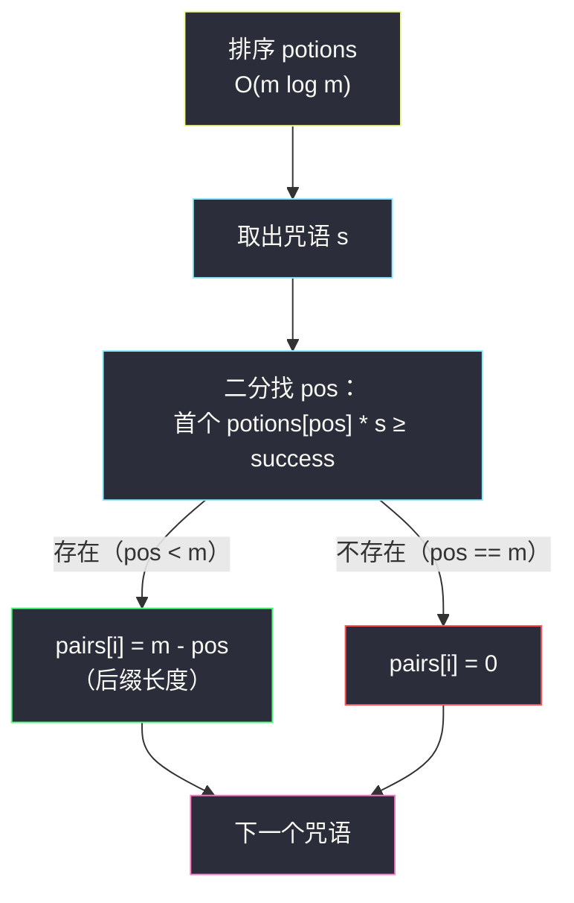
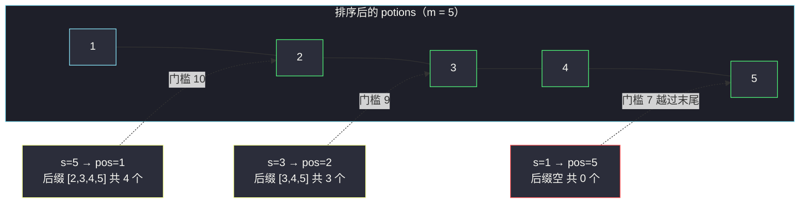

# 咒语和药水的成功对数（排序 + 二分找首个满足位置）

## 一、问题描述

给你两个正整数数组 `spells` 和 `potions`，长度分别为 `n` 和 `m`，其中 `spells[i]` 是第 `i` 个咒语的**强度**，`potions[j]` 是第 `j` 瓶药水的**能量**。

同时给你一个整数 `success`。一个「咒语-药水」对被认为是**成功的**，当且仅当 `spells[i] * potions[j] >= success`。

请你返回一个长度为 `n` 的整数数组 `pairs`，其中 `pairs[i]` 是能跟第 `i` 个咒语**成功配对**的药水数目。

> 🔗 LeetCode 2300：https://leetcode.cn/problems/successful-pairs-of-spells-and-potions/
>
> 数据范围：`n == spells.length`，`m == potions.length`，`1 <= n, m <= 10^5`，`1 <= spells[i], potions[i] <= 10^5`，`1 <= success <= 10^10`。

**示例 1**

```
输入：spells = [5,1,3], potions = [1,2,3,4,5], success = 7
输出：[4,0,3]
解释：
- 咒语 5：5*1=5 ✗，5*2=10 ✓，5*3=15 ✓，5*4=20 ✓，5*5=25 ✓ → 4 对；
- 咒语 1：最大 1*5=5 < 7 → 0 对；
- 咒语 3：3*1=3 ✗，3*2=6 ✗，3*3=9 ✓，3*4=12 ✓，3*5=15 ✓ → 3 对。
```

**示例 2**

```
输入：spells = [3,1,2], potions = [8,5,8], success = 16
输出：[2,0,2]
解释：排序后 potions = [5,8,8]。
- 咒语 3：3*5=15 ✗，3*8=24 ✓ ×2 → 2 对；
- 咒语 1：最大 8 < 16 → 0 对；
- 咒语 2：2*5=10 ✗，2*8=16 ✓ ×2 → 2 对。
```

**直观理解**

固定咒语强度 `s`，条件 `s * potion >= success` 即 `potion >= success / s`——**药水能量有一个门槛，过了门槛的全都成功**。如果药水有序，成功的就是一段**后缀**：只要求出「第一个过门槛的位置」，个数就是 `m - 该位置`。于是套路清晰：排序 `potions`，对每个咒语二分找门槛位置。

---

## 二、暴力解法

对每个咒语扫一遍全部药水，逐个乘出来比较。

```python
class Solution:
    def successfulPairs(self, spells: List[int], potions: List[int], success: int) -> List[int]:
        ans = []
        for s in spells:
            cnt = 0
            for p in potions:
                if s * p >= success:      # 成功配对
                    cnt += 1
            ans.append(cnt)
        return ans
```

### 复杂度

- **时间**：`O(n * m)`。
- **空间**：`O(1)`（不计返回数组）。

### 🔴 瓶颈在哪里

`n = m = 10^5` 时要乘 `10^10` 次，铁定超时。内层做的事是「在一个**无序**数组里数有多少元素 ≥ 某门槛」，只能线性扫；一旦数组**有序**，这活儿二分一步到位。

---

## 三、优化探索（核心章节）

> 📚 本题在灵茶题单中属于 **§1.2 二分进阶（排序 / 预处理 + 二分）**：先排序 `potions`（`O(m log m)`），此后每个咒语的询问从 `O(m)` 降到 `O(log m)`。灵神的二分模板是「求满足 `check(x)` 的最小 `x`」：红蓝染色、`l = 下界`、`r = 上界 + 1`，循环内 `if (check(mid)) r = mid else l = mid + 1`，答案 `l`。

### 3.1 观察特征

| 特征 | 说明 |
|------|------|
| 条件可改写为单边 | `s * p >= success` ⟺ `p >= success / s`，门槛只与 `s` 有关 |
| 乘法单调 | `p` 越大乘积越大 → 「成功」的药水在有序数组中是一段连续后缀 |
| 询问是逐个独立 | 每个咒语各问一次门槛 → 排序一次，复用 `n` 次 |

### 3.2 后缀计数 → 二分找首个成功位置

排序后，设 `pos` 为「第一个满足 `potions[pos] * s >= success` 的下标」，则成功对数 = `m - pos`。求 `pos` 正是「求满足 `check(x)` 的最小 `x`」（`check(x) = potions[x] * s >= success`）：



### 3.3 门槛的整数化：为什么用乘不用除

「门槛」可以写成 `p >= ⌈success / s⌉`（向上取整，因为 `p` 是整数）。Python 里是 `(success + s - 1) // s`。但更推荐的做法是**把不等式两边同乘、避免除法**：

- 二分时直接判断 `potions[mid] * s >= success`，全程整数运算，不存在上取整的推导，也不存在浮点误差；
- 注意乘积上界 `10^5 * 10^5 = 10^10`，**超过 32 位 int**，Java 必须用 `long`（Python 天然大整数，无此烦恼）。

两种写法等价，本文主解用「乘法版」——它是灵神模板最朴素的落法：`check` 直接抄题目条件，不用做任何数学变形。

### 3.4 为什么排序 potions 而不是 spells

两边只排一个就够（排完的那边才具备可二分性）。排 `potions` 更顺：`spells` 的答案要求**按原下标**输出，动它还得记下标还原；而 `potions` 只贡献「个数」，顺序无所谓。

### 3.5 一句话核心

> **排序药水后，「成功」是一段后缀；对每个咒语二分找后缀的起点，答案 = 数组长度 − 起点。**

---

## 四、代码实现

### Python（主解：排序 + 手写二分模板）

```python
class Solution:
    def successfulPairs(self, spells: List[int], potions: List[int], success: int) -> List[int]:
        potions.sort()
        m = len(potions)
        ans = []
        for s in spells:
            # 求满足 check(x) 的最小 x，check(x) = potions[x] * s >= success
            l, r = 0, m                    # r = 上界 + 1
            while l < r:
                mid = (l + r) // 2
                if potions[mid] * s >= success:   # mid 可行，尝试更左
                    r = mid
                else:                              # mid 不行，门槛在右侧
                    l = mid + 1
            ans.append(m - l)             # 后缀 [l, m-1] 全部成功
        return ans
```

等价写法（先算整数门槛再二分，注意向上取整）：

```python
from bisect import bisect_left

class Solution:
    def successfulPairs(self, spells: List[int], potions: List[int], success: int) -> List[int]:
        potions.sort()
        m = len(potions)
        ans = []
        for s in spells:
            t = (success + s - 1) // s     # 门槛 = ⌈success / s⌉
            pos = bisect_left(potions, t)  # 首个 >= t 的下标
            ans.append(m - pos)
        return ans
```

**变量含义**

| 变量 | 含义 |
|------|------|
| `l` / `r` | 二分闭区间左端 / 哨兵右端（`m = 上界 + 1`），循环结束 `l` 即后缀起点 |
| `check(mid)` | `potions[mid] * s >= success`，题目条件原样照抄 |
| `m - l` | 满足条件的后缀长度，即成功对数 |
| `t` | 整数门槛 `⌈success / s⌉`（除法版写法用） |

**循环不变式**：`[0, l)` 内的药水全部失败（乘积 `< success`），`[r, m)` 内的药水全部成功；`l == r` 时二者拼上 `r == l` 处的判定恰好完整覆盖。

### Java（最优解同款写法，注意用 long）

```java
// 咒语和药水的成功对数
// 测试链接 : https://leetcode.cn/problems/successful-pairs-of-spells-and-potions/
class Solution {
    public int[] successfulPairs(int[] spells, int[] potions, long success) {
        Arrays.sort(potions);
        int n = spells.length, m = potions.length;
        int[] ans = new int[n];
        for (int i = 0; i < n; i++) {
            long s = spells[i];
            int l = 0, r = m;              // r = 上界 + 1
            while (l < r) {
                int mid = l + (r - l) / 2;
                if (potions[mid] * s >= success) { // 乘积用 long 比较
                    r = mid;
                } else {
                    l = mid + 1;
                }
            }
            ans[i] = m - l;                // 后缀长度
        }
        return ans;
    }
}
```

---

## 五、具体例子演示

以 `spells = [5,1,3]`、`potions = [1,2,3,4,5]`、`success = 7` 端到端走一遍。排序后 `potions = [1,2,3,4,5]`（已有序），`m = 5`。

**咒语 s = 5：找首个 `potions[pos] * 5 >= 7` 的下标**

| 轮次 | l | mid | r | potions[mid] | 乘积 | check（≥ 7 ?） | 动作 |
|------|---|-----|---|--------------|------|-----------------|------|
| 1 | 0 | 2 | 5 | 3 | 15 | ✓ | r = 2 |
| 2 | 0 | 1 | 2 | 2 | 10 | ✓ | r = 1 |
| 3 | 0 | 0 | 1 | 1 | 5 | ✗ | l = 1 |
| 结束 | 1 | — | 1 | — | — | — | pos = 1 |

`m - pos = 5 - 1 = 4` ✓（对应 `2,3,4,5` 四瓶）。

**咒语 s = 1：找首个 `potions[pos] * 1 >= 7` 的下标**

| 轮次 | l | mid | r | potions[mid] | 乘积 | check | 动作 |
|------|---|-----|---|--------------|------|-------|------|
| 1 | 0 | 2 | 5 | 3 | 3 | ✗ | l = 3 |
| 2 | 3 | 4 | 5 | 5 | 5 | ✗ | l = 5 |
| 结束 | 5 | — | 5 | — | — | — | pos = 5 = m |

`m - pos = 0` ✓（连最大药水都不够）。

**咒语 s = 3：找首个 `potions[pos] * 3 >= 7` 的下标**

| 轮次 | l | mid | r | potions[mid] | 乘积 | check | 动作 |
|------|---|-----|---|--------------|------|-------|------|
| 1 | 0 | 2 | 5 | 3 | 9 | ✓ | r = 2 |
| 2 | 0 | 1 | 2 | 2 | 6 | ✗ | l = 2 |
| 结束 | 2 | — | 2 | — | — | — | pos = 2 |

`m - pos = 3` ✓（对应 `3,4,5` 三瓶）。

最终输出 `[4, 0, 3]` ✓。可以看到：**门槛越低（咒语越强），二分落点越靠左，后缀越长**——这正是条件单调性的体现。



（上图中绿色节点表示各咒语对应的后缀起点；`s=1` 的门槛越过末尾，后缀为空。）

---

## 六、复杂度分析

| 方法 | 时间 | 空间 | 说明 |
|------|------|------|------|
| 暴力 | `O(n * m)` | `O(1)` | `10^10` 次乘法，超时 |
| 排序 + 二分 | `O((n + m) log m)` | `O(1)` | 排序 `O(m log m)` + `n` 次二分 `O(n log m)`；不计输出数组与排序栈空间 |

量级感受：`m log m ≈ 10^5 × 17 ≈ 1.7 × 10^6`，`n log m` 同阶，合计约几百万次操作，轻松通过。

---

## 七、对比总结

| 视角 | 暴力 | 排序 + 二分 |
|------|------|-------------|
| 内层操作 | 逐个乘、逐个比 | 二分定位后缀起点 |
| 单次询问 | `O(m)` | `O(log m)` |
| 前置代价 | 无 | 一次排序 |

**与同批题的横向对照**

| 题 | 预处理 | 每次二分找什么 | 答案形态 |
|----|--------|----------------|----------|
| #1385 两个数组间的距离值 | 排序 arr2 | 首个 `>= a-d` 的下标，看它是否 `<= a+d` | 计数（见 `find-the-distance-value-between-two-arrays.md`） |
| #2300 本篇 | 排序 potions | 首个乘积 `>= success` 的下标 | 后缀长度 `m - pos` |
| #2476 BST 最近节点查询 | 中序展开成有序数组 | 两次：`<= q` 的最大与 `>= q` 的最小 | 一对边界值（见 `closest-nodes-queries-in-a-binary-search-tree.md`） |

**易错点**

1. **溢出**：`potions[mid] * s` 最高 `10^10`，Java/C++ 必须用 `long`/`long long`，这是本题最经典的翻车点。
2. 若走「门槛」路线，务必是 `⌈success / s⌉` 向上取整：`(success + s - 1) // s`，写成 `success // s` 会把「除不尽但乘起来恰好够」的药水漏掉（例如 `success=7, s=3`：`7//3=2` 会误排除 `3*3=9 ≥ 7` 的药水 3）。
3. 二分右端是 `m`（上界 + 1），表示「不存在」的哨兵；`l == m` 时后缀为空，`m - l` 自然为 0，不需要额外特判。
4. 排序后原下标信息丢失——本题只数个数所以没事；若题目要你返回药水的**下标**，就得排下标或用哈希记录位置。

---

## 八、举一反三

| 题目 | 关系 |
|------|------|
| [1385. 两个数组间的距离值](https://leetcode.cn/problems/find-the-distance-value-between-two-arrays/) | 同批姊妹篇（同 §1.2），见 `find-the-distance-value-between-two-arrays.md`：排序 + 二分判区间非空 |
| [2476. 二叉搜索树最近节点查询](https://leetcode.cn/problems/closest-nodes-queries-in-a-binary-search-tree/) | 同批姊妹篇（同 §1.2），见 `closest-nodes-queries-in-a-binary-search-tree.md`：有序化 + 两次二分 |
| [2563. 统计公平数对的数目](https://leetcode.cn/problems/count-the-number-of-fair-pairs/) | 排序后数「和落在区间内」的对数，两次二分作差，见同目录 `count-the-number-of-fair-pairs.md` |
| [275. H 指数 II](https://leetcode.cn/problems/h-index-ii/) | 有序数组上直接二分找「首个满足条件的位置」，无排序成本版 |
| [875. 爱吃香蕉的珂珂](https://leetcode.cn/problems/koko-eating-bananas/) | 「每个香蕉堆消耗 ⌈pile/k⌉」与本题门槛思想同源，进阶为二分答案求最小速度 |

**思想迁移**

- 看到「乘积 / 和 **≥ 某阈值**的个数」，第一反应：**一边排序，另一边二分找边界，计数 = 长度 − 边界**。
- 比较类二分尽量「**移项后同乘同加**」保持整数运算，把除法、开方留给必要时再上取整。
- 口诀：**「单边条件成后缀，排序一次二分随；答案长度减起点，乘积溢出要 long 陪。」**
