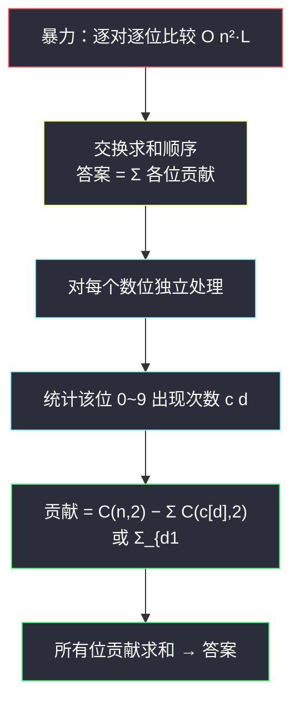

# 3153. 所有数对数字位差异之和（Sum of Digit Differences of All Pairs）

> 题目来源：[https://leetcode.cn/problems/sum-of-digit-differences-of-all-pairs/](https://leetcode.cn/problems/sum-of-digit-differences-of-all-pairs/)
>
> 灵茶题单小节定位：§四、拆位 / 贡献法（按位独立 + 计数贡献）

## 一、问题描述

给定一个由 **正整数** 组成的数组 `nums`，其中所有整数的 **数位长度相同**。

两个整数的 **数位差** 定义为：在 **相同位置** 上数字 **不同** 的数目。

例如，`123` 和 `321` 的数位差为 `3`（百位 `1≠3`、十位 `2=2`、个位 `3≠1`——等等，百位和个位不同、十位相同，共 2 处不同，数位差为 `2`）。

返回 `nums` 中 **所有无序数对** `(i, j)`（`i < j`）的数位差之和。

**数据范围**：

- `2 <= nums.length <= 10⁵`
- `1 <= nums[i] < 10⁹`
- `nums` 中所有整数数位长度相同（最多 10 位）

**示例 1**：

```text
输入：nums = [13,23,12]
输出：4
解释：13 与 23 差 1 位（十位 1≠2）；
     13 与 12 差 1 位（个位 3≠2）；
     23 与 12 差 2 位（十位、个位都不同）。
     总和 = 1 + 1 + 2 = 4。
```

**示例 2**：

```text
输入：nums = [10,10,10,10]
输出：0
解释：所有整数相同，每个数对的数位差都是 0。
```

**核心思考点**：一对一对地比较是 `O(n² × 位数)` 的。换视角做 **按位独立**：整个答案 = 每一数位上「不同数字对」的个数之和。而对单个数位，「不同数字对」可以用 **数字出现次数** 直接数出来——每位的贡献互相无关，这就是「拆位 / 贡献法」。

## 二、暴力解法

### 思路

老老实实枚举每一对 `(i, j)`，把两个数转成十进制字符串逐位比较，累计不同的位数。

### 代码

```python
def sumDigitDifferencesBrute(nums: list[int]) -> int:
    n = len(nums)
    s = [str(x) for x in nums]
    total = 0
    for i in range(n):
        for j in range(i + 1, n):
            total += sum(1 for a, b in zip(s[i], s[j]) if a != b)
    return total
```

### 复杂度

- 时间：`O(n² × L)`，`L` 为数位长度（≤ 10）。`n = 10⁵` 时约 `10¹⁰ × L` 次比较，超时。
- 空间：`O(n × L)`（字符串列表）。

## 三、优化探索

### 3.1 换视角：从「逐对统计」到「逐位统计」

把答案按数位拆开重写：

```text
答案 = Σ(所有数对) Σ(所有位) [两位数字不同]
     = Σ(所有位) Σ(所有数对) [两位数字不同]        ← 交换求和顺序
     = Σ(所有位) 该位上「数字不同的无序对」个数
```

交换求和顺序后，每个数位变成了一个 **独立的小问题**：一列数字（`n` 个），数出其中不同的无序对有多少。

### 3.2 单个位置的计数公式

设某一数位上数字 `d`（0~9）出现的次数为 `c[d]`，总个数 `S = Σ c[d] = n`：

- **相同**数字的无序对数 = `Σ C(c[d], 2)`；
- 无序对总数 = `C(n, 2)`；
- **不同**数字的无序对数 = `C(n, 2) − Σ C(c[d], 2)`。

也可以直接枚举数字对：`Σ_{d1<d2} c[d1] × c[d2]`——两种写法等价（前者用总数减相同，后者正面枚举不同）。等价性验证：`C(n,2) - ΣC(c[d],2) = (n² - n - Σ(c[d]² - c[d]))/2 = (n² - Σc[d]²)/2`，而 `Σ_{d1<d2} c[d1]c[d2] = (n² - Σc[d]²)/2`，一致 ✅。

### 3.3 为什么「按位独立」成立

数位差把「不同位」计数时，每一位是否不同只取决于该位的两个数字，**跨位无任何耦合**。这正是一切「拆位」类问题（数位差、二进制异或贡献、逐位与/或贡献）的共同根基：**位与位之间天然独立，可以分别统计再求和**。



## 四、代码实现

### 主解：按位计数贡献

```python
def sumDigitDifferences(nums: list[int]) -> int:
    n = len(nums)
    total = 0
    # 从最低位开始逐位提取，直到所有数都为 0（数位长度相同）
    for place in range(10):                    # nums[i] < 10^9，至多 10 位
        cnt = [0] * 10                         # 该位 0~9 出现次数
        all_zero = True
        for x in nums:
            digit = (x // 10 ** place) % 10
            cnt[digit] += 1
            if x >= 10 ** place:               # 还有更高位
                all_zero = False
        # 该位贡献：总数对 − 相同数字对
        same = sum(c * (c - 1) // 2 for c in cnt)
        total += n * (n - 1) // 2 - same
        if all_zero:                           # 所有数已没有更高位，提前结束
            break
    return total
```

### 等价写法：正面枚举数字对

```python
def sumDigitDifferences2(nums: list[int]) -> int:
    total = 0
    place = 1
    while place <= max(nums):
        cnt = [0] * 10
        for x in nums:
            cnt[x // place % 10] += 1
        for d1 in range(10):
            for d2 in range(d1 + 1, 10):
                total += cnt[d1] * cnt[d2]
        place *= 10
    return total
```

### 细节说明

- **取位方式**：`(x // 10^place) % 10` 从最低位逐位提取；由于题目保证数位长度相同，任何一位所有数都有数字，无需补零对齐。
- **`C(n,2) − ΣC(c,2)` 与 `Σ_{d1<d2} c[d1]c[d2]` 二选一**：前者对每个数位是 `O(10)`，后者 `O(10²/2)`，都是常数级；前者在位数多时稍快。
- **提前终止**：`all_zero` 标记所有数在该位以上没有数字了，避免白跑满 10 轮（数位长度相同时也可以用 `nums` 的最大值上界控制轮数）。
- **对比字符串写法**：转字符串 `s[i][place]` 逐位取也可以，但整型取位避免了字符串分配，常数更小。

## 五、例子演示

用示例 1 `nums = [13, 23, 12]`（`n = 3`，两位数）端到端走一遍。

**个位（place=0）**：提取每个数的个位：

| 数 | 13 | 23 | 12 |
|---|---|---|---|
| 个位数字 | 3 | 3 | 2 |

计数：`c[2] = 1, c[3] = 2`，其余为 0。

| 计算路径 | 数值 |
|---|---|
| 总无序对 `C(3,2)` | 3 |
| 相同数字对：`C(c[2],2) + C(c[3],2)` = `0 + 1` | 1 |
| **个位贡献** = `3 − 1` | **2** |

（哪两对贡献了？`13-23` 个位相同不贡献；`13-12`、`23-12` 个位不同各贡献 1，共 2 ✅）

**十位（place=1）**：提取十位：

| 数 | 13 | 23 | 12 |
|---|---|---|---|
| 十位数字 | 1 | 2 | 1 |

计数：`c[1] = 2, c[2] = 1`。

| 计算路径 | 数值 |
|---|---|
| 总无序对 `C(3,2)` | 3 |
| 相同数字对：`C(2,2)=1` + `C(1,2)=0` | 1 |
| **十位贡献** = `3 − 1` | **2** |

（`13-23` 十位不同贡献 1；`13-12` 十位相同；`23-12` 十位不同贡献 1，共 2 ✅）

**百位（place=2）**：所有数 `x < 100`，`all_zero` 触发，循环终止。

**最终答案** = `2 + 2 = 4` ✅，与暴力逐对计算（`1 + 1 + 2 = 4`）一致。

**一个容易踩的坑**（对照理解题意）：如果误把「数位差」理解为数字之差的绝对值 `|d1 − d2|` 求和，示例 1 也会得到 `1 + 1 + 2 = 4`（纯巧合！），但换一组数据如 `[13, 19]` 就会露馅：正确答案 `1`（个位 `3≠9`，一位不同），错误理解给出 `|3−9| = 6`。写题解/刷题时务必用自定义数据验证对题意的理解。

```mermaid
flowchart LR
    subgraph P["按位独立（示例 1）"]
        T1["十位 1,2,1<br>c1=2 c2=1<br>贡献 2"] --- T2["个位 3,3,2<br>c3=2 c2=1<br>贡献 2"]
    end
    R["答案 = 2 + 2 = 4"]
    T1 --> R
    T2 --> R
    style P fill:#1e1f29,stroke:#6272a4
    style T1 fill:#2b2d3a,stroke:#8be9fd,color:#f8f8f2
    style T2 fill:#2b2d3a,stroke:#8be9fd,color:#f8f8f2
    style R fill:#2b2d3a,stroke:#50fa7b,color:#f8f8f2
```



## 六、复杂度分析

设 `n = len(nums)`，`L` 为数位长度（≤ 10）：

- **时间复杂度：`O(n × L)`**
  - 每个数位对全体数扫一遍：`O(n)`；计数求贡献：`O(10)` 常数。
  - 总计 `O(10n)`，`n = 10⁵` 时百万级操作，轻松通过。
  - 对比暴力 `O(n²L)`：把「两两组合」压缩成「计数组合」。
- **空间复杂度：`O(10)`**
  - 仅需一个 10 长度的计数数组（每轮复用）；比暴力的字符串存储更省。

## 七、对比总结

| 维度 | 暴力（逐对比较） | 主解（按位计数） |
|---|---|---|
| 时间 | `O(n²L)` | `O(nL)` |
| 空间 | `O(nL)` | `O(10)` |
| 思维方式 | 模拟定义 | 交换求和序 + 计数贡献 |
| 关键洞察 | 无 | 位与位独立；「不同对数 = 总对数 − 相同对数」 |

**套路归纳**：见到「所有数对的 XX 之和」先想两件事——①能不能 **交换求和顺序**（从逐对变成逐位/逐属性）；②单个属性上的统计能不能 **用计数代替枚举**（桶计数、前缀和）。本题两步全中，是「贡献法」的标准入门样本。

## 八、举一反三

1. **[1835. 所有数对按位异或之和](https://leetcode.cn/problems/find-xor-sum-of-all-pairs-bitwise-and/)**：二进制版「拆位贡献」Hard（见本站 `find-xor-sum-of-all-pairs-bitwise-and.md`），把「十进制位不同计数」换成「二进制位异或加权」。
2. **[1521. 最接近目标的子数组和按位或](https://leetcode.cn/problems/find-a-value-of-a-mysterious-function-closest-to-target/)**：OR 值的位结构分析，拆位思想的另一种应用。
3. **[898. 子数组按位或操作](https://leetcode.cn/problems/bitwise-ors-of-subarrays/)**：按位 OR 的取值集合大小分析（LogTrick 前置知识，见本站 `shortest-subarray-with-or-at-least-k-ii.md`）。
4. **[2383. 赢得比赛需要的最少训练时长](https://leetcode.cn/problems/minimum-hours-of-training-to-win-a-competition/)** 之外更贴切的计数练习是 **[1512. 好数对的数目](https://leetcode.cn/problems/number-of-good-pairs/)**：`相同对 = ΣC(c,2)` 的裸用，本篇公式的另一半。
5. **[2602. 使数组相等的最少操作数](https://leetcode.cn/problems/minimum-operations-to-make-array-equal-ii/)** 之外，**[1685. 有序数组中差绝对值之和](https://leetcode.cn/problems/sum-of-absolute-differences-in-a-sorted-array/)**：逐元素贡献代替逐对统计的姊妹篇。

**同族互引**：本篇是灵神「拆位 / 贡献法」小节的十进制版入门，与 `find-xor-sum-of-all-pairs-bitwise-and.md`（#1835，二进制 Hard 版）正反馈配对：先在本篇吃透「按位独立 + 计数」，再去 #1835 看「位加权」的进阶变形。
