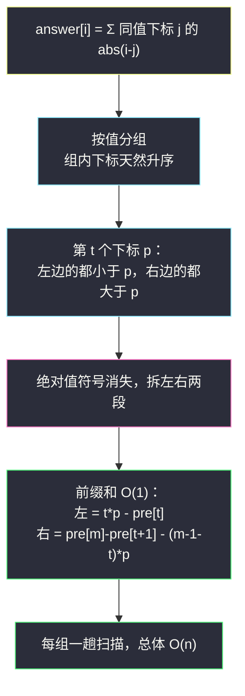
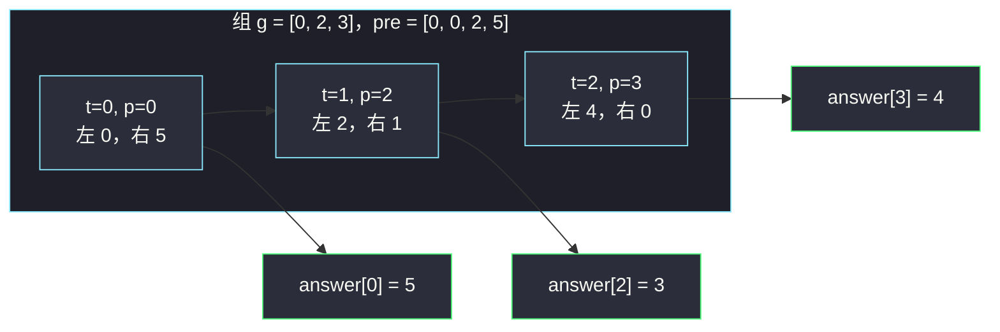

# 等值距离和（按值分组 + 前缀和求距离）

## 一、问题描述

给你一个下标从 **0** 开始、长度为 `n` 的整数数组 `nums`。

定义两个下标 `i` 和 `j` 之间的**距离**为 `|i - j|`。

请你返回一个长度为 `n` 的数组 `answer`，其中 `answer[i]` 等于：所有满足 `nums[j] == nums[i]` 且 `j != i` 的下标 `j` 与下标 `i` 的距离之和。

> 🔗 LeetCode 2615：https://leetcode.cn/problems/sum-of-distances/
>
> 数据范围：`1 <= n <= 10^5`，`1 <= nums[i] <= 10^5`。

**示例 1**

```
输入：nums = [1,3,1,1,2]
输出：[5,0,3,4,0]
解释：
- 下标 0：同值下标 2、3，|0-2| + |0-3| = 5
- 下标 1：没有同值下标，为 0
- 下标 2：同值下标 0、3，|2-0| + |2-3| = 3
- 下标 3：同值下标 0、2，|3-0| + |3-2| = 4
- 下标 4：没有同值下标，为 0
```

**示例 2**

```
输入：nums = [0,5,3]
输出：[0,0,0]
解释：每个值都只出现一次，所有距离和为 0。
```

**直观理解**

只有**同值**的下标之间才算距离，天然分成互不干扰的「值小组」。组内下标有序，绝对值可以按「左边 / 右边」拆开，用前缀和把每个下标 O(1) 算完——这是前缀和家族里「**距离和**」的标准姿势（灵神题单 §1.3）。

---

## 二、暴力解法

按值分组，组内两两算距离求和。

```python
class Solution:
    def distance(self, nums: List[int]) -> List[int]:
        groups = defaultdict(list)
        for i, x in enumerate(nums):
            groups[x].append(i)            # 收集同值下标
        n = len(nums)
        ans = [0] * n
        for g in groups.values():
            for i in g:                    # 对组内每个下标
                ans[i] = sum(abs(i - j) for j in g if j != i)
        return ans
```

### 复杂度

- **时间**：`O(n²)`（最坏所有元素相同，单个下标要加 n-1 次）。
- **空间**：`O(n)`（分组存储）。

### 🔴 瓶颈在哪里

`n = 10^5` 时最坏约 `10^10` 次加法，超时。组内每个下标都从零求和，重复计算了大量「区间下标之和」。

---

## 三、优化探索（核心章节）

> 📚 本题在灵茶题单中属于 **§1.3 距离和**。核心思想：一个点到**一组有序下标**的距离和，把绝对值按左右拆开，用前缀和把 O(m) 的求和变成 O(1)。

### 3.1 按值分组，组内天然有序

遍历一遍把每个值的下标收进列表，因为 `i` 递增枚举，**组内下标天然升序**，无需排序：

```
nums = [1,3,1,1,2]  →  1: [0,2,3]   3: [1]   2: [4]
```

### 3.2 绝对值拆解：左右两段

设组内下标 `p[0] < p[1] < ... < p[m-1]`，考察第 `t` 个下标 `p[t]`：

- **左边**的 `j < t`：`p[j] < p[t]`，绝对值展开为 `p[t] - p[j]`；
- **右边**的 `j > t`：`p[j] > p[t]`，绝对值展开为 `p[j] - p[t]`。

有序性让绝对值符号消失，这是距离和类题目的关键一步：

```
左侧贡献 = t * p[t] - (p[0] + p[1] + ... + p[t-1])
右侧贡献 = (p[t+1] + ... + p[m-1]) - (m - 1 - t) * p[t]
```

左边共 `t` 项、右边共 `m - 1 - t` 项，「距离和」被拆成「**个数 × 自身 − 前面下标之和**」与「**后面下标之和 − 个数 × 自身**」。

### 3.3 前缀和：区间和 O(1)

令 `pre[i] = p[0] + p[1] + ... + p[i-1]`（`pre[0] = 0`），上面两式变成：

```
左侧 = t * p[t] - pre[t]
右侧 = (pre[m] - pre[t+1]) - (m - 1 - t) * p[t]
```

每个下标 O(1) 得到答案，整组 O(m)，全部组加起来 O(n)。



### 3.4 等价视角：相邻下标 O(1) 递推

也可以从左往右逐个下标**增量**转移：从 `p[t]` 走到 `p[t+1]` 时，左边多了 1 个点、少了 1 个点的「跨越距离」，整组答案可以 O(1) 更新（维护左侧下标和、右侧下标和即可）。两种写法同为 O(m)，前缀和版结构更清晰，与题单 §1.3 的命名一致，本篇采用前缀和版。

### 3.5 一句话核心

> **有序让绝对值变成减法，前缀和让区间求和变成 O(1)**；分组后每个下标的距离和 = `t * p - pre[t] + (pre[m] - pre[t+1]) - (m-1-t) * p`。

---

## 四、代码实现

### Python（主解：分组 + 前缀和）

```python
class Solution:
    def distance(self, nums: List[int]) -> List[int]:
        groups = defaultdict(list)
        for i, x in enumerate(nums):
            groups[x].append(i)            # 组内下标天然递增
        ans = [0] * len(nums)
        for g in groups.values():
            m = len(g)
            pre = [0] * (m + 1)            # pre[t] = g[0] + ... + g[t-1]
            for t in range(m):
                pre[t + 1] = pre[t] + g[t]
            for t in range(m):
                p = g[t]
                left = t * p - pre[t]                        # 左边 t 个都比 p 小
                right = (pre[m] - pre[t + 1]) - (m - 1 - t) * p
                ans[p] = left + right
        return ans
```

**变量含义**

| 变量 | 含义 |
|------|------|
| `g` | 某个值的全部下标，升序 |
| `pre[t]` | `g[0..t-1]` 的下标之和 |
| `t * p - pre[t]` | 左侧 t 个下标到 p 的距离和 |
| `(pre[m] - pre[t+1]) - (m-1-t) * p` | 右侧 m-1-t 个下标到 p 的距离和 |

**循环不变式**：第二趟扫描处理 `g[t]` 时，`pre` 已完整覆盖整组，左右两段各 O(1) 取用。

**溢出提醒**：`n = 10^5` 全同值时，最中间下标的答案约 `n²/4 ≈ 2.5 * 10^9`。Python 整数任意精度无感；其他语言必须用 64 位。

### Java（最优解同款）

```java
import java.util.*;

class Solution {
    public long[] distance(int[] nums) {
        int n = nums.length;
        Map<Integer, List<Integer>> groups = new HashMap<>();
        for (int i = 0; i < n; i++) {
            groups.computeIfAbsent(nums[i], k -> new ArrayList<>()).add(i);
        }
        long[] ans = new long[n];
        for (List<Integer> g : groups.values()) {
            int m = g.size();
            long[] pre = new long[m + 1];
            for (int t = 0; t < m; t++) {
                pre[t + 1] = pre[t] + g.get(t);
            }
            for (int t = 0; t < m; t++) {
                long p = g.get(t);
                long left = t * p - pre[t];
                long right = (pre[m] - pre[t + 1]) - (long) (m - 1 - t) * p;
                ans[g.get(t)] = left + right;
            }
        }
        return ans;
    }
}
```

---

## 五、具体例子演示

### 例 1：nums = [1,3,1,1,2]（示例 1）

**第一步：分组**

```
值 1 → [0, 2, 3]     值 3 → [1]     值 2 → [4]
```

**第二步：单元素组直接得 0**

`answer[1] = 0`、`answer[4] = 0`。

**第三步：组 g = [0,2,3] 建前缀和**

| t | g[t] | pre[t] | pre[t+1] |
|---|------|--------|----------|
| 0 | 0 | 0 | 0 |
| 1 | 2 | 0 | 2 |
| 2 | 3 | 2 | 5 |

（`pre = [0, 0, 2, 5]`，`pre[3] = 0+2+3 = 5` 为整组下标和。）

**第四步：逐下标套公式（m = 3）**

| t | p = g[t] | 左侧贡献 t*p - pre[t] | 右侧贡献 (pre[3]-pre[t+1]) - (2-t)*p | answer[p] |
|---|----------|------------------------|----------------------------------------|-----------|
| 0 | 0 | 0*0 - 0 = 0 | (5 - 0) - 2*0 = 5 | **5** |
| 1 | 2 | 1*2 - 0 = 2 | (5 - 2) - 1*2 = 1 | **3** |
| 2 | 3 | 2*3 - 2 = 4 | (5 - 5) - 0*3 = 0 | **4** |

**汇总**：`answer = [5, 0, 3, 4, 0]` ✓，与示例一致。

手工抽查 `answer[0]`：`|0-2| + |0-3| = 2 + 3 = 5` ✓；`answer[2]`：`|2-0| + |2-3| = 2 + 1 = 3` ✓。

### 例 2：nums = [0,5,3]（示例 2）

三个值各出现一次，每组 `m = 1`：`t = 0` 时左贡献 `0*0 - 0 = 0`、右贡献 `(pre[1] - pre[1]) - 0 = 0`，输出 `[0,0,0]` ✓。



---

## 六、复杂度分析

| 方法 | 时间 | 空间 | 说明 |
|------|------|------|------|
| 暴力分组 | `O(n²)` | `O(n)` | 组内每个下标重新求和 |
| 分组 + 前缀和 | `O(n)` | `O(n)` | 建前缀 O(m) + 逐下标 O(1)，全体下标只被扫常数遍 |

---

## 七、对比总结

**距离和家族（前缀和的「区间和」应用）**

| 题 | 「一组点」 | 目标 | 工具 |
|----|------------|------|------|
| #1685 有序数组中差绝对值之和 | 全体下标（天然一组） | 每个点到所有点的距离和 | 排序 + 前缀和 |
| **#2615 本篇** | **同值下标分组** | 组内点到同组点的距离和 | 分组 + 前缀和 |
| #2602 使数组元素全部相等的最少操作数 | 目标值左右两侧元素 | 每个查询的移动代价 | 排序 + 前缀和 + 二分 |

三者骨架相同：**有序 → 绝对值拆左右 → 前缀和 O(1) 区间和**。

**与前缀和 + 哈希计数族的区别**：#1524 / #974 / #2588 用前缀和把「子数组判定」转成「前缀配对计数」，求的是**个数**；本题用前缀和把「区间求和」变 O(1)，求的是**距离总和**。前者靠哈希表数对，后者靠有序数组拆绝对值，都是灵神题单 §1.x 的前缀和家族成员（互相引用见举一反三）。

**易错点**

1. **组内别再排序**：枚举下标天然升序，重复排序多付 `O(n log n)`。
2. **公式下标**：`pre[t]` 不含 `g[t]` 本身、`pre[t+1]` 才含；右边个数是 `m - 1 - t` 不是 `m - t`。
3. **溢出**：Java 返回 `long[]`，中间量 `t * p`、`pre` 都要 64 位。
4. 答案按**原下标**回填 `ans[g[t]]`，别错用组内序号 `t` 当下标。

**模板（分组距离和，Python 版）**

```python
for g in groups.values():          # g 升序
    m = len(g)
    pre = list(accumulate(g, initial=0))
    for t in range(m):
        p = g[t]
        ans[p] = (t * p - pre[t]) + (pre[m] - pre[t + 1]) - (m - 1 - t) * p
```

---

## 八、举一反三

| 题目 | 关系 |
|------|------|
| [1685. 有序数组中差绝对值之和](https://leetcode.cn/problems/sum-of-absolute-differences-in-a-sorted-array/) | 本题「单组」特例，先做它更好懂 |
| [2602. 使数组元素全部相等的最少操作数](https://leetcode.cn/problems/minimum-operations-to-make-all-array-elements-equal/) | 同骨架加二分：每次查询定位左右分界再前缀和求代价 |
| [974. 和可被 K 整除的子数组](https://leetcode.cn/problems/subarray-sums-divisible-by-k/) | 同批姊妹篇：前缀和 + 哈希的**计数**应用，见 `subarray-sums-divisible-by-k.md` |
| [1524. 和为奇数的子数组数目](https://leetcode.cn/problems/number-of-sub-arrays-with-odd-sum/) | 同批：奇偶配对计数，见 `number-of-sub-arrays-with-odd-sum.md` |
| [1542. 找出最长的超赞子字符串](https://leetcode.cn/problems/find-the-longest-awesome-substring/) | 前缀和家族另一支：状态压缩 + 哈希（与距离和互补的两种用法） |
| [1738. 找出第 K 大的异或坐标值](https://leetcode.cn/problems/find-kth-largest-xor-coordinate-value/) | 同批：二维前缀和，见 `find-kth-largest-xor-coordinate-value.md` |

**思想迁移**

- 看到「Σ |a - b|」先想**排序/有序结构**，把绝对值拆成「左减、右加」两段。
- 看到「对每个位置求一组位置的统计量」想**前缀和**（和）/ **计数数组**（个数）做 O(1) 查询。
- 口诀：**「同值先分组，有序拆绝对；左乘个数减前缀，右减个数加后缀。」**
