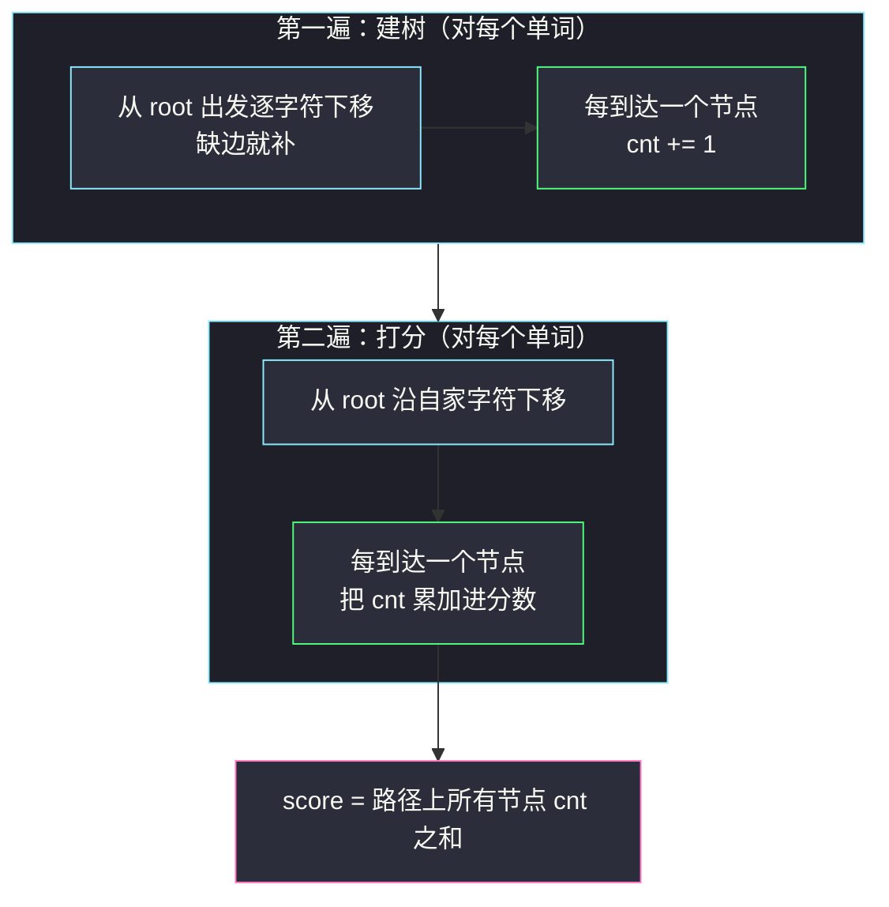
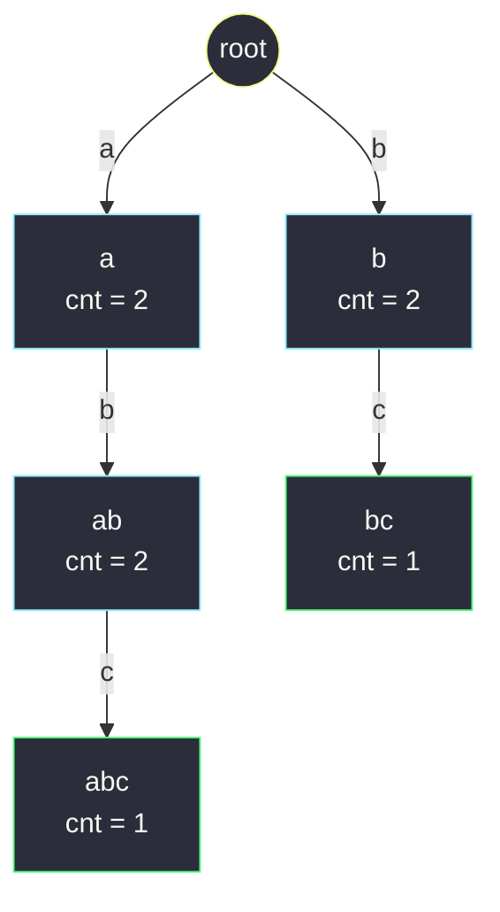

# 字符串的前缀分数和（Trie 节点挂经过计数 cnt）

## 一、问题描述

定义字符串 `term` 的**分数**为：`words` 中以 `term` 作为**前缀**的字符串数目。定义字符串 `w` 的**分数和**为：`w` 的**每一个前缀**的分数加起来（`w` 自身也算自己的前缀）。

给你字符串数组 `words`，返回数组 `answer`，其中 `answer[i]` 是 `words[i]` 的分数和。

> 🔗 LeetCode 2416：https://leetcode.cn/problems/sum-of-prefix-scores-of-strings/
>
> 数据范围：`1 <= words.length <= 1000`，`1 <= words[i].length <= 1000`，`1 <= words[i] 的长度总和 <= 5 * 10^5`，全部由小写英文字母组成（允许重复单词）。

**示例**

```
输入：words = ["abc", "ab", "bc", "b"]
输出：[5, 4, 3, 2]

解释（每个前缀的分数 = 以它为前缀的单词个数）：
- "abc" 的前缀 "a"、"ab"、"abc"：分数分别是 2（abc、ab）、2、1 → 5
- "ab"  的前缀 "a"、"ab"      ：2 + 2 → 4
- "bc"  的前缀 "b"、"bc"      ：2（bc、b）+ 1 → 3
- "b"   的前缀 "b"            ：2 → 2

输入：words = ["abcd"]
输出：[4]
解释：前缀 "a"、"ab"、"abc"、"abcd" 各是 1 个单词的前缀，1+1+1+1 = 4。
```

**直观理解**

把「以 `p` 为前缀的单词有几个」看成一个函数：它按**前缀**组织，而不是按完整单词组织——这正是 Trie 的地盘。把所有单词插进一棵树后，**每个节点恰好代表一个前缀**，而「以该前缀为前缀的单词数」就等于**插入时经过这个节点的次数**。于是一个节点的 `cnt`、一条路径上 `cnt` 的累加，就是本题的全部。

---

## 二、暴力解法

### 暴力：对每个前缀全表扫描

对每个 `words[i]` 的每个前缀 `p`，扫一遍全部单词数有几个以 `p` 开头：

```python
class Solution:
    def sumPrefixScores(self, words: List[str]) -> List[int]:
        ans = []
        for w in words:
            s = 0
            for j in range(1, len(w) + 1):          # w 的每个前缀 w[:j]
                p = w[:j]                            # 切出前缀，O(j)
                s += sum(u.startswith(p) for u in words)
            ans.append(s)
        return ans
```

- **时间**：一个长度 `L` 的词有 `L` 个前缀，每个前缀要对 `n` 个词各做一次至多 `O(L)` 的比较——单个词 `O(n * L^2)`，全体最坏 `O(n^2 * L^2)`；按 `n = 1000`、`L = 1000` 口径约 `10^12` 次字符比较，超时到没有悬念；
- **空间**：`O(L)`（临时前缀串）。

### 🔴 瓶颈在哪里

两个「重复」叠在一起：

1. **比较重复**：`"abc"` 与 `"ab"` 的前缀 `"a"`、`"ab"` 被当作互不相干的字符串，反复切出来、反复与同一批单词比较；
2. **前缀共享浪费**：`"abcd"`、`"abce"`、`"abc"` 的前三个前缀完全相同，暴力把它们各算各的。

缺的是把所有前缀**收进一个共享结构**，让「经过多少次」一步可查。

---

## 三、优化探索（核心章节）

> 📚 本题在灵茶题单中属于 **§6.1 字典树 Trie（基础）**，树形骨架与 [#208 实现 Trie](implement-trie-prefix-tree.md) 完全一致（`children` + 词尾标记），只是把 `isEnd` 换成了更有统计味道的**经过计数 `cnt`**；与 [#211 添加与搜索单词](design-add-and-search-words-data-structure.md) 同属「在 #208 积木上换挂件」的一族。

### 3.1 关键观察：节点 = 前缀，cnt = 经过次数

把所有单词插入 Trie（缺边补边，与 #208 的 `insert` 相同），并且**每到达一个节点就给它 `cnt += 1`**：

- 根到节点 `X` 的路径拼出一个前缀 `p`，所以 **`X` 唯一对应前缀 `p`**；
- 单词 `w` 以 `p` 为前缀 ⇔ `w` 的插入路径**经过** `X`；
- 于是 `X.cnt`（经过次数）恰好就是「以 `p` 为前缀的单词数」，即前缀 `p` 的分数。

而 `answer[i]` 是 `words[i]` 所有前缀分数之和——`words[i]` 的前缀们正是它的插入路径上那一串节点：

```text
answer[i] = Σ（words[i] 路径上每个节点的 cnt）
```

注意根节点**不参与**累加：根对应空前缀，题目前缀从 1 个字符起算。

### 3.2 为什么必须「先全部插入、再统一查询」

前缀 `p` 的 `cnt` 依赖**全体**单词——若边插边查，后插入的单词无法计入前面词的分数。所以标准姿势是**两遍扫描**：

1. 第一遍：把每个 `words[i]` 插入，沿途 `cnt += 1`；
2. 第二遍：对每个 `words[i]` 沿自家路径把沿途 `cnt` 累加。



### 3.3 哈希表的中间形态：为什么不如 Trie

「所有前缀的计数」也可以用哈希表装：`Counter` 收集每个单词的全部前缀，再查表累加（代码见第四节）。它能过题，但有个隐蔽的账单：

- 每生成一个前缀 `w[:j]` 都要**拷贝 `j` 个字符**，两遍合计的字符搬运量是 `O(Σ|w| * L)` 量级（`L` 为单词平均长度，最坏即 `Σ|w|²`），总长 `5 * 10^5`、单词接近上限长度时是**数亿字符级**的搬运；
- 表里还要把每个**不同前缀完整存一份**字符串，内存同样吃紧。

Trie 把「前缀」压缩成「节点指针」：插入和查询都只做「下移一层 + 访问计数」两个动作，**每个字符只被消费一次**。这是「字符串键 → 树上路径」在空间和时间上的双重胜利。

### 3.4 树长什么样（示例 1 建成后）

`words = ["abc", "ab", "bc", "b"]` 建树完成后的 `cnt`：



读一遍：`a` 被经过 2 次（`abc`、`ab`），`ab` 同样 2 次，`abc` 只有 1 次；`b` 被经过 2 次（`bc`、`b`），`bc` 1 次——与 3.1 的推导严丝合缝。

### 3.5 一句话核心

> **把所有单词插进 Trie，每到一个节点 `cnt += 1`；打分时沿自家路径把沿途 `cnt` 累加——节点即前缀，经过次数即前缀分数。**

---

## 四、代码实现

### Python 主解（Trie + 两遍扫描）

```python
class Node:
    __slots__ = ("children", "cnt")

    def __init__(self):
        self.children = {}   # 出边：字符 -> 子节点
        self.cnt = 0         # 插入时经过本节点的单词数 = 本前缀的分数


class Solution:
    def sumPrefixScores(self, words: List[str]) -> List[int]:
        root = Node()

        # 第一遍：全部插入，沿途 cnt += 1
        for w in words:
            node = root
            for c in w:
                node = node.children.setdefault(c, Node())   # 缺边补边
                node.cnt += 1                                # 经过即计 1

        # 第二遍：沿自家路径累加 cnt
        ans = []
        for w in words:
            node = root
            s = 0
            for c in w:
                node = node.children[c]   # 自家路径必已存在，无需判空
                s += node.cnt
            ans.append(s)
        return ans
```

**变量含义**

| 变量 | 含义 |
|------|------|
| `node` | 游标：当前走到（对应某个前缀）的节点 |
| `node.cnt` | 经过该节点的插入次数 = 以该前缀为前缀的单词数 |
| `s` | 当前单词沿途 `cnt` 的累加和，即它的分数和 |
| 两遍扫描 | 先全体插入再全体查询，保证计数完整（见 3.2） |

### Python 对比解（哈希表装全部前缀）

```python
from collections import Counter

class Solution:
    def sumPrefixScores(self, words: List[str]) -> List[int]:
        cnt = Counter(
            w[:j]
            for w in words
            for j in range(1, len(w) + 1)
        )
        return [
            sum(cnt[w[:j]] for j in range(1, len(w) + 1))
            for w in words
        ]
```

正确性同款，代价是数亿字符级的前缀拷贝与存储（见 3.3 的账单），长单词多时明显吃力。

### Java（数组版 Trie，节点池 + cnt 数组）

```java
class Solution {
    public int[] sumPrefixScores(String[] words) {
        int total = 0;
        for (String w : words) {
            total += w.length();
        }
        int[][] son = new int[total + 1][26];   // 每个字符至多新增 1 个节点
        int[] cnt = new int[total + 1];
        int idx = 1;                            // 0 号是根，idx 是下一个可用编号

        for (String w : words) {                // 第一遍：插入
            int u = 0;
            for (char c : w.toCharArray()) {
                int b = c - 'a';
                if (son[u][b] == 0) {
                    son[u][b] = idx++;
                }
                u = son[u][b];
                cnt[u]++;
            }
        }

        int[] ans = new int[words.length];
        for (int i = 0; i < words.length; i++) { // 第二遍：打分
            int u = 0, s = 0;
            for (char c : words[i].toCharArray()) {
                u = son[u][c - 'a'];
                s += cnt[u];
            }
            ans[i] = s;
        }
        return ans;
    }
}
```

节点池按 `总字符数 + 1` 开就够：插入每个字符至多新建一个节点（前缀共享时新建数为 0）。

---

## 五、具体例子演示

对示例 1 `words = ["abc", "ab", "bc", "b"]` 端到端走一遍。初始只有空 `root`，所有 `cnt = 0`。

**第一遍：建树（插入 4 个单词，cnt 逐次累加）**

| 插入 | 沿途动作（节点: cnt 变化） |
|------|----------------------------|
| `"abc"` | 新建 a: 0→1 → 新建 ab: 0→1 → 新建 abc: 0→1 |
| `"ab"` | 已有 a: 1→2 → 已有 ab: 1→2（词读完，停在 ab） |
| `"bc"` | 新建 b: 0→1 → 新建 bc: 0→1 |
| `"b"` | 已有 b: 1→2（词读完，停在 b） |

建成的树与各节点 `cnt` 即 3.4 节的图：`a=2、ab=2、abc=1`，`b=2、bc=1`。

**第二遍：打分（逐词给出前缀分数的累计表）**

`words[0] = "abc"`：

| 走的边 | 到达节点 | 该节点 cnt | 累计分数 |
|--------|----------|------------|----------|
| a | a | 2 | 2 |
| b | ab | 2 | 4 |
| c | abc | 1 | **5** |

`words[1] = "ab"`：

| 走的边 | 到达节点 | 该节点 cnt | 累计分数 |
|--------|----------|------------|----------|
| a | a | 2 | 2 |
| b | ab | 2 | **4** |

`words[2] = "bc"`：

| 走的边 | 到达节点 | 该节点 cnt | 累计分数 |
|--------|----------|------------|----------|
| b | b | 2 | 2 |
| c | bc | 1 | **3** |

`words[3] = "b"`：

| 走的边 | 到达节点 | 该节点 cnt | 累计分数 |
|--------|----------|------------|----------|
| b | b | 2 | **2** |

**汇总**：`answer = [5, 4, 3, 2]`。

顺带核对两个细节：

- `words[0] = "abc"` 查询时，`a`、`ab` 的 `cnt` 是 2 而不是 1——`"ab"` 这个词也路过它们，前缀共享让短词自动给长词的前缀分数「充值」；
- 根节点从不进表：若把根也计 `cnt = 4`，四个答案会整体虚高 4，而题目的前缀从第 1 个字符起算。

再看示例 2 `words = ["abcd"]`：建树后 `a=1、ab=1、abc=1、abcd=1`，查询累计 `1+1+1+1 = 4` ✓。若数组是 `["abcd", "abcd"]`（重复词），则四个节点 `cnt` 全为 2，两个答案都是 `2+2+2+2 = 8`——重复单词被 `cnt` 天然按次数计入，无需任何特判。

---

## 六、复杂度分析

设 `n = len(words)`、`S = Σ|words[i]| <= 5 * 10^5`、`L` 为单词长度：

| 方案 | 时间 | 空间 |
|------|------|------|
| 暴力全扫 | `O(n^2 * L^2)`，最坏 `10^12` 级 | `O(L)` |
| 哈希表装前缀 | 逻辑 `O(S)`，但字符搬运 `O(S * L)`，数亿字符级 | 不同前缀各存一份完整字符串 |
| Trie + cnt（本篇） | `O(S)`：建树每字符一步 + 查询每字符一步 | `O(S)` 个节点，Java 数组版再 × 26 |

- Trie 版把每个字符的**消费次数压到 1**：插一次、查一次，`5 * 10^5` 总长下千万级基本操作，稳过；
- 空间与「去重后的真实前缀数」成正比，共享前缀越长越省——这是哈希版「前缀整串存」做不到的压缩。

---

## 七、对比总结

| | 暴力全扫 | 哈希表前缀 | Trie + cnt |
|---|----------|------------|------------|
| 前缀表示 | 现切现比 | 独立字符串键 | 节点路径 |
| 共享前缀 | 无共享 | 键去重但值不省 | 路径共享，天然压缩 |
| 单字符成本 | 反复比较 | 反复拷贝 | 下移一层 |
| 附加统计 | 无 | 计数在键上 | **计数在节点上**，随手可得 |

**易错点**

1. **`cnt` 加在「到达的节点」上**，且根节点不参与打分——空串不是合法前缀；
2. **必须两遍扫描**：先全部插入、再统一查询；边插边查会把后插入的词漏统计进前面词的分数；
3. 查询阶段的 `node.children[c]` **无需判空**——自家路径建树时必然铺好；若真的 `KeyError`，多半是把两遍写混了；
4. 重复单词、一词是另一词前缀（如 `"ab"` 与 `"abc"`）都不需特判：`cnt` 按「经过次数」自然累计；
5. Java 数组版要用 `son[u][b] == 0` 表示「无边」，节点编号从 1 起、根占 0 号，别把有效孩子编号与空槽混淆。

---

## 八、举一反三

| 题目 | 关系 |
|------|------|
| [208. 实现 Trie（前缀树）](https://leetcode.cn/problems/implement-trie-prefix-tree/) | 本批根基篇（§6.1）：本篇的建树代码就是它的 `insert`，见 `implement-trie-prefix-tree.md` |
| [211. 添加与搜索单词 - 数据结构设计](https://leetcode.cn/problems/design-add-and-search-words-data-structure/) | 本批姊妹篇（§6.2）：同样在 #208 积木上换查询语义，见 `design-add-and-search-words-data-structure.md` |
| [1804. 实现 Trie II](https://leetcode.cn/problems/implement-trie-ii-prefix-tree/) | 同款节点计数的完全体：同时维护「等于…的次数」与「以…为前缀的次数」，本篇 + #208 的合体 |
| [677. 键值映射](https://leetcode.cn/problems/map-sum-pairs/) | 节点挂 val、查询累加子树——「节点当累加器」的初阶练习 |
| [2185. 统计给定前缀的字符串](https://leetcode.cn/problems/counting-words-with-a-given-prefix/) | 只查一个前缀的退化版，暴力即过，可对照体会「前缀计数」何时值得建树 |
| [648. 单词替换](https://leetcode.cn/problems/replace-words/) | Trie 上的「最短词根」查询，与本篇的「沿途计数」互为镜像 |

**思想迁移**

- 「**节点 = 前缀，节点计数 = 前缀出现次数**」是前缀统计类问题的万能插座：词频统计、自动补全热度排序、敏感词前缀过滤，都是往 Trie 节点上挂一个计数器的事；
- 本题还演示了**离线批处理**的正确姿势：当统计量（`cnt`）依赖全体输入时，先构建、后查询的两遍扫描是最朴素也最可靠的并行化切分点（两遍之间天然可做增量更新或持久化）；
- 口诀：**「节点即前缀，过路就计数；建完再打分，沿途把 cnt 加到底。」**
