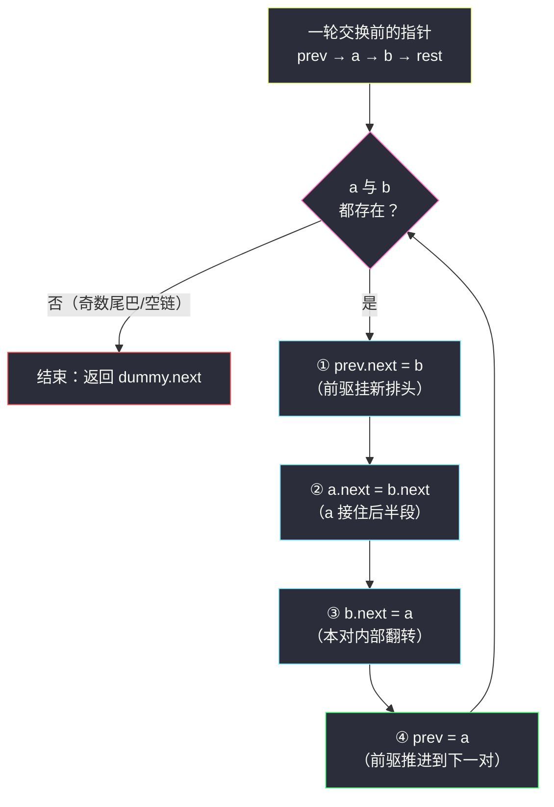
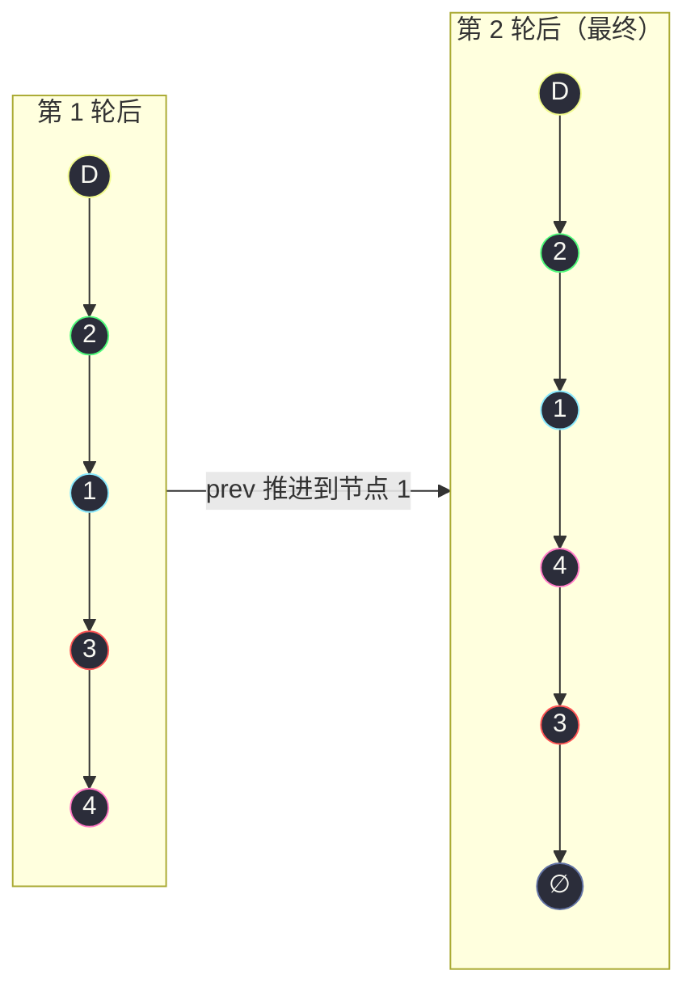

# 24. 两两交换链表中的节点（Swap Nodes in Pairs）

> 题目来源：[https://leetcode.cn/problems/swap-nodes-in-pairs/](https://leetcode.cn/problems/swap-nodes-in-pairs/)
>
> 灵茶题单小节定位：§链表·两两交换链表中的节点

## 一、问题描述

给你一个链表，**两两交换其中相邻的节点**，并返回交换后链表的头节点。你必须**在不修改节点内部的值**的情况下完成本题（即，只能进行节点交换）。

**数据范围**：

- 链表中节点的数目在范围 `[0, 100]` 内
- `0 <= Node.val <= 100`

**示例 1**：

```text
输入：head = [1,2,3,4]
输出：[2,1,4,3]
解释：节点 1 与节点 2 交换，节点 3 与节点 4 交换。
```

**示例 2**：

```text
输入：head = []
输出：[]
```

**示例 3**：

```text
输入：head = [1]
输出：[1]
解释：只剩一个节点，无处配对，原样返回。
```

**核心思考点**：链表题的第一反应往往是「把值抄到数组里交换再写回去」——本题**明确禁止**改值，逼你直面链表最本质的操作：**改指针（next）而不是改数据**。两两交换的精髓是把「头节点也会变」这个麻烦交给一个**虚拟头节点（dummy）**兜底，然后每一轮只盯着**三个指针**的重新接线。

## 二、暴力解法

### 思路

既然只是「功能上等价」，最朴素的做法是把链表值抄进数组 `vals`，把 `vals[0]` 与 `vals[1]`、`vals[2]` 与 `vals[3]`……逐对交换，再按新顺序把值写回链表节点。

这个做法**能过测试，但违反题意**（修改了节点内部的值）。它也不是白写的：

- 它是后面对拍验证的**正确性基准**（功能等价）；
- 它暴露了「值搬家」思路的脆弱性：若节点上还挂着别的数据（真实业务里节点往往是复杂对象），逐字段搬运会指数级变丑——**指针操作才是链表的正统语言**。

### 代码

```python
class ListNode:
    def __init__(self, val=0, next=None):
        self.val = val
        self.next = next

def swapPairsBrute(head: ListNode) -> ListNode:
    # 1) 抄值进数组
    vals, node = [], head
    while node:
        vals.append(node.val)
        node = node.next
    # 2) 相邻两两交换（值层面）
    for i in range(0, len(vals) - 1, 2):
        vals[i], vals[i + 1] = vals[i + 1], vals[i]
    # 3) 写回链表
    node = head
    for v in vals:
        node.val = v
        node = node.next
    return head
```

### 复杂度

- 时间：`O(n)`（两趟遍历）。
- 空间：`O(n)`（辅助数组）。
- **但它不被题目接受**——题目考察的正是指针操作本身。

## 三、优化探索

### 3.1 难点拆解：头节点会变

单节点交换 `a → b` 变 `b → a`，需要断开/接上**三条边**：

1. `a.next = b.next`（a 接到 b 身后）
2. `b.next = a`（b 反过来指 a）
3. **a 的前驱 `prev.next = b`**（否则链表从 prev 处断开，b 成了孤儿）

第 3 条在第一轮就尴尬：`a` 是头节点，**没有前驱**。特判 `head` 会让代码丑一半——解法是造一个 **dummy 虚拟头节点**，令 `prev = dummy`，从此每一轮的「前驱」都天然存在，循环体零特判。

### 3.2 迭代主解：三指针一轮接线

令 `prev` 指向待交换对的前驱，`a = prev.next`、`b = a.next`。当 `a` 和 `b` 都存在时执行一轮：

```text
prev.next = b      # 前驱改挂 b（b 升为本对新的排头）
a.next  = b.next   # a 跨过 b，接住本对后面的整段链
b.next  = a        # b 反指 a，完成本对内部翻转
prev    = a        # a 是下一对的前驱
```

四步之后，本对变成 `prev → b → a → (下一对)`，`prev` 推进到 `a`，继续处理下一对。`a` 或 `b` 缺席（奇数尾巴或空链）时循环自然停止。



**易错点**：② 和 ③ 的顺序不能换。若先做 `b.next = a`，则 `b.next` 原来指向的后半段就**丢了**，`a.next = b.next` 会把 `a` 指回 `a` 自己（自环）。记住口诀「**先让 a 抓住后半段，再让 b 反指 a**」。

### 3.3 递归写法：把「下一对的答案」当作黑盒

递归视角更短：`swapPairs(head)` 的结果 = `head` 与 `head.next` 交换后，再拼上 `swapPairs(第三個节点起的子链)`。

```python
def swapPairsRecur(head: ListNode) -> ListNode:
    if not head or not head.next:        # 空或单节点：原样返回
        return head
    a, b = head, head.next               # 本对两个节点
    a.next = swapPairsRecur(b.next)      # a 的后继 = 后面所有对的交换结果
    b.next = a                           # b 反指 a
    return b                             # b 是本段新头
```

递归版三行核心、极其优雅，但 `n ≤ 100` 之外的场景（如 `n = 10⁵`）会爆栈——**面试先写迭代，递归当加分项讲**。

### 3.4 头插法视角：另一种等价叙事

同一件事还可以这样看：每一对里的第二个节点 `b`，等价于「把 `b` 从链中摘出、头插到本对前驱的后面」。头插法在链表重排家族（#25 K 个一组翻转）里更通用：组内逐个把节点摘下来往组头前插，插完一组恰好实现整组翻转，`k = 2` 时退化为本题。两种叙事殊途同归，掌握其一即可，见另一叙事能认出来即可。

## 四、代码实现

```python
class ListNode:
    def __init__(self, val=0, next=None):
        self.val = val
        self.next = next

def swapPairs(head: ListNode) -> ListNode:
    # 虚拟头节点：统一「第一对也有前驱」的边界，循环体免特判
    dummy = ListNode(-1, head)
    prev = dummy                        # 每一轮的前驱指针

    while prev.next and prev.next.next: # a = prev.next 与 b = prev.next.next 都在
        a = prev.next                   # 本对第一个节点
        b = a.next                      # 本对第二个节点

        prev.next = b                   # ① 前驱改挂 b（b 升排头）
        a.next = b.next                 # ② a 先抓住后半段（防丢链）
        b.next = a                      # ③ b 反指 a，本对翻转完成

        prev = a                        # ④ a 成为下一对的前驱

    return dummy.next                   # 真头永远挂在 dummy 上


# ------- 验证辅助：数组 ⇄ 链表 -------
def build_list(vals: list) -> ListNode:
    dummy = ListNode()
    cur = dummy
    for v in vals:
        cur.next = ListNode(v)
        cur = cur.next
    return dummy.next

def list_to_vals(head: ListNode) -> list:
    vals = []
    while head:
        vals.append(head.val)
        head = head.next
    return vals
```

### 细节说明

- **dummy 的价值**：头节点参与交换意味着「答案的头」不再是原 `head`（而是原第二个节点）。有了 dummy，全程只需 `return dummy.next`，不需要为第一轮单写 `head = head.next` 的特判——这是所有「头会变」链表题的通用套路（#21 合并有序链表、#203 移除元素同理）。
- **循环条件**：`prev.next and prev.next.next` 分别保证 `a`、`b` 存在，恰好覆盖「空链」「单节点」「奇数个节点剩尾巴」三种不完整对。
- **指针推进**：一轮结束后 `prev = a` 而不是 `prev = b`——`b` 已经是本对的排头，下一对的前驱是排在末尾的 `a`。
- **不改值只改指针**：全程没有任何 `node.val = ...` 的写操作，节点对象本身只是换了几条 `next` 边。

## 五、例子演示

以 `head = 1 → 2 → 3 → 4` 为例，`dummy = D`：

**第 1 轮（prev = D，a = 1，b = 2）**：

| 步骤 | 操作 | 链表状态（→ 表示 next） |
|---|---|---|
| 初始 | — | `D → 1 → 2 → 3 → 4` |
| ① | `D.next = 2` | `D → 2`，同时 `1 → 2 → 3 → 4` 仍挂着（2 有两个入度，中间态） |
| ② | `1.next = 3` | `D → 2 → 1 → 3 → 4` 的雏形：1 已抓住后半段 |
| ③ | `2.next = 1` | `D → 2 → 1 → 3 → 4` ✅ 第一对完成 |
| ④ | `prev = 1` | 下一轮处理 `3, 4` |

**第 2 轮（prev = 1，a = 3，b = 4）**：

| 步骤 | 操作 | 链表状态 |
|---|---|---|
| 初始 | — | `D → 2 → 1 → 3 → 4` |
| ① | `1.next = 4` | `… → 1 → 4`，`3 → 4` 残留 |
| ② | `3.next = None` | 3 抓住后半段（4 后面是空） |
| ③ | `4.next = 3` | `D → 2 → 1 → 4 → 3` ✅ |
| ④ | `prev = 3` | `3.next` 与 `3.next.next` 均不存在 → 循环结束 |

返回 `dummy.next`，答案 `2 → 1 → 4 → 3`，与官方示例 1 一致。



**边界演示**：

- `head = []`：`dummy.next` 本身就是 `None`，循环条件直接为假，返回空链 ✅（官方示例 2）。
- `head = [1]`：`a = 1` 存在但 `b` 不存在，循环不进入，返回 `1` ✅（官方示例 3）。
- `head = [1,2,3]`：第一轮 `D → 2 → 1 → 3`，第二轮 `a = 3` 无 `b`，停在 `… → 1 → 3`。

## 六、复杂度分析

设 `n` 为链表长度：

- **时间复杂度：`O(n)`**
  - 每轮处理 2 个节点，`prev` 单向推进，总轮数 `⌊n/2⌋`。
- **空间复杂度：`O(1)`**
  - 迭代版只用 `dummy/a/b/prev` 四个指针变量（递归版为 `O(n)` 栈深）。

## 七、对比总结

| 维度 | 暴力（数组换值写回） | 迭代主解 | 递归版 |
|---|---|---|---|
| 时间 | `O(n)` | `O(n)` | `O(n)` |
| 空间 | `O(n)` | `O(1)` | `O(n)`（栈） |
| 合规性 | ❌ 改了节点值 | ✅ 只改指针 | ✅ 只改指针 |
| 大 n 表现 | 依然能过 | 能过 | `n ≈ 10⁵` 爆栈 |
| 代码量 | 三段式 | 四步循环 | 三行核心 |
| 教学 | 对拍基准 | **面试首选** | 思维体操 |

**套路归纳**：「头会变」的链表题三板斧——①`dummy` 虚拟头兜住边界；②把「一对/一组的重接」拆成**固定顺序的赋值序列**（先抓后半段、再翻内部、最后挂前驱，顺序错就丢链或成环）；③推进前驱指针，循环条件同时校验**本组所有成员存在**。

## 八、举一反三

1. **[25. K 个一组翻转链表](https://leetcode.cn/problems/reverse-nodes-in-k-group/)**（Hard）：本篇的通用版——`k = 2` 就是本题。先数出一组 `k` 个，组内用「头插法」翻转，再接回前后；组不足 `k` 个保持原序。
2. **[92. 反转链表 II](https://leetcode.cn/problems/reverse-linked-list-ii/)**：区间 `[left, right]` 翻转，同样是 `dummy` + 组内头插，练「先抓尾、再翻中、后接头」的顺序感。
3. **[19. 删除链表的倒数第 N 个结点](https://leetcode.cn/problems/remove-nth-node-from-end-of-list/)**：又一个「头可能被删」必须上 `dummy` 的经典；快慢指针间隔 `n` 一次扫描。
4. **[203. 移除链表元素](https://leetcode.cn/problems/remove-linked-list-elements/)**：最基础的「dummy + 前驱推进」模板，适合作为本题的热身/复习对照。
5. **[21. 合并两个有序链表](https://leetcode.cn/problems/merge-two-sorted-lists/)**：`dummy` 套路的「正名之战」——没有 dummy 时头节点归属要多写一整段特判。

**同族互引**：本篇与 `remove-k-digits.md`（#402）同属「链表/序列重排」小节：一个用单调栈删数字，一个用三指针换节点——都遵循「**哨兵兜底 + 局部固定套路 + 单向推进**」的骨架，对照着刷能明显感到链表题的「模板复用率」。
