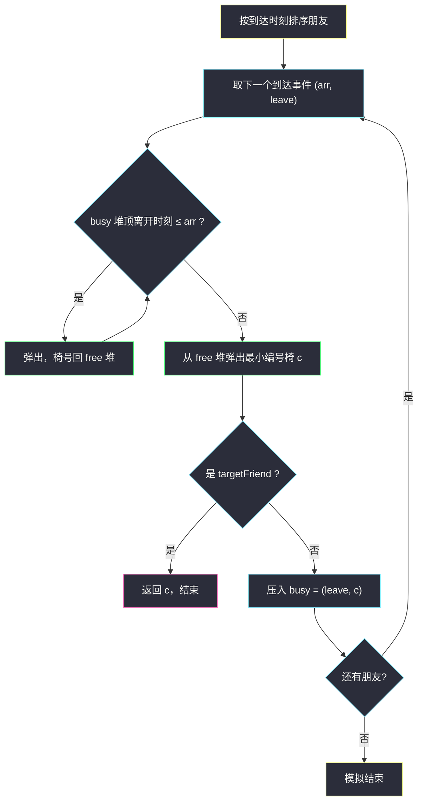

# 最小未被占据椅子的编号（双堆 · 时间线事件模拟）

## 一、问题描述

一场聚会有 `n` 位朋友，编号 `0` 到 `n - 1`。给定二维整数数组 `times`，其中 `times[i] = [arrival_i, leaving_i]` 表示第 `i` 位朋友的**到达时刻**与**离开时刻**；再给你整数 `targetFriend`。所有到达时刻**互不相同**。

聚会有无限多把椅子，编号从 `0` 开始。当第 `i` 位朋友到达时，他会坐到**编号最小的未被占据椅子**上；当他离开时椅子空出。**同一时刻**，先离开腾出的椅子可以立刻被此刻到达的朋友坐上。

返回编号为 `targetFriend` 的朋友坐的椅子编号。

> 🔗 LeetCode 1942：https://leetcode.cn/problems/the-number-of-the-smallest-unoccupied-chair/
>
> 数据范围：`2 <= n <= 10^4`，`1 <= arrival_i < leaving_i <= 10^5`，到达时刻互不相同。

**示例 1**

```
输入：times = [[1,4],[2,3],[4,6]], targetFriend = 1
输出：1
解释：
- 时刻 1：朋友 0 到达，坐椅子 0。
- 时刻 2：朋友 1 到达，坐椅子 1。
- 时刻 3：朋友 1 离开，椅子 1 空出。
- 时刻 4：朋友 0 离开，椅子 0 空出；朋友 2 到达，坐椅子 0。
朋友 1 坐的是椅子 1。
```

**示例 2**

```
输入：times = [[3,10],[1,5],[2,6]], targetFriend = 0
输出：2
解释：
- 时刻 1：朋友 1 坐椅子 0；时刻 2：朋友 2 坐椅子 1。
- 时刻 3：朋友 0 到达，坐椅子 2（前两把都被占）。
```

**直观理解**

这是一条**时间线上的事件模拟**：每个时刻可能有「椅子空出」和「朋友到达」两类事件。要维护两件动态的事——哪些椅子空闲（要**最小**编号）、哪些椅子何时空出（按**离开时刻**先后）——两个信息各配一个小根堆，恰好一一对应。

---

## 二、暴力解法

对每次到达事件，把所有椅子的占用情况摆开检查：从编号 0 起逐个问「这把椅子的主人离开时刻是否 ≤ 当前到达时刻」，找到第一把满足条件的椅子。

```python
class Solution:
    def smallestChair(self, times: List[List[int]], targetFriend: int) -> int:
        order = sorted(range(len(times)), key=lambda i: times[i][0])  # 按到达排序
        chairs = []                    # chairs[c] = 坐 c 的朋友的离开时刻
        for i in order:
            arr = times[i][0]
            c = 0
            while c < len(chairs) and chairs[c] > arr:   # 占用中，看下一把
                c += 1
            if c == len(chairs):       # 全被占：启用新椅子
                chairs.append(0)
            chairs[c] = times[i][1]
            if i == targetFriend:
                return c
        return -1
```

### 复杂度

- **时间**：`O(n²)`——每次到达最坏扫过全部已有椅子（`n <= 10^4` 时最坏 `10^8` 次比较，Python 悬）。
- **空间**：`O(n)`。

### 🔴 瓶颈在哪里

每次都从编号 0 开始**重新询问每一把椅子**「你空了吗」。但椅子空出的时刻在朋友落座时就已确定——哪些椅子将在「当前时刻之前」空出，是一个**按离开时刻排序、可增量弹出**的信息，天然属于小根堆；「空闲椅子取编号最小」则是另一个小根堆。

---

## 三、优化探索（核心章节）

> 📚 本题在灵茶题单中属于 **§5.1 堆的基础用法**（数据结构③ A 路）。模板要点：**到达/离开双事件 + 双小根堆**——一个按「值」服务分配（空闲椅取最小编号），一个按「时间」服务回收（占用椅按离开时刻早的先弹出）。

### 3.1 两个堆各管什么

| 堆 | 元素 | 堆顶含义 | 何时变动 |
|----|------|----------|----------|
| `free` 空闲椅堆 | 椅子编号 | 当前可分配的**最小编号** | 到达时弹出分配；离开时回收压入 |
| `busy` 占用椅堆 | `(离开时刻, 椅号)` | **最早**将空出的椅子 | 到达时按时刻批量弹出；分配时压入 |

两个堆配合的节奏：**到达时刻 t 先清场再入座**——把 `busy` 中所有 `离开时刻 <= t` 的椅子弹出、编号压回 `free`；然后从 `free` 弹堆顶（最小编号）给这位朋友。

### 3.2 事件顺序：先离开、后到达

题面明确「同一时刻，离开腾出的椅子可立即被坐下」。落实到代码就是回收条件用 `<=`：

```python
while busy and busy[0][0] <= arr:      # 离开时刻 <= 当前到达时刻 → 已空出
    _, c = heapq.heappop(busy)
    heapq.heappush(free, c)
```

若写成 `<`，示例 1 中时刻 4 离开的朋友 0 的椅子 0 就来不及给同一时刻到达的朋友 2，导致错序。

### 3.3 椅子只需 n 把，两种初始化均可

`n` 个朋友最多同时占用 `n` 把椅子，编号 `0..n-1` 足够：

- **法 A（本文主解）**：初始 `free = [0, 1, ..., n-1]` 一次性 `heapify`，直观；
- **法 B（更省）**：`free` 初始为空，配一个「下一把新椅」计数器 `next`，分配时先看 `free` 是否有回收椅、没有就取 `next++`。由于回收椅编号恒小于 `next`，弹出堆顶仍是全局最小编号，正确性不变。

### 3.4 为什么按到达排序就够了

所有到达时刻互不相同，**离开事件全部挂在到达事件上被「顺带」处理**（到了时刻 t，就把 ≤ t 的离开全放行），无需再对离开单独排序。这是「事件驱动模拟」的常见化简：不维护全局时间轴，只在关键事件点清算。



### 3.5 一句话核心

> 空闲椅小根堆 + `(离开时刻, 椅号)` 占用堆：到达先放行 `<=` 的离开、再取最小空闲椅，时间线一步一清算。

---

## 四、代码实现

### Python（主解：双小根堆）

```python
import heapq

class Solution:
    def smallestChair(self, times: List[List[int]], targetFriend: int) -> int:
        n = len(times)
        order = sorted(range(n), key=lambda i: times[i][0])   # 按到达时刻排序

        free = list(range(n))            # 空闲椅堆：初始 0..n-1 全空闲
        heapq.heapify(free)
        busy = []                        # 占用椅堆：(离开时刻, 椅号)

        for i in order:
            arr, leave = times[i]
            while busy and busy[0][0] <= arr:   # 同刻先离开：椅子空出
                heapq.heappush(free, heapq.heappop(busy)[1])
            c = heapq.heappop(free)             # 编号最小的空闲椅
            if i == targetFriend:
                return c                        # 目标朋友落座即得答案
            heapq.heappush(busy, (leave, c))    # 登记占用
        return -1
```

**变量含义**

| 变量 | 含义 |
|------|------|
| `order` | 朋友下标按到达时刻升序的排列（题目保证无并列） |
| `free` | 空闲椅子编号的小根堆，堆顶 = 最小可用编号 |
| `busy` | `(离开时刻, 椅号)` 小根堆，堆顶 = 最早空出的椅子 |

**循环不变式**：处理某到达事件前，`free ∪ busy` 恰好覆盖当前全部已启用椅子且互不重叠；`free` 堆顶就是「若此刻有人到达会坐的椅子」。

**细节**：遇到 `targetFriend` 立即 `return`，后面的朋友无需模拟。

### Java（最优解同款）

```java
class Solution {
    public int smallestChair(int[][] times, int targetFriend) {
        int n = times.length;
        Integer[] order = new Integer[n];
        for (int i = 0; i < n; i++) order[i] = i;
        Arrays.sort(order, (a, b) -> times[a][0] - times[b][0]);

        PriorityQueue<Integer> free = new PriorityQueue<>();          // 椅号
        for (int c = 0; c < n; c++) free.offer(c);
        PriorityQueue<int[]> busy = new PriorityQueue<>((a, b) -> a[0] - b[0]); // (leave, chair)

        for (int i : order) {
            int arr = times[i][0];
            while (!busy.isEmpty() && busy.peek()[0] <= arr) {
                free.offer(busy.poll()[1]);
            }
            int c = free.poll();
            if (i == targetFriend) return c;
            busy.offer(new int[]{times[i][1], c});
        }
        return -1;
    }
}
```

---

## 五、例子演示

### 例 1：times = [[1,4],[2,3],[4,6]], targetFriend = 1

排序后到达顺序：朋友 0（时刻 1）→ 朋友 1（时刻 2）→ 朋友 2（时刻 4）。逐步跟踪两个堆：

| 事件 | 时刻 | 回收（busy → free） | 分配 | free 堆 | busy 堆（leave, chair） | 说明 |
|------|------|----------------------|------|---------|--------------------------|------|
| 朋友 0 到达 | 1 | 无（busy 空） | 坐椅 0 | {1, 2} | (4, 0) | 最小空闲椅 0 |
| 朋友 1 到达 | 2 | 无（堆顶 (4,0) 的 4 > 2） | 坐椅 1 | {2} | (4, 0), (3, 1) | **目标朋友 → 答案 1** |
| 朋友 2 到达 | 4 | (3,1) → 椅 1；继续 (4,0) ≤ 4 → 椅 0 | 坐椅 0 | {1, 2} | (6, 0) | 同刻离开先放行 |

**返回 `1`** ✓

关键看第三行：时刻 4 先把 `busy` 中离开时刻 `3` 和 `4` 的两把椅子都回收进 `free`，此时 `free = {0, 1, 2}`，堆顶回到最小编号 `0`，朋友 2 坐下后椅子 1 保持空闲——「回收要彻底」保证了最小编号语义。

### 例 2：times = [[3,10],[1,5],[2,6]], targetFriend = 0

排序后到达顺序：朋友 1（时刻 1）→ 朋友 2（时刻 2）→ 朋友 0（时刻 3）。

| 事件 | 时刻 | 回收 | 分配 | free 堆 | busy 堆 |
|------|------|------|------|---------|---------|
| 朋友 1 到达 | 1 | 无 | 坐椅 0 | {1, 2, 3} | (5, 0) |
| 朋友 2 到达 | 2 | 无（5 > 2） | 坐椅 1 | {2, 3} | (5, 0), (6, 1) |
| 朋友 0 到达 | 3 | 无（5 > 3） | 坐椅 2 | {3} | (5, 0), (6, 1), (10, 2) |

**返回 `2`** ✓——没有任何椅子在时刻 3 前空出，只能启用新椅 2。


---

## 六、复杂度分析

| 方法 | 时间 | 空间 | 说明 |
|------|------|------|------|
| 暴力扫椅 | `O(n²)` | `O(n)` | 每次到达从 0 号椅逐个检查 |
| 双堆时间线 | `O(n log n)` | `O(n)` | 排序 `O(n log n)`；每把椅子至多各进出两堆一次，单次 `O(log n)` |

---

## 七、对比总结

**「区间事件 + 堆」家族**

这类题的共同骨架：把 `(start, end)` 区间按端点排上时间线，用堆维护「正在进行中的占用」：

| 题 | 资源 | 到达/离开语义 | 堆拓扑 |
|----|------|---------------|--------|
| **#1942 本篇** | 椅子 | 坐下 / 腾出 | free（编号堆）+ busy（离开时刻堆） |
| #2406 区间分组 | 组 | 开新组 / 复用组 | 最小组右端点堆 |
| #1094 拼车 | 座位容量 | 上车 / 下车 | 差分即可，无需堆 |
| #1851 查询最小区间 | — | 离线查询 + 堆扫 | 按左端点入堆 |

**易错点**

1. **回收条件用 `<=` 不是 `<`**：同刻「先离开后到达」是题面明文，差一个符号答案就变。
2. **回收要 while 循环清完**：同一时刻可能有多把椅子空出（例 1 时刻 4），漏弹会导致分到偏大编号。
3. **按到达时刻排序后处理**：`targetFriend` 按原下标判断，别和排序后的位置混用。
4. **提前返回**：目标朋友落座即返回，后面事件不必模拟（虽不影响正确性，但省时间）。

**模板（双资源堆 · 事件模拟）**

```python
for i in order:                        # 按到达时间排序
    while busy and busy[0][0] <= times[i][0]:
        heappush(free, heappop(busy)[1])    # 先离开
    c = heappop(free)                       # 再分配最小
    if i == targetFriend: return c
    heappush(busy, (times[i][1], c))
```

---

## 八、举一反三

| 题目 | 关系 |
|------|------|
| [2406. 将区间分为最少组数](https://leetcode.cn/problems/divide-intervals-into-minimum-number-of-groups/) | 同款「右端点小根堆」复用资源：区间重叠判互斥，堆大小即组数 |
| [1094. 拼车](https://leetcode.cn/problems/car-pooling/) | 上下车时间线的更简形态，差分数组一行流，适合对照体会「何时不用堆」 |
| [1851. 包含每个查询的最小区间](https://leetcode.cn/problems/minimum-interval-to-include-each-query/) | 离线查询 + 按左端点入堆 / 按右端点弹堆的时间线扫法 |
| [1801. 积压订单中的订单总数](https://leetcode.cn/problems/number-of-orders-in-the-backlog/) | 买卖双堆按价格撮合，同为「双堆各管一摊」结构 |
| [3264. K 次乘运算后的最终数组 I](https://leetcode.cn/problems/final-array-state-after-k-multiplication-operations-i/) | 同小节 §5.1 姊妹题：单堆模拟取最小，见同批 `final-array-state-after-k-multiplication-operations-i.md` |

**思想迁移**

- 凡是「**资源按最值分配 + 占用按时间到期**」，基本就是 free 堆 + busy 堆的两堆协奏。
- 事件模拟不必逐时间刻推进，**只在到达事件点清算所有已到期的离开**，复杂度与事件数同阶。
- 口诀：**「先走后坐差一秒，两堆一清一分配；编号最小看 free，何时空看 busy。」**
