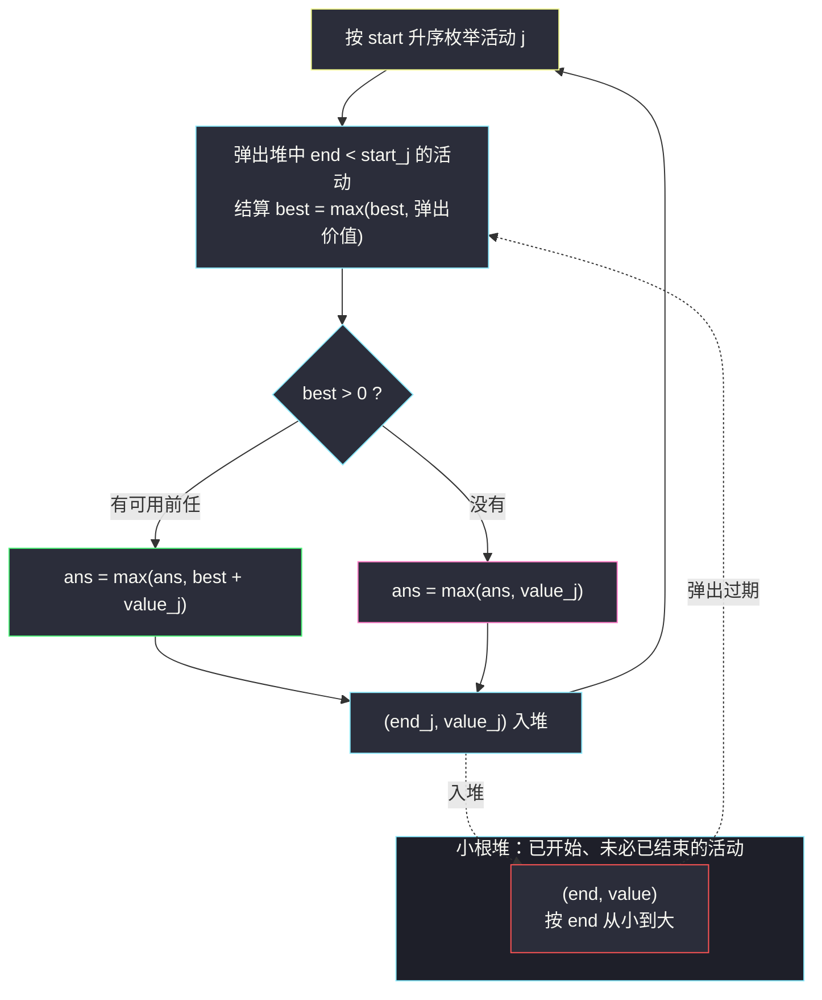

# 两个最好的不重叠活动（区间贪心 · 前后缀最大值与小根堆两解）

## 一、问题描述

给你一个下标从 0 开始的二维整数数组 `events`，其中 `events[i] = [startDay_i, endDay_i, value_i]`：第 `i` 个活动从第 `startDay_i` 天开始、第 `endDay_i` 天结束（含首尾两天），参加它可获得价值 `value_i`。

你可以从 `events` 中选择**至多两个**活动参加。由于同一时刻只能身处一场活动，所选的两个活动必须**不重叠**：一个活动必须在另一个活动开始之前**严格结束**（即一个的 `endDay` 必须小于另一个的 `startDay`，同一天「无缝衔接」也视为重叠，因为结束当天人还在场）。

请返回你能获得的最大总价值。可以只参加一个活动。

> 🔗 LeetCode 2054：https://leetcode.cn/problems/two-best-non-overlapping-events/
>
> 数据范围：`2 <= events.length <= 10^5`，`1 <= startDay_i <= endDay_i <= 10^9`，`1 <= value_i <= 10^6`。

**示例 1**

```
输入：events = [[1,3,4],[3,4,3],[5,8,2]]
输出：6
解释：参加 [1,3]（价值 4）与 [5,8]（价值 2）：3 < 5 不重叠，共 6。
     [1,3] 与 [3,4] 在第 3 天重叠，不能同时选（4 + 3 的组合非法）。
```

**示例 2**

```
输入：events = [[1,3,2],[4,5,2],[1,5,5]]
输出：5
解释：[1,5] 与另外两个活动都重叠，只能单独参加，价值 5；
     而 [1,3] + [4,5] 的组合只有 2 + 2 = 4，不如 5。
```

**示例 3**

```
输入：events = [[1,5,3],[1,5,1],[6,6,5]]
输出：8
解释：参加 [1,5,3] 与 [6,6,5]：5 < 6，3 + 5 = 8。
```

**直观理解**

固定「第二个活动」是谁，最优搭配就是「所有在它开始前就结束的活动里价值最大的那个」——这是一个**前缀最大值**问题。把活动按某种顺序排好后，「谁有资格当它的前任」由结束时间决定，「前任里谁最值钱」由一个单调维护的最大值决定。灵茶题单 §2.6 其他区间贪心给的两条路完全对称：**按 end 排序 + 前缀最大 + 二分**，或 **按 start 排序 + 小根堆弹出过期活动**。

---

## 二、暴力解法

枚举所有活动对，检查不重叠后取价值和最大；再与「只参加一个」的最大价值比较。

```python
class Solution:
    def maxTwoEvents(self, events: List[List[int]]) -> int:
        n = len(events)
        ans = max(v for _, _, v in events)        # 只参加一个
        for i in range(n):
            for j in range(n):
                if i == j:
                    continue
                s1, e1, v1 = events[i]
                s2, e2, v2 = events[j]
                if e1 < s2:                        # i 结束严格早于 j 开始
                    ans = max(ans, v1 + v2)
        return ans
```

### 复杂度

- **时间**：`O(n²)`。
- **空间**：`O(1)`。

### 🔴 瓶颈在哪里

`n = 10^5` 时约 `10^10` 次比较，严重超时。配对信息大量冗余：对第二个活动 `j` 而言，我们根本不关心前任是**谁**，只关心「结束早于 `start_j` 的活动里价值最大是多少」——这个量随 `start_j` 增大只会单调不减，完全可以增量维护。

---

## 三、优化探索（核心章节）

> 📚 本题在灵茶题单中属于 **§2.6 其他区间贪心**。模板要点：**区间贪心 + 前后缀最大值——选两个不重叠活动的最优组合**。把「找前任」转化为有序结构上的查询，有两种等价实现。

### 3.1 重新表述：枚举「第二个活动」

最优方案的两个活动中，必有一个**后开始**（按开始时间分先后）。枚举后开始的那个活动 `j`，则最优搭配是：

```
best_before(j) = max{ value_i : end_i < start_j }
ans = max over j of ( value_j + best_before(j) )，再与单选最大值比较
```

`best_before(j)` 只依赖 `start_j`，且 `start` 越大候选集越大——这是典型的「**枚举右维护左**」结构。

### 3.2 解法一：按 start 排序 + 小根堆

按 `start` 升序处理，用一个**小根堆**存放「已开始的活动」`(end, value)`：

- 轮到活动 `j` 时，把堆顶所有 `end < start_j` 的活动弹出——它们是**确定不重叠**的候选前任，从中维护最大价值 `best`；
- 候选 `best + value_j` 与答案比较，随后 `(end_j, value_j)` 入堆。

堆里躺着的都是「开始了但还没结束」的活动，它们不能与 `j` 搭配（重叠），留在堆里等未来的活动来结算。

### 3.3 解法二：按 end 排序 + 前缀最大 + 二分

按 `end` 升序排序后，设 `pre[i]` 为前 `i` 个活动价值的最大值。对每个活动 `j`，二分找出最后一个 `end < start_j` 的位置 `p`，则 `best_before(j) = pre[p]`。一次排序 + 一次线性前缀 + 每个活动一次二分。

### 3.4 两种解法的对照

| | 解法一（start + 堆） | 解法二（end + 前缀 + 二分） |
|---|---|---|
| 排序键 | `start` 升序 | `end` 升序 |
| 维护结构 | 小根堆（存活活动） | 前缀最大值数组 |
| 「前任」如何界定 | 弹出时结算（`end < start`） | 二分定位（`end < start`） |
| 推广到 k 个活动 | 不易 | 容易（DP + 二分，见 #1751） |



### 3.5 一句话核心

> **枚举右（后开始的活动），维护左（已结束活动的价值最大值）**；堆版在弹出时结算，二分版在前缀数组上查询。

---

## 四、代码实现

### Python（主解：按 start 排序 + 小根堆）

```python
class Solution:
    def maxTwoEvents(self, events: List[List[int]]) -> int:
        events.sort(key=lambda e: e[0])        # 按开始时间升序
        heap = []                              # 小根堆：(end, value) 已开始的活动
        best = 0                               # 已结束活动中的最大价值
        ans = 0
        for s, e, v in events:
            while heap and heap[0][0] < s:     # 结束早于当前开始 → 可作前任
                best = max(best, heapq.heappop(heap)[1])
            ans = max(ans, best + v, v)        # 配对 / 单选 两种候选
            heapq.heappush(heap, (e, v))
        return ans
```

**变量含义**

| 变量 | 含义 |
|------|------|
| `heap` | 已开始、尚未确认结束的活动，按 `end` 小根堆 |
| `best` | **已从堆中弹出**（即 `end < 当前 start`）活动的最大价值 |
| `ans` | 目前最优答案，天然覆盖「只参加一个」（`v` 单独入比较） |

**循环不变式**：处理活动 `j` 前，`best` 恰等于 `{ value_i : start_i <= 之前处理过的 start、end_i < start_j }` 的最大值——正是 `best_before(j)` 所需；堆中剩余活动全部 `end >= start_j`（重叠，不可搭配）。

**细节**：

1. 弹出条件是**严格** `heap[0][0] < s`：`end == s` 意味着同一天「接力」，按题意算重叠，不能弹出。
2. `ans = max(ans, best + v, v)` 一行同时覆盖「配对」与「单选」。
3. `best` 只增不减，无需重置——候选集随 `start` 增大单调扩张。

### Python（解法二：按 end 排序 + 前缀最大 + 二分）

```python
from bisect import bisect_left

class Solution:
    def maxTwoEvents(self, events: List[List[int]]) -> int:
        events.sort(key=lambda e: e[1])         # 按结束时间升序
        ends = [e for _, e, _ in events]        # 有序结束时间，供二分
        n = len(events)
        pre = [0] * (n + 1)                     # pre[i]：前 i 个活动的最大价值
        for i, (_, _, v) in enumerate(events):
            pre[i + 1] = max(pre[i], v)
        ans = 0
        for s, _, v in events:
            i = bisect_left(ends, s)            # ends[0..i) 全部 < s
            ans = max(ans, v + pre[i], v)
        return ans
```

`bisect_left(ends, s)` 返回第一个 `>= s` 的下标，即「结束时间严格小于 `s`」的前缀长度——前缀长度直接当下标用，`pre[i]` 就是全部合法前任的最大价值。

### Java（最优解环节：堆版）

```java
class Solution {
    public int maxTwoEvents(int[][] events) {
        Arrays.sort(events, (a, b) -> a[0] - b[0]);          // 按 start 升序
        PriorityQueue<int[]> pq =                             // 小根堆：(end, value)
            new PriorityQueue<>((a, b) -> a[0] - b[0]);
        int best = 0, ans = 0;
        for (int[] ev : events) {
            int s = ev[0], e = ev[1], v = ev[2];
            while (!pq.isEmpty() && pq.peek()[0] < s) {       // 过期结算
                best = Math.max(best, pq.poll()[1]);
            }
            ans = Math.max(ans, Math.max(best + v, v));
            pq.offer(new int[]{e, v});
        }
        return ans;
    }
}
```

---

## 五、具体例子演示

### 例：events = [[1,3,2],[2,4,6],[5,7,4],[6,9,5],[10,12,3]]（自拟，端到端）

最优解是 `[2,4]`（价值 6）搭配 `[6,9]`（价值 5）：`4 < 6` 不重叠，共 **11**。下面用解法一逐步跟踪（活动已按 start 排序）：

| 步 | 当前活动 (s, e, v) | 弹出的过期活动 | best | 候选活动对 | best + v | ans | 入堆后堆内容 (end, v) |
|----|--------------------|----------------|------|------------|----------|-----|------------------------|
| 1 | (1,3,2) | 无（堆空） | 0 | 单选 | 2 | 2 | (3,2) |
| 2 | (2,4,6) | 无（end=3 ≥ 2） | 0 | 单选 | 6 | 6 | (3,2), (4,6) |
| 3 | (5,7,4) | (3,2)、(4,6) | 6 | **(2,4)+(5,7)** | 10 | 10 | (7,4) |
| 4 | (6,9,5) | 无（end=7 ≥ 6） | 6 | **(2,4)+(6,9)** | 11 | 11 | (7,4), (9,5) |
| 5 | (10,12,3) | (7,4)、(9,5) | 6 | (2,4)+(10,12) | 9 | 11 | (12,3) |

注意第 4 步：`best = 6` 来自第 3 步弹出的活动 `(2,4,6)`——**前任不必紧邻当前活动**，它早在处理上一个活动时就已经「结算完毕」存进 `best`，这正是增量维护的精髓。

### 同一例子用解法二验证（按 end 排序 + 二分）

排序后顺序不变，`ends = [3,4,7,9,12]`，`pre = [0, 2, 6, 6, 6, 6]`：

| 当前活动 (s, e, v) | `bisect_left(ends, s)` | 前缀最大 pre[i] | 候选和 |
|--------------------|------------------------|-----------------|--------|
| (1,3,2) | 0 | 0 | 2 |
| (2,4,6) | 0 | 0 | 6 |
| (5,7,4) | 2（3、4 < 5） | 6 | 6 + 4 = 10 |
| (6,9,5) | 2（3、4 < 6，7 ≥ 6） | 6 | 6 + 5 = **11** |
| (10,12,3) | 4（3、4、7、9 < 10） | 6 | 6 + 3 = 9 |

两法同得 `11` ✓。

### 边界情形回看示例 2

`events = [[1,3,2],[4,5,2],[1,5,5]]`：排序后先 `(1,3,2)`、`(1,5,5)`（同 start），再 `(4,5,2)`。轮到 `(4,5,2)` 时弹出 `end=3 < 4` 的 `(1,3,2)`，`best = 2`，候选 `2 + 2 = 4`；而 `(1,5,5)` 的 `end = 5 ≥ 4` 不能弹出。加上单选候选 `5`，最终 `ans = 5` ✓——「大价值活动谁都配不上」的情形被单选分支兜住。

---

## 六、复杂度分析

| 方法 | 时间 | 空间 | 说明 |
|------|------|------|------|
| 暴力枚举对 | `O(n²)` | `O(1)` | 全对检查 |
| 堆版（主解） | `O(n log n)` | `O(n)` | 每个活动一进一出堆 |
| 二分版 | `O(n log n)` | `O(n)` | 排序 + 每活动一次二分 |

- **时间**：`O(n log n)`，`n = 10^5` 轻松通过。
- **空间**：`O(n)`（堆或前缀数组）。

---

## 七、对比总结

**「枚举右维护左」在区间问题上的三副面孔**

| 题 | 排序键 | 维护的「左」 | 组合目标 |
|----|--------|--------------|----------|
| #1235 规划兼职工作 | end | DP 值 + 二分 | 任意个不重叠活动的最大收益 |
| #1353 最多参加会议 | start | 小根堆（按 end） | 每天参加一场，最多几场 |
| **#2054 本篇** | start / end | 已结束活动的最大价值 | **恰好两个**不重叠活动 |

**易错点**

1. **重叠判定必须严格**：`end < start` 才算不重叠，`end == start` 是同天接力、算重叠。
2. **单选分支不能漏**：题允许只参加一个活动，初始化与每步比较都要带上裸 `v`。
3. `best` 只能吸收**已弹出**的活动：堆里未弹出的活动 `end >= 当前 start`，与当前活动重叠，混入会错。
4. 堆比较键是 `end` 而不是 `value`——堆负责「谁先过期」，最大价值由 `best` 另行维护。

**模板（区间贪心 · 小根堆维护过期，Python 版）**

```python
events.sort(key=lambda e: e[0])
heap, best, ans = [], 0, 0
for s, e, v in events:
    while heap and heap[0][0] < s:      # 严格早于 start 才过期
        best = max(best, heapq.heappop(heap)[1])
    ans = max(ans, best + v, v)
    heapq.heappush(heap, (e, v))
```

---

## 八、举一反三

| 题目 | 关系 |
|------|------|
| [1353. 最多可以参加的会议数目](https://leetcode.cn/problems/maximum-number-of-events-that-can-be-attended/) | 同款「按 start 排序 + 小根堆」，但按天消费活动 |
| [1751. 最多可以参加的会议数目 II](https://leetcode.cn/problems/maximum-number-of-events-that-can-be-attended-ii/) | 本题推广到 k 个不重叠活动：DP + 二分前驱 |
| [1235. 规划兼职工作](https://leetcode.cn/problems/maximum-profit-in-job-scheduling/) | 按 end 排序 + DP + 二分的标准形态 |
| [452. 用最少数量的箭引爆气球](https://leetcode.cn/problems/minimum-number-of-arrows-to-burst-balloons/) | 区间贪心入门：按右端点排序的紧凑写法 |
| [435. 无重叠区间](https://leetcode.cn/problems/non-overlapping-intervals/) | 「最多保留多少不重叠区间」的镜像问法 |
| [1845. 座位预约管理系统](https://leetcode.cn/problems/seat-reservation-manager/) | 有序结构维护空闲资源；同目录 `the-number-of-the-smallest-unoccupied-chair.md` 是「到达/离开双事件 + 双堆」姊妹套路 |

**思想迁移**

- 「选两个最优组合」几乎总是能拆成「枚举其中一个 + 前缀/后缀最大值」：本题两个活动按时间有序，天然适合枚举**后者**、维护**前者**的最值。
- 堆版和二分版是同一件事的两种数据结构表达：**堆版适合流式（不需要预知全部 end），二分版适合离线且要推广到 DP**。
- 口诀：**「枚举后开场，堆里弹前方；前任取最大，单选也别忘。」**
