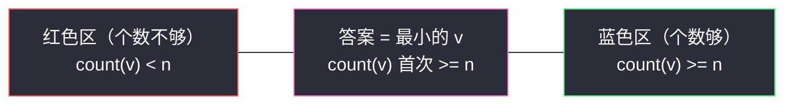
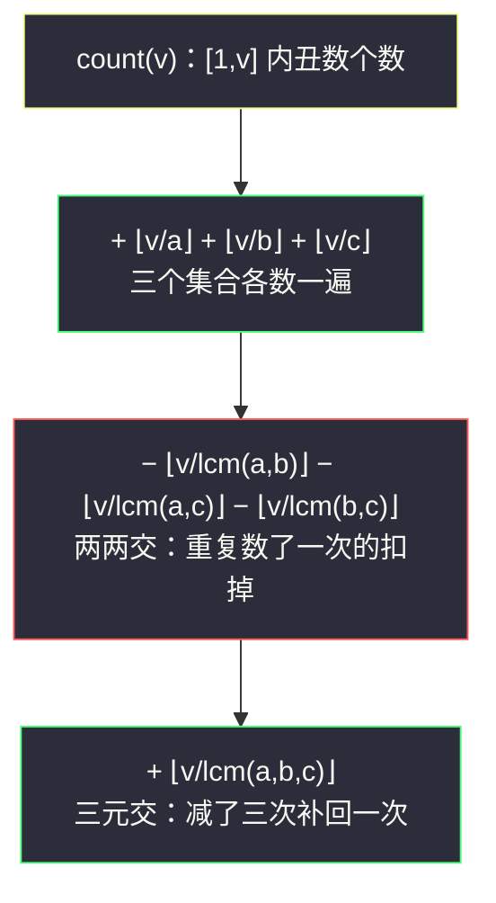
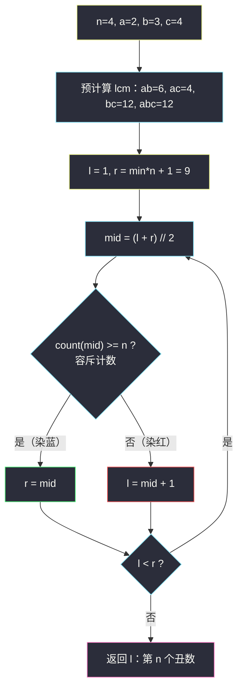

# 丑数 III（二分答案 · 第 K 小）

## 一、问题描述

丑数是可以被 `a` **或** `b` **或** `c` 整除的**正整数**。

给你四个整数 `n`、`a`、`b`、`c`，请你返回**第 `n` 个丑数**。

> 🔗 LeetCode 1201：https://leetcode.cn/problems/ugly-number-iii/
>
> 数据范围：`1 <= n, a, b, c <= 10^9`（答案本身可达 `10^18` 量级）。

**示例 1**

```
输入：n = 5, a = 2, b = 11, c = 13
输出：10
解释：丑数序列为 2, 4, 6, 8, 10, 11, 12, 13, 14, 16, 18, 22 ...
     只有 2 的倍数（11、13 都太大）撑起了前 5 个：2, 4, 6, 8, 10。
```

**示例 2**

```
输入：n = 4, a = 2, b = 3, c = 4
输出：6
解释：丑数序列为 2, 3, 4, 6, 8, 9, 10, 12 ...，第 4 个是 6。
     注意 4 既是 2 的倍数又是 4 的倍数，只能数一次。
```

**直观理解**

如果答案不太大，从 1 开始数到第 n 个就行——但 `n` 高达 `10^9`，逐个判断必然超时。

换一个视角：虽然「第 n 个丑数是多少」不好直接算，但「**不超过 v 的丑数有几个**」却能 `O(1)` 算出来（容斥原理）。而「个数」随 `v` 单调不减，「第 n 个 = 让个数首次达到 n 的位置」——这正是**二分答案 · 第 K 小**的标准范式：**二分 v，找最小的 v 使 `count(v) >= n`**。

---

## 二、暴力解法

从 `v = 1` 开始逐个整数判断（`v % a == 0 or v % b == 0 or v % c == 0`），数到第 n 个返回。

```python
class Solution:
    def nthUglyNumber(self, n: int, a: int, b: int, c: int) -> int:
        v = 0
        while n > 0:
            v += 1
            if v % a == 0 or v % b == 0 or v % c == 0:
                n -= 1          # 又数到一个丑数
        return v
```

### 复杂度

- **时间**：`O(min(a,b,c) * n)`——答案最大可达 `min(a,b,c) * n <= 10^18`，每步一次循环，天文数字，必然超时。
- **空间**：`O(1)`。

### 🔴 瓶颈在哪里

我们其实不需要「知道每个丑数是什么」，只需要知道「丑数的**排名**」。排名可以通过**计数**得到：`[1, v]` 内丑数的个数有闭式公式，于是「逐个生成」可以换成「对排名二分」。

---

## 三、优化探索（核心章节）

> 📚 本题在灵茶题单中属于 **§2.6 第 K 小/大**（二分答案）。核心口诀对齐灵神二分：**第 K 小 = 求最小的 v 使 `count(v) >= K`，用「求最小」模板——`check(mid)` 满足则 `r = mid`**。与 §2.1 求最小（`koko-eating-bananas.md`）的区别在于：二分的对象从「数组下标/资源值」换成了**正整数轴本身**。

### 3.1 关键转换：从「找第 n 个」到「数不超过 v 的个数」

定义：

```
count(v) = [1, v] 内能被 a 或 b 或 c 整除的整数的个数
```

三条基本事实：

1. `count` 关于 `v` **单调不减**（v 变大只会多不精）；
2. 第 n 个丑数 `= 最小的 v 使得 count(v) >= n`（v 走到第 n 个丑数那一刻，个数才首次达到 n）；
3. `count(v)` 有**闭式**，`O(1)` 可算（下一小节）。

于是真值在 v 轴上呈**左假右真**的结构——这是标准的「求最小」形态。



### 3.2 容斥原理：count(v) 的闭式

`[1, v]` 内 `a` 的倍数恰有 `⌊v/a⌋` 个（`a, 2a, 3a, ..., ⌊v/a⌋·a`）。同理 `b`、`c`。

若直接相加 `⌊v/a⌋ + ⌊v/b⌋ + ⌊v/c⌋`，会**重复计数**：既被 a 又被 b 整除的数（如 a=2、b=4 时的 4、8、12）被数了两次。标准修补就是**容斥三步走**：

```
count(v) = ⌊v/a⌋ + ⌊v/b⌋ + ⌊v/c⌋              先把三个集合都数一遍
         − ⌊v/lcm(a,b)⌋ − ⌊v/lcm(a,c)⌋ − ⌊v/lcm(b,c)⌋    两两交补减
         + ⌊v/lcm(a,b,c)⌋                       三元交补加
```

**为什么「交 = lcm 的倍数」**：`x` 同时是 `a` 和 `b` 的倍数 ⟺ `x` 是 `lcm(a,b)` 的倍数（lcm 是公倍数中最小的那个，且任意公倍数都是 lcm 的倍数——由带余除法可证）。于是「同时被 a、b 整除的个数」= `⌊v/lcm(a,b)⌋`。

**符号直觉**：画文氏图——`|A ∪ B ∪ C|` 中每个元素应恰好数 1 次。只属于一个集合的：加法数了 1 次 ✓。恰好属于两个集合的：加法数了 2 次、减法扣了 1 次，净 1 次 ✓。属于全部三个的：加法数了 3 次、两两交扣了 3 次、三元交补回 1 次，净 1 次 ✓。



**快速验证**（示例 2，a=2, b=3, c=4）：`lcm(2,3)=6`，`lcm(2,4)=4`，`lcm(3,4)=12`，`lcm(2,3,4)=12`。

- `count(6) = 3 + 2 + 1 − 1 − 1 − 0 + 0 = 4`，与列举 `2, 3, 4, 6` 完全一致 ✓（注意 4 被算了两次：`⌊6/2⌋` 和 `⌊6/4⌋` 各一次，由 `−⌊6/4⌋` 扣回）
- `count(9) = 4 + 3 + 2 − 1 − 2 − 0 + 0 = 6`，列举 `2, 3, 4, 6, 8, 9` ✓

### 3.3 二分上下界：min(a,b,c) * n

- **下界**：`1`（第 n 个丑数至少是 1）。
- **上界**：`min(a,b,c) * n`。理由：`[1, min*n]` 内仅 `min` 一个数的倍数就有 `n` 个（`min, 2·min, ..., n·min`），所以 `count(min*n) >= n` **必真**——上界处必为蓝色，答案不会跑出去。

这个上界既是**正确性保证**（check(上界) 必真），也是**防溢出的关键**：`min * n <= 10^9 * 10^9 = 10^18`，恰好还在 64 位整数范围内。

### 3.4 求最小模板套用

```
l = 1, r = min(a,b,c) * n + 1          # 候选区间左闭右开
while l < r:
    mid = (l + r) // 2
    if count(mid) >= n: r = mid        # 个数已够：答案 <= mid，向左收缩
    else:               l = mid + 1    # 个数不够：第 n 个在 mid 右边
答案 = l
```



### 3.5 一句话核心

> **「≤ v 的丑数个数」有容斥闭式且单调 → 第 n 个 = 最小的 v 使 `⌊v/a⌋+⌊v/b⌋+⌊v/c⌋−⌊v/lcm(ab)⌋−⌊v/lcm(ac)⌋−⌊v/lcm(bc)⌋+⌊v/lcm(abc)⌋ >= n`，在 `[1, min*n]` 上跑求最小模板。**

---

## 四、代码实现

### Python（主解）

```python
from math import lcm

class Solution:
    def nthUglyNumber(self, n: int, a: int, b: int, c: int) -> int:
        ab, ac, bc = lcm(a, b), lcm(a, c), lcm(b, c)
        abc = lcm(ab, c)

        def count(v: int) -> int:        # [1, v] 内丑数个数（容斥）
            return (v // a + v // b + v // c
                    - v // ab - v // ac - v // bc
                    + v // abc)

        l, r = 1, min(a, b, c) * n + 1   # 答案 ∈ [1, min*n]，check(min*n) 必真
        while l < r:
            mid = (l + r) // 2
            if count(mid) >= n:          # 第 n 个丑数 <= mid
                r = mid                  # 向左找更早达到 n 个的位置
            else:
                l = mid + 1              # mid 处个数不够，答案在右边
        return l
```

**变量含义**

| 变量 | 含义 |
|------|------|
| `count(v)` | `[1, v]` 内丑数个数（容斥闭式） |
| `ab` / `ac` / `bc` | 两两最小公倍数，对应「两两交」的大小 |
| `abc` | 三数最小公倍数，对应「三元交」的大小 |
| `l` | 红区右边界：`count(l') < n` 对所有 `l' < l` 成立 |
| `r` | 蓝区左边界：`count(r) >= n` 必定成立 |
| 返回值 `l` | 第 n 个丑数 |

Python 的 `math.lcm` 在 3.9+ 可用；大整数天然无溢出问题。

### Java（含防溢出的安全 lcm）

Java 的坑：`a, b, c` 各达 `10^9`，`lcm(a,b)` 最大约 `10^18`，而 `lcm(a,b,c)` 最大约 `10^27`——**超出 long 上限（约 9.2 * 10^18）**，直接算会静默溢出。

解决：凡是会超过二分上界 `upper = min*n` 的 lcm，对 `count` 的贡献必然是 0（`v <= upper < L` 时 `⌊v/L⌋ = 0`）。所以写一个「带上限的安全 lcm」：一旦发现结果会超过上限，就返回 `upper + 1` 当作「无穷大」顶替，运算结果完全不受影响。

```java
class Solution {
    public int nthUglyNumber(int n, int a, int b, int c) {
        long upper = (long) Math.min(a, Math.min(b, c)) * n;   // <= 1e18
        long ab = lcm(a, b, upper);
        long ac = lcm(a, c, upper);
        long bc = lcm(b, c, upper);
        long abc = lcm(ab, c, upper);

        long l = 1, r = upper + 1;                 // 答案 ∈ [1, upper]
        while (l < r) {
            long mid = l + (r - l) / 2;
            long cnt = mid / a + mid / b + mid / c
                     - mid / ab - mid / ac - mid / bc + mid / abc;
            if (cnt >= n) r = mid;
            else l = mid + 1;
        }
        return (int) l;
    }

    // 安全 lcm：结果若会超过 cap，返回 cap+1 充当“无穷大”（对 count 贡献恒为 0）
    private long lcm(long x, long y, long cap) {
        if (x > cap || y > cap) return cap + 1;    // 已经是“无穷大”，直接传播
        long g = gcd(x, y);
        long t = x / g;
        if (t > cap / y) return cap + 1;           // x/g * y 会超 cap（也就会溢出 long 的危险区）
        return t * y;
    }

    private long gcd(long x, long y) {
        while (y != 0) { long t = x % y; x = y; y = t; }
        return x;
    }
}
```

注意 `abc = lcm(ab, c, upper)`：若 `ab` 已经是 `upper+1`（被视为无穷大），`lcm` 开头的短路检查会把它原样传播，逻辑自洽。

---

## 五、具体例子演示

### 5.1 示例 2 端到端：n = 4, a = 2, b = 3, c = 4

预计算：`lcm(2,3) = 6`，`lcm(2,4) = 4`，`lcm(3,4) = 12`，`lcm(2,3,4) = 12`。

`count(v) = ⌊v/2⌋ + ⌊v/3⌋ + ⌊v/4⌋ − ⌊v/6⌋ − ⌊v/4⌋ − ⌊v/12⌋ + ⌊v/12⌋`

上界 `min * n = 2 * 4 = 8`，初始 `l = 1`，`r = 9`。

**每轮 count 明细**：

| 轮次 | l | r | mid | 容斥展开 | count | ≥ 4 ? | 染色 | 动作 |
|------|---|---|-----|----------|-------|-------|------|------|
| 1 | 1 | 9 | 5 | 2 + 1 + 1 − 0 − 1 − 0 + 0 | 3 | ✗ | 红 | `l = 6` |
| 2 | 6 | 9 | 7 | 3 + 2 + 1 − 1 − 1 − 0 + 0 | 4 | ✓ | 蓝 | `r = 7` |
| 3 | 6 | 7 | 6 | 3 + 2 + 1 − 1 − 1 − 0 + 0 | 4 | ✓ | 蓝 | `r = 6` |

`l == r == 6`，返回 **6** ✓（丑数序列 2, 3, 4, **6**, ...）。

**体会容斥的必要性**：`count(6)` 若不算容斥是 `3+2+1 = 6`，比真实值 4 多了 2——多出来的正是 4（2 和 4 的公倍数，`−⌊6/4⌋` 扣回）和 6（2、3 的公倍数，`−⌊6/6⌋` 扣回）。

### 5.2 示例 1：n = 5, a = 2, b = 11, c = 13

`lcm`：`ab = 22`，`ac = 26`，`bc = 143`，`abc = 286`——都远大于候选值，容斥项全为 0，`count(v) ≈ ⌊v/2⌋`。上界 `2 * 5 = 10`，`l = 1`，`r = 11`。

| 轮次 | l | r | mid | count | ≥ 5 ? | 动作 |
|------|---|---|-----|-------|-------|------|
| 1 | 1 | 11 | 6 | ⌊6/2⌋ = 3 | ✗ | `l = 7` |
| 2 | 7 | 11 | 9 | ⌊9/2⌋ = 4 | ✗ | `l = 10` |
| 3 | 10 | 11 | 10 | ⌊10/2⌋ = 5 | ✓ | `r = 10` |

`l == r == 10`，返回 **10** ✓。

对比暴力：这里二分只做了 **3 次**除法计数，暴力要循环 10 次还行；但当 `n = 10^9`、`min = 10^9` 时，二分仍只需约 60 轮（`log2(10^18) ≈ 60`），每轮 `O(1)`——这就是「闭式计数 + 二分」的力量。

---

## 六、复杂度分析

| 方法 | 时间 | 空间 | 说明 |
|------|------|------|------|
| 暴力逐个数 | `O(min * n)` | `O(1)` | 最多 `10^18` 步，不可行 |
| 二分 + 容斥 | `O(log(min * n))` | `O(1)` | 约 60 轮二分 × 每轮 7 次整除 |

lcm/gcd 预计算是 `O(log(max(a,b,c)))`，可忽略。总时间 `O(log(min * n))`，空间 `O(1)`。

---

## 七、对比总结

**「第 K 小」二分范式 vs 前面几节**：

| 家族 | 二分对象 | check 内容 | 模板 |
|------|----------|-----------|------|
| §2.1 求最小（#875 等） | 资源值（速度、载重） | 「总量约束能否满足」 | 真 `r = mid` |
| §2.2/§2.5 求最大（#2226/#3281） | 资源值 | 「目标能否达成」 | 真 `l = mid` |
| **§2.6 第 K 小（本篇）** | **候选数值 v 本身** | **「≤ v 的合法值个数 ≥ K」** | **真 `r = mid`** |

「第 K 小」的巧妙之处：**不需要知道合法值长什么样，只需要能数出「不超过 v 的合法值有几个」**——只要个数函数单调，就能二分定位第 K 个的位置。

**本篇易错点**

1. **容斥符号写错**：三加、三减、一加，顺序别乱；漏掉 `+⌊v/lcm(abc)⌋` 会在「三者公倍数」处多数流失（被减了 3 次只该净扣 2 次）。
2. **lcm 不是乘积**：`lcm(a,b) = a / gcd(a,b) * b`，直接 `a*b` 会把交算大、count 算小。
3. **Java 溢出**：`lcm(abc)` 可达 `10^27` 溢出 long，必须用带上限的安全 lcm（见四章）。
4. **上界别拍脑袋取 `n * max`**：`min * n` 才是「最密频率下界」的正确估计，且天然防溢出（`<= 10^18`）。
5. `r` 初值取 `上界 + 1`（左闭右开），不要取 `上界 - 1` 这类「差一」写法。

**模板（第 K 小，Python 版）**

```python
def kth_by_count(count, k, lo, hi):     # count 单调不减，答案 ∈ [lo, hi]
    l, r = lo, hi + 1
    while l < r:
        mid = (l + r) // 2
        if count(mid) >= k: r = mid     # 第 k 个 <= mid
        else:              l = mid + 1
    return l
```

---

## 八、举一反三

| 题目 | 关系 |
|------|------|
| [878. 第 N 个神奇数字](https://leetcode.cn/problems/nth-magical-number/) | **同构姊妹题（同为 §2.6）**：容斥只剩两项（a、b 两数），另附「周期 + 双指针」数学解，见同批 `nth-magical-number.md` |
| [668. 乘法表中第 K 小的数字](https://leetcode.cn/problems/kth-smallest-number-in-multiplication-table/) | 同范式：`count(v) = Σ ⌊v/i⌋`（逐行数不超过 v 的格子），二分定位 |
| [719. 找出第 K 小的数对距离](https://leetcode.cn/problems/find-k-th-smallest-pair-distance/) | 同范式：排序后双指针数「距离 ≤ v 的数对个数」，二分第 K 小 |
| [378. 有序矩阵中第 K 小元素](https://leetcode.cn/problems/kth-smallest-element-in-a-sorted-matrix/) | `count(v)` = 矩阵中 ≤ v 的元素个数（走阶梯），二分答案 |
| [1802. 有界数组中指定下标处的最大值](https://leetcode.cn/problems/maximum-value-at-a-given-index-in-a-bounded-array/) | 构造型对照：也用「count 单调」二分，check 从数个数换成数元素总和 |
| [410. 分割数组的最大值](https://leetcode.cn/problems/split-array-largest-sum/) | 二分答案老牌 Hard，check 从「数个数」换成「贪心分段」 |
| [264. 丑数 II](https://leetcode.cn/problems/ugly-number-ii/) | 名字最像但路线完全不同：因子固定为 2/3/5，用**多路归并**逐个生成第 n 个，与本题的「计数二分」互为对照 |
| [313. 超级丑数](https://leetcode.cn/problems/super-ugly-number/) | 多路归并版丑数（因子由数组给出），同样不适合容斥计数（因子可达 10^5 个） |

**思想迁移**

- 看到「**第 K 小/大 + 值域巨大 + 合法值有计数公式**」，直接上「count 单调 + 二分定位」；K 大只需把 `>= k` 换成 `>= k` 作用在「从大到小」的视角或对偶函数上。
- 容斥是「多重集合去重」的通用工具：两个数三项（+−+），k 个数就是 `2^k − 1` 项——所以因子一多（如丑数 II 的 2/3/5 固定因子生成式）就换多路归并，别硬容斥。
- 数个数往往比找具体那个数容易得多——「先数后找」是第 K 小问题的万金油。
- 口诀：**「个数随值涨，二分找分界；容斥数个数，第 K 自然现。」**
