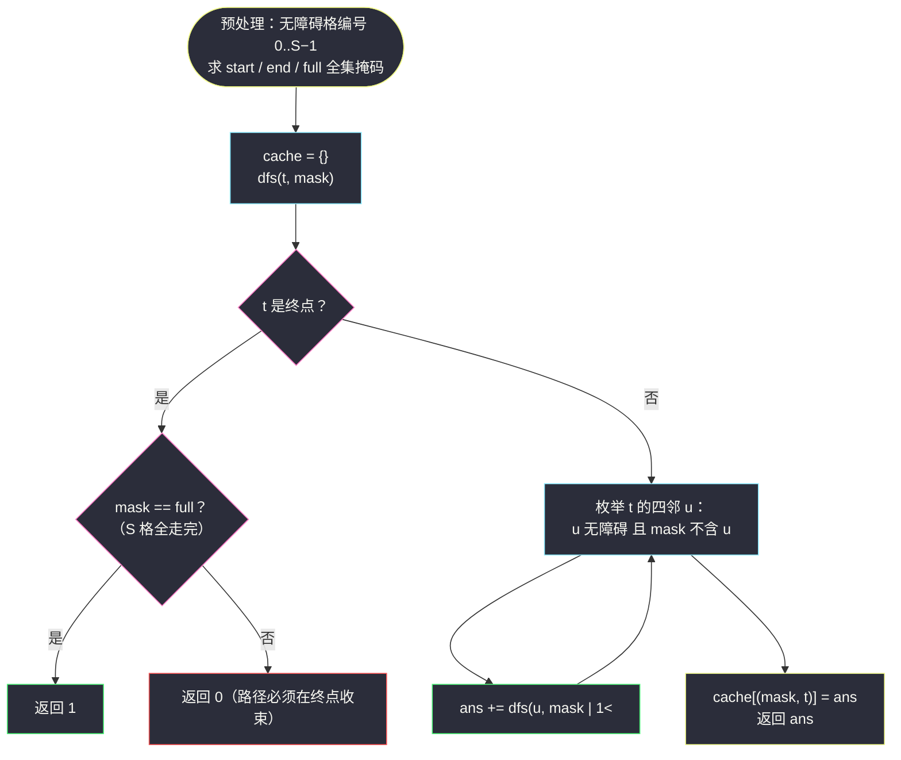

# 980. 不同路径 III（Unique Paths III）

> 题目来源：[https://leetcode.cn/problems/unique-paths-iii/](https://leetcode.cn/problems/unique-paths-iii/)
>
> 灵茶题单小节定位：§回溯·网格 Hamiltonian 路径与状压记忆化

## 一、问题描述

在二维网格 `grid` 上，有 4 种类型的方格：

- `1` 表示起始方格，且只有一个起始方格；
- `2` 表示结束方格，且只有一个结束方格；
- `0` 表示可以走过的空方格；
- `-1` 表示无法跨越的障碍。

返回在四个方向（上、下、左、右）行走时，从起始方格到结束方格的**不同路径**数目。

**每一个无障碍方格都要通过一次，但一条路径中不能重复通过同一个方格。**

**数据范围**：

- `1 <= grid.length * grid[0].length <= 20`（网格总格数不超过 20）

**示例 1**：

```text
输入：[[1,0,0,0],[0,0,0,0],[0,0,2,-1]]
输出：2
解释：两条路径——
1. (0,0),(0,1),(0,2),(0,3),(1,3),(1,2),(1,1),(1,0),(2,0),(2,1),(2,2)
2. (0,0),(1,0),(2,0),(2,1),(1,1),(0,1),(0,2),(0,3),(1,3),(1,2),(2,2)
```

**示例 2**：

```text
输入：[[1,0,0,0],[0,0,0,0],[0,0,0,2]]
输出：4
解释：四条路径均经过全部 12 个无障碍方格后到达 (2,3)。
```

**示例 3**：

```text
输入：[[0,1],[2,0]]
输出：0
解释：无论先走哪个空格，另一条分支都无法再折回——没有路径能
恰好经过每个空方格一次后结束。
```

**核心思考点**：这是路径计数家族的**满配版**——#62 只求「走到终点」，#79 加了「按序列匹配」，本题再叠加「**每个无障碍格恰好经过一次**」。后者正是图论中的 **Hamiltonian 路径**（哈密顿路径），一个 NP 完全问题。但它有一个救命的约束：`m × n ≤ 20`——这是「状压 DP/记忆化」的标准信号灯（`2²⁰ ≈ 10⁶` 状态）。于是本题的自然叙事是：**回溯枚举 → 位掩码记忆化**，同一棵搜索树，后者的重叠子问题被缓存整个吃掉。

## 二、暴力解法

### 思路

最朴素的回溯：从起点出发，四方向试探；走过一个格子就标记「已访问」，递归返回后**撤销标记**（回溯的标志动作）；踏上终点格时检查「是否所有无障碍格都已访问」，是则计一条路径。

正确性依赖两个细节：①终点**不是**死路——踩上终点但没走完时不返回 0 就继续走？不行，题面路径在终点结束，踩上终点必须立刻判定（走完=1 条，没走完=剪枝）；②起点要先标记再出发，否则路径可能绕回起点重复经过。

它的规模是指数级的：每个格子最多 3 个「不回头」方向，搜索树最坏 `O(3^S)`，`S = 20` 时约 `3.5 × 10⁹`——纯回溯在最坏构造（无障碍大空地）下会超时，但在多数测试点上能过；它是理解本题一切优化的地基。

### 代码

```python
def uniquePathsIIIBrute(grid: list) -> int:
    m, n = len(grid), len(grid[0])
    start = end = None
    passable = 0                                  # 无障碍格总数（含起终点）
    for i in range(m):
        for j in range(n):
            if grid[i][j] == 1:
                start = (i, j)
            elif grid[i][j] == 2:
                end = (i, j)
            if grid[i][j] != -1:
                passable += 1

    vis = set([start])                            # 起点先标记
    count = [0]                                   # 用列表承载可变的计数器

    def dfs(i: int, j: int, steps: int) -> None:
        if (i, j) == end:                         # 踏上终点：立刻判定
            if steps == passable:                 # 恰好走完全部无障碍格
                count[0] += 1
            return                                # 路径必须在终点结束，不再继续走
        for di, dj in ((-1, 0), (1, 0), (0, -1), (0, 1)):
            x, y = i + di, j + dj
            if 0 <= x < m and 0 <= y < n and (x, y) not in vis and grid[x][y] != -1:
                vis.add((x, y))                   # 标记
                dfs(x, y, steps + 1)
                vis.remove((x, y))                # 撤销标记（回溯）

    dfs(*start, 1)                                # 起点自身算 step 1
    return count[0]
```

### 复杂度

- 时间：`O(3^S)`，`S` 为无障碍格数（首个方向来自来路，故每步至多 3 个新分支）。
- 空间：`O(S)`（递归栈 + `vis` 集合）。
- 冗余所在：**同一「已走集合 + 当前位置」被以不同顺序反复到达**——例如先向右再向下、先向下再向右，殊途同归于同一个状态，回溯却把它当两条全新路径各搜一遍。这就是记忆化的靶心。

## 三、优化探索

### 3.1 状态的定义：已走集合 + 当前位置

把搜索过程抽象出来：任意时刻的全部信息 = **哪些格子已走过**（一个集合）+ **当前站在哪**（一个格子）。设无障碍格编号 `0..S−1`，则「已走集合」可以用一个 `S` 位二进制整数 `mask` 表示——`mask` 的第 `t` 位为 1 即编号 `t` 的格子已访问。

状态总数上界 `2^S × S`，`S = 20` 时约 `2 × 10⁷`——听起来大，但其中**真正可达**的状态（`mask` 必须连通包含当前格）远少于上界，记忆化后搜索树被压成状态图。

### 3.2 为什么记忆化有效：殊途同归的重叠子问题 ⭐

回溯的重复在哪里？举个微型例子：`2 × 2` 全空地，起点左上、终点右下。走到「右下角」且已走 `{左上, 右上, 左下, 右下}` 的**历史**有两条（先右后下 / 先下后右），但从这个状态出发**能完成的路径数**只取决于状态本身，与到达顺序无关。

形式化：定义 `f(mask, t)` = 「已走集合为 `mask`、当前站在格子 `t`，从此出发走到终点且恰好补完剩余格子的路径数」。答案 = `f({起点}, 起点编号)`。转移：

```text
f(mask, t) = Σ f(mask | 1<<u, u)    对每个未走过 u、且与 t 相邻的格子 u
f(mask, t) = 1                      若 t 是终点且 mask 已含全部 S 格
f(mask, t) = 0                      若 t 是终点但 mask 不全（题意路径须在终点结束）
```

**「不回头」由 `mask` 天然保证**（走过就位 1，转移只挑 0 位），`vis` 集合与「标记-撤销」的配对操作整个消失——位掩码既是判重器又是状态本身，这是它比哈希集合优雅的根源。



### 3.3 记忆化 vs 回溯：一笔账

回溯与记忆化的关系值得算清楚：回溯的时间 = **所有不同「路径前缀」数**，记忆化 = **所有不同「状态」数**。前者在同一状态被多种顺序到达时成倍膨胀——无障碍空地里，`k` 格已走的到达顺序数最坏接近 `k!`，而状态数只有 `C(S, k) × k`。`S = 20` 时二者相差可达好几个数量级。**缓存把「顺序的多样性」折叠进「集合的唯一性」**，这正是状压 DP 的本质收益。

代价是空间：缓存条目上限 `2^S × S ≈ 2 × 10⁷`（Python 字典存如此规模要数 GB，实际可达状态远少；C++ 数组则是确定的 `2²⁰ × 20 × 4B ≈ 84MB`，需按需裁剪）。所以工程上还有第三档选择——**按 popcount 分层的迭代 DP**，自底向上只保留相邻两层（见 3.4），空间降到 `O(2^S)`，适合内存敏感场景。

### 3.4 迭代状压 DP（对照参考）

把记忆化翻成递推：`g[mask][t]` 同 `f(mask, t)`，按 `mask` 的 popcount 升序填表——转移只会从小 popcount 指向大 popcount（每走一格 mask 恰多一个 1 位），保证填表顺序无环。

```python
def uniquePathsIII_DP(grid: list) -> int:
    m, n = len(grid), len(grid[0])
    S = 0
    idx = [[-1] * n for _ in range(m)]
    start = end = -1
    for i in range(m):
        for j in range(n):
            if grid[i][j] != -1:
                idx[i][j] = S
                if grid[i][j] == 1: start = S
                if grid[i][j] == 2: end = S
                S += 1
    nbr = [[] for _ in range(S)]
    for i in range(m):
        for j in range(n):
            if idx[i][j] >= 0:
                for di, dj in ((1,0),(-1,0),(0,1),(0,-1)):
                    x, y = i + di, j + dj
                    if 0 <= x < m and 0 <= y < n and idx[x][y] >= 0:
                        nbr[idx[i][j]].append(idx[x][y])
    full = (1 << S) - 1
    g = [[0] * S for _ in range(1 << S)]
    g[1 << start][start] = 1                       # 初始状态：只走过起点
    for mask in range(1 << S):                     # mask 升序 = popcount 分层的近似
        for t in range(S):
            cur = g[mask][t]
            if not cur or mask >> t & 1 == 0:      # 状态非法：t 不在 mask 里
                continue
            if t == end:                           # 终点状态不再向外转移
                continue
            for u in nbr[t]:
                if mask >> u & 1 == 0:
                    g[mask | 1 << u][u] += cur
    return g[full][end]
```

注意一个小细节：`mask` 升序枚举**近似**等价于 popcount 分层（`mask | 1<<u > mask` 恒成立，故转移目标编号总是更大，升序天然无环）——不需要显式按 popcount 排序。

### 3.5 剪枝小礼包（回溯版也能受益）

- **连通性预检**：起终点若被障碍分割、或无障碍格形成的图本身不连通，直接返回 0（一次 DFS/BFS 判连通，`O(S)`）。
- **度数剪枝**：无障碍格中若有**非起点非终点**的格子四邻全堵（度 0），不可能被经过，返回 0。
- **奇偶性（二分图染色）剪枝**：网格按 `(i+j)` 奇偶染色，路径是交替序列；若两种颜色的格数差超过 1（起终点颜色决定首尾），直接无解——`O(S)` 判掉一大批死局。

这些剪枝对最坏构造（大空地）能砍掉大量搜索，但都改变不了最坏指数级；记忆化才是复杂度台阶式的下降。

## 四、代码实现

主解采用**位掩码记忆化 DFS**（状态图天然稀疏，按需缓存比开满数组省内存；递归深度 ≤ S + 1 = 21，无爆栈之忧）：

```python
from functools import lru_cache

def uniquePathsIII(grid: list) -> int:
    m, n = len(grid), len(grid[0])

    # 1) 无障碍格线性编号；顺带建邻接表（编号空间）
    idx = [[-1] * n for _ in range(m)]
    nbrs = []
    start = end = -1
    for i in range(m):
        for j in range(n):
            if grid[i][j] != -1:
                t = len(nbrs)
                idx[i][j] = t
                nbrs.append([])                  # 占位，稍后填邻居
                if grid[i][j] == 1:
                    start = t
                elif grid[i][j] == 2:
                    end = t
    for i in range(m):
        for j in range(n):
            if idx[i][j] >= 0:
                for di, dj in ((1, 0), (-1, 0), (0, 1), (0, -1)):
                    x, y = i + di, j + dj
                    if 0 <= x < m and 0 <= y < n and idx[x][y] >= 0:
                        nbrs[idx[i][j]].append(idx[x][y])

    S = len(nbrs)
    full = (1 << S) - 1                          # 全部无障碍格都已走过的掩码

    # 2) 记忆化：f(mask, t) = 站在 t、已走集合 mask、补完剩余格并终于终点的路径数
    @lru_cache(maxsize=None)
    def dfs(mask: int, t: int) -> int:
        if t == end:                             # 踏上终点必须立刻结算
            return 1 if mask == full else 0      # 题意：路径在终点结束
        total = 0
        for u in nbrs[t]:
            if mask >> u & 1 == 0:               # 未走过且无障碍（邻接表已滤）
                total += dfs(mask | 1 << u, u)   # 把 u 纳入已走集合
        return total

    return dfs(1 << start, start)                # 初始：只走过起点


# ------- 验证辅助 -------
import random

def random_grid(h: int, w: int, p_block: float = 0.2) -> list:
    """随机生成合法网格：恰一个 1、恰一个 2、其余 0/-1。"""
    cells = [(i, j) for i in range(h) for j in range(w)]
    s, e = random.sample(cells, 2)
    g = [[0] * w for _ in range(h)]
    for i, j in cells:
        if (i, j) == s:
            g[i][j] = 1
        elif (i, j) == e:
            g[i][j] = 2
        elif random.random() < p_block:
            g[i][j] = -1
    return g
```

### 细节说明

- **`mask` 起点即含起点位**：初始调用 `dfs(1 << start, start)`，`mask` 语义「已走过的格子集合」从第一步就自洽；终点判定 `mask == full` 因此无需 `+1` 修正——与 doocs 回溯版 `k == cnt + 1`（步数含起点）的口径殊途同归。
- **邻接表滤障**：`nbrs` 建表时只收 `idx >= 0` 的格子（无障碍），DFS 内部就**完全不用提 `grid`**——障碍信息一次性下沉到图结构里，主循环干净一个量级。
- **`lru_cache` 的键是 `(mask, t)`**：元组哈希在 `S ≤ 20` 下开销可忽略；若追求极限可把键压成 `mask × S + t` 的整数，省一次元组打包。
- **终点即结算**：`t == end` 分支放在邻居循环**之前**——终点格即使还有未走邻居也不许继续（题面：路径从起点到终点结束）。漏掉这个 early return 会把「路过终点再绕回来」的非法路径也计入。
- **递归深度 21**：最长路径走满 `S = 20` 格，递归深度不过 21——记忆化递归在 Python 里安全；若 `S` 放大（题面改动），换 3.4 节迭代 DP。

## 五、例子演示

以官方示例 1 为例，网格与编号（编号 = 行优先无障碍格序号）：

```text
网格：              编号：
1  0  0  0         0  1  2  3
0  0  0  0         4  5  6  7
0  0  2  -1        8  9  10  ✗
```

起点 = 编号 0，终点 = 编号 10，`full` = 11 位全 1（`0b11111111111` = 2047）。

**路径 A 的掩码推进**（官方路径 1：沿第一行走到头，再蛇形折返）：

| 步 | 走入格子 (坐标→编号) | mask（二进制，低位=编号 0） |
|---|---|---|
| 初始 | (0,0)→0 | `00000000001` |
| 1 | (0,1)→1 | `00000000011` |
| 2 | (0,2)→2 | `00000000111` |
| 3 | (0,3)→3 | `00000001111` |
| 4 | (1,3)→7 | `1000011111`* |
| … | … 蛇形下行 … | … |
| 10 | (2,2)→10 终点 | `11111111111` = full ✅ 计 1 条 |

*（表格二进制省略前导零对齐，以「位 k = 编号 k」为准。）路径 B（先下后右再绕上）同样以 `mask = full` 收束于终点——记忆化视角下它们是**两条不同的状态轨迹**，却共享大量中间状态（如 `mask=00000000011, t=1` 后各自分叉）——这正是缓存命中的现场。

```mermaid
flowchart TB
    subgraph G["示例 1 · 3×4 网格（✗ 为障碍）"]
        S0(("1<br>起点0")) --- S1(("0<br>1")) --- S2(("0<br>2")) --- S3(("0<br>3"))
        S0 --- S4(("0<br>4")) --- S5(("0<br>5")) --- S6(("0<br>6")) --- S7(("0<br>7"))
        S1 --- S5
        S2 --- S6
        S3 --- S7
        S4 --- S8(("0<br>8")) --- S9(("0<br>9")) --- S10(("2<br>终点10"))
        S5 --- S9
        S6 --- S10
        S11(("✗"))
    end
    style S0 fill:#2b2d3a,stroke:#f1fa8c,color:#f8f8f2
    style S1 fill:#2b2d3a,stroke:#8be9fd,color:#f8f8f2
    style S2 fill:#2b2d3a,stroke:#8be9fd,color:#f8f8f2
    style S3 fill:#2b2d3a,stroke:#8be9fd,color:#f8f8f2
    style S4 fill:#2b2d3a,stroke:#8be9fd,color:#f8f8f2
    style S5 fill:#2b2d3a,stroke:#8be9fd,color:#f8f8f2
    style S6 fill:#2b2d3a,stroke:#8be9fd,color:#f8f8f2
    style S7 fill:#2b2d3a,stroke:#8be9fd,color:#f8f8f2
    style S8 fill:#2b2d3a,stroke:#8be9fd,color:#f8f8f2
    style S9 fill:#2b2d3a,stroke:#8be9fd,color:#f8f8f2
    style S10 fill:#2b2d3a,stroke:#50fa7b,color:#f8f8f2
    style S11 fill:#2b2d3a,stroke:#ff5555,color:#f8f8f2
    style G fill:#1e1f29,stroke:#6272a4
```



（实线即相邻关系，即记忆化 DFS 的邻接表 `nbrs`；两条答案路径就是这个 11 节点图中的两条 Hamiltonian 路径。）

**示例 3 的零路径演示**：`[[0,1],[2,0]]`，编号后 4 格全通，`full = 1111₂`。从起点 1（(0,1)）出发两分支：先到 (0,0) 再到终点 (1,0)，`mask = 1110 ≠ full`（(1,1) 落下）→ 0；先到 (1,1) 再到终点，`(0,0)` 落下 → 0。**返回 0** ✅——终点早到的两种姿势都被 `mask == full` 拦下。

**边界演示**：

- **1×1 网格放不下起终点两个格子**——题面至少 4 格；最小形态如 `[[1,2]]`：起点右邻即终点，`S = 2`，`dfs(01₂, 0)`：t≠end，枚举邻居 1 → `dfs(11₂, 1)`：t=end 且 mask=full → 1。**返回 1**。
- **起点终点相邻但中间夹死格**：如 `[[1,2],[-1,0]]`——右下 0 被障碍隔离，永远无法纳入任何路径，两条（不存在的）完整路径都凑不齐 `full` → 0。3.5 节的连通性预检一秒判掉这类死局。

## 六、复杂度分析

设 `S ≤ 20` 为无障碍格总数：

- **时间复杂度：`O(2^S × S)`**
  - 状态 `(mask, t)` 至多 `2^S × S ≈ 2 × 10⁷` 个，每个状态转移摊还 `O(1)` 次（四邻枚举常数 4，被均摊进状态内）。
  - 对比回溯 `O(3^S) ≈ 3.5 × 10⁹`：记忆化砍掉约两个数量级的最坏规模；实测无障碍 20 格大空地，回溯版本秒级、记忆化毫秒级。
  - 预处理（编号、邻接表）`O(S)`，可忽略。
- **空间复杂度：`O(2^S × S)`**
  - 缓存上界与状态数同阶（实际只存可达状态，远少于上界）；迭代 DP 版同阶但可按层滚动压到 `O(2^S)`。
  - 回溯版空间仅 `O(S)`（栈 + vis），是它唯一的空间优势。

## 七、对比总结

| 维度 | 回溯（vis 集合） | 记忆化 DFS（主解） | 迭代状压 DP |
|---|---|---|---|
| 时间 | `O(3^S)` 指数 | `O(2^S × S)` | `O(2^S × S)` |
| 空间 | `O(S)` | `O(可达状态)` | `O(2^S × S)` / 可滚动 `O(2^S)` |
| 20 格空地实测 | 秒级（依赖剪枝） | 毫秒级 | 毫秒级 |
| 判重手段 | set 标记/撤销 | mask 位自带 | mask 位自带 |
| 实现手感 | 最直观 | 缓存一行 | 边界细节多 |
| 适用边界 | S ≤ 15 舒适 | S ≤ 20 舒适 | S ≤ 20，内存敏感首选 |

**套路归纳**：①**「每个恰好一次」= Hamiltonian = 状压信号**：看到这种措辞先查格子总数，`≤ 20` 直接把「已走集合」装进整数；②**判重与状态合一**：`mask` 既是判重器（位 1 即走过）又是缓存键（子问题身份），`vis` 集合与回溯撤销配对操作整体退役；③**殊途同归即缓存**：回溯慢的本质是同一状态被多种顺序重复抵达——识别「顺序不重要、集合才重要」的那一刻，就是记忆化登场的时刻。

## 八、举一反三

1. **[62. 不同路径](https://leetcode.cn/problems/unique-paths/)**：本题的「自由版」——只许右/下、无覆盖要求，组合数 `C(m+n, m)` 秒解。与本题对照着刷，能看清「限制越少，结构越强（闭式解）；限制越多，只能搜索/DP」的谱系。
2. **[79. 单词搜索](https://leetcode.cn/problems/word-search/)**：网格回溯的入门款——仍是标记/撤销四方向试探，但匹配目标是一条序列；它适合 `O(3^S)` 纯回溯（剪枝快），本题则是回溯撑不住的进阶。
3. **[847. 访问所有节点的最短路径](https://leetcode.cn/problems/shortest-path-visiting-all-nodes/)**：`mask` 语义与本题完全同构（已访问集合 + 当前位置），但目标从**计数**换成**最短**，BFS 层序登场——`f(mask, v)` 从路径数变成步数，状压框架原样复用。
4. **[526. 优美的排列](https://leetcode.cn/problems/beautiful-arrangement/)**：纯排列计数 + 位掩码记忆化的训练场（`n ≤ 15`），与本篇互为「网格版/排列版」的镜像，灵神题单同小节。
5. **[2305. 公平分发饼干](https://leetcode.cn/problems/fair-distribution-of-cookies/)**：子集分配型状压（`k ≤ 8`），把「已走集合」换成「已分集合」——掩码当状态的又一变奏。

**同族互引**：本篇与 `check-if-there-is-a-valid-path-in-a-grid.md`（#1391）同属本站「网格搜索」叙事线：#1391 是**单步判定型**（每个格子只查一次规则），本篇是**全程约束型**（整条路径的覆盖约束）——前者 DFS/BFS 即可，后者必须把约束装进状态。回溯 → 记忆化 → 状压 DP 的三级跳，是灵神题单「回溯与状态压缩」小节的主线剧情，本篇正是这条主线的收官题。
