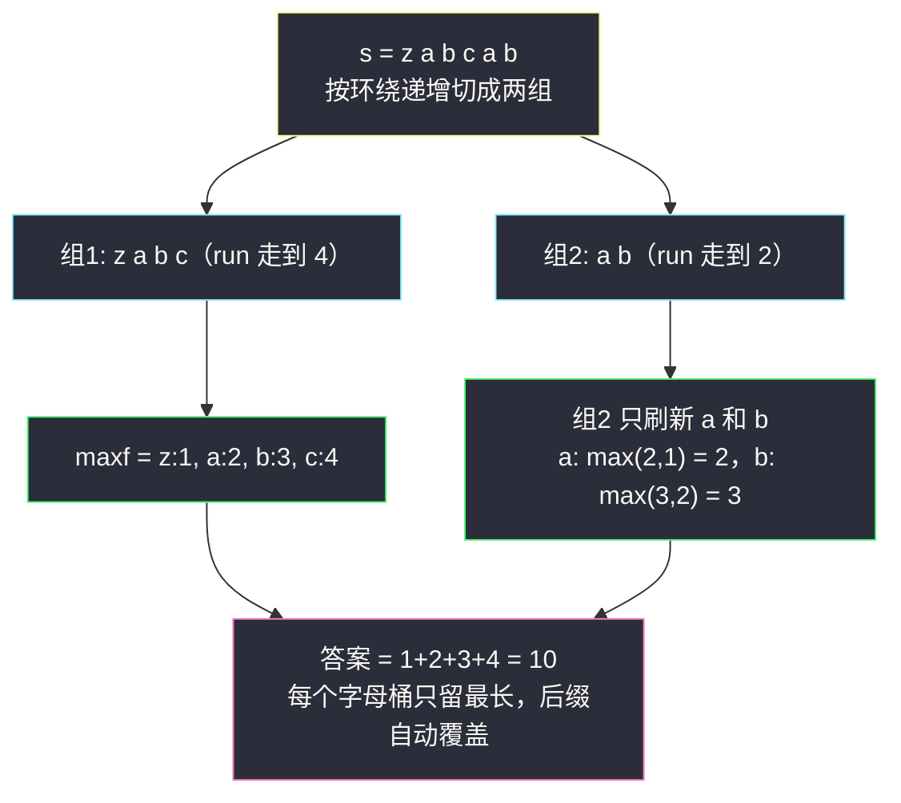
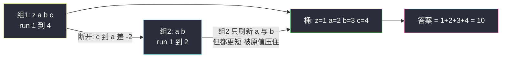

# 环绕字符串中唯一的子字符串（分组循环 · 按结尾字母去重计数）

## 一、问题描述

定义 `base` 为 `"abcdefghijklmnopqrstuvwxyz"` **无限循环**拼接得到的字符串（`...xyzabcdefghijklmnopqrstuvwxyzabc...`）。给定字符串 `s`，统计 `s` 中有多少个**不同**的非空子串也在 `base` 中出现（同样子串只算一次）。

> 🔗 LeetCode 467：https://leetcode.cn/problems/unique-substrings-in-wraparound-string/

**示例 1**

```
输入: s = "a"
输出: 1
解释: 子串 "a" 在 base 中出现。
```

**示例 2**

```
输入: s = "cac"
输出: 2
解释: 只有 "a" 与 "c" 两个子串在 base 中出现（"ca"、"ac" 等不满足环绕递增）。
```

**示例 3**

```
输入: s = "zab"
输出: 6
解释: "z"、"a"、"b"、"za"、"ab"、"zab" 共 6 个，全部在 base 中出现。
```

**直观理解**

一个子串能在 `base` 中出现，当且仅当它内部相邻字符都是**环绕递增**的：后一个字符恰是前一个的下一个（`a→b→...→z→a→b`）。所以问题一分为二：① 判断 `s` 的每个子串是否「环绕递增」；② 对合法子串**去重计数**。难点全在②：子串总数 `O(n²)` 个，直接丢进集合会爆炸。

## 二、暴力解法（入门）

### 直观思路

枚举每个起点 `i`，向右延伸终点 `j`，只要 `s[j-1] → s[j]` 仍环绕递增就继续，把沿途每个子串 `s[i..j]` 塞进集合去重；断了就从下一个起点重来。最后答案即集合大小。

```python
class Solution:
    def findSubstringInWraproundString(self, s: str) -> int:
        n = len(s)
        subs = set()                       # 用子串本身做去重键
        for i in range(n):
            subs.add(s[i])                 # 长度 1 的子串
            for j in range(i + 1, n):
                if (ord(s[j]) - ord(s[j - 1])) % 26 != 1:   # 不环绕递增就断
                    break
                subs.add(s[i:j + 1])
        return len(subs)
```

### 复杂度

- **时间**：`O(n²)` 个子串，每个入集合还要付出哈希与拷贝的代价。
- **空间**：`O(n²)` 量级（最坏全是环绕递增串，集合里塞满长子串）。

`n ≤ 10⁵` 时无论时间还是内存都直接爆炸。

### 🔴 瓶颈在哪里

我们存了太多冗余信息：**以同一字符结尾的合法子串，天然被「以它结尾的最长合法段」全部覆盖**。比如 `s = "...abcd"`，以 `d` 结尾的合法子串是 `d、cd、bcd、abcd`——恰好是最长段的所有后缀。逐个存子串等于把一棵「后缀树」拍平了存，去重本可以免费完成。

## 三、优化探索（核心章节）

> 本题属于 **灵茶题单 · 六、分组循环**。讲法对齐灵神的分组循环模板：把 `s` 按「环绕递增」切成连续组，**组内 `run` 递增累积，组间重置为 1**，再配合「按结尾字母去重」完成计数。

### 3.1 第一步转换：合法 ⇔ 环绕递增

子串 `t` 在 `base` 中出现 ⇔ `t` 的相邻字符满足 `next(c) = c+1`（`z` 的下一个绕回 `a`）。用 ASCII 差判断：`(ord(b) - ord(a)) % 26 == 1`（`'a'-'z'` 差 `-25`，取模后恰好是 `1`，环绕被自动覆盖）。

### 3.2 第二步转换：以 i 结尾的合法子串 = 最长后缀家族

设 `f[i]` = 以 `s[i]` 结尾的最长合法（环绕递增）子串长度，即分组循环里的当前 `run`。则以 `s[i]` 结尾的合法子串**恰好**是它的 `1..f[i]` 长度的后缀，共 `f[i]` 个。

### 3.3 第三步转换（去重核心）：按结尾字母合并

两个都以下标 `i`、`i'` 结尾（`s[i] = s[i'] = c`）的后缀家族，短的那个是长的**子集**——后缀也是后缀的后缀。所以对每个结尾字母 `c`，只保留历史最大值：

```text
maxf[c] = max(所有以 c 结尾位置的 f)
答案 = maxf['a'] + maxf['b'] + ... + maxf['z']
```

正确性一句话：任何以 `c` 结尾的合法子串 `t`，都出现在某个使 `f` 达到 `maxf[c]` 的位置上，且是那个最长段的后缀，因此 `t` 一定被数到；不同长度的后缀互不相同，因此不重不漏。



### 3.4 分组循环怎么写

「组」= 极大的环绕递增连续段。扫到 `s[i]` 时：若 `s[i-1] → s[i]` 环绕递增则 `run += 1`（延续本组），否则 `run = 1`（组间断开、重置）；无论哪种情况都执行 `maxf[s[i]] = max(maxf[s[i]], run)`——**组内边走边收集答案，组间只做重置**。这正是分组循环「外层推进 + 内层消费」的退化形态：每组的消费被折叠进了单步转移里。

### 3.5 一句话核心

> **以 `s[i]` 结尾的合法子串恰好 `f[i]` 个（最长段的后缀家族），按结尾字母取历史最大 `maxf[c]` 再求和，去重就免费完成了。**

## 四、代码实现详解

### Python（主解：分组循环 + 按结尾字母去重）

```python
class Solution:
    def findSubstringInWraproundString(self, s: str) -> int:
        max_len = [0] * 26                  # max_len[c]: 以字母 c 结尾的最长合法子串长度
        run = 1                             # 以当前字符结尾的最长合法长度（当前组内）
        max_len[ord(s[0]) - 97] = 1
        for i in range(1, len(s)):
            d = ord(s[i]) - ord(s[i - 1])   # 相邻 ASCII 差
            if d == 1 or d == -25:          # 顺延（-25 即 z 到 a 的环绕）
                run += 1                    # 组内延续
            else:
                run = 1                     # 组间断开，重置
            c = ord(s[i]) - 97
            max_len[c] = max(max_len[c], run)
        return sum(max_len)
```

**变量含义**

| 变量 | 含义 |
|------|------|
| `run` | 以 `s[i]` 结尾的最长合法子串长度（= 当前组内已连上的长度） |
| `max_len[c]` | 结尾字母为 `c` 的历史最长 `run` |
| `d == 1` / `d == -25` | 顺延（`b-a`）/ 环绕顺延（`a-z`） |

**循环不变式**：处理完 `s[i]` 后，`run` 等于以 `i` 结尾的极大环绕递增段长度；`max_len[c]` 等于 `s[0..i]` 中以 `c` 结尾的合法子串的最大可能长度。

### Java（最优解同款）

```java
class Solution {
    public int findSubstringInWraproundString(String str) {
        char[] s = str.toCharArray();
        int[] maxLen = new int[26];
        int run = 1;
        maxLen[s[0] - 'a'] = 1;
        for (int i = 1; i < s.length; i++) {
            int d = s[i] - s[i - 1];
            run = (d == 1 || d == -25) ? run + 1 : 1;
            maxLen[s[i] - 'a'] = Math.max(maxLen[s[i] - 'a'], run);
        }
        int ans = 0;
        for (int x : maxLen) ans += x;
        return ans;
    }
}
```

## 五、具体例子演示

**跟踪 `s = "zabcab"`**（比官方示例长一点，能同时看到组内累积与组间重置）：

| i | s[i] | 相邻差 d | 环绕递增? | run | max_len 更新（c = s[i]） | 说明 |
|---|------|----------|-----------|-----|--------------------------|------|
| 0 | z | — | — | 1 | z: 0→1 | 组 1 开始 |
| 1 | a | -25 | 是 | 2 | a: 0→2 | z→a 环绕顺延 |
| 2 | b | 1 | 是 | 3 | b: 0→3 | 组 1 内延续 |
| 3 | c | 1 | 是 | 4 | c: 0→4 | 组 1 结束（长 4） |
| 4 | a | -2 | 否 | 1 | a: max(2,1)=2 | 组 2 开始，a 桶保持 2 |
| 5 | b | 1 | 是 | 2 | b: max(3,2)=3 | 组 2 只长到 2，b 桶保持 3 |

最终 `max_len = z:1, a:2, b:3, c:4`，答案 `1 + 2 + 3 + 4 = 10`。

验证：以 `c` 结尾的合法子串恰有 `c、bc、abc、zabc` 共 4 个；以 `b` 结尾的是 `b、ab、zab` 共 3 个（组 2 的 `ab` 与组 1 的 `ab` 重复，桶取 max 自动去重）；以此类推，总数恰为 10，无重无漏。

**再对官方示例 3 快速核对**：`s = "zab"`，`run = 1,2,3`，`max_len = z:1, a:2, b:3`，答案 `6`。



## 六、复杂度分析

| 方法 | 时间 | 空间 | 说明 |
|------|------|------|------|
| 暴力 set 收集 | `O(n²)` | `O(n²)` | 子串全量入集合 |
| 分组循环 + 结尾桶（主解） | `O(n)` | `O(26)` | 一趟扫描，26 个桶 |

## 七、方法对比与总结

| | 暴力收集 | 按结尾字母去重（主解） |
|--|----------|------------------------|
| 去重方式 | 把子串本身存进集合 | 只存 26 个「最长 run」 |
| 时间 | `O(n²)` | `O(n)` |
| 空间 | `O(n²)` | `O(26)` |

**易错点**

1. 环绕判断必须包含 `d == -25`（`z→a`），只写 `d == 1` 会漏掉示例 3 这类串；用 `(ord差) % 26 == 1` 也可以，Python 负数取模结果为正，同样正确。
2. `run` 断开时重置为 **1**（当前字符自己就是长度 1 的合法子串），不是 0。
3. 别忘了初始化 `max_len[s[0]] = 1`（循环从 `i = 1` 开始时首字符会漏统计）。
4. 求和对象是 `max_len`（26 个桶），不是把每个 `run` 都加一遍——后者会把重复子串反复计数。

**模板（分组循环 + 结尾桶去重）**

```python
# run = 1; max_len[首字符] = 1
# for i in 1..n-1:
#     run = run + 1 if 环绕递增 else 1      # 组内延续 / 组间重置
#     max_len[s[i]] = max(max_len[s[i]], run)  # 组内收集（按结尾字母）
# 答案 = sum(max_len)
```

## 八、举一反三

| 题目 | 关系 |
|------|------|
| [2262. 字符串的总引力](https://leetcode.cn/problems/total-appeal-of-a-string/) | 同款「以 i 结尾的贡献」聚合思想 |
| [828. 统计子串中的唯一字符](https://leetcode.cn/problems/count-unique-characters-of-all-substrings-of-a-string/) | 换个视角数子串贡献（按字符上次出现位置） |
| [718. 最长重复子数组](https://leetcode.cn/problems/maximum-length-of-repeated-subarray/) | 连续段匹配的另一个经典 |
| [1446. 连续字符](https://leetcode.cn/problems/consecutive-characters/) | 分组循环入门题 |

**思想迁移**

- 「不同子串计数」遇到超内存，先想**按结尾位置/结尾字母聚合**：以同一字符结尾的后缀家族存在包含关系，只需保留最长者。
- 分组循环的「组」不一定要显式切区间：把组折叠成单步转移（`run` 的延续/重置）是常见等价写法。
- 同批姊妹篇：`adjacent-increasing-subarrays-detection-ii.md`（递增段切分 + 跨段拼接）、`push-dominoes.md`（分段一次性结算）。
